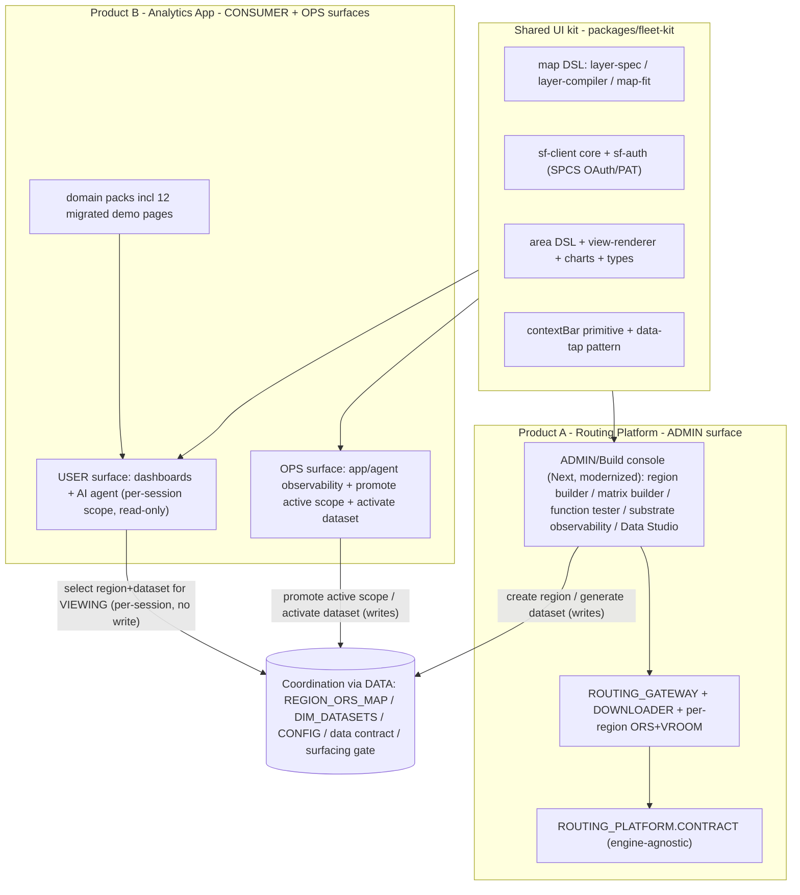

# APP_RESTRUCTURE_PLAN — Routing/Fleet apps -> "2 products / 3 surfaces / 1 UI kit"

> RESUME HEADER (read first in a new context)
> - Read: project memory `fleet-sa-synapse-migration` (at `/Users/obielov/.snowflake/cortex/memory/projects/Users-obielov-Documents-GitHub-synapse/fleet-sa-synapse-migration.md`), `STEP4_PLAN.md`, `STEP4C_PLAN.md`, and this file.
> - Repo: `/Users/obielov/Documents/GitHub/sfguide-create-a-route-optimisation-and-vehicle-route-plan-simulator`. Branch `feature/sa-synapse-app`. Account `wgb26798` (conn `fleet_test_evals`). Live consumer service `FLEET_INTELLIGENCE.SYNAPSE_USER.FLEET_SA_APP` (v0.1.5) at https://bocmjncj-pm-fleet-test.snowflakecomputing.app .
> - LOCKED DECISIONS (2026-06-22): (1) Posture = **Accelerator now, product-ready seams**. (2) Consumer scoping = **per-session param-scoped (multi-tenant safe)**; global active-scope promotion is OPS/ADMIN-only. (3) UI kit = **rewrite control app onto Next + full kit** (still TWO services until 4D). (4) The ~12 control-app demo analytics pages **migrate to the consumer app** as packs.
> - Respect AGENTS.md: tracking tags on every object + `query_tag` per session; control-app deploy = suspend -> update spec -> resume; commit-per-logical-change + push to `feature/sa-synapse-app` via the gh-token method in `/memories/git-push-method.md`; PRs target `dev`. New-deployment-first fix discipline.
> - Start at R0. Do NOT consolidate to a single host before R3 (4D).
>
> PROGRESS LOG (update as phases complete):
> - R0: DONE (commit 9d2470a) — `packages/fleet-kit/` shell + .gitignore dist negation; suspended idle ORS_SERVICE_EUROPE+SANFRANCISCO; baseline builds green.
> - R1.1: DONE (commit 897c8bc) — extracted 3 zero-dep modules to `@fleet-kit/core` (`sf-auth`, `sql-utils`, `map` layer-spec TYPES); consumer consumes kit via `file:` dep + re-export shims; consumer build green, sf-auth inlined into 9 server route bundles.
> - R1.2: DONE — extracted `map-fit` + `layer-compiler` to `@fleet-kit/core/map` (deck.gl/h3-js PEER deps); consumer dedupes via `transpilePackages:['@fleet-kit/core']` + webpack `resolve.symlinks=false`; lib/map shims; build green, compiler bundled into client chunks. Runtime map render = end deploy.
> - R2.1: DONE — UNIFIED scope-arg fns (see below). 
> - R2.2: DONE — contract-layer per-session wiring. Added FLEET_APP.UNIFIED_FLEET.F_VW_FACT_{TRIPS,VEHICLE_TELEMETRY}_SCOPED(region,dataset_id) wrapping the UNIFIED fns (consumer stays bound to the neutral contract, not the physical source). ContextBar no longer writes the shared CONFIG (per-session); added a dynamic Dataset picker (DIM_DATASETS by region -> context.dataset_id). Repointed the 6 fleet_operations/fleet_map queries to TABLE(F_VW_*_SCOPED(:region,:dataset_id)). Verified live: contract scoped==null-fallback==global view==394; SAMPLE-on-subquery telemetry query returns rows; consumer build green. Two-concurrent-session verification = end deploy. FOLLOW-ON: wire the FLEET_APP contract scoped fns into the pack installer for fresh installs (currently in scoped_contract.sql + applied live).

## 1. Context (verified read-only)

Two logical planes, 18 services today:
- **Consumer (Analytics App):** `FLEET_SA_APP` — Next 15 / React 19, domain-agnostic primitives (dashboard YAML DSL, deck.gl map DSL, `/api/query` data tap, agent proxy, `sf-auth`, contextBar, surfacing gate, config-driven pack loader). Runs as the SPCS service identity (ACCOUNTADMIN today).
- **Routing Platform / control plane:** `ORS_CONTROL_APP` (separate **React 18 + Vite + Redux** SPA + Express server) holding region builder, matrix builder, function tester, substrate observability, Data Studio — PLUS ~12 fleet demo analytics pages. Also `ROUTING_GATEWAY_SERVICE`, `DOWNLOADER`, per-region `ORS_SERVICE_<r>` + `VROOM_SERVICE_<r>` (7 regions).

Key findings:
- **No code is shared between the two frontends**, but heavy conceptual duplication: SF SQL client (`server/lib/sql.ts` vs `ui/src/lib/snowflake.ts`), SPCS-OAuth/PAT auth (`server/lib/sanitize.ts:getSpcsToken` vs `ui/src/lib/sf-auth.ts`), deck.gl map (`src/shared/MapView.tsx` + `src/dynamic/layer-compiler.ts` vs `ui/src/lib/map/*`), `asSqlJsonLiteral`, charts/metric cards.
- **Scoping is 100% GLOBAL today.** Both apps write the physical single-row per-schema `CONFIG(VEHICLE_TYPE, REGION)` tables; `SYNTHETIC_DATASETS.UNIFIED.V_*_CURRENT` views resolve the active dataset by a **global** `DIM_DATASETS.IS_ACTIVE = TRUE` flag. Consumer "switch region" (`ui/src/app/api/region/route.ts` POST) and control-app `POST /api/regions/active` both `UPDATE ... CONFIG SET REGION=?` across all schemas. No per-user/session isolation anywhere. (Confirmed: `region/route.ts`, `routes/regions/lifecycle.ts`, `init.ts` V_*_CURRENT defs, `studio/jobs.ts` archive logic.)
- **Lifecycle data objects (coordination seam):** `OPENROUTESERVICE_APP.CORE.REGION_ORS_MAP` (+ `REGION_CATALOG` boundaries) for provisioned regions; `FLEET_INTELLIGENCE.CORE.DIM_DATASETS` (immutable, one `IS_ACTIVE` per region+vehicle) for datasets; per-schema `CONFIG`; the surfacing gate (`/api/pack-status`) hides packs whose probe view has 0 rows. A new region/dataset already surfaces to the consumer via these tables with no redeploy — this is the data-coordination contract to preserve and harden.

## 2. Target architecture

## 3. Surface-ownership map (region/dataset lifecycle)

| Action | Owner surface | Mechanism | Multi-tenant effect |
|---|---|---|---|
| Create routing region (provision ORS+VROOM, register `REGION_ORS_MAP`/`REGION_CATALOG`) | **ADMIN** (Routing Platform admin/build console) | `CALL CORE.PROVISION_REGION_WRAPPER(...)` | Global infra; gated by 4D |
| Generate synthetic dataset (Data Studio -> `DIM_DATASETS` + `UNIFIED.*`, versioned/non-destructive) | **ADMIN** (admin/build console; needs routing engine to synthesize routes) | `POST /api/studio/start` -> `studio/jobs.ts` | New immutable dataset row; surfaces to consumer via registry |
| Activate dataset (`IS_ACTIVE` flip = global default promotion) | **OPS** | `archivePriorDatasets` flip / OPS endpoint | Changes global default only |
| Switch region (global `CONFIG` write = global default) | **OPS** | `SET_ACTIVE_REGION` + per-schema `CONFIG` UPDATE | Changes global default only |
| Select region/dataset for VIEWING | **CONSUMER (USER)** | per-session client state -> `:param` -> scope-arg views (NO write) | Per-session, isolated |

Principle honored: the two products coordinate through Snowflake DATA, not shared code. A new region or dataset appears in the consumer app via `REGION_ORS_MAP`/`DIM_DATASETS`/contract with **no consumer redeploy and no consumer-side provisioning code**.

## 4. Scoping decision (locked) + sequencing vs 4D

- **Reads -> per-session (multi-tenant safe), lands BEFORE 4D.** Introduce scope-arg resolution: `SYNTHETIC_DATASETS.UNIFIED.F_<TABLE>_SCOPED(region, dataset_id)` table functions (Snowflake views can't take params), resolving an explicit dataset instead of the global `IS_ACTIVE`. Keep `V_*_CURRENT` for the global default + surfacing-gate probes. Consumer contextBar carries `region` + `dataset_id` as per-session client state -> `use-view-data` resolves them as `:params` -> dashboards read scope-args. Consumer "switch" stops writing `CONFIG`.
- **Writes -> demoted to OPS/ADMIN, ENFORCED BY 4D.** "Promote active scope" + "activate dataset" + "provision" + "generate" require ingress-identity role gating (`Sf-Context-Current-User`) + least-privilege runtime roles. Until 4D lands, consumer + admin remain **separate services** (current safe default); 4D is sequenced before any single-host consolidation (we keep two services regardless). Ties to 4E (generic N-dimension contextBar + write-back) and 4D (role gating).

## 5. Phased implementation (R0–R8)

### R0 — Guardrails + parallel-safe scaffolding (no behavior change)
- Stand up an in-repo npm workspace `packages/fleet-kit/` (empty shell, not yet imported). Confirm both app build paths still green. Suspend idle ORS/VROOM regions for cost. Re-confirm tracking-tag + deploy discipline. Keep `FLEET_SA_APP` live untouched.

### R1 — Extract the shared UI kit (framework-agnostic core)
- Move portable primitives into `packages/fleet-kit/*`: map (`layer-spec`, `layer-compiler`, `map-fit`), `sf-client` core (REST `/api/v2/statements` + poll + type-coerce), `sf-auth` (SPCS OAuth + PAT), `sql-utils` (`asSqlJsonLiteral`), `charts`, shared `types`, area-DSL types. These are the dedup targets present in BOTH trees.
- Repoint `fleet_sa_app/ui` imports to the kit; zero behavior change. Verify `npm run build` + `tsc --noEmit` green; redeploy `FLEET_SA_APP` (image bump) renders identically.

### R2 — Per-session scope-arg data contract (multi-tenant-safe READS) — additive, no privilege
- Add `F_<TABLE>_SCOPED(region, dataset_id)` table functions over the base UNIFIED tables (committed DDL, tracking COMMENT). Keep `V_*_CURRENT` for the global default + surfacing probe.
- Extend consumer contextBar to carry `region` + `dataset_id` per-session; thread as `:params` through `use-view-data` + `/api/query`; migrate dashboards to scope-args. Consumer "switch" no longer writes `CONFIG`.
- Verify: two concurrent browser sessions select different region/dataset and see different data simultaneously. New dataset appears in the picker via `DIM_DATASETS` with no redeploy.

### R3 — 4D role-gating prerequisite (ingress identity + least-privilege)
- Enforce role at `/api/ops` + write routes via `Sf-Context-Current-User`; bind real users to `FLEET_APP_USER/OPS/ADMIN`; least-privilege runtime roles; remove ACCOUNTADMIN from the consumer service where feasible.
- INVARIANT: consumer + admin stay SEPARATE services; this phase is the prerequisite for any host consolidation (not planned now) and for the write demotion in R4.

### R4 — Demote global-scope WRITES to OPS; consumer read-only of selected scope
- Move "switch region (global)" + "activate dataset (`IS_ACTIVE` flip)" behind an OPS surface (app/agent observability ops view in the Analytics App), gated by R3. Consumer keeps per-session selection only (no global write). Lock the surface-ownership map (Section 3).

### R5 — Modernize the admin/build console onto Next + kit (Product A: Routing Platform)
- Rewrite `ORS_CONTROL_APP` onto Next 15/React 19 + `fleet-kit` as a NEW service (e.g. `ROUTING_ADMIN_APP`), holding ONLY privileged substrate tools: region builder, matrix builder, function tester, substrate observability, Data Studio. Port `server/{lib,routes,studio}/*` to Next API routes / co-located node server; reuse kit `sf-client`/`sf-auth`. Build in PARALLEL — old Vite app stays live until cutover (R7).
- ADMIN owns create-region + generate-dataset. Heavy substrate (graphs, image pipeline) stays here (hybrid provisioning tenet).

### R6 — Migrate the 12 demo analytics pages to the consumer app as packs
- Reimplement Dwell, Taxis, Delivery, Route Deviation, Asset Velocity, Backload, Freight Exchange, Retail, Emergency, Route Opt as consumer packs (YAML dashboards + showcase views via `PACK_REGISTRY`), reading through the R2 scope-arg contract. Reconcile with the YAML equivalents the consumer app already has. Remove the duplicate React pages from the soon-retired Vite control app.

### R7 — Cutover + retire old control app; finalize topology
- Blue/green cut over to `ROUTING_ADMIN_APP`; verify all admin/build flows + provisioning end-to-end; retire `ORS_CONTROL_APP` (Vite). Finalize endpoint topology. Never break the live demo.

### R8 — Distribution + close-out (accelerator now, product-ready seams)
- Accelerator now: branch-as-template + config bundle; document the data-contract + `ROUTING_PLATFORM.CONTRACT` seams as the dependency boundary. Design (not necessarily publish) TWO listings: Routing Platform (Product A) + Analytics App (Product B, depends on A). Carry forward 4E/4F/4G follow-ups (generic N-dim contextBar, SV VQR/eval, vitest/CI).

## 6. Service / endpoint topology — before vs after

- **Before:** `FLEET_SA_APP` (consumer, Next) | `ORS_CONTROL_APP` (admin+demos, Vite) | `ROUTING_GATEWAY_SERVICE` | `DOWNLOADER` | 7x(`ORS_SERVICE_<r>` + `VROOM_SERVICE_<r>`).
- **After:** `FLEET_SA_APP` (consumer USER + OPS surfaces, Next+kit) | `ROUTING_ADMIN_APP` (admin/build only, Next+kit) | `ROUTING_GATEWAY_SERVICE` | `DOWNLOADER` | per-region ORS+VROOM (unchanged). Still two app services (4D trust boundary preserved). Migration path: additive kit + scope views; new admin service built in parallel; blue/green cutover; old Vite app retired only after verification.

## 7. Verification
- R1: both apps build green; `FLEET_SA_APP` renders identically post-kit.
- R2: concurrent sessions see different scopes; new dataset surfaces with no redeploy.
- R3: a `FLEET_APP_USER`-bound (non-admin) user uses the app + agent but gets 403 from `/api/ops`.
- R4: consumer cannot change global default; OPS can promote scope/activate dataset.
- R5/R7: `ROUTING_ADMIN_APP` performs region build + matrix build + function test + Data Studio generation end-to-end; old control app retired with no demo breakage.
- R6: each migrated demo page renders in the consumer app via the scope-arg contract; surfacing gate still hides empty packs.

## 8. Critical files
- `.cortex/skills/build-routing-solution/fleet_sa_app/ui/src/lib/map/*`, `lib/snowflake.ts`, `lib/sf-auth.ts`, `components/views/view-renderer.tsx` — kit extraction sources (R1).
- `.cortex/skills/build-routing-solution/openrouteservice_app/services/ors_control_app/server/lib/init.ts` + `studio/jobs.ts` + `studio/ensure-tables.ts` — V_*_CURRENT / DIM_DATASETS owner; source for `F_*_SCOPED` table functions (R2) and Data Studio port (R5).
- `.cortex/skills/build-routing-solution/fleet_sa_app/ui/src/app/api/region/route.ts` + `use-view-data.ts` + `components/context-bar.tsx` — per-session scoping + write demotion (R2/R4).
- `.cortex/skills/build-routing-solution/fleet_sa_app/ui/src/app/api/ops/route.ts` — 4D ingress-identity gating (R3/R4).
- `ors_control_app/src/components/{RegionBuilder,MatrixBuilder,FunctionTester,Observability,FleetDataStudio}.tsx` — admin/build console rewrite targets (R5); the 12 demo pages -> consumer packs (R6).
