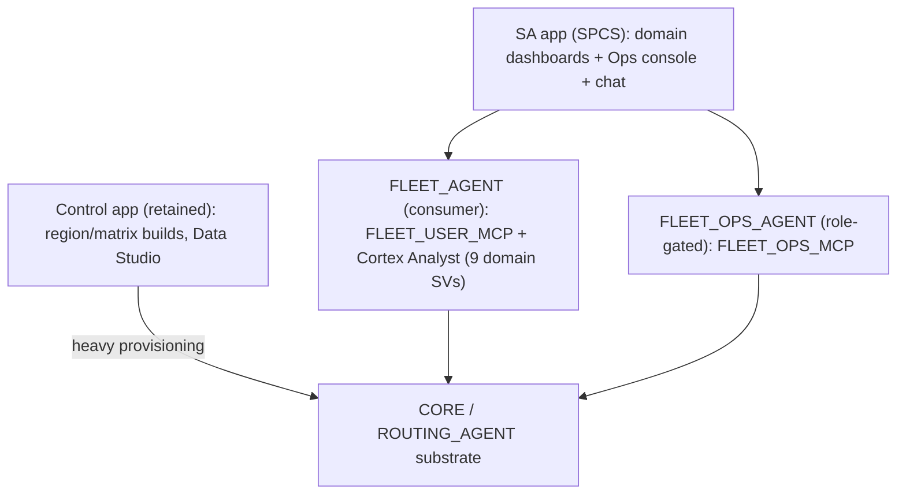

# Step 3 plan — Fleet Intelligence SA+synapse: full coverage, Ops, Analyst

> How to resume in a new context: read project memory `fleet-sa-synapse-migration`
> and this file. Step 2 is committed on branch `feature/sa-synapse-app` in this work
> repo. The live app is `https://bocmjncj-pm-fleet-test.snowflakecomputing.app`
> (SPCS service `FLEET_INTELLIGENCE.SYNAPSE_USER.FLEET_SA_APP` on account wgb26798,
> connection `fleet_test_evals`). Execute the tasks below in order. Scope decisions
> already made: **hybrid** (SA owns consumer analytics + agent/analyst + Ops console;
> the control app keeps heavy provisioning builders) and **agent-invokable, role-gated
> Ops** (separate Ops agent + FLEET_OPS_MCP, never attached to the consumer agent).

## Context

Step 2 (branch `feature/sa-synapse-app`, work repo) delivered a working, deployed slice: vendored SA host live on SPCS (`https://bocmjncj-pm-fleet-test.snowflakecomputing.app`), 2 dwell dashboards, 5 wrapped routing tools (`FLEET_USER_MCP`), the consumer agent `FLEET_AGENT`, and 2 simplified Tier-3 showcases. An inventory of the original ORS control app shows the full target is much larger: ~22 top-level tabs / ~37 views, 7 routing tools, plus heavy Ops/Admin builders.

Verified against the live account (wgb26798): every fleet domain schema has analytical tables/views ready for semantic views + dashboards (DWELL_ANALYSIS 12+5, ROUTE_OPTIMIZATION 9+5, MARKETPLACE 5+8, ROUTE_DEVIATION 4+5, DHL_NTBO 9+5, BACKLOAD_MATCHING 3+3, RETAIL_CATCHMENT 5, TAXIS 1+7, FOOD_DELIVERY 1+2).

Scope decisions (this pass):
- **Hybrid**: SA app owns consumer analytics (all domain dashboards), the agent (+Cortex Analyst), and an Ops console for config/region/service control. The **existing control app keeps the heavy provisioning builders** (region graph builds, matrix builds, synthetic Data Studio, Function Tester).
- **Ops is agent-invokable, role-gated**: a separate Ops agent + `FLEET_OPS_MCP` bound to the ops role; the consumer `FLEET_AGENT` never sees Ops tools.

### Coverage map (original feature -> Step-2 status -> Step-3 task)

| Area | Step 2 | Step 3 |
|---|---|---|
| Dwell (overview, congestion) | Done | — |
| Dwell (facilities, SLA, trip inspector, driver perf, live) | — | 3B |
| Fleet Delivery (dashboard, fleet map, catchment, heatmap) | — | 3B |
| Fleet Taxis (overview, driver routes, heatmap) | — | 3B |
| Route Deviation (dashboard, comparison, inspector) | — | 3B |
| Retail Catchment, Asset Velocity | — | 3B |
| Freight Exchange (+AI negotiation), Backload Matching | — | 3C |
| Routing tools: directions/isochrone/optimize/poi/pharma_catchment | Done (5) | — |
| Routing tools: pharma_optimization, supply_chain | — | 3F |
| Cortex Analyst over semantic views | Deferred | 3A |
| Ops: service lifecycle, region/vehicle/dataset, routing limits | Deferred | 3D |
| Heavy provisioning builders (region/matrix/data studio/function tester) | n/a | Stay in control app (hybrid) |
| Admin install, production role binding, Native App | Template only | 3E |
| Live routing e2e, tier-C self-containment, image pipeline | Pending | 3F/3G |

## Implementation steps

### Task 1 - Commit Step 2 (closeout)
Commit all Step-2 work on `feature/sa-synapse-app` in the work repo (fleet_sa_app host + bundle, fleet_tools synapse apps, native-app templates). Exclude `node_modules`, `.next`, `dist`, `_installed` build outputs (gitignore-check). DONE when this plan was saved.

### Task 2 (3A) - Cortex Analyst over per-domain semantic views
- Author one semantic view per consumer domain over existing analytical tables (start: dwell, route_optimization, route_deviation, taxis, food_delivery, retail_catchment, marketplace, backload, dhl_ntbo). Validate each with `evaluate_semantic_view` / `reflect_semantic_model`.
- `ALTER AGENT FLEET_AGENT` to add `cortex_analyst_text_to_sql` tool(s) + `tool_resources.semantic_view` (multiple analyst tools, one per SV, or a combined SV). Keep `FLEET_USER_MCP` attached.
- Update `app/agent-spec.json` to match.

### Task 3 (3B) - Port remaining consumer dashboards as SA views
Add `app/app-views.json` entries using the 2B area framework (MetricCards/Chart/Table/Map/Slider/ClickableTable; reuse the `h3` layer for heatmaps, `path`/`arc` for routes):
- Dwell: facility_utilization, sla_alerts, trip_inspector, driver_performance, live_operations.
- Fleet Delivery: delivery_dashboard, fleet_map (ClickableTable courier drilldown -> map highlight), catchment, courier_heatmap.
- Fleet Taxis: overview, driver_routes, demand_heatmap.
- Route Deviation: dashboard, route_comparison (planned vs actual path layers), inspector.
- Retail Catchment, Asset Velocity.
All queries fully qualified, lowercase columns, region/vehicle `:params` (the 2B hybrid refetch contract). Validate each query live before wiring.

### Task 4 (3C) - Freight Exchange + Backload as interactive SA views
- Rebuild as custom `viewRegistry` full-page components (the 2E pattern): filter bar, offer grid + map, offer drawer, decisions audit.
- Add the freight verbs the original `/api/fx/*` provided: `fx_round_trip` / `fx_bundle` (VROOM OPTIMIZATION), `fx_draft_counter` (AI_COMPLETE negotiation), deadhead MATRIX, lane-density H3 - as synapse User verbs (or SA `/api/tool` allowlist additions) over `CORE.*` + existing MARKETPLACE objects.
- Backload Matching page using `optimize_routes` + matrix-budget sliders.

### Task 5 (3D) - Ops bundle + role-gated Ops agent + SA Ops console
- New synapse app `fleet_tools/ops/` (roles:['ops']) wrapping: resume/suspend/scale service, `set_active_region`/vehicle/dataset, `set_routing_limits`, healthcheck/diagnose - over existing service SQL + `CORE` procs. Materialize -> `FLEET_OPS_MCP` (schema `SYNAPSE_OPS`).
- Create `FLEET_OPS_AGENT` referencing `FLEET_OPS_MCP`, bound to the ops role (agent-invokable per decision); NOT attached to the consumer agent.
- SA Ops console: an ops-gated `viewRegistry` view that (a) edits the config stage files (app-config.json / app-views.json / agent prompts) -> tier-B config-extensibility, and (b) calls Ops verbs for service/region/limits. Heavy provisioning stays in the control app (link out).

### Task 6 (3E) - Production role binding + endpoint grants + Native App install
- Create real roles `FLEET_APP_USER` / `FLEET_APP_OPS` / `FLEET_APP_ADMIN`; re-run synapse deploy with `install.json.roles` bound to these (not ACCOUNTADMIN); grant agent/MCP/proc/SV usage per role.
- `GRANT SERVICE ROLE FLEET_SA_APP!ALL_ENDPOINTS` to the consumer role so non-admins can reach the app.
- Finalize `native-app/{manifest.yml,setup.sql}` and either install as a Native App or publish via org listing; wire `check_substrate` into the admin install flow.

### Task 7 (3F) - Last 2 routing tools + live routing e2e
- Wrap `TOOL_PHARMA_OPTIMIZATION` and `TOOL_SUPPLY_CHAIN` into the User bundle (-> 7/7 tools); re-materialize/deploy `FLEET_USER_MCP`; register inline maps if they return geometry.
- With ORS/VROOM services resumed, run end-to-end tests of every routing verb via the agent and the Tier-3 pages; confirm inline maps render real geometry.

### Task 8 (3G) - Tier-C self-containment + image pipeline integration
- Vendor the synapse framework into the work repo (replace the absolute `file:` dep) so the branch is a forkable, self-contained tier-C template.
- Integrate the SA host image into `scripts/deploy.sh` + `image-versions.env` + `check_image_versions.sh` so `fleet_sa_app` builds/pushes/redeploys via the same one-command flow as the control app.

## Verification
- 3A: agent answers a data question per domain via Cortex Analyst (cites the SV); `evaluate_semantic_view` passes for each SV.
- 3B: each ported dashboard renders live data; region/vehicle contextBar refetches; `next build` green.
- 3C: Freight Exchange grid + map render; an AI counter-offer draft returns; round-trip/bundle optimization renders routes.
- 3D: an ops-role session can suspend/resume a service and change region via the Ops agent AND the Ops console; a consumer agent session CANNOT see/invoke any Ops tool (role isolation proof). Config-stage edit + service restart reloads dashboards without rebuild.
- 3E: a non-admin user bound to `FLEET_APP_USER` can open the app endpoint and use the consumer agent; cannot reach Ops/Admin tools. Native App installs clean (or listing publishes).
- 3F: all 7 routing verbs run end-to-end and render inline maps; synapse audit rows recorded.
- 3G: `bash scripts/deploy.sh` builds+pushes+redeploys the SA host; fresh clone builds without the external synapse path.

## Critical files
- `.cortex/skills/build-routing-solution/fleet_sa_app/app/app-views.json` - all new consumer dashboards (3B).
- `.cortex/skills/build-routing-solution/fleet_sa_app/app/agent-spec.json` - add Cortex Analyst tools (3A); plus `ALTER AGENT FLEET_AGENT`.
- `.cortex/skills/build-routing-solution/fleet_tools/` - new `ops/` app (3D) + add 2 procs to `user/` (3F); per-bundle MCP servers.
- `.cortex/skills/build-routing-solution/fleet_sa_app/ui/src/lib/fleet-views.tsx` - register Freight Exchange / Backload / Ops console custom views (3C/3D).
- `.cortex/skills/build-routing-solution/fleet_sa_app/native-app/setup.sql` + install.json - production role binding + install (3E).

## Open items / dependencies
- ORS/VROOM SPCS services must be resumed for 3C/3F live tests (region pools are mostly SUSPENDED).
- Semantic-view granularity (one combined SV vs one per domain) - decide at 3A start; per-domain is the default.
- Freight Exchange AI negotiation uses `AI_COMPLETE` - confirm model availability in region.
