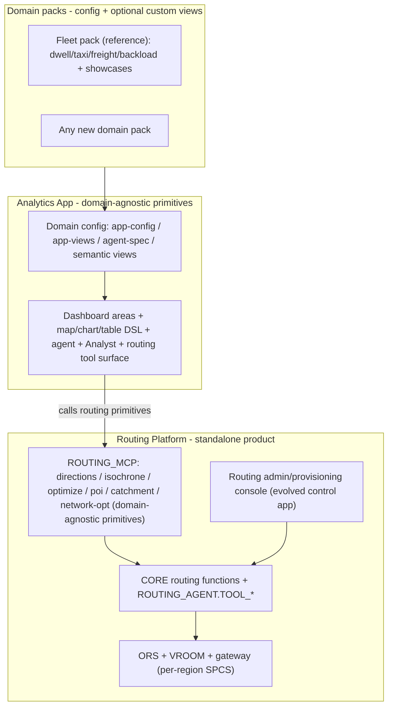

# Step 4 plan — Routing Platform + domain-agnostic primitives app

> How to resume in a new context: read project memory `fleet-sa-synapse-migration` and this file.
> Step 3 is COMPLETE and LIVE on branch `feature/sa-synapse-app` in this work repo (SPCS service
> `FLEET_INTELLIGENCE.SYNAPSE_USER.FLEET_SA_APP` v0.1.2 at
> https://bocmjncj-pm-fleet-test.snowflakecomputing.app, account wgb26798, connection
> `fleet_test_evals`). Step 3 is NOT yet committed. Execute the tasks below in order.
>
> User's ultimate goal (verbatim intent): the **routing service runs as a separate app**, and the
> **main app is domain- and vehicle-agnostic** — a set of **reusable primitives** users apply to
> their own use cases per domain (no taxi/bike/dwell/freight call-outs baked in). Fleet becomes one
> example domain pack. This is achievable and is mostly DECOUPLING, not a rewrite.
>
> Pre-Step-4 hygiene (do regardless of when Step 4 starts): commit Step 3; suspend ORS/VROOM Europe
> services (`ALTER SERVICE OPENROUTESERVICE_APP.CORE.{ORS,VROOM}_SERVICE_EUROPE SUSPEND`) to stop cost.

## Context

An audit of `fleet_sa_app/ui/` shows the host is already mostly generic and config-driven:

- **Generic primitives (keep as-is, ~55 files):** the declarative dashboard engine
  (`view-renderer.tsx` + `areas/*` — MetricCards/Chart/Table/Map/Slider/ClickableTable/ComboBox/FilterBar),
  the deck.gl map DSL (`lib/map/*`), the view registry + loader (`load-views.tsx`, `view-registry.ts`,
  `use-view-data.ts`), the agent proxy (`agent-config.ts` is fully env-driven), and the data tap (`/api/query`).
- **Already swappable via JSON/env:** `app-config.json`, `app-views.json`, `agent-spec.json`,
  `install.json`, and `AGENT_*` / `APP_*` env vars. All 14 fleet dashboards live in `app-views.json` as
  SQL+config, not code.
- **Fleet hardcoding to remove (concentrated):** `SCHEMA`+`VERBS` literals in
  `ui/src/app/api/tool/route.ts` and `ui/src/app/api/ops/route.ts`; DB + `REGION`/`VEHICLE_TYPE` columns in
  `ui/src/app/api/region/route.ts`; the hardcoded routing tool names in `ui/src/components/inline/index.ts`;
  the unconditional `registerFleetViews()` in `ui/src/components/app-shell.tsx`; and the four fleet showcase
  views + `/api/fx` (`ui/src/lib/fleet-views.tsx`, freight-exchange, backload-matching, vrp-simulator,
  emergency-wizard, ops-console).

The routing engine itself (ORS/VROOM/gateway + `FLEET_INTELLIGENCE.CORE` functions + `ROUTING_AGENT.TOOL_*`
+ the synapse routing verbs in `FLEET_USER_MCP`) already lives in its own database (`OPENROUTESERVICE_APP`)
with its own control app — so the "separate routing app" largely exists; Step 4 formalizes it as a clean,
reusable product and fixes its substrate sizing.

### Target architecture

## Implementation steps

### 4A - Genericize the app core (de-fleet the primitives)
- Make `ui/src/app/api/tool/route.ts` and `ui/src/app/api/ops/route.ts` read `SCHEMA` + the verb/arity
  allowlist from config (env `TOOL_VERBS_CONFIG` / JSON), not literals.
- Genericize `ui/src/app/api/region/route.ts`: read DB, schema list, and the context-column set from config
  (replace fixed `REGION`/`VEHICLE_TYPE` with a generic `contextColumns` map driven by `app-config.json`
  `contextBar`).
- Make the inline tool->map binding config-driven (e.g. `toolsWithMapOutput` in agent/app config) instead of
  hardcoded verb names in `ui/src/components/inline/index.ts`.
- Replace the unconditional `registerFleetViews()` in `app-shell.tsx` with a config-driven domain-pack loader (4C).
- Rename `FLEET_*` env defaults to neutral names (keep back-compat aliases); fleet identity comes from config.

### 4B - Extract the Routing Platform as a standalone product
- Define the routing service boundary and rename its public tool API from `FLEET_USER_MCP` to a neutral
  `ROUTING_MCP` (alias retained) — the 7 verbs are already domain-agnostic primitives (directions, isochrone,
  optimize_routes, find_poi, pharma/site catchment, network optimizers). Move them out of the `SYNAPSE_USER`
  fleet schema into a routing-product schema (or keep + alias).
- Reposition the evolved ORS control app as the **Routing Platform admin/provisioning console** (region graph
  builds, matrix builds, Function Tester) — this is where the heavy provisioning lives, owned by the routing
  product, not the analytics app.
- **Routing substrate fix (priority):** resolve the live-routing blocker — ORS-Europe graph is 23.4 GB on a
  24 GB node, so its HTTP hangs. Right-size the ORS region compute pools (larger instance family) and/or trim
  per-region graphs; document a region->pool-size matrix. Verify directions/optimize render live end-to-end.

### 4C - Domain-pack model + Fleet as the reference pack
- Define a "domain pack" = `{app-config.json, app-views.json, agent-spec.json, semantic_models/, optional
  customViews + apiRoutes}` discovered/loaded purely by config. Add a registry so packs register their custom
  views/inline-components without core code edits.
- Move the four showcase views + `/api/fx` + ops-console + `fleet-views.tsx` into a `packs/fleet/` domain pack,
  registered conditionally via config.
- Ship a minimal **starter/blank pack** (one semantic view + one dashboard, no vehicle assumptions) to prove the
  core is domain-agnostic and to serve as the "author your own domain" template.
- Write authoring docs: how to stand up a new domain on the primitives + routing platform.

### 4D - Security and gating
- Per-user Ops gating: enforce role in `ui/src/app/api/ops/route.ts` using the SPCS ingress identity header
  (`Sf-Context-Current-User`) so consumers cannot invoke Ops verbs even though the service runs as its own
  identity.
- Bind real users to `FLEET_APP_USER/OPS/ADMIN` (today granted to roles only); least-privilege review; remove
  ACCOUNTADMIN from the service runtime role where feasible.
- Define the multi-tenant/endpoint access model for the shared Routing Platform vs per-domain analytics apps.

### 4E - UX completeness
- Generic multi-context contextBar: support N context dimensions (region + any domain field), not just
  region/vehicle; drive `:param` scoping + the CONFIG write generically.
- In-app config-stage editing (tier-B): edit `app-config.json` / `app-views.json` from the Ops console and
  restart the service to reload (uses `/api/write` to the config stage).
- Write-back primitive: generalize decisions persistence (the deferred OFFER_DRAFTS / PROPOSAL_DECISIONS writes)
  into a reusable "record decision" primitive over `/api/write`.
- Verify inline maps for `pharma_optimization` / `supply_chain` once routing substrate is healthy (4B).

### 4F - Observability and evaluation
- Add verified queries (VQRs) to the semantic views and run `evaluate_semantic_view` per domain; track Analyst
  accuracy and regressions.
- Cortex Agent evaluations + feedback capture; structured app logging/metrics and request tracing for `/api/*`.

### 4G - Tests and CI
- Unit tests for the generic primitives: `layer-compiler.ts`, `use-view-data.ts` param resolution, area
  components, and the now-config-driven verb allowlists.
- Integration tests for `/api/tool`, `/api/query`, `/api/ops`, `/api/region` with config fixtures.
- Fix the pre-existing `src/lib/sfQuery.test.ts` failures; add a CI workflow (typecheck + build + vitest, and
  optionally a gated deploy) so the one-command deploy is CI-backed.

### 4H - Distribution and close-out
- Package both products: the **Routing Platform** and the **Analytics App + fleet pack** as Native Apps /
  org listings; wire the admin install flow + `check_substrate`.
- Commit Step 3 + Step 4 on the branch; fix the `deploy_fleet_sa_app.sh` empty-URL print
  (the `SHOW ENDPOINTS` parse) and add a `deploy_routing_platform.sh` sibling if the routing product gets its
  own image flow.

## Verification
- 4A: swap `app-config`/`app-views`/`agent-spec` + the verb config to a non-fleet domain and the app runs with
  zero TS changes; `next build` green.
- 4B: a live `get_directions` / `optimize_routes` returns and renders real geometry (not `service_unreachable`);
  `ROUTING_MCP` reachable by an agent in a fresh (non-fleet) app.
- 4C: the starter pack boots a working dashboard + agent with no fleet code loaded; fleet pack loads only when
  its config is selected.
- 4D: a `FLEET_APP_USER`-bound (non-admin) user can use the app + consumer agent but receives 403 from `/api/ops`.
- 4E: editing a dashboard in-app + restart reflects live; a recorded decision persists and shows in analytics.
- 4F: `evaluate_semantic_view` passes per domain; agent feedback rows recorded.
- 4G: `vitest run` green (incl. fixed sfQuery tests); CI runs on push.
- 4H: clean install of both products on a fresh account; deploy script prints the endpoint URL.

## Critical files
- `fleet_sa_app/ui/src/app/api/tool/route.ts` and `.../api/ops/route.ts` - config-drive SCHEMA + verbs (4A/4B/4D).
- `fleet_sa_app/ui/src/app/api/region/route.ts` - genericize DB + context columns (4A/4E).
- `fleet_sa_app/ui/src/lib/fleet-views.tsx` + `ui/src/components/app-shell.tsx` - domain-pack registration (4C).
- `fleet_sa_app/ui/src/components/inline/index.ts` - config-driven tool->component map (4A).
- `fleet_tools/` (synapse routing/ops bundles) - rename/relocate to ROUTING_MCP product (4B); `scripts/deploy_*` for image flows (4H).

## Open items / decisions to confirm at execution
- Routing platform: **evolve the existing `OPENROUTESERVICE_APP` + control app** into the standalone product
  (recommended) vs build a new shell. Renaming `FLEET_USER_MCP` -> `ROUTING_MCP` and moving verbs out of the
  fleet schema is a breaking change for the live agent — do it behind aliases.
- How far to take vehicle-agnosticism in the routing primitives: keep `profile` as a free parameter (already
  generic) vs add a capability/profile registry.
- Distribution shape: two separate listings (Routing Platform + Analytics App) vs one bundle with the routing
  product as a dependency.
- Old control app: becomes the Routing Platform admin console (kept, repositioned) rather than decommissioned —
  confirm this matches "routing as a separate app".

## How to resume in a new chat
Tell the agent: "Continue the fleet -> SA+synapse migration, Step 4. Read memory
`fleet-sa-synapse-migration` and `.cortex/skills/build-routing-solution/fleet_sa_app/STEP4_PLAN.md`.
Step 3 is live (FLEET_SA_APP v0.1.2) but uncommitted. Start with pre-Step-4 hygiene (commit Step 3,
suspend ORS/VROOM Europe), then execute 4A."
