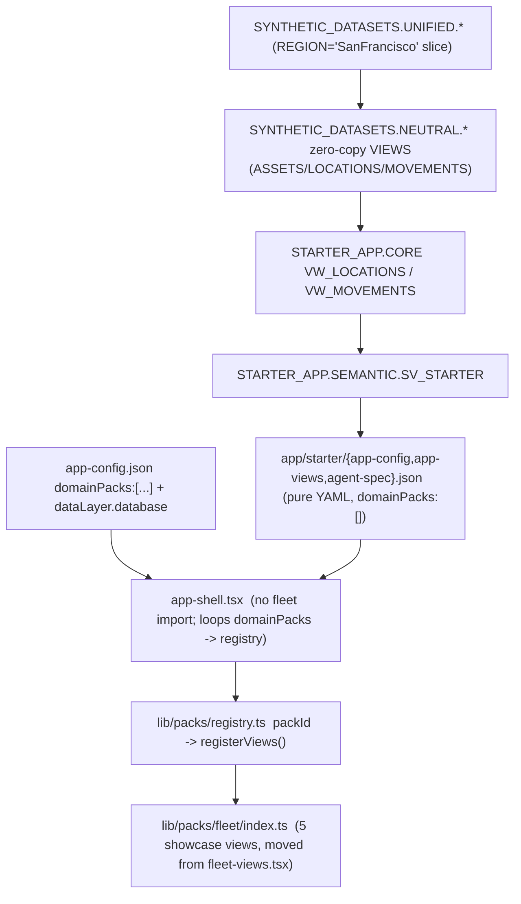

# Step 4C plan - Domain-pack loader + neutral starter pack

> How to resume in a new context: read project memory `fleet-sa-synapse-migration`
> (at `/Users/obielov/.snowflake/cortex/memory/projects/Users-obielov-Documents-GitHub-synapse/fleet-sa-synapse-migration.md`)
> and this file, then execute the tasks below in order.
>
> State at plan time (2026-06-22): branch `feature/sa-synapse-app` (work repo), remote `origin` =
> `Snowflake-Labs/sfguide-create-a-route-optimisation-and-vehicle-route-plan-simulator`, PR #127 open
> (base `dev`). Account `wgb26798`, snow connection `fleet_test_evals`. Live service
> `FLEET_INTELLIGENCE.SYNAPSE_USER.FLEET_SA_APP` v0.1.4 READY at
> https://bocmjncj-pm-fleet-test.snowflakecomputing.app . The data-contract close-out is DONE: all 10
> packs migrated to `FLEET_APP.<DOMAIN>`; route_optimization/backload/dhl_ntbo self-building; manifest +
> install.py + surfacing gate live; reproducible SV-repoint committed.
>
> CONFIRMED DECISIONS for 4C: (1) DEPLOY - redeploy `FLEET_SA_APP` (bump v0.1.4 -> v0.1.5) to demo the
> starter live. (2) Neutral vocabulary = `LOCATIONS` / `MOVEMENTS` (and `ASSETS` if needed). (3)
> `app-config.json` selects packs via `domainPacks: string[]` (legacy `domainPack` string coerced).
> (4) Starter app DB = neutral `STARTER_APP` (proves the data layer is not fleet-bound). (5) Starter ships
> NO custom React views (pure YAML dashboards) - the strongest proof the core needs zero domain code.
> (6) NEUTRAL SUBSTRATE FORM = **zero-copy VIEWS** `SYNTHETIC_DATASETS.NEUTRAL.*` over the EXPLICIT
> `REGION='SanFrancisco'` slice of `SYNTHETIC_DATASETS.UNIFIED.*` (NOT CONFIG-following, NOT materialized
> tables) - idiomatic data-contract pattern, no storage duplication, always fresh, reversible. Materialize
> only later IF a distributable neutral seed for fresh accounts is needed (packaging decision, not the proof).
> (7) FLEET PACK SCOPE = **STARTER ONLY maps from the substrate.** All 10 fleet packs stay exactly as-is on
> their current sources (Europe live demo unchanged). Do NOT re-point trip-shaped fleet packs (rejected
> option b/c): the agnosticism proof needs exactly ONE neutral pack; re-pointing working packs adds
> regression blast radius (packs x SVs x dashboards x SV-repoints) for no extra proof, and is inherently
> partial (dwell/marketplace/backload/dhl can't derive from LOCATIONS/MOVEMENTS/ASSETS).
> (8) "SF AS LIVE DEFAULT" IS A SEPARATE, OPTIONAL CONFIG FLIP - decoupled from the substrate/starter work.
> The fleet packs already filter by `CONFIG` (e.g. route_optimization `WHERE REGION=(SELECT REGION FROM
> CONFIG)`), so setting active `CONFIG` to `(SanFrancisco, ebike)` + the routing gateway default to
> SanFrancisco renders SF data with ZERO binding changes; non-SF packs auto-hide via the surfacing gate.
> Treat as a follow-up, not part of the starter proof. Caveats if/when flipped: (a) auto-resume/prewarm so a
> suspended SF service doesn't return service_unreachable (the 4B trap); (b) SF is ebike/food_delivery, so
> confirm its built ORS profiles match what any routing showcase calls (cycling/driving-car, NOT driving-hgv).
> (9) LIVE STARTER DEMO = **rotate the config stage temporarily** (upload starter app-config/app-views to
> `@FLEET_INTELLIGENCE.SYNAPSE_USER.FLEET_APP_STAGE/config`, suspend/resume, verify, then restore the fleet
> bundle as steady state). One service, no extra cost, no second endpoint.

## Goal (the user's ultimate intent)
The routing service runs as a separate product and the **main app is domain- and vehicle-agnostic** - a set
of reusable primitives users apply to their own use cases per domain. Fleet is one reference domain pack.
4C delivers the config-driven domain-pack LOADER (replacing the hardcoded `domainPack==='fleet'` gate) and a
**neutral starter pack** built from the real seeded **San Francisco** synthetic dataset, proving a non-fleet
domain can be authored on the primitives with no core code edits.

## Context / findings (verified read-only)

Remaining fleet coupling (grep - 5 files):
- `ui/src/components/app-shell.tsx` lines 11, 111-113: hardcoded `import { registerFleetViews }`, called
  behind `appConfig.domainPack === 'fleet'`. AppConfig already has `domainPack?: string` + `tools.mapTools`.
- `ui/src/lib/fleet-views.tsx`: `registerFleetViews(disabledSchemas?)` registers 5 showcase views
  (vrp_simulator, emergency_wizard, freight_exchange [gated on MARKETPLACE], backload_matching [gated on
  BACKLOAD_MATCHING], ops_console) via `viewRegistry.register({id,label,description,component: lazy(...)})`.
  The view component files live in `ui/src/components/views/areas/{vrp-simulator,emergency-wizard,
  freight-exchange,backload-matching,ops-console}.tsx`. `/api/fx/route.ts` backs freight/backload.
- `ui/src/lib/load-views.tsx`: `const FQN_RE = /FLEET_APP\.([A-Za-z0-9_]+)\./g` derives each YAML
  dashboard's schema (for the surfacing gate). Hardcodes the data-layer DB name `FLEET_APP`.
- `ui/src/app/api/pack-status/route.ts` + `ui/src/lib/server-config.ts`: `FLEET_APP`/fleet refs in the
  surfacing-gate probe path.

Surfacing gate (already live, commit 0d61676): `/api/pack-status` returns `{schemas:{<SCHEMA>:boolean}}`;
app-shell builds `disabledSchemas` = schemas whose probe view has 0 rows; `registerViewsFromConfig` and
`registerFleetViews` both take it and skip empty packs.

Starter data source (CONFIRMED): seeded **San Francisco** synthetic data. Active `DIM_DATASETS` row
`San Francisco E-Bike 50 @ seed` (DATASET_ID 59e656d4-6801-46fc-9209-137f909fbe31). SF-scoped base-table
counts (verified): `SYNTHETIC_DATASETS.UNIFIED.DIM_POIS WHERE REGION='SanFrancisco'` = **4998**,
`FACT_TRIPS` = **11693**, `FACT_VEHICLE_TELEMETRY` = **518535**, `DIM_FLEET` = **50**,
`DIM_TRIP_SCHEDULE` = **5685**. Bind the starter directly to the SF base tables (filter
`REGION='SanFrancisco'`), NOT the CONFIG-following `V_*_CURRENT` views (those track active Europe/hgv).

Column shapes (verified):
- `DIM_POIS`: LOCATION_ID, REGION, NAME, LOCATION_TYPE, CATEGORY, LAT FLOAT, LNG FLOAT, POINT_GEOM
  GEOGRAPHY, SOURCE, JOB_ID.
- `FACT_TRIPS`: TRIP_ID, VEHICLE_ID, DRIVER_ID, VEHICLE_TYPE, REGION, ORIGIN_POI_ID, DESTINATION_POI_ID,
  ORIGIN_LAT/LON, ORIGIN GEOGRAPHY, DESTINATION_LAT/LON, DESTINATION GEOGRAPHY, ROUTE_GEOG GEOGRAPHY,
  DISTANCE_KM, DURATION_MINUTES, PLANNED_ROUTE_GEOG, PLANNED_DISTANCE_KM, IS_DETOUR, DETOUR_DISTANCE_KM,
  TRIP_START TIMESTAMP_NTZ, TRIP_END, STATUS, ORS_PROFILE, JOB_ID.

Generator/installer facts:
- `app/packs/_lib/generate.py` derives the app DB from `app_schema.split('.')[0]`, so `app_schema:
  STARTER_APP.CORE` emits to a neutral DB with NO generator change. Grants go to existing roles
  FLEET_APP_USER/OPS/ADMIN (acceptable; they are just role names). `--sv-repoint` exists and wraps output
  in `EXECUTE IMMEDIATE $$...$$` (single-statement safe for `snow sql -f`).
- `app/packs/manifest.yaml` drives install order + the surfacing-gate probe per pack.
- Deploy: `.cortex/skills/build-routing-solution/scripts/deploy_fleet_sa_app.sh fleet_test_evals` (build ->
  push -> config upload -> ALTER SERVICE -> RESUME; sets ORS_CARTO_EAI). Tag source-of-truth =
  `openrouteservice_app/image-versions.env` (FLEET_SA_APP_TAG) + `fleet_sa_app_service.yaml`; pre-flight
  asserts they match and refuses a dirty tree (override `ALLOW_DIRTY=1`). On ARM Mac, if `docker push`
  hangs on the SPCS token bug, use the `crane` fallback (see AGENTS.md / memory crane-spcs-push-workaround).

## Target architecture

NOTE: fleet packs do NOT read `NEUTRAL.*` (decision 7 - starter only). The fleet bundle stays on its current
`FLEET_APP.*` sources. The `NEUTRAL` layer exists solely to feed the starter proof.

## Implementation steps

### A. Decouple the app core (config-driven pack loader)
1. **UI pack registry** - new `ui/src/lib/packs/registry.ts`:
   `export const PACK_REGISTRY: Record<string, { registerViews: (disabled?: Set<string>) => void }>`.
   Move the fleet showcase registration into `ui/src/lib/packs/fleet/index.ts` (relocate the body of
   `registerFleetViews`; keep the `disabledSchemas` arg + MARKETPLACE/BACKLOAD_MATCHING gating). Register
   `fleet` in PACK_REGISTRY. (Leave the 5 view component files where they are under
   `components/views/areas/` - only the registration moves, minimal churn.)
2. **app-shell** - add `domainPacks?: string[]` to `AppConfig`; coerce legacy `domainPack?: string` ->
   `[domainPack]`. Replace the `import { registerFleetViews }` + `if (domainPack==='fleet')` branch with
   `for (const id of resolvedPacks) PACK_REGISTRY[id]?.registerViews(disabledSchemas)`. No domain import
   remains in the shell. Delete `fleet-views.tsx` (or leave a thin re-export from the pack module).

### B. Genericize the data-layer DB prefix
3. Add `dataLayer?: { database: string }` to AppConfig (default `FLEET_APP` for back-compat). In
   `load-views.tsx` build the schema regex from the configured DB
   (`new RegExp(\`${db}\\.([A-Za-z0-9_]+)\\.\`,'g')`) instead of literal `FLEET_APP\.`. Mirror in
   `pack-status/route.ts` (read DB from `server-config.ts`). Fleet keeps working (default `FLEET_APP`).

### C. Build the neutral SF substrate (VIEWS) + author the starter data-contract pack
4a. **Neutral substrate (zero-copy VIEWS)** - create schema `SYNTHETIC_DATASETS.NEUTRAL` and relabel the
   EXPLICIT SF slice of `UNIFIED.*` with domain-agnostic names (no vehicle/trailer/HGV vocabulary). Minimum
   set for the starter:
   - `NEUTRAL.LOCATIONS` <- `UNIFIED.DIM_POIS WHERE REGION='SanFrancisco'` (LOCATION_ID, NAME, CATEGORY,
     LOCATION_TYPE, LAT, LNG, POINT_GEOM).
   - `NEUTRAL.MOVEMENTS` <- `UNIFIED.FACT_TRIPS WHERE REGION='SanFrancisco'` (MOVEMENT_ID=TRIP_ID,
     ORIGIN_ID=ORIGIN_POI_ID, DESTINATION_ID=DESTINATION_POI_ID, DISTANCE_KM, DURATION_MINUTES,
     STARTED_AT=TRIP_START, ENDED_AT=TRIP_END, STATUS, ROUTE_GEOG). Drop VEHICLE/DRIVER/ORS_PROFILE.
   - `NEUTRAL.ASSETS` <- `UNIFIED.DIM_FLEET WHERE REGION='SanFrancisco'` (ASSET_ID=VEHICLE_ID, neutral
     attributes only) - include only if a dashboard/SV needs it.
   These are plain VIEWS (not CONFIG-following, not materialized). Tracking COMMENT per AGENTS.md. This IS
   the "restructured seed to fit the domain-agnostic concept" - done as a view layer, reversible, zero-copy.
4b. New `app/packs/starter/{data-model.yaml, entity-mapping.yaml}` - `app_schema: STARTER_APP.CORE`; the
   entity-mapping binds to the `SYNTHETIC_DATASETS.NEUTRAL.*` views (NOT to `UNIFIED.*` directly):
   - `LOCATIONS` (mapped) <- `NEUTRAL.LOCATIONS`; `MOVEMENTS` (mapped) <- `NEUTRAL.MOVEMENTS`;
     optional `MOVEMENT_DAILY` (derived rollup by day).
   This proves the chain: neutral substrate -> data-contract pack -> SV -> dashboards, with zero fleet terms.
5. Generate + apply: `python3 app/packs/_lib/generate.py --model app/packs/starter/data-model.yaml
   --mapping app/packs/starter/entity-mapping.yaml --out app/packs/starter/setup.sql`; then
   `snow sql -c fleet_test_evals -f app/packs/starter/setup.sql` (creates `STARTER_APP` DB + `CORE` schema
   + grants). Commit the `NEUTRAL.*` DDL too (e.g. `app/packs/starter/neutral_substrate.sql`) so a fresh
   install can rebuild it. Add a `starter` row to `app/packs/manifest.yaml` (probe
   `STARTER_APP.CORE.VW_LOCATIONS`, no depends_on, self_building:false).

### D. Starter semantic view + app bundle
6. Create `STARTER_APP.SEMANTIC.SV_STARTER` over `VW_LOCATIONS` + `VW_MOVEMENTS` (neutral facts/dims/
   metrics: location count by category; movement count; avg distance/duration; movements by day). Validate
   with `call_cortex_analyst`. Commit the DDL as `app/packs/starter/sv_starter.sql` (the starter is the
   reference for "SV as a committed artifact" - closes the SV-DDL-source gap for this pack).
7. New `app/starter/` bundle:
   - `app-config.json`: neutral name (e.g. "Locations & Movements"), `domainPacks: []`,
     `dataLayer.database: STARTER_APP`, no region/vehicle contextBar (or a minimal date_range only),
     no `tools`/`ops`/routing.
   - `app-views.json`: 2 pure-YAML dashboards - (a) a `Map` scatter of `VW_LOCATIONS.POINT_GEOM`
     (use `ST_X`/`ST_Y` or LAT/LNG), (b) metrics + table/line over `VW_MOVEMENTS` (count, avg distance/
     duration; movements-by-day line if MOVEMENT_DAILY built).
   - `agent-spec.json`: one `cortex_analyst_text_to_sql` tool over `SV_STARTER` + `data_to_chart`;
     NO MCP/routing tools. (Create a starter agent only if demoing the chat; otherwise dashboards suffice.)
   Remember SA data-tap rules: `/api/query` LOWERCASES columns + sends NO default db/schema -> fully
   qualify tables; metric `percent` format multiplies by 100; path layer geojsonColumn must be a STRING
   (`ST_ASGEOJSON(geog)::STRING`); scatter needs numeric lng/lat.

### E. Docs
8. `app/packs/starter/README.md` + an "Author your own domain" section: pack contract = data-contract pack
   (data-model + entity-mapping + generated setup.sql + sv_*.sql) + app bundle (app-config/app-views/
   agent-spec) + optional UI pack module in `lib/packs/<id>/`. Update `app/packs/README.md` +
   `fleet_sa_app/README.md` to point at the loader + starter.

### F. Deploy (CONFIRMED) + verify
9. Bump `FLEET_SA_APP_TAG` v0.1.4 -> **v0.1.5** in `openrouteservice_app/image-versions.env` +
   `fleet_sa_app_service.yaml` (TSX changed -> image rebuild required). Commit, then run
   `bash .cortex/skills/build-routing-solution/scripts/deploy_fleet_sa_app.sh fleet_test_evals`.
10. **Live starter demo = ROTATE CONFIG STAGE (decision 9), one service, no extra cost:** upload
   `app/starter/app-config.json` + `app/starter/app-views.json` to
   `@FLEET_INTELLIGENCE.SYNAPSE_USER.FLEET_APP_STAGE/config/` (`snow stage copy --overwrite`), suspend/resume
   `FLEET_SA_APP`, verify/screenshot the starter rendering SF data with NO fleet views, then **restore the
   fleet bundle** (re-upload fleet `app-config.json`/`app-views.json`, suspend/resume) as the steady-state
   live bundle. Do NOT stand up a second service. Do NOT leave the starter bundle staged.
11. **SF-as-live-default (decision 8) is OPTIONAL and SEPARATE - only if explicitly requested:** flip active
   `CONFIG` to `(SanFrancisco, ebike)` in the per-schema CONFIG tables + set the routing gateway
   `DEFAULT_REGION_NAME=SanFrancisco`; ensure the SF ORS service auto-resumes/prewarms (avoid the 4B
   service_unreachable trap) and that SF's built ORS profiles cover what any routing showcase calls. This is
   NOT part of the starter proof; skip unless the user asks for it in the execution session.

## Verification
- `cd ui && npm run build` GREEN; `npx tsc --noEmit` clean.
- Decoupling proof: host with starter bundle (`APP_CONFIG=app/starter/app-config.json
  APP_VIEWS_CONFIG=app/starter/app-views.json`) shows ONLY the 2 starter dashboards; no fleet chunks load
  (lazy() never fetched); agent answers via `SV_STARTER` on SF data.
- Fleet unchanged: fleet bundle still registers all 5 showcase views through the registry; surfacing gate
  still hides empty packs (FQN prefix resolves `FLEET_APP`); all 10 fleet packs untouched on their sources.
- Neutral substrate: `SELECT COUNT(*) FROM SYNTHETIC_DATASETS.NEUTRAL.LOCATIONS` = 4998,
  `NEUTRAL.MOVEMENTS` = 11693; starter `STARTER_APP.CORE.VW_LOCATIONS` = 4998, `VW_MOVEMENTS` = 11693;
  `call_cortex_analyst` on `SV_STARTER` returns valid SQL + rows.
- Live: service READY on v0.1.5; after the demo the FLEET bundle is restored as steady state;
  `SYSTEM$GET_SERVICE_LOGS` shows clean boot + `/api/pack-status` 200.

## Commit / push (per AGENTS.md)
- Logical commits: (1) loader refactor + FQN genericization; (2) starter data pack + SV + app bundle;
  (3) docs; (4) v0.1.5 tag bump. Push to `origin/feature/sa-synapse-app` via the gh-token method in
  `/memories/git-push-method.md` (plain `git push` fails). PR #127 (base `dev`) auto-includes the commits;
  add a summary comment (requires `gh auth switch --user sfc-gh-obielov` then back - EMU restriction).
- Update memory `fleet-sa-synapse-migration` with the 4C close-out.

## Critical files
- `ui/src/components/app-shell.tsx` - remove fleet import; add domainPacks loop over the registry.
- `ui/src/lib/fleet-views.tsx` -> move to `ui/src/lib/packs/fleet/index.ts` + new `ui/src/lib/packs/registry.ts`.
- `ui/src/lib/load-views.tsx` + `ui/src/app/api/pack-status/route.ts` - config-driven data-layer DB prefix.
- `app/packs/_lib/generate.py` - reused unchanged (neutral DB via `app_schema`); new `app/packs/starter/*`
  (data-model.yaml, entity-mapping.yaml, setup.sql, sv_starter.sql, neutral_substrate.sql, README.md).
- `app/packs/manifest.yaml` - register the starter pack; `app/starter/*` - the starter app bundle.
- `SYNTHETIC_DATASETS.NEUTRAL.*` - new zero-copy view layer (DDL committed in `neutral_substrate.sql`).

## Deferred (after 4C)
4D per-user ops gating (ingress identity `Sf-Context-Current-User` in `/api/ops`); 4E generic N-dimension
contextBar + in-app config editing; 4F SV VQRs + `evaluate_semantic_view` per domain + agent eval; 4G
vitest/CI (fix `src/lib/sfQuery.test.ts`); 4H Native App / org-listing packaging. Tracked in
`STEP4_PLAN.md`. Also still open: the other 7 packs lack committed `sv_repoint.sql`; the 10 `SV_*` CREATE
DDLs are not yet a committed repo source-of-truth.

## How to resume in a new chat
Tell the agent: "Execute Step 4C. Read memory `fleet-sa-synapse-migration` and
`.cortex/skills/build-routing-solution/fleet_sa_app/STEP4C_PLAN.md`. Branch feature/sa-synapse-app, account
wgb26798 (conn fleet_test_evals), FLEET_SA_APP live at v0.1.4. Decisions locked: deploy v0.1.5;
LOCATIONS/MOVEMENTS(/ASSETS); domainPacks array; neutral STARTER_APP DB; neutral substrate =
SYNTHETIC_DATASETS.NEUTRAL.* zero-copy VIEWS over the REGION='SanFrancisco' slice; STARTER-ONLY maps from
the substrate (all 10 fleet packs unchanged); SF-as-live-default is a SEPARATE optional CONFIG flip (skip
unless asked); live starter demo = rotate config stage then restore fleet. Start at task A1 (pack
registry)."
