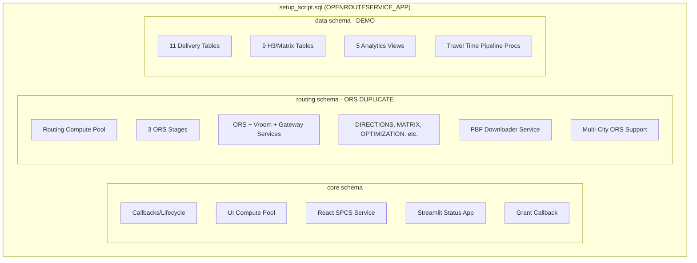
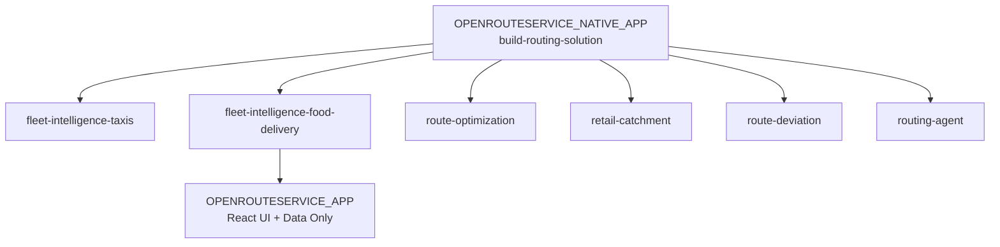

# Decompose ORS from Food Delivery Native App

## Current State

The `setup_script.sql` (1778 lines) mixes three concerns:



The `routing` schema (~500 lines) **duplicates** what `build-routing-solution` already provides via the standalone `OPENROUTESERVICE_NATIVE_APP`, with two additions:
1. Multi-city ORS support (`setup_city_ors`, `create_city_functions`, per-region ORS instances)
2. Missing: `ISOCHRONES`, all `_GEO` table functions

**All other demo skills** (taxis, route-optimization, retail-catchment, route-deviation, routing-agent) call `OPENROUTESERVICE_NATIVE_APP.CORE.*` -- none bundle ORS.

---

## Proposed Architecture



**Remove the entire `routing` schema from the food delivery native app.** The app becomes a UI + data pipeline that depends on the standalone ORS, just like every other demo.

---

## What Changes

### 1. Remove from `setup_script.sql` (~500 lines)

Delete the entire `routing` schema block (lines 177-529):
- `CREATE SCHEMA routing` + all grants
- 10 procedures: `create_routing_pool`, `create_stages`, `start_downloader`, `create_services`, `create_functions`, `setup_ors`, `create_city_pool`, `create_city_ors_service`, `create_city_functions`, `setup_city_ors`, `resume_city_ors`
- All routing functions created inside `create_functions()` and `create_city_functions()`

### 2. Backport multi-city ORS to standalone app (optional, separate task)

The food delivery app has **unique multi-city support** (`setup_city_ors`, per-region ORS instances) that doesn't exist in the standalone app. Two choices:

- **Option A**: Backport multi-city to `build-routing-solution` as a new feature, then all skills benefit
- **Option B**: Drop multi-city from the food delivery app for now (simplest)

### 3. Update food delivery app to use standalone ORS

The React server ([`assets/react-app/server/index.ts`](assets/react-app/server/index.ts)) currently calls `routing.*` functions within its own app database. It needs to call `OPENROUTESERVICE_NATIVE_APP.CORE.*` instead. Two approaches:

- **Option A (cross-app calls)**: The app's procedures call `OPENROUTESERVICE_NATIVE_APP.CORE.DIRECTIONS(...)` directly. Requires GRANT USAGE on the standalone app's functions to the food delivery app.
- **Option B (thin wrappers)**: Create thin SQL wrapper functions in the app that delegate to the standalone app. More resilient to app name changes but adds indirection.

### 4. Update `manifest.yml`

Remove the ORS Docker image references from the food delivery app's manifest since it no longer bundles ORS services:
```yaml
# REMOVE these:
- /openrouteservice_setup/public/image_repository/openrouteservice:v9.0.0
- /openrouteservice_setup/public/image_repository/vroom-docker:v1.0.1
- /openrouteservice_setup/public/image_repository/routing_reverse_proxy:v0.9.2
- /openrouteservice_setup/public/image_repository/downloader:v0.0.3
```

This also means removing the ORS-related privilege requests from manifest.yml and removing the `external_access_download_ref` reference (for PBF downloads).

### 5. Update deployment docs

- [`references/native-app-deployment.md`](.cortex/skills/fleet-intelligence-food-delivery/references/native-app-deployment.md): Remove all ORS deployment steps (setup_ors, image push for ORS images, etc.)
- [`SKILL.md`](.cortex/skills/fleet-intelligence-food-delivery/SKILL.md): Update dependency to explicitly require `build-routing-solution` be completed first. Add prerequisite check for running ORS services.

### 6. Update `deploy()` / `deploy_full()` procedures

Currently `deploy_full()` calls `routing.setup_ors()`. After decomposition:
- `deploy()` = create UI pool + warehouse + React service (unchanged)
- Remove `deploy_full()` entirely (or rename to just `deploy()`)
- Add a `check_ors()` procedure that verifies `OPENROUTESERVICE_NATIVE_APP` is installed and running

---

## Impact Summary

| Area | Change |
|------|--------|
| `setup_script.sql` | Remove ~500 lines (routing schema) |
| `manifest.yml` | Remove 4 ORS image references |
| `server/index.ts` | Change `routing.*` calls to `OPENROUTESERVICE_NATIVE_APP.CORE.*` |
| `native-app-deployment.md` | Remove ORS-specific deployment steps |
| `SKILL.md` | Add explicit `build-routing-solution` prerequisite |
| Standalone ORS app | Optional: backport multi-city support |

---

## Risk Assessment

- **Breaking change**: The native app will no longer be self-contained. Users must install `OPENROUTESERVICE_NATIVE_APP` first. This is already the pattern for all other demos.
- **Cross-app grants**: Need `GRANT USAGE ON FUNCTION OPENROUTESERVICE_NATIVE_APP.CORE.DIRECTIONS(...) TO APPLICATION OPENROUTESERVICE_APP` (and similar for other functions). This requires the installer to run grant statements.
- **Multi-city**: If we drop multi-city without backporting, the food delivery app loses per-region ORS capability. This is used for deploying city-specific ORS instances from the React UI's map builder.
