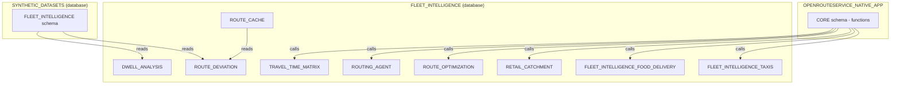

# Plan: Consolidate Demo Skills into FLEET_INTELLIGENCE Database

## Overview

Move all demo skill assets from their current scattered databases (`OPENROUTESERVICE_SETUP`, `FLEET_INTELLIGENCE`, `FLEET_DEMOS`, `ROUTING_DB`, `RETAIL_CATCHMENT_DEMO`) into a single `FLEET_INTELLIGENCE` database with per-skill schemas.

**What stays unchanged:**
- Source data: `SYNTHETIC_DATASETS.FLEET_INTELLIGENCE` (5 S3-loaded tables)
- ORS native app: `OPENROUTESERVICE_NATIVE_APP.CORE.*` functions
- ORS infrastructure: `OPENROUTESERVICE_SETUP.PUBLIC` (stages, image repos from `build-routing-solution`)
- Marketplace data: `OVERTURE_MAPS__PLACES.CARTO.*`, `OVERTURE_MAPS__ADDRESSES.CARTO.*`

## New Schema Mapping

| Skill | Old DB.SCHEMA | New DB.SCHEMA |
|-------|--------------|---------------|
| route-deviation (target) | `FLEET_INTELLIGENCE.DEVIATION_ANALYSIS` | `FLEET_INTELLIGENCE.ROUTE_DEVIATION` |
| route-deviation (route cache) | `FLEET_DEMOS.ROUTING` | `FLEET_INTELLIGENCE.ROUTE_CACHE` |
| dwell-analysis | `FLEET_INTELLIGENCE.DWELL_ANALYSIS` | `FLEET_INTELLIGENCE.DWELL_ANALYSIS` (unchanged) |
| fleet-intelligence-taxis | `OPENROUTESERVICE_SETUP.FLEET_INTELLIGENCE_TAXIS` | `FLEET_INTELLIGENCE.FLEET_INTELLIGENCE_TAXIS` |
| fleet-intelligence-food-delivery | `OPENROUTESERVICE_SETUP.FLEET_INTELLIGENCE_FOOD_DELIVERY` | `FLEET_INTELLIGENCE.FLEET_INTELLIGENCE_FOOD_DELIVERY` |
| retail-catchment | `OPENROUTESERVICE_SETUP.RETAIL_CATCHMENT_DEMO` | `FLEET_INTELLIGENCE.RETAIL_CATCHMENT` |
| route-optimization | `OPENROUTESERVICE_SETUP.VEHICLE_ROUTING_SIMULATOR` | `FLEET_INTELLIGENCE.ROUTE_OPTIMIZATION` |
| routing-agent | `OPENROUTESERVICE_SETUP.SI_ROUTING_AGENT` | `FLEET_INTELLIGENCE.ROUTING_AGENT` |
| travel-time-matrix | `ROUTING_DB.PUBLIC` / `OPENROUTESERVICE_SETUP.ROUTING` | `FLEET_INTELLIGENCE.TRAVEL_TIME_MATRIX` |

**Note:** `dwell-analysis` already uses `FLEET_INTELLIGENCE.DWELL_ANALYSIS` -- no DB change needed, only schema name stays the same.

---

## Task 1: Define new schema mapping and update SKILL.md variable tables

Update the configuration variable tables in each SKILL.md.

### 1a. [route-deviation/SKILL.md](route-deviation/SKILL.md)
Change variable table:
- `TARGET_DB`: `FLEET_INTELLIGENCE` (unchanged)
- `TARGET_SCHEMA`: `DEVIATION_ANALYSIS` -> `ROUTE_DEVIATION`
- `ROUTE_CACHE_DB`: `FLEET_DEMOS` -> `FLEET_INTELLIGENCE`
- `ROUTE_CACHE_SCHEMA`: `ROUTING` -> `ROUTE_CACHE`
- Update Required Privileges table: remove `FLEET_DEMOS` database references, add `FLEET_INTELLIGENCE.ROUTE_CACHE`
- Update Cleanup section: change all `FLEET_INTELLIGENCE.DEVIATION_ANALYSIS.*` to `FLEET_INTELLIGENCE.ROUTE_DEVIATION.*`, change `FLEET_DEMOS.ROUTING.*` to `FLEET_INTELLIGENCE.ROUTE_CACHE.*`, remove `DROP DATABASE IF EXISTS FLEET_DEMOS`

### 1b. [fleet-intelligence-taxis/SKILL.md](fleet-intelligence-taxis/SKILL.md)
- Update all `OPENROUTESERVICE_SETUP.FLEET_INTELLIGENCE_TAXIS` to `FLEET_INTELLIGENCE.FLEET_INTELLIGENCE_TAXIS`
- Update Required Privileges table: change DB from `OPENROUTESERVICE_SETUP` to `FLEET_INTELLIGENCE`
- Update Cleanup section

### 1c. [fleet-intelligence-food-delivery/SKILL.md](fleet-intelligence-food-delivery/SKILL.md)
- Update all `OPENROUTESERVICE_SETUP.FLEET_INTELLIGENCE_FOOD_DELIVERY` to `FLEET_INTELLIGENCE.FLEET_INTELLIGENCE_FOOD_DELIVERY`
- Note: `FLEET_INTELLIGENCE_SETUP` database (for native app image repo) stays -- that's ORS-related infrastructure

### 1d. [retail-catchment/SKILL.md](retail-catchment/SKILL.md)
- Update `OPENROUTESERVICE_SETUP.RETAIL_CATCHMENT_DEMO` to `FLEET_INTELLIGENCE.RETAIL_CATCHMENT`

### 1e. [route-optimization/SKILL.md](route-optimization/SKILL.md)
- Update `OPENROUTESERVICE_SETUP.VEHICLE_ROUTING_SIMULATOR` to `FLEET_INTELLIGENCE.ROUTE_OPTIMIZATION`

### 1f. [routing-agent/SKILL.md](routing-agent/SKILL.md)
- Update `OPENROUTESERVICE_SETUP.SI_ROUTING_AGENT` to `FLEET_INTELLIGENCE.ROUTING_AGENT`

### 1g. [travel-time-matrix/SKILL.md](travel-time-matrix/SKILL.md)
- Update default `P_DB` from `ROUTING_DB` to `FLEET_INTELLIGENCE`
- Update default schema from `PUBLIC` to `TRAVEL_TIME_MATRIX`

---

## Task 2: Update route-deviation SQL pipeline and SKILL.md

### [route-deviation/references/sql-pipeline.md](route-deviation/references/sql-pipeline.md)

Global replacements:
- `{TARGET_SCHEMA}` default changes from `DEVIATION_ANALYSIS` to `ROUTE_DEVIATION` (template vars stay, just the documented defaults change in SKILL.md)
- `{ROUTE_CACHE_DB}.{ROUTE_CACHE_SCHEMA}` -- template vars stay, defaults change in SKILL.md
- Remove `CREATE DATABASE IF NOT EXISTS {ROUTE_CACHE_DB}` block (route cache now in same FLEET_INTELLIGENCE DB)
- Add `CREATE SCHEMA IF NOT EXISTS FLEET_INTELLIGENCE.ROUTE_CACHE` to infrastructure setup
- Update Streamlit deployment section: `{TARGET_DB}.{TARGET_SCHEMA}` remains parameterized

### [route-deviation/references/dataset-guide.md](route-deviation/references/dataset-guide.md)
- No changes needed (documents S3 source tables which stay in SYNTHETIC_DATASETS)

### [route-deviation/assets/dashboard/](route-deviation/assets/dashboard/) (if Streamlit files exist with hardcoded refs)
- Search for hardcoded `FLEET_INTELLIGENCE.DEVIATION_ANALYSIS` and update to `FLEET_INTELLIGENCE.ROUTE_DEVIATION`

---

## Task 3: Update dwell-analysis SQL pipeline and Streamlit files

`dwell-analysis` already targets `FLEET_INTELLIGENCE.DWELL_ANALYSIS` -- no DB change needed. The schema name `DWELL_ANALYSIS` matches the underscore convention perfectly. However, we need to verify all references are consistent.

### [dwell-analysis/references/sql-pipeline.sql](dwell-analysis/references/sql-pipeline.sql)
- No changes needed -- already uses `FLEET_INTELLIGENCE.DWELL_ANALYSIS`

### Streamlit files (21 files)
- Already use `SCHEMA = "FLEET_INTELLIGENCE.DWELL_ANALYSIS"` -- no changes needed

**This task may be a no-op** but included for completeness and verification.

---

## Task 4: Update fleet-intelligence-taxis references

### [fleet-intelligence-taxis/references/sql-pipeline.md](fleet-intelligence-taxis/references/sql-pipeline.md)
- Replace all `OPENROUTESERVICE_SETUP.FLEET_INTELLIGENCE_TAXIS` with `FLEET_INTELLIGENCE.FLEET_INTELLIGENCE_TAXIS`
- Update `CREATE DATABASE IF NOT EXISTS OPENROUTESERVICE_SETUP` to `CREATE DATABASE IF NOT EXISTS FLEET_INTELLIGENCE`
- Update `CREATE SCHEMA` accordingly

### Streamlit files (3 files + main):
| File | Change |
|------|--------|
| [assets/streamlit/Taxi_Control_Center.py](fleet-intelligence-taxis/assets/streamlit/Taxi_Control_Center.py) | Replace `OPENROUTESERVICE_SETUP.FLEET_INTELLIGENCE_TAXIS` with `FLEET_INTELLIGENCE.FLEET_INTELLIGENCE_TAXIS` |
| [assets/streamlit/pages/1_Driver_Routes.py](fleet-intelligence-taxis/assets/streamlit/pages/1_Driver_Routes.py) | Same replacement |
| [assets/streamlit/pages/2_Heat_Map.py](fleet-intelligence-taxis/assets/streamlit/pages/2_Heat_Map.py) | Same replacement |

---

## Task 5: Update fleet-intelligence-food-delivery references

### [fleet-intelligence-food-delivery/references/sql-pipeline.md](fleet-intelligence-food-delivery/references/sql-pipeline.md)
- Replace all `OPENROUTESERVICE_SETUP.FLEET_INTELLIGENCE_FOOD_DELIVERY` with `FLEET_INTELLIGENCE.FLEET_INTELLIGENCE_FOOD_DELIVERY`

### Streamlit files (6 files):
| File | Change |
|------|--------|
| [assets/streamlit/Delivery_Control_Center.py](fleet-intelligence-food-delivery/assets/streamlit/Delivery_Control_Center.py) | Replace DB.SCHEMA |
| [assets/streamlit/pages/1_Courier_Routes.py](fleet-intelligence-food-delivery/assets/streamlit/pages/1_Courier_Routes.py) | Replace DB.SCHEMA |
| [assets/streamlit/pages/2_Heat_Map.py](fleet-intelligence-food-delivery/assets/streamlit/pages/2_Heat_Map.py) | Replace DB.SCHEMA |
| [assets/streamlit/pages/3_Travel_Time_Matrix.py](fleet-intelligence-food-delivery/assets/streamlit/pages/3_Travel_Time_Matrix.py) | Replace `OPENROUTESERVICE_SETUP.ROUTING` with `FLEET_INTELLIGENCE.TRAVEL_TIME_MATRIX` |
| [assets/streamlit/pages/3_Travel_Time_Analysis.py](fleet-intelligence-food-delivery/assets/streamlit/pages/3_Travel_Time_Analysis.py) | Same -- update `OPENROUTESERVICE_SETUP.ROUTING` and `OPENROUTESERVICE_SETUP.PUBLIC.CA_H3_*` |
| [assets/streamlit/pages/4_Retail_Catchment.py](fleet-intelligence-food-delivery/assets/streamlit/pages/4_Retail_Catchment.py) | Replace `OPENROUTESERVICE_SETUP.PUBLIC.RETAIL_*` with `FLEET_INTELLIGENCE.RETAIL_CATCHMENT.RETAIL_*` |

**Note:** Pages 3 and 4 reference objects from `travel-time-matrix` and `retail-catchment` skills. These cross-references must use the NEW schema names.

### Native app files (no change expected):
- `assets/react-app/native-app/` files use env vars and `CURRENT_DATABASE()` -- no hardcoded DB.SCHEMA to change

---

## Task 6: Update retail-catchment, route-optimization, routing-agent, travel-time-matrix

### 6a. [retail-catchment/references/sql-pipeline.md](retail-catchment/references/sql-pipeline.md)
- Replace `OPENROUTESERVICE_SETUP.RETAIL_CATCHMENT_DEMO` with `FLEET_INTELLIGENCE.RETAIL_CATCHMENT`
### [retail-catchment/assets/streamlit/retail_catchment.py](retail-catchment/assets/streamlit/retail_catchment.py)
- Replace `RETAIL_CATCHMENT_DEMO.PUBLIC.RETAIL_POIS` etc. with `FLEET_INTELLIGENCE.RETAIL_CATCHMENT.RETAIL_POIS`

### 6b. [route-optimization/references/sql-setup.md](route-optimization/references/sql-setup.md)
- Replace `OPENROUTESERVICE_SETUP.VEHICLE_ROUTING_SIMULATOR` with `FLEET_INTELLIGENCE.ROUTE_OPTIMIZATION`
### [route-optimization/assets/streamlit/routing.py](route-optimization/assets/streamlit/routing.py)
- Replace `VEHICLE_ROUTING_SIMULATOR.*` with `FLEET_INTELLIGENCE.ROUTE_OPTIMIZATION.*`
### [route-optimization/assets/notebooks/*.ipynb](route-optimization/assets/notebooks/)
- Update `VEHICLE_ROUTING_SIMULATOR` schema references

### 6c. [routing-agent/references/agent-definitions.md](routing-agent/references/agent-definitions.md)
- Replace `OPENROUTESERVICE_SETUP.SI_ROUTING_AGENT` with `FLEET_INTELLIGENCE.ROUTING_AGENT`

### 6d. [travel-time-matrix/references/*.sql](travel-time-matrix/references/)
- Update default `P_DB` to `FLEET_INTELLIGENCE`, schema from `PUBLIC` to `TRAVEL_TIME_MATRIX`
- Update `build-city-matrix.sql`, `setup-infrastructure.sql`, `sql-procedures.md`
- Update `build-ca-travel-time.sql` references from `OPENROUTESERVICE_SETUP.ROUTING.*` to `FLEET_INTELLIGENCE.TRAVEL_TIME_MATRIX.*`

---

## Task 7: Update cleanup skill and shared references

### [cleanup/SKILL.md](cleanup/SKILL.md)
- Update the skill-to-tracking-tag table with new DB.SCHEMA locations
- Ensure DROP statements reference the new schemas

### [synthetic-datasets-generator/references/s3-load-fleet-intelligence.sql](synthetic-datasets-generator/references/s3-load-fleet-intelligence.sql)
- No change needed (loads into `SYNTHETIC_DATASETS.FLEET_INTELLIGENCE`)

### Run eval framework
- Execute `.cortex/skills/evals/run_evals.py` to verify all 50 checks still pass after changes
- The xref checks may need updates if they validate DB.SCHEMA patterns

---

## Impact Summary

| Metric | Count |
|--------|-------|
| SKILL.md files to update | 8 |
| SQL reference files to update | ~10 |
| Streamlit Python files to update | ~16 |
| Notebook files to update | ~2 |
| Total files affected | ~36 |

## Risks

1. **Cross-skill references**: Food-delivery pages 3/4 reference travel-time-matrix and retail-catchment objects. These cross-references must be updated atomically.
2. **Eval framework**: The xref checks validate SKILL.md cleanup sections match asset file paths -- schema name changes in cleanup may cause eval failures until evals are updated.
3. **build-routing-solution**: Creates `OPENROUTESERVICE_SETUP` database. Skills that previously relied on this DB existing will now need `CREATE DATABASE IF NOT EXISTS FLEET_INTELLIGENCE` in their infrastructure setup. Multiple skills creating the same DB is fine (IF NOT EXISTS).
4. **FLEET_INTELLIGENCE database**: Currently created by both `route-deviation` and `dwell-analysis`. With all 8 skills creating schemas in it, each skill's infrastructure setup should include `CREATE DATABASE IF NOT EXISTS FLEET_INTELLIGENCE`.
