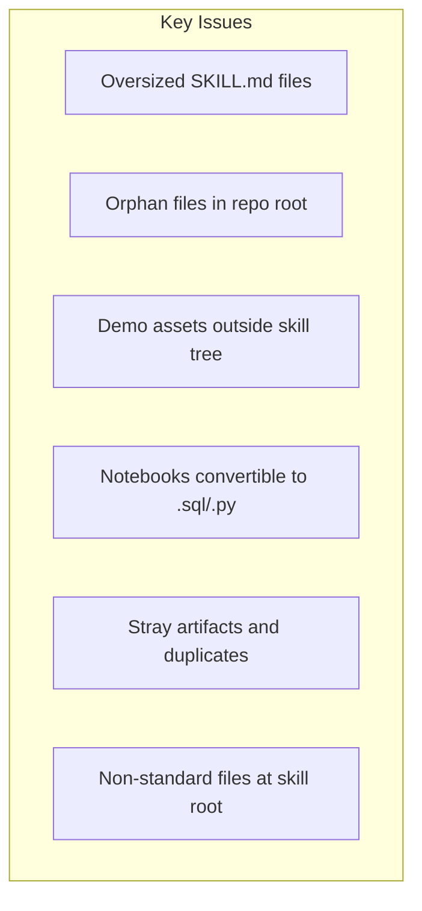
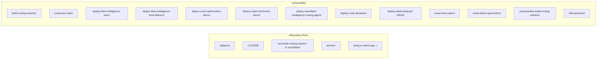

# Plan: Repository Skill Modularization

## Current State Analysis

The repository has **14 skills** in `.cortex/skills/` but the majority of supporting assets (SQL, Python, Streamlit apps, notebooks, config files, slide decks) are **scattered across the root and various `oss-*` directories** outside the skill tree. Several skills also violate Anthropic's 5,000-word limit or have non-standard files at the skill root.

### Problems Identified



| Issue | Files Affected |
|-------|---------------|
| SKILL.md over 5,000 words | `deploy-fleet-intelligence-food-delivery` (8,056 words) |
| Root orphan .md files | 3 CoCo_Direct_*.md + slide_deck.md |
| Root orphan .sql files | build_ca_travel_time.sql, build_city_matrix.sql |
| Non-standard skill root files | travel-time-matrix: ARCHITECTURE.md, COSTING.md, ors-config.yml, setup_infrastructure.sql |
| Demo folders disconnected from skills | 6 `oss-*` directories + fleet-intelligence-app/ |
| Convertible notebooks | add_carto_data.ipynb (mostly SQL), download_map.ipynb (pure Python) |
| Stray artifacts | `file:/tmp/` directory, `.DS_Store`, folder with trailing space |

---

## Task 1: Extract Oversized SKILL.md Content to references/

### deploy-fleet-intelligence-food-delivery (8,056 words -- CRITICAL)

This is the most bloated skill. Extract into progressive disclosure:

| Extract To | Content |
|-----------|---------|
| `references/sql-pipeline.md` | All CTAS SQL blocks (restaurants, couriers, routes, views, ETAs) |
| `references/streamlit-deployment.md` | Streamlit file contents + SiS deployment SQL |
| `references/native-app-deployment.md` | Docker build, image push, app package, service spec, install |
| `references/travel-time-integration.md` | Travel time matrix SQL blocks |

Keep in SKILL.md: workflow steps (numbered), decision points, prerequisites, configuration table, troubleshooting.

### deploy-fleet-intelligence-taxis (3,535 words -- borderline)

Extract inline SQL to `references/sql-pipeline.md`, keep workflow skeleton in SKILL.md. This brings it under ~1,500 words.

### travel-time-matrix (3,957 words -- borderline)

Extract inline SQL procedures to `references/sql-procedures.md`. The massive stored procedure definitions (worker proc, flatten proc, DAG proc) should not be in the main SKILL.md body.

### deploy-snowflake-intelligence-routing-agent (2,864 words)

Extract the 3 Python stored procedures and CREATE AGENT spec to `references/agent-definitions.md`. Keep workflow + decision tree in SKILL.md.

---

## Task 2: Restructure travel-time-matrix Skill Folder

Current (non-compliant):
```
travel-time-matrix/
  ARCHITECTURE.md      <-- NOT standard
  COSTING.md           <-- NOT standard
  SKILL.md
  config.yaml
  ors-config.yml       <-- NOT standard
  setup_infrastructure.sql  <-- NOT standard
```

Target:
```
travel-time-matrix/
  SKILL.md
  references/
    architecture.md
    costing.md
    ors-config.yml
    setup-infrastructure.sql
    sql-procedures.md      (extracted from SKILL.md per Task 1)
```

Note: `config.yaml` stays at root -- it is the standard Cortex Code skill config file.

---

## Task 3: Move Root Orphan Files Into Skills

| File | Move To | Rationale |
|------|---------|-----------|
| [CoCo_Direct_Build_Fleet_Intelligence.md](CoCo_Direct_Build_Fleet_Intelligence.md) | `.cortex/skills/deploy-fleet-intelligence-taxis/references/coco-direct-deck.md` | Fleet Intelligence enablement deck |
| [CoCo_Direct_Fleet_Intelligence_Pitch_Script.md](CoCo_Direct_Fleet_Intelligence_Pitch_Script.md) | `.cortex/skills/deploy-fleet-intelligence-taxis/references/pitch-script.md` | Companion narration script |
| [CoCo_Direct_Route_Optimization.md](CoCo_Direct_Route_Optimization.md) | `.cortex/skills/deploy-route-optimization-demo/references/coco-direct-deck.md` | Route Optimization deck |
| [slide_deck.md](slide_deck.md) | Same destination as whichever deck it relates to (staged, not yet committed) | |
| [build_ca_travel_time.sql](build_ca_travel_time.sql) | `.cortex/skills/travel-time-matrix/references/build-ca-travel-time.sql` | California travel time matrix builder |
| [build_city_matrix.sql](build_city_matrix.sql) | `.cortex/skills/travel-time-matrix/references/build-city-matrix.sql` | Generic city matrix procedure |
| [dwell-analysis/sql/00_complete_pipeline.sql](dwell-analysis/sql/00_complete_pipeline.sql) | New skill or `deploy-route-deviation/references/dwell-pipeline.sql` (see Task 7) | Dwell ETL pipeline |

---

## Task 4: Move oss-* Demo Folders Into Skill Trees

Each `oss-*` folder contains Streamlit apps, notebooks, and configs that are exclusively referenced by one skill. Moving them into the skill tree makes each skill self-contained and portable.

| Folder | Skill | Move To |
|--------|-------|---------|
| [oss-deploy-a-fleet-intelligence-solution-for-taxis/](oss-deploy-a-fleet-intelligence-solution-for-taxis/) | `deploy-fleet-intelligence-taxis` | `deploy-fleet-intelligence-taxis/assets/streamlit/` |
| [oss-deploy-a-fleet-intelligence-solution-for-food-delivery/](oss-deploy-a-fleet-intelligence-solution-for-food-delivery/) | `deploy-fleet-intelligence-food-delivery` | `deploy-fleet-intelligence-food-delivery/assets/streamlit/` |
| [oss-deploy-route-optimization-demo/](oss-deploy-route-optimization-demo/) | `deploy-route-optimization-demo` | `deploy-route-optimization-demo/assets/` |
| [oss-retail-catchment-overture-maps/](oss-retail-catchment-overture-maps/) | `deploy-retail-catchment-demo` | `deploy-retail-catchment-demo/assets/streamlit/` |
| [oss-deploy-snowflake-intelligence-routing-agent/](oss-deploy-snowflake-intelligence-routing-agent/) | `deploy-snowflake-intelligence-routing-agent` | Delete (contains only `.gitkeep` -- empty) |
| [fleet-intelligence-app/](fleet-intelligence-app/) | `deploy-fleet-intelligence-food-delivery` | `deploy-fleet-intelligence-food-delivery/assets/react-app/` |
| [dwell-analysis/dashboard/](dwell-analysis/dashboard/) | See Task 7 | |
| [dwell-analysis/sis/](dwell-analysis/sis/) | See Task 7 | |

All file path references inside SKILL.md files must be updated to reflect the new locations.

### Directories NOT moved (they stay):
- `oss-build-routing-solution-in-snowflake/` -- referenced by `build-routing-solution` + `customize-main` + subskills (shared dependency)
- `archive/` -- historical archive, not skill-related
- `using-a-native-app-to-build-a-route-optimisation-simulator-hands-on-lab/` -- separate sfguide project, not a skill

---

## Task 5: Convert Notebooks to .sql/.py

| Notebook | Type | Action |
|----------|------|--------|
| [add_carto_data.ipynb](oss-deploy-route-optimization-demo/Notebook/add_carto_data.ipynb) | ~80% SQL | Convert to `references/add-carto-data.sql` in `deploy-route-optimization-demo`. Strip Snowpark session boilerplate. |
| [download_map.ipynb](oss-build-routing-solution-in-snowflake/Notebook/download_map.ipynb) | Pure Python | Convert to `scripts/download-map.py` in `build-routing-solution`. 4 cells -> single script. |
| [routing_functions_aisql.ipynb](oss-deploy-route-optimization-demo/Notebook/routing_functions_aisql.ipynb) | Hybrid Python+SQL+Streamlit | Keep as .ipynb -- too tightly coupled to Snowsight runtime. Move into `deploy-route-optimization-demo/assets/notebooks/`. |
| Notebooks in `using-.../dataops/event/notebooks/` | Various | Leave as-is -- these belong to the separate sfguide project. |

---

## Task 6: Clean Up Stray Artifacts

| Item | Action |
|------|--------|
| `file:/tmp/` directory | Delete -- bogus path artifact from Docker volume mounts. The 2 ORS config files inside are New York variants; if needed, save one to `customize-main/location/references/ors-config-newyork.yml` first. |
| `.DS_Store` files | Add `**/.DS_Store` to `.gitignore`, remove from index with `git rm --cached` |
| `prerequisites-build-routing-solution /SKILL.md` (trailing space in folder name) | Already handled: new folder `prerequisites-build-routing-solution/SKILL.md` exists. Delete the space-suffixed folder. |
| `.cortex/skills/deploy-fleet-intelligence-food-delivery/SKILL.md` references `4_Retail_Catchment.py` | Verify this page file exists and is correct after folder moves |

---

## Task 7: Create Dedicated dwell-analysis Skill or Merge Into Existing

The `dwell-analysis/` directory has:
- `dashboard/` -- local Streamlit (5 .py files + environment.yml)
- `sis/` -- Snowflake-native Streamlit (5 .py pages + environment.yml)  
- `sql/00_complete_pipeline.sql` -- 12-step Dynamic Table ETL

This is a complete, self-contained demo. Two options:

**Option A (Recommended): Create new `deploy-dwell-analysis` skill**
```
deploy-dwell-analysis/
  SKILL.md              (workflow: run SQL pipeline, deploy Streamlit)
  references/
    sql-pipeline.md     (or 00_complete_pipeline.sql)
    dataset-guide.md    (geofences, SLA thresholds)
  assets/
    streamlit/          (dashboard/ files)
    sis/                (Snowflake-native Streamlit files)
```

**Option B: Merge into deploy-route-deviation**
Since dwell/congestion analysis is part of the fleet intelligence story and uses the same telemetry data, it could live as `deploy-route-deviation/references/dwell-pipeline.sql` + `deploy-route-deviation/assets/dwell-dashboard/`.

---

## Task 8: Final Validation Audit

Run through the Anthropic checklist for every skill:

| Check | Rule |
|-------|------|
| Folder name | kebab-case, no spaces/capitals/underscores |
| File name | Exactly `SKILL.md` (case-sensitive) |
| No README.md | Inside skill folder |
| YAML frontmatter | `name` matches folder, `description` has WHAT+WHEN+triggers |
| No XML angle brackets | In frontmatter |
| Description | Under 1,024 characters |
| SKILL.md body | Under 5,000 words |
| Progressive disclosure | Detailed docs in `references/`, not inline |
| Only standard files at root | `SKILL.md`, `config.yaml`, optional dirs: `references/`, `scripts/`, `assets/` |

---

## Target Repository Structure



Each skill folder follows:
```
skill-name/
  SKILL.md           (under 5,000 words)
  references/        (detailed SQL, docs, configs)
  assets/            (Streamlit apps, templates, images)
  scripts/           (Python/bash utilities)
```

Files deleted from root: 3 CoCo_Direct_*.md, 2 build_*.sql, slide_deck.md, `file:/` directory, empty `oss-deploy-snowflake-intelligence-routing-agent/` folder.

Folders moved from root into skills: 4 `oss-deploy-*` folders, `fleet-intelligence-app/`, `dwell-analysis/`.

Folders staying at root: `oss-build-routing-solution-in-snowflake/` (shared dependency), `archive/`, `using-a-native-app.../` (separate project).
