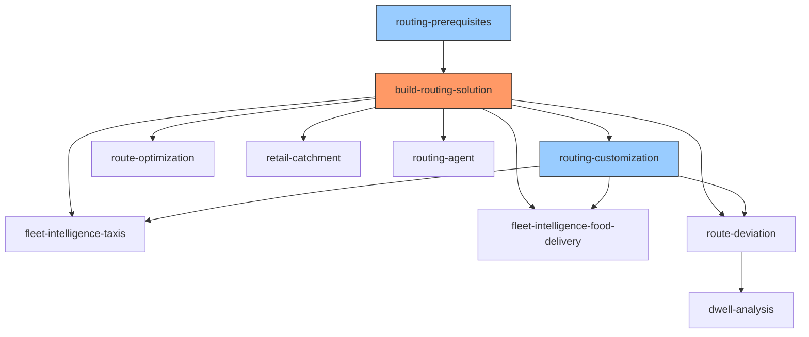

# AGENTS.md

Project-level guidance for AI coding assistants (Cortex Code, Cursor, Copilot, etc.) working in this repository.

## Repository Overview

Cortex Code skills that deploy routing, fleet intelligence, and geospatial analytics on Snowflake — powered by the OpenRouteService (ORS) Native App on Snowpark Container Services (SPCS).

Skills live in `.cortex/skills/`. Each is a self-contained deployment playbook an AI agent follows step-by-step.

## Repository Structure

```
.cortex/skills/              # All Cortex Code skills
  ├── <skill-name>/
  │   ├── SKILL.md           # Skill definition (frontmatter + instructions)
  │   ├── references/        # Detailed SQL, code, docs (loaded on demand)
  │   └── assets/            # Notebooks and other deployable artifacts
  ├── evals/                 # Eval framework (trigger, quality, xref)
build-routing-solution/      # ORS native app build artifacts (Dockerfiles, configs)
docs/                        # Documentation (dev/ and guides/)
archive/                     # Archived materials
```

## Build, Test, and Lint

```bash
# Run skill evals (trigger accuracy, quality checks, cross-ref validation)
python3 .cortex/skills/evals/run_evals.py

# Audit a single skill interactively
# Invoke the skill-optimiser skill in Cortex Code: "audit skill <name>"

# Validate ORS services are running
snow sql -q "SHOW SERVICES IN APPLICATION OPENROUTESERVICE_NATIVE_APP;"
```

No global build/lint step — each skill is independently deployable via its own SKILL.md workflow.

## Skills Inventory

| Skill | Category | Purpose |
|-------|----------|---------|
| `build-routing-solution` | infrastructure | Builds and deploys the ORS native app on SPCS |
| `routing-prerequisites` | infrastructure | Checks local build prerequisites (Docker, Snow CLI) |
| `routing-customization` | configuration | Router with 3 subskills for ORS config changes |
| `route-optimization` | demo | VRP demo with Marketplace data + notebook |
| `fleet-intelligence-taxis` | fleet-intelligence | Taxi GPS telemetry generation + React dashboard |
| `fleet-intelligence-food-delivery` | fleet-intelligence | Food delivery courier telemetry + React native app |
| `retail-catchment` | demo | Retail location analysis with isochrone catchment zones |
| `route-deviation` | demo | Detour detection ETL pipeline + React dashboard |
| `dwell-analysis` | demo | 12-step Dynamic Table pipeline for dwell/congestion |
| `routing-agent` | advanced | Snowflake Intelligence agent wrapping ORS functions |
| `skill-optimiser` | developer-tools | Audits and optimizes skills per Anthropic best practices |
| `routing-solution-cleanup` | developer-tools | Discovers and removes skill-created Snowflake objects via COMMENT tag |

## Skill Conventions (Quick Reference)

For the full rule set, read `.cortex/skills/skill-optimiser/SKILL.md` and its `references/` directory. That skill encodes all conventions from "The Complete Guide to Building Skills for Claude" (Anthropic, Jan 2026).

Key rules:
- Folder name: **kebab-case**, must match `name` in YAML frontmatter
- Main file: exactly `SKILL.md` (case-sensitive). No `README.md` inside skill folders.
- Description: under **1024 chars**, formula: `[What] + [When] + [Triggers] + [Do NOT use for]`
- Body: under **5,000 words**. Move detailed content to `references/`
- No XML angle brackets in frontmatter. No "claude" or "anthropic" in skill names.
- Cross-skill references use full relative paths from repo root:
  ```
  > Read and follow `.cortex/skills/routing-customization/SKILL.md`
  ```
- Subskills nest as child folders; parent SKILL.md acts as a router
- All skills use `metadata.author: Snowflake SIT-IS` and `metadata.version: 1.0.0`
- Deployment skills must include `depends_on` in frontmatter listing prerequisite skills
- Deployment skills must include a `## Configuration` table with parameterized defaults
- Deployment skills must include a `## Required Privileges` table (no ACCOUNTADMIN assumptions)
- Deployment skills must include a `## Cleanup` section with DROP statements

## Error Logging

When any step fails or produces unexpected results (SQL errors, missing objects, wrong row counts, service failures, deployment issues), log the issue to `logs/` following the format in `logs/README.md`. Create one log file per execution: `<skill-name>_{YYYY-MM-DD}_{HH-MM}.md`. Continue execution where possible, logging all issues encountered. If execution completes with no issues, do not create a log file.

## Creating a New Skill

1. Create folder: `.cortex/skills/my-new-skill/`
2. Create `SKILL.md` with YAML frontmatter + body (use `skill-optimiser` for the template)
3. Add `references/` for detailed SQL/code if body would exceed 5,000 words
4. Add `assets/` for notebooks or other deployable artifacts
5. Audit: invoke `skill-optimiser` or run `python3 .cortex/skills/evals/run_evals.py`
6. Update the Skills Inventory table above

## Do NOT

- **Inline large SQL blocks in SKILL.md** — put them in `references/*.md` and link
- **Skip the query tag** — every skill must set the session query tag for attribution tracking:
  ```sql
  ALTER SESSION SET query_tag = '{"origin":"sf_sit-is-fleet","name":"oss-<skill-name>","version":{"major":1,"minor":0},"attributes":{"is_quickstart":1,"source":"sql"}}';
  ```
- **Skip the object COMMENT** — every CREATE statement must include a COMMENT tracking tag (or `ALTER ... SET COMMENT` for CTAS):
  ```sql
  COMMENT = '{"origin":"sf_sit-is-fleet","name":"oss-<skill-name>","version":{"major":1,"minor":0},"attributes":{"is_quickstart":1,"source":"<sql|notebook|native-app>"}}';
  ```
- **Assume ORS is running** — always verify with `SHOW SERVICES IN APPLICATION OPENROUTESERVICE_NATIVE_APP;` (all 4 services must be RUNNING)
- **Hardcode city/region** — skills must be configurable via parameters, not baked-in coordinates
- **Add README.md inside skill folders** — all docs go in SKILL.md or `references/`
- **Duplicate conventions** — point to `skill-optimiser` references instead of repeating rules
- **Require ACCOUNTADMIN** — document minimum privileges in `## Required Privileges`; never assume ACCOUNTADMIN
- **Skip cleanup instructions** — every deployment skill must have a `## Cleanup` section with DROP statements
- **Run CREATE PROCEDURE/TABLE/FUNCTION directly in OPENROUTESERVICE_NATIVE_APP** — objects created as ACCOUNTADMIN are invisible to the app context and will cause runtime errors
- **Create any Snowflake object or run any query without tracking tags** — this is a hard requirement with no exceptions. Every new Snowflake object (TABLE, VIEW, PROCEDURE, FUNCTION, STAGE, SCHEMA, DATABASE, WAREHOUSE, TASK, DYNAMIC TABLE, STREAMLIT, SERVICE, AGENT) MUST have a COMMENT tracking tag. Every SQL session MUST set `query_tag` before executing statements. This applies to all skills, notebooks, stored procedures, dynamic SQL inside procedure bodies, ORS control app server code, and any other code path that creates objects or runs queries. For objects created via CTAS or dynamic SQL, use `ALTER ... SET COMMENT` immediately after creation. For service functions (`SERVICE=...` clause) that do not support COMMENT, document the limitation and ensure the parent procedure has a COMMENT tag.

## ORS Native App Deployment Rules

ALL changes to the ORS native app schema (procedures, tables, functions) MUST go through the setup_script upgrade flow. Never create objects directly via SQL.

```bash
# The ONLY way to deploy setup_script.sql changes:
cd build-routing-solution/native_app/app
./upgrade_app.sh           # uploads setup_script.sql + modules/*.sql, then ALTER APPLICATION UPGRADE
```

Key facts:
- `setup_script.sql` is a thin orchestrator (~15 lines) that calls `EXECUTE IMMEDIATE FROM 'modules/<NN>_<domain>.sql'`
- The 6 module files live in `native_app/app/modules/`:
  | Module | Domain | Component tag |
  |--------|--------|---------------|
  | `01_core_infra.sql` | compute, stages, services, callbacks | `core` |
  | `02_routing_functions.sql` | service functions, UDFs | `routing` |
  | `03_region_management.sql` | region catalog, provisioning, per-region ORS | `region-catalog` / `provisioner` / `multi-region` |
  | `04_service_lifecycle.sql` | resume, suspend, scale, status | `lifecycle` |
  | `05_matrix_pipeline.sql` | matrix build pipeline | `matrix` |
  | `06_matrix_ops.sql` | matrix status, inventory, delete | `matrix` |
- `upgrade_app.sh` uploads `setup_script.sql` + all `modules/*.sql` to the package stage, then runs `ALTER APPLICATION UPGRADE`
- If you see ACCOUNTADMIN-owned objects after upgrade, DROP them — they shadow or conflict with app-owned objects

### Native App SQL Scripting Guidelines (MANDATORY)

Every `CREATE` statement in setup_script modules MUST include a JSON tracking COMMENT tag. See full rules, examples, and the `REBUILD_GRAPHS` requirement in:

> `.cortex/skills/build-routing-solution/references/snowflake-scripting-guidelines.md` — Section 11

Quick reference — component tags per module:

| Module | Component tag |
|--------|---------------|
| `01_core_infra.sql` | `core` |
| `02_routing_functions.sql` | `routing` |
| `03_region_management.sql` | `region-catalog` / `provisioner` / `multi-region` |
| `04_service_lifecycle.sql` | `lifecycle` |
| `05_matrix_pipeline.sql` | `matrix` |
| `06_matrix_ops.sql` | `matrix` |

## Control App Image Deployment (ors_control_app)

When changing server code (e.g., `server/index.ts`), you must rebuild and push the Docker image:

```bash
cd build-routing-solution/Native_app/services/ors_control_app

# 1. Edit BOTH source and compiled files:
#    - server/index.ts (source)
#    - dist-server/index.js (compiled — this is what runs in SPCS)

# 2. Build (bump version from current):
docker build --platform linux/amd64 -t pm-fleet-test.registry.snowflakecomputing.com/openrouteservice_setup/public/image_repository/ors_control_app:vX.Y.Z .

# 3. Login if needed:
snow spcs image-registry login -c fleet_test_evals

# 4. Push:
docker push pm-fleet-test.registry.snowflakecomputing.com/openrouteservice_setup/public/image_repository/ors_control_app:vX.Y.Z

# 5. Update version in these files:
#    - services/ors_control_app/ors_control_app_service.yaml (image tag)
#    - app/manifest.yml (container_services.images list)

# 6. Deploy (uploads all YAMLs + upgrades app):
cd ../..
./deploy.sh
```

The app upgrade (`ALTER APPLICATION ... UPGRADE`) re-creates the ORS_CONTROL_APP service, which picks up the new image tag from the service YAML.

## Skill Dependency Graph



**Legend:** Orange = core infrastructure. Blue = configuration/prerequisites. White = demo/feature skills.

Deploy order (top → bottom). Teardown order (bottom → top).

## Common Patterns

- **ORS dependency**: most demo skills require 4 running ORS services. Use `routing-prerequisites` to verify.
- **Overture Maps POI data**: fleet skills use Overture Maps for realistic locations. Fallback: synthetic points within configured bounding boxes.
- **ORS Control App deployment**: Rebuild Docker image → push to registry → update service YAML version → `deploy.sh`.
- **Object tracking**: Two tracking mechanisms — session `query_tag` (tracks queries) and object `COMMENT` (tracks created objects). Both are required. For CTAS (`CREATE TABLE ... AS SELECT`), use `ALTER TABLE ... SET COMMENT` after creation since CTAS doesn't support inline COMMENT.

## Geospatial Conventions

### GEOGRAPHY-First Schema Design
- Store point locations as `GEOGRAPHY` columns (not separate FLOAT lat/lon).
- Construct via `ST_MAKEPOINT(longitude, latitude)` — note: **longitude first**.
- Line/polygon geometries: use `TO_GEOGRAPHY('LINESTRING(lon lat, ...)')` or `ST_MAKELINE`.
- Keep redundant FLOAT lat/lon only when required (CLUSTER BY, ORS ARRAY_CONSTRUCT API args, bounding-box configs).

### Preferred Functions
| Instead of | Use |
|---|---|
| `H3_LATLNG_TO_CELL(lat, lon, res)` | `H3_POINT_TO_CELL_STRING(geography, res)` |
| `HAVERSINE(lat1, lon1, lat2, lon2)` (returns km) | `ST_DISTANCE(geog_a, geog_b) / 1000` (meters→km) |
| `ST_DISTANCE` + filter | `ST_DWITHIN(geog_a, geog_b, meters)` (uses spatial index) |
| Separate FLOAT lat/lon in WHERE | `ST_WITHIN`, `ST_INTERSECTS`, `ST_CONTAINS` |

### H3 Index Storage
- Always store H3 indices as `VARCHAR` (string format, e.g. `'8928308280fffff'`).
- Use `H3_POINT_TO_CELL_STRING` (returns VARCHAR directly) — not `H3_LATLNG_TO_CELL` which returns NUMBER.
- Never cast H3 between NUMBER and STRING at query time — store as string from the start.

### Loading GEOGRAPHY Data
- **COPY INTO with transform**: use `ST_MAKEPOINT($col_lon, $col_lat)` or `TO_GEOGRAPHY($col_wkb)` in the SELECT.
- **INSERT via SELECT…UNION ALL**: compute `ST_MAKEPOINT(lon, lat)` inline (VALUES clauses cannot contain function calls).
- `MATCH_BY_COLUMN_NAME` cannot be used when adding computed columns — switch to explicit transform SELECT.

### Direct GEOGRAPHY Column References
All tables are created with GEOGRAPHY columns from the start. Reference them directly:
```sql
t.POINT_GEOM    -- telemetry point
t.ORIGIN        -- trip origin
t.DESTINATION   -- trip destination
```

### deck.gl Layer Selection
| Layer | Data format | Extraction |
|---|---|---|
| `ScatterplotLayer` | `[lng, lat]` array | `ST_X(geog)` / `ST_Y(geog)` in SQL |
| `H3HexagonLayer` | H3 string index | `H3_POINT_TO_CELL_STRING(geog, res)` in SQL |
| `GeoJsonLayer` | GeoJSON string | `ST_ASGEOJSON(geog)::STRING` in SQL |
| `PathLayer` | coordinate array | `ST_ASGEOJSON(geog)` → parse coords client-side |

### When FLOAT lat/lon is Acceptable
- ORS function arguments (`ARRAY_CONSTRUCT` of numeric coords for DIRECTIONS/MATRIX)
- Bounding-box configs (REGION_REGISTRY, city provisioner)
- `CLUSTER BY` expressions (GEOGRAPHY not supported in CLUSTER BY)
- Direct deck.gl `getPosition` callbacks expecting `[Number, Number]`

## Documentation

- `docs/guides/QUICKSTART.md` — End-to-end deployment quickstart
- `docs/README.md` — Full index
