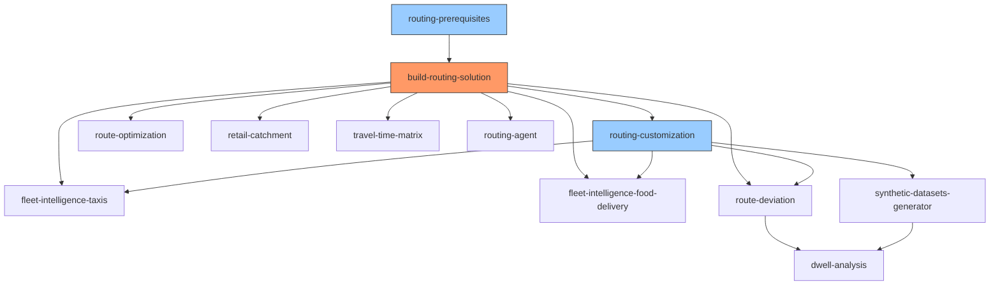

# AGENTS.md

Project-level guidance for AI coding assistants (Cortex Code, Cursor, Copilot, etc.) working in this repository.

## Repository Overview

Cortex Code skills that deploy routing, fleet intelligence, and geospatial analytics on Snowflake — powered by the OpenRouteService (ORS) Native App on Snowpark Container Services (SPCS).

Skills live in `.cortex/skills/`. Each is a self-contained deployment playbook an AI agent follows step-by-step.

## Repository Structure

```
.cortex/skills/              # All Cortex Code skills
  ├── <skill-name>/
  │   ├── SKILL.md           # Skill definition (frontmatter + instructions)
  │   ├── references/        # Detailed SQL, code, docs (loaded on demand)
  │   └── assets/            # Streamlit apps, notebooks, React apps
  ├── evals/                 # Eval framework (trigger, quality, xref)
build-routing-solution/      # ORS native app build artifacts (Dockerfiles, configs)
docs/                        # Documentation (dev/ and guides/)
archive/                     # Archived materials
```

## Build, Test, and Lint

```bash
# Run skill evals (trigger accuracy, quality checks, cross-ref validation)
python3 .cortex/skills/evals/run_evals.py

# Audit a single skill interactively
# Invoke the skill-optimiser skill in Cortex Code: "audit skill <name>"

# Validate ORS services are running
snow sql -q "SHOW SERVICES IN APPLICATION OPENROUTESERVICE_NATIVE_APP;"
```

No global build/lint step — each skill is independently deployable via its own SKILL.md workflow.

## Skills Inventory

| Skill | Category | Purpose |
|-------|----------|---------|
| `build-routing-solution` | infrastructure | Builds and deploys the ORS native app on SPCS |
| `routing-prerequisites` | infrastructure | Checks local build prerequisites (Docker, Snow CLI) |
| `routing-customization` | configuration | Router with 3 subskills for ORS config changes |
| `route-optimization` | demo | VRP demo with Marketplace data, notebook, Streamlit |
| `fleet-intelligence-taxis` | fleet-intelligence | Taxi GPS telemetry generation + Streamlit dashboard |
| `fleet-intelligence-food-delivery` | fleet-intelligence | Food delivery courier telemetry + React native app |
| `retail-catchment` | demo | Retail location analysis with isochrone catchment zones |
| `route-deviation` | demo | Detour detection ETL pipeline + Streamlit dashboards |
| `dwell-analysis` | demo | 12-step Dynamic Table pipeline for dwell/congestion |
| `synthetic-datasets-generator` | fleet-intelligence | Synthetic HGV truck GPS telemetry generator |
| `travel-time-matrix` | advanced | H3-based travel time matrices via ORS MATRIX_TABULAR |
| `routing-agent` | advanced | Snowflake Intelligence agent wrapping ORS functions |
| `skill-optimiser` | developer-tools | Audits and optimizes skills per Anthropic best practices |
| `cleanup` | developer-tools | Discovers and removes skill-created Snowflake objects via COMMENT tag |

## Skill Conventions (Quick Reference)

For the full rule set, read `.cortex/skills/skill-optimiser/SKILL.md` and its `references/` directory. That skill encodes all conventions from "The Complete Guide to Building Skills for Claude" (Anthropic, Jan 2026).

Key rules:
- Folder name: **kebab-case**, must match `name` in YAML frontmatter
- Main file: exactly `SKILL.md` (case-sensitive). No `README.md` inside skill folders.
- Description: under **1024 chars**, formula: `[What] + [When] + [Triggers] + [Do NOT use for]`
- Body: under **5,000 words**. Move detailed content to `references/`
- No XML angle brackets in frontmatter. No "claude" or "anthropic" in skill names.
- Cross-skill references use full relative paths from repo root:
  ```
  > Read and follow `.cortex/skills/routing-customization/SKILL.md`
  ```
- Subskills nest as child folders; parent SKILL.md acts as a router
- All skills use `metadata.author: Snowflake SIT-IS` and `metadata.version: 1.0.0`
- Deployment skills must include `depends_on` in frontmatter listing prerequisite skills
- Deployment skills must include a `## Configuration` table with parameterized defaults
- Deployment skills must include a `## Required Privileges` table (no ACCOUNTADMIN assumptions)
- Deployment skills must include a `## Cleanup` section with DROP statements

## Creating a New Skill

1. Create folder: `.cortex/skills/my-new-skill/`
2. Create `SKILL.md` with YAML frontmatter + body (use `skill-optimiser` for the template)
3. Add `references/` for detailed SQL/code if body would exceed 5,000 words
4. Add `assets/` for Streamlit apps, notebooks, or other deployable artifacts
5. Audit: invoke `skill-optimiser` or run `python3 .cortex/skills/evals/run_evals.py`
6. Update the Skills Inventory table above

## Do NOT

- **Inline large SQL blocks in SKILL.md** — put them in `references/*.md` and link
- **Skip the query tag** — every skill must set the session query tag for attribution tracking:
  ```sql
  ALTER SESSION SET query_tag = '{"origin":"sf_sit-is-fleet","name":"oss-<skill-name>","version":{"major":1,"minor":0},"attributes":{"is_quickstart":1,"source":"sql"}}';
  ```
- **Skip the object COMMENT** — every CREATE statement must include a COMMENT tracking tag (or `ALTER ... SET COMMENT` for CTAS):
  ```sql
  COMMENT = '{"origin":"sf_sit-is-fleet","name":"oss-<skill-name>","version":{"major":1,"minor":0},"attributes":{"is_quickstart":1,"source":"<sql|streamlit|notebook|native-app>"}}';
  ```
- **Assume ORS is running** — always verify with `SHOW SERVICES IN APPLICATION OPENROUTESERVICE_NATIVE_APP;` (all 4 services must be RUNNING)
- **Hardcode city/region** — skills must be configurable via parameters, not baked-in coordinates
- **Add README.md inside skill folders** — all docs go in SKILL.md or `references/`
- **Duplicate conventions** — point to `skill-optimiser` references instead of repeating rules
- **Deploy Streamlit without `OR REPLACE`** — always use `CREATE OR REPLACE STREAMLIT`
- **Require ACCOUNTADMIN** — document minimum privileges in `## Required Privileges`; never assume ACCOUNTADMIN
- **Skip cleanup instructions** — every deployment skill must have a `## Cleanup` section with DROP statements
- **Run CREATE PROCEDURE/TABLE/FUNCTION directly in OPENROUTESERVICE_NATIVE_APP** — objects created as ACCOUNTADMIN are invisible to the app context and will cause runtime errors

## ORS Native App Deployment Rules

ALL changes to the ORS native app schema (procedures, tables, functions) MUST go through the setup_script upgrade flow. Never create objects directly via SQL.

```bash
# The ONLY way to deploy setup_script.sql changes:
cd build-routing-solution/native_app/app
./upgrade_app.sh           # uploads setup_script.sql + modules/*.sql, then ALTER APPLICATION UPGRADE
```

Key facts:
- `setup_script.sql` is a thin orchestrator (~15 lines) that calls `EXECUTE IMMEDIATE FROM 'modules/<NN>_<domain>.sql'`
- The 6 module files live in `native_app/app/modules/`:
  | Module | Domain | Component tag |
  |--------|--------|---------------|
  | `01_core_infra.sql` | compute, stages, services, callbacks | `core` |
  | `02_routing_functions.sql` | service functions, UDFs | `routing` |
  | `03_city_management.sql` | city provisioning, per-region ORS | `provisioner` / `multi-city` |
  | `04_service_lifecycle.sql` | resume, suspend, scale, status | `lifecycle` |
  | `05_matrix_pipeline.sql` | matrix build pipeline | `matrix` |
  | `06_matrix_ops.sql` | matrix status, inventory, delete | `matrix` |
- `upgrade_app.sh` uploads `setup_script.sql` + all `modules/*.sql` to the package stage, then runs `ALTER APPLICATION UPGRADE`
- If you see ACCOUNTADMIN-owned objects after upgrade, DROP them — they shadow or conflict with app-owned objects

### Native App SQL Scripting Guidelines (MANDATORY)

Every `CREATE` statement in the setup_script modules MUST include a tracking COMMENT tag. No exceptions.

**Format:**
```sql
COMMENT = '{"origin":"sf_sit-is-fleet","name":"build-routing-solution","version":"1.0","attributes":{"component":"<component>"}}'
```

Where `<component>` matches the module domain (see table above).

**Rules:**

1. **Procedures** — COMMENT goes before `AS $$`:
   ```sql
   CREATE OR REPLACE PROCEDURE core.my_proc()
   RETURNS VARCHAR
   LANGUAGE SQL
   EXECUTE AS OWNER
   COMMENT = '{"origin":"sf_sit-is-fleet","name":"build-routing-solution","version":"1.0","attributes":{"component":"matrix"}}'
   AS
   $$
   ```

2. **Tables** — COMMENT goes after column definitions:
   ```sql
   CREATE TABLE IF NOT EXISTS travel_matrix.MY_TABLE (
       COL1 VARCHAR
   )
   COMMENT = '{"origin":"sf_sit-is-fleet","name":"build-routing-solution","version":"1.0","attributes":{"component":"matrix"}}';
   ```

3. **Schemas** — COMMENT goes inline:
   ```sql
   CREATE SCHEMA IF NOT EXISTS core
       COMMENT = '{"origin":"sf_sit-is-fleet","name":"build-routing-solution","version":"1.0","attributes":{"component":"core"}}';
   ```

4. **Streamlit / Services / Functions created at top level** — same pattern with appropriate component tag.

5. **Dynamic objects (inside procedure bodies)** — use `ALTER ... SET COMMENT` after creation when the DDL syntax does not support inline COMMENT (e.g., CTAS, service functions with `SERVICE=` clause).

6. **New modules** — if adding a new module file, register it in `setup_script.sql` with `EXECUTE IMMEDIATE FROM` and add a row to the module table above.

7. **Pre-commit check** — before uploading, run: `grep -c COMMENT modules/*.sql` and verify every module has at least as many COMMENT clauses as CREATE statements.

## Control App Image Deployment (ors_control_app)

When changing server code (e.g., `server/index.ts`), you must rebuild and push the Docker image:

```bash
cd build-routing-solution/Native_app/services/ors_control_app

# 1. Edit BOTH source and compiled files:
#    - server/index.ts (source)
#    - dist-server/index.js (compiled — this is what runs in SPCS)

# 2. Build (bump version from current):
docker build --platform linux/amd64 -t pm-fleet-test.registry.snowflakecomputing.com/openrouteservice_setup/public/image_repository/ors_control_app:vX.Y.Z .

# 3. Login if needed:
snow spcs image-registry login -c fleet_test_evals

# 4. Push:
docker push pm-fleet-test.registry.snowflakecomputing.com/openrouteservice_setup/public/image_repository/ors_control_app:vX.Y.Z

# 5. Update version in these files:
#    - services/ors_control_app/ors_control_app_service.yaml (image tag)
#    - app/manifest.yml (container_services.images list)

# 6. Deploy (uploads all YAMLs + upgrades app):
cd ../..
./deploy.sh
```

The app upgrade (`ALTER APPLICATION ... UPGRADE`) re-creates the ORS_CONTROL_APP service, which picks up the new image tag from the service YAML.

## Skill Dependency Graph



**Legend:** Orange = core infrastructure. Blue = configuration/prerequisites. White = demo/feature skills.

Deploy order (top → bottom). Teardown order (bottom → top). See `docs/dev/SHARED-INFRASTRUCTURE.md` for shared object details.

## Common Patterns

- **ORS dependency**: most demo skills require 4 running ORS services. Use `routing-prerequisites` to verify.
- **Overture Maps POI data**: fleet skills use Overture Maps for realistic locations. Fallback: synthetic points within configured bounding boxes.
- **Streamlit deployment**: CREATE stage → upload files via `snow stage copy` → `CREATE OR REPLACE STREAMLIT` → `ALTER STREAMLIT ... ADD LIVE VERSION FROM LAST`.
- **Object tracking**: Two tracking mechanisms — session `query_tag` (tracks queries) and object `COMMENT` (tracks created objects). Both are required. For CTAS (`CREATE TABLE ... AS SELECT`), use `ALTER TABLE ... SET COMMENT` after creation since CTAS doesn't support inline COMMENT.

## Documentation

- `docs/dev/` — Development notes, audit reports, architecture decisions
- `docs/dev/SHARED-INFRASTRUCTURE.md` — Database/warehouse ownership map across skills
- `docs/guides/QUICKSTART.md` — End-to-end deployment quickstart
- `docs/README.md` — Full index
