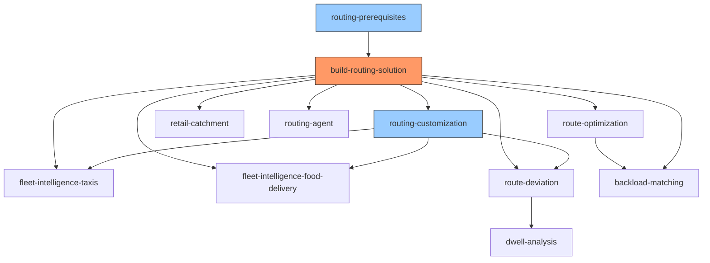

# AGENTS.md

Project-level guidance for AI coding assistants (Cortex Code, Cursor, Copilot, etc.) working in this repository.

## Repository Overview

Cortex Code skills that deploy routing, fleet intelligence, and geospatial analytics on Snowflake — powered by the OpenRouteService (ORS) App on Snowpark Container Services (SPCS).

Skills live in `.cortex/skills/`. Each is a self-contained deployment playbook an AI agent follows step-by-step.

## Repository Structure

```
.cortex/skills/              # All Cortex Code skills
  ├── <skill-name>/
  │   ├── SKILL.md           # Skill definition (frontmatter + instructions)
  │   ├── references/        # Detailed SQL, code, docs (loaded on demand)
  │   └── assets/            # Notebooks and other deployable artifacts
  ├── evals/                 # Eval framework (trigger, quality, xref)
build-routing-solution/      # ORS app build artifacts (Dockerfiles, configs)
docs/                        # Documentation (dev/ and guides/)
archive/                     # Archived materials
```

## Build, Test, and Lint

```bash
# Run skill evals (trigger accuracy, quality checks, cross-ref validation)
python3 .cortex/skills/evals/run_evals.py

# Audit a single skill interactively
# Invoke the skill-optimiser skill in Cortex Code: "audit skill <name>"

# Validate ORS services are running
snow sql -q "SHOW SERVICES IN DATABASE OPENROUTESERVICE_APP;"
```

No global build/lint step — each skill is independently deployable via its own SKILL.md workflow.

## Skills Inventory

| Skill | Category | Purpose |
|-------|----------|---------|
| `build-routing-solution` | infrastructure | Builds and deploys the ORS app on SPCS |
| `routing-prerequisites` | infrastructure | Checks local build prerequisites (Docker, Snow CLI) |
| `routing-customization` | configuration | Router with 3 subskills for ORS config changes |
| `route-optimization` | demo | VRP demo with Marketplace data + notebook |
| `fleet-intelligence-taxis` | fleet-intelligence | Taxi GPS telemetry generation + React dashboard |
| `fleet-intelligence-food-delivery` | fleet-intelligence | Food delivery courier telemetry + React app |
| `retail-catchment` | demo | Retail location analysis with isochrone catchment zones |
| `route-deviation` | demo | Detour detection ETL pipeline + React dashboard |
| `dwell-analysis` | demo | 12-step Dynamic Table pipeline for dwell/congestion |
| `routing-agent` | advanced | Snowflake Intelligence agent wrapping ORS functions |
| `skill-optimiser` | developer-tools | Audits and optimizes skills per Anthropic best practices |
| `routing-solution-cleanup` | developer-tools | Discovers and removes skill-created Snowflake objects via COMMENT tag |
| `backload-matching` | demo | DHL Freight backload VRP demo: solves trailer<->load assignment via OPENROUTESERVICE_APP.CORE.OPTIMIZATION, with internal-first priority and Cortex rationale |

## Skill Conventions (Quick Reference)

For the full rule set, read `.cortex/skills/skill-optimiser/SKILL.md` and its `references/` directory. That skill encodes all conventions from "The Complete Guide to Building Skills for Claude" (Anthropic, Jan 2026).

Key rules:
- Folder name: **kebab-case**, must match `name` in YAML frontmatter
- Main file: exactly `SKILL.md` (case-sensitive). No `README.md` inside skill folders.
- Description: under **1024 chars**, formula: `[What] + [When] + [Triggers] + [Do NOT use for]`
- Body: under **5,000 words**. Move detailed content to `references/`
- No XML angle brackets in frontmatter. No "claude" or "anthropic" in skill names.
- Cross-skill references use full relative paths from repo root:
  ```
  > Read and follow `.cortex/skills/routing-customization/SKILL.md`
  ```
- Subskills nest as child folders; parent SKILL.md acts as a router
- All skills use `metadata.author: Snowflake SIT-IS` and `metadata.version: 1.0.0`
- Deployment skills must include `depends_on` in frontmatter listing prerequisite skills
- Deployment skills must include a `## Configuration` table with parameterized defaults
- Deployment skills must include a `## Required Privileges` table (no ACCOUNTADMIN assumptions)
- Deployment skills must include a `## Cleanup` section with DROP statements

## Error Logging

When any step fails or produces unexpected results (SQL errors, missing objects, wrong row counts, service failures, deployment issues), log the issue to `logs/` following the format in `logs/README.md`. Create one log file per execution: `<skill-name>_{YYYY-MM-DD}_{HH-MM}.md`. Continue execution where possible, logging all issues encountered. If execution completes with no issues, do not create a log file.

## Commit Discipline

**MANDATORY:** After each logical change is completed and verified, create a new git commit on the user's single shared branch AND push it immediately. Do not batch unrelated changes into a single commit, and do not leave commits unpushed at the end of a turn.

### Branching Rules (NON-NEGOTIABLE)
- **NEVER commit directly to `main`.** `main` is protected — changes only land via merged PRs from `dev`.
- **NEVER commit directly to `dev`.** `dev` is the integration branch — changes only land via merged PRs from per-user branches.
- **All work happens on ONE per-user long-lived branch named `feat/<GITHUB_LOGIN>-feat`.** The GitHub login MUST be detected dynamically at the start of every session — never hardcoded.
  ```bash
  GITHUB_LOGIN=$(gh api user --jq .login)
  USER_BRANCH="feat/${GITHUB_LOGIN}-feat"
  ```
  Example: for login `sfc-gh-preszke` the branch is `feat/sfc-gh-preszke-feat`.
  This single branch is shared by all parallel Cortex Code chats on the user's machine, so no branch switching is ever needed mid-session.
- **Do NOT create additional branches.** No `<username>/work`, no `<username>/<topic>`, no `feat/*` / `fix/*` / `docs/*` per-change branches. One user, one branch. Multiple parallel chats sharing one working tree cannot each own their own branch — that causes constant `git checkout` thrashing and lost work. Commit straight onto the user's branch instead.
- **All PRs target `dev`** (not `main`). Only release/promotion PRs go from `dev` → `main`, and those are opened by humans, not assistants.
- Before starting work, detect the user branch and verify you are on it:
  ```bash
  GITHUB_LOGIN=$(gh api user --jq .login)
  USER_BRANCH="feat/${GITHUB_LOGIN}-feat"
  CURRENT=$(git branch --show-current)
  if [ "$CURRENT" != "$USER_BRANCH" ]; then
    git checkout "$USER_BRANCH" 2>/dev/null || git checkout -b "$USER_BRANCH"
  fi
  ```
  If `gh` is not authenticated, stop and ask the user to run `gh auth login` — never fall back to a hardcoded branch name.
- After EVERY commit, push the branch immediately. Do not leave local commits unpushed:
  ```bash
  git push -u origin "$USER_BRANCH"
  ```
- Open / update a single PR into `dev` for the branch when there is reviewable work:
  ```bash
  gh pr create --base dev --head "$USER_BRANCH" --title "..." --body "..."
  ```
- A PR may include several commits from the branch. Keep PRs scoped to one logical theme — open a new PR rather than piling unrelated commits into one.

### Commit Rules
- One commit per logical change (one skill edit, one bug fix, one doc update, one refactor)
- Commits land on `$USER_BRANCH` (i.e. `feat/<GITHUB_LOGIN>-feat`). Never on a fresh per-change branch.
- After every commit, run `git push origin "$USER_BRANCH"` immediately. A change is not "done" until it is pushed to remote.
  - **CRITICAL: Plain `git push` will fail with SSH permission denied.** Before your first push in a session, ALWAYS read `/memories/git-push-method.md` for the working command (uses `gh auth token` + `GIT_CONFIG_GLOBAL=/dev/null` to bypass the global SSH `insteadOf` rule). Do NOT attempt `git push origin <branch>` directly — it always fails for this repo.
- Verify the change works (SQL compiles, skill evals pass, notebook runs) BEFORE committing
- Stage only files related to the current change — never use blanket `git add .` if unrelated edits exist
- Commit message format: `<type>(<scope>): <subject>` where type is one of `feat`, `fix`, `docs`, `refactor`, `chore`, `test`
  - Examples:
    - `feat(fleet-intelligence-taxis): add H3 resolution config parameter`
    - `fix(build-routing-solution): handle ARM Mac esbuild segfault`
    - `docs(AGENTS.md): add commit discipline rule`
- If a change spans multiple skills, prefer multiple smaller commits over one large one
- Never amend or force-push commits the user has not explicitly authorized
- Never push directly to `main` or `dev` — push only to `$USER_BRANCH` (`feat/<GITHUB_LOGIN>-feat`)

## Friction Logging

**MANDATORY:** After every `build-routing-solution` execution (regardless of success or failure), generate a friction log in `logs/`. This is NOT optional — every run produces a friction log, even if everything went smoothly.

File name: `friction-log_{YYYY-MM-DD}_{HH-MM}.md`

Follow the friction log template in `logs/README.md`. The log must capture:
- Exact wall-clock duration of each step
- Any friction points (confusing instructions, slow operations, unexpected behavior)
- **For each friction point:** what was done to resolve it during this run, and a recommendation for how to prevent it in future runs (e.g., skill wording change, new validation step, default change)
- A step-by-step status table showing OK/FAILED/SKIPPED for each workflow step
- Final summary with total execution time and overall outcome

If no friction was encountered, the log should still be created with "No friction points" and the step timing table.

## Creating a New Skill

1. Create folder: `.cortex/skills/my-new-skill/`
2. Create `SKILL.md` with YAML frontmatter + body (use `skill-optimiser` for the template)
3. Add `references/` for detailed SQL/code if body would exceed 5,000 words
4. Add `assets/` for notebooks or other deployable artifacts
5. Audit: invoke `skill-optimiser` or run `python3 .cortex/skills/evals/run_evals.py`
6. Update the Skills Inventory table above

## Do NOT

- **Inline large SQL blocks in SKILL.md** — put them in `references/*.md` and link
- **Skip the query tag** — every skill must set the session query tag for attribution tracking:
  ```sql
  ALTER SESSION SET query_tag = '{"origin":"sf_sit-is-fleet","name":"oss-<skill-name>","version":{"major":1,"minor":0},"attributes":{"is_quickstart":1,"source":"sql"}}';
  ```
- **Skip the object COMMENT** — every CREATE statement must include a COMMENT tracking tag (or `ALTER ... SET COMMENT` for CTAS):
  ```sql
  COMMENT = '{"origin":"sf_sit-is-fleet","name":"oss-<skill-name>","version":{"major":1,"minor":0},"attributes":{"is_quickstart":1,"source":"<sql|notebook|app>"}}';
  ```
- **Assume ORS is running** — always verify with `SHOW SERVICES IN DATABASE OPENROUTESERVICE_APP;` (all 5 services must be RUNNING)
- **Hardcode city/region** — skills must be configurable via parameters, not baked-in coordinates
- **Add README.md inside skill folders** — all docs go in SKILL.md or `references/`
- **Duplicate conventions** — point to `skill-optimiser` references instead of repeating rules
- **Require ACCOUNTADMIN** — document minimum privileges in `## Required Privileges`; never assume ACCOUNTADMIN
- **Skip cleanup instructions** — every deployment skill must have a `## Cleanup` section with DROP statements
- **Skip committing AND pushing after a completed change** — every verified change must result in a commit AND a push to `feat/<GITHUB_LOGIN>-feat` before the turn ends (see `## Commit Discipline`)
- **Commit directly to `main` or `dev`** — both are protected. All work goes on `feat/<GITHUB_LOGIN>-feat` with PRs targeting `dev`. Only humans promote `dev` → `main`.
- **Hardcode the user branch name** — always derive it from `gh api user --jq .login` at session start. Do not paste a literal branch like `feat/sfc-gh-preszke-feat` into AGENTS.md, skill files, or scripts.
- **Create a new branch per change or per topic** — there is exactly one branch per user (`feat/<GITHUB_LOGIN>-feat`). No `<username>/work`, no `<username>/<topic>`, no `feat/*` / `fix/*` / `docs/*` per-change branches. Multiple Cortex Code chats running in parallel against the same working tree must all commit to the same branch.
- **Create any Snowflake object or run any query without tracking tags** — this is a hard requirement with no exceptions. Every new Snowflake object (TABLE, VIEW, PROCEDURE, FUNCTION, STAGE, SCHEMA, DATABASE, WAREHOUSE, TASK, DYNAMIC TABLE, STREAMLIT, SERVICE, AGENT) MUST have a COMMENT tracking tag. Every SQL session MUST set `query_tag` before executing statements. This applies to all skills, notebooks, stored procedures, dynamic SQL inside procedure bodies, ORS control app server code, and any other code path that creates objects or runs queries. For objects created via CTAS or dynamic SQL, use `ALTER ... SET COMMENT` immediately after creation. For service functions (`SERVICE=...` clause) that do not support COMMENT, document the limitation and ensure the parent procedure has a COMMENT tag.

## Control App Image Deployment (ors_control_app)

When changing any source file (`src/`, `server/`, or config), rebuild and push the Docker image.
The multi-stage `Dockerfile.runtime` compiles both the React frontend and the server automatically —
no manual `dist/` or `dist-server/` edits are needed.

**IMPORTANT:** Always use `Dockerfile.runtime` (multi-stage build). Never create a "prebuilt" Dockerfile that copies `dist/` from the host — this conflicts with `.dockerignore` and creates fragile host-build dependencies. The `.dockerignore` intentionally excludes `dist` and `dist-server` because the multi-stage build generates them inside the container. Do not remove those exclusions.

**ARM Mac + Podman:** If `esbuild` crashes with a QEMU segfault during the build stage, build locally first (`npm run build && npx tsc -p tsconfig.server.json`), then use `--ignorefile .dockerignore.prebuilt` when building the image. See `references/troubleshooting.md` for full instructions. Do NOT rename or edit `.dockerignore`.

```bash
APP_DIR=.cortex/skills/build-routing-solution/openrouteservice_app/services/ors_control_app

snow spcs image-registry login -c <connection>
REPO_URL=$(snow spcs image-repository url OPENROUTESERVICE_APP.core.image_repository -c <connection>)

# 1. Edit source files only:
#    - src/components/...  (React frontend)
#    - server/index.ts     (Express backend)

# 2. Build (bump version from current):
docker build --platform linux/amd64 \
  -f $APP_DIR/Dockerfile.runtime \
  -t $REPO_URL/openrouteservice_app/core/image_repository/ors_control_app:vX.Y.Z \
  $APP_DIR

# 3. Push:
docker push $REPO_URL/openrouteservice_app/core/image_repository/ors_control_app:vX.Y.Z

# 4. Update version:
#    - $APP_DIR/ors_control_app_service.yaml (image tag)

# 5. Upload updated spec to stage:
snow stage copy $APP_DIR/ors_control_app_service.yaml \
  @OPENROUTESERVICE_APP.CORE.ORS_SPCS_STAGE/services/ors_control_app/ \
  -c <connection> --overwrite

# 6. Apply new spec and restart:
# IMPORTANT: ALTER SERVICE while RUNNING does not reliably cycle the container.
# Always use the suspend → update spec → resume pattern to guarantee the new image loads.
```sql
ALTER SERVICE OPENROUTESERVICE_APP.CORE.ORS_CONTROL_APP SUSPEND;

ALTER SERVICE OPENROUTESERVICE_APP.CORE.ORS_CONTROL_APP
  FROM @OPENROUTESERVICE_APP.CORE.ORS_SPCS_STAGE/services/ors_control_app/
  SPECIFICATION_FILE = 'ors_control_app_service.yaml';

-- The service does NOT auto-resume after a spec update. Always resume manually:
ALTER SERVICE OPENROUTESERVICE_APP.CORE.ORS_CONTROL_APP RESUME;
```

# 7. After the service restarts, always retrieve and display the endpoint URL:
```sql
SHOW ENDPOINTS IN SERVICE OPENROUTESERVICE_APP.CORE.ORS_CONTROL_APP;
SELECT 'https://' || ingress_url AS control_app_url
FROM TABLE(RESULT_SCAN(LAST_QUERY_ID()))
WHERE name = 'ors-control-app';
```

## Skill Dependency Graph



**Legend:** Orange = core infrastructure. Blue = configuration/prerequisites. White = demo/feature skills.

Deploy order (top → bottom). Teardown order (bottom → top).

## Common Patterns

- **ORS dependency**: most demo skills require 4 running ORS services. Use `routing-prerequisites` to verify.
- **Overture Maps POI data**: fleet skills use Overture Maps for realistic locations. Fallback: synthetic points within configured bounding boxes.
- **ORS Control App deployment**: Edit source → `docker build` (multi-stage, no manual dist/ step) → `docker push` → update YAML version → `snow stage copy` spec to stage → `ALTER SERVICE FROM @stage SPECIFICATION_FILE=...`.
- **Object tracking**: Two tracking mechanisms — session `query_tag` (tracks queries) and object `COMMENT` (tracks created objects). Both are required. For CTAS (`CREATE TABLE ... AS SELECT`), use `ALTER TABLE ... SET COMMENT` after creation since CTAS doesn't support inline COMMENT.
- **REBUILD_GRAPHS management (Issue #59)**: Routing graphs are persisted on `@ORS_GRAPHS_SPCS_STAGE/<region>/` and MUST be reused across suspend/resume cycles. The `create_region_ors_service` proc probes the stage and sets `REBUILD_GRAPHS="false"` if graphs already exist. After first-time provisioning completes (`service_ready=true`), `PROVISION_REGION_WRAPPER` auto-calls `SET_REBUILD_GRAPHS_FLAG(region, 'false')` so the next resume is instant (~1–2 min). For forced rebuilds (PBF update / corruption), call `REBUILD_REGION_GRAPHS(region)`.
- **Per-region VROOM (multi-region OPTIMIZATION)**: Each provisioned region gets its own `VROOM_SERVICE_<REGION>` co-located in `ORS_POOL_<REGION>` (same compute pool as the region's ORS). The VROOM image (`vroom-docker:v1.0.4`) reads `ORS_HOST` from env and substitutes it into `/conf/config.yml` at startup, so the same image serves any region without rebuild. `BUILD_VROOM_SERVICE_SPEC(region)` + `create_region_vroom_service(region)` mirror the ORS pattern; `PROVISION_REGION_WRAPPER` calls `create_region_vroom_service` after the ORS service is up. The routing gateway's `resolve_vroom_host(region)` returns `vroom-service-<region>` and routes `/optimization` there, so VROOM's internal ORS calls land on the right regional graph. To add a new region, no code change is needed — the existing provisioning flow auto-deploys the per-region VROOM. Drop with `drop_region_vroom(region)` (also called by `drop_region_ors`). **v1.1.0 unification**: there is NO global `ORS_SERVICE`/`VROOM_SERVICE` anymore — even the default region (`SanFrancisco`) is served by `ORS_SERVICE_SANFRANCISCO` + `VROOM_SERVICE_SANFRANCISCO` in `ORS_POOL_SANFRANCISCO`. The gateway resolves a missing/NULL `region` to the env var `DEFAULT_REGION_NAME` (default: `SanFrancisco`) so callers may still omit the argument; both omitted and explicit-region paths land on the same per-region service. Passing `region` is recommended in all multi-region payloads to be self-documenting and to avoid relying on the DEFAULT_REGION_NAME setting. The `_OPTIMIZATION_TABULAR_RAW(jobs, vehicles, matrices, region)` form requires region as the 4th arg (do not pass `NULL`). VROOM's `config.yml` body-parser limit is set to `50mb` to fit pre-computed matrices for VRPs up to ~1000 locations.
- **AUTO_SUSPEND_SECS invariant**: While a region is being provisioned (`REGION_PROVISION_JOBS.STAGE IN ('DOWNLOADING','CONFIGURING','STARTING_SERVICE','WAITING_FOR_SERVICE','BUILDING_GRAPH')`) or an H3 matrix job is running (`MATRIX_BUILD_JOBS.STATUS IN ('PENDING','RUNNING')`) the relevant services (`ORS_SERVICE_<REGION>`, `routing_gateway_service`, `downloader`) MUST have `AUTO_SUSPEND_SECS=0` so automatic time-based suspension cannot interrupt the long-running work. At all other times they MUST be `AUTO_SUSPEND_SECS=14400` (4h). Every procedure that flips these values to `0` is responsible for restoring `14400` on ALL exits (happy path, timeout, early return, exception). The idempotent safety net `OPENROUTESERVICE_APP.CORE.RECONCILE_AUTO_SUSPEND()` detects drift and can be called at any time; it is auto-called by `SUSPEND_ALL_SERVICES` and `SUSPEND_SERVICE`.
- **v1.1.4 default-sentinel retirement**: The legacy `region:'default'` sentinel returned by `/api/regions/provisioned` was retired. `LIST_REGIONS()` now returns SanFrancisco as a regular row in `REGION_ORS_MAP` (with new `IS_DEFAULT BOOLEAN` column, seeded `TRUE` for the canonical default). The control-app server no longer synthesizes a `region:'default'` entry, no longer makes 0-arg `ORS_STATUS()` calls, and no longer special-cases `'default'` in studio job pool scaling, ors-readiness, or stage probing. The `isDefault` boolean is preserved as a pure UI hint (dropdown auto-selection + "(Default)" badge) but is decoupled from SQL routing. Inbound API requests passing `'default'` or empty region are still resolved at the gateway boundary via `normalizeRegion()` -> `DEFAULT_REGION_NAME`, but internal contracts assume real region keys.

## Geospatial Conventions

### GEOGRAPHY-First Schema Design
- Store point locations as `GEOGRAPHY` columns (not separate FLOAT lat/lon).
- Construct via `ST_MAKEPOINT(longitude, latitude)` — note: **longitude first**.
- Line/polygon geometries: use `TO_GEOGRAPHY('LINESTRING(lon lat, ...)')` or `ST_MAKELINE`.
- Keep redundant FLOAT lat/lon only when required (CLUSTER BY, ORS ARRAY_CONSTRUCT API args, bounding-box configs).

### Preferred Functions
| Instead of | Use |
|---|---|
| `H3_LATLNG_TO_CELL(lat, lon, res)` | `H3_POINT_TO_CELL_STRING(geography, res)` |
| `HAVERSINE(lat1, lon1, lat2, lon2)` (returns km) | `ST_DISTANCE(geog_a, geog_b) / 1000` (meters→km) |
| `ST_DISTANCE` + filter | `ST_DWITHIN(geog_a, geog_b, meters)` (uses spatial index) |
| Separate FLOAT lat/lon in WHERE | `ST_WITHIN`, `ST_INTERSECTS`, `ST_CONTAINS` |

### H3 Index Storage
- Always store H3 indices as `VARCHAR` (string format, e.g. `'8928308280fffff'`).
- Use `H3_POINT_TO_CELL_STRING` (returns VARCHAR directly) — not `H3_LATLNG_TO_CELL` which returns NUMBER.
- Never cast H3 between NUMBER and STRING at query time — store as string from the start.

### Loading GEOGRAPHY Data
- **COPY INTO with transform**: use `ST_MAKEPOINT($col_lon, $col_lat)` or `TO_GEOGRAPHY($col_wkb)` in the SELECT.
- **INSERT via SELECT…UNION ALL**: compute `ST_MAKEPOINT(lon, lat)` inline (VALUES clauses cannot contain function calls).
- `MATCH_BY_COLUMN_NAME` cannot be used when adding computed columns — switch to explicit transform SELECT.

### Direct GEOGRAPHY Column References
All tables are created with GEOGRAPHY columns from the start. Reference them directly:
```sql
t.POINT_GEOM    -- telemetry point
t.ORIGIN        -- trip origin
t.DESTINATION   -- trip destination
```

### deck.gl Layer Selection
| Layer | Data format | Extraction |
|---|---|---|
| `ScatterplotLayer` | `[lng, lat]` array | `ST_X(geog)` / `ST_Y(geog)` in SQL |
| `H3HexagonLayer` | H3 string index | `H3_POINT_TO_CELL_STRING(geog, res)` in SQL |
| `GeoJsonLayer` | GeoJSON string | `ST_ASGEOJSON(geog)::STRING` in SQL |
| `PathLayer` | coordinate array | `ST_ASGEOJSON(geog)` → parse coords client-side |

### When FLOAT lat/lon is Acceptable
- ORS function arguments (`ARRAY_CONSTRUCT` of numeric coords for DIRECTIONS/MATRIX)
- Bounding-box configs (REGION_REGISTRY, city provisioner)
- `CLUSTER BY` expressions (GEOGRAPHY not supported in CLUSTER BY)
- Direct deck.gl `getPosition` callbacks expecting `[Number, Number]`

## Documentation

- `docs/guides/QUICKSTART.md` — End-to-end deployment quickstart
- `docs/README.md` — Full index
