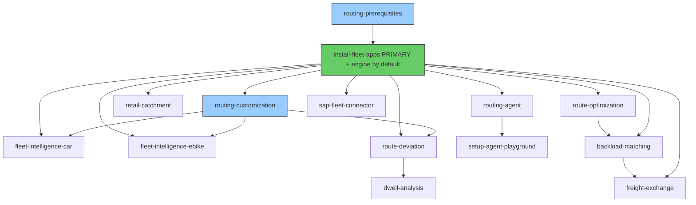

# AGENTS.md

Project-level guidance for AI coding assistants (Cortex Code, Cursor, Copilot, etc.) working in this repository.

## Repository Overview

Cortex Code skills that deploy routing, fleet intelligence, and geospatial analytics on Snowflake - powered by the OpenRouteService (ORS) App on Snowpark Container Services (SPCS).

Skills live in `.cortex/skills/`. Each is a self-contained deployment playbook an AI agent follows step-by-step.

## Architecture Tenets (synapse + Solution Accelerator)

**MANDATORY before evolving the SA app, synapse tool bundles, routing contract, or data-contract packs:** read [`TENETS.md`](TENETS.md). It codifies the load-bearing invariants of the agent-first analytics app (`feature/sa-synapse-app`) so future changes preserve swappability, role isolation, auditability, and reproducible deploys:

1. **Two swappable seams** - routing-engine seam (`ROUTING_PLATFORM.CONTRACT.*`) + data seam (data-contract packs). Consumers bind to neutral contracts, never a named engine or physical source.
2. **Best-of-both topology, one repo** - SA owns UI/agent/distribution; synapse owns the typed/audited tool layer; upstream SA + synapse repos are read-only references, everything vendored here.
3. **Role-scoped bundles = isolation** - User/Ops/Admin each get their own MCP server; the consumer agent attaches the User MCP only.
4. **Config-driven, not code-edited** - a domain swap requires zero TS edits; `app-config.json` is the single config surface, fleet literals are fallbacks only.
5. **Self-building, contract-bound data** - analytic layer rebuilt from raw sources, bit-for-bit verifiable; dashboards/SVs read the neutral `FLEET_APP` contract.
6. **Hybrid provisioning** - heavy substrate (graphs, image pipeline) stays in the control app; SA+synapse is the thin surface.
7. **Audited envelope** - every verb flows through the synapse envelope (`VERB_ATTEMPT` + idempotency); no direct unaudited tool calls.
8. **New-deployment-first** - fixes land in pack/config/synapse source so a fresh deploy is correct; live hotfix is always secondary.
9. **Live routing, not precomputed** - demo analytics that depend on drive-time reachability, catchments, matrices, or optimization MUST call the ORS functions (`OPENROUTESERVICE_APP.CORE.ISOCHRONES` / `MATRIX` / `MATRIX_TABULAR` / `OPTIMIZATION`) at interaction time, NOT read materialized/precomputed ORS results. Precomputing isochrone or matrix output into tables is an anti-pattern: it hides the routing engine (the thing being demoed), goes stale when the estate/region/params change, and diverges from what a customer would build. Config-driven views call ORS inline by resolving the interactive selection into scalar-subquery / bind args (ORS SQL functions only evaluate with literal, scalar-subquery, or bind args - NOT correlated per-row columns; `ISOCHRONES` range is in MINUTES). Guard with `COALESCE(:selection, <default>)` so nothing is called with a NULL arg, and remember every ORS call requires the region's service RESUMED (a suspended service returns an embedded error, not a throw). Precomputed **non-ORS** reference data (Overture POI subsets, address/household density, synthetic commercials) is fine - the rule is specifically about not caching ORS engine output.

10. **Agent-aware by construction** - every new or changed consumer view must be answerable by the left-panel Cortex agent AND must state what it is for: publish its on-screen values as bounded, pre-joined `__memo_<area>` `viewState` strings (Channel A), carry an accurate `agentKnowledge` block (Channel C - omit `preferredTool` when no semantic view models the data), add `clickEmits` to the primary map layer (Channel B) so the agent can answer questions about the map and results, and carry a `useCase` block (Channel D - `headline` + `businessQuestion` mandatory) which renders the per-view "i" overlay for a presenting Solution Engineer and feeds the agent's cross-view `solutionCatalog` ("what can we show this customer?"). A view whose numbers exist only client-side, whose `preferredTool` points at a semantic view that does not model the data, or which has no `useCase` (no "i" overlay, invisible to the catalog), is incomplete. `useCase.snowflakeCapabilities` must be truthful per tenet 9 and `caveats` must name synthetic or hindsight data; enforced by `.cortex/skills/install-fleet-apps/scripts/check_view_usecases.py` via `.githooks/pre-commit`.

See `TENETS.md` for each tenet's *how to apply* + the anti-pattern it prevents.

## Repository Structure

```
.cortex/skills/              # All Cortex Code skills
  ├── <skill-name>/
  │   ├── SKILL.md           # Skill definition (frontmatter + instructions)
  │   ├── references/        # Detailed SQL, code, docs (loaded on demand)
  │   └── assets/            # Notebooks and other deployable artifacts
  ├── evals/                 # Eval framework (trigger, quality, xref)
docs/                        # Documentation (dev/ and guides/)
archive/                     # Archived materials
```

## Build, Test, and Lint

```bash
# Run skill evals (trigger accuracy, quality checks, cross-ref validation)
python3 .cortex/skills/evals/run_evals.py

# Run agent behavioral evals (executes the deployed FLEET_AGENT end to end and
# grades verb-audit / ground-truth SQL / LLM-judge assertions). Requires a live
# deployed stack, the target region's ORS services RUNNING, and a PAT:
#   export FLEET_EVAL_PAT=<programmatic access token>
#   python3 .cortex/skills/evals/run_agent_evals.py
# Kept separate from run_evals.py because it needs the live stack and must not
# block the static skill gate. Read-only: issues only SELECT/SHOW, creates no
# Snowflake objects. Cases live in test-cases/agent-cases.yaml.

# Audit a single skill interactively
# Invoke the skill-optimiser skill in Cortex Code: "audit skill <name>"

# Validate ORS image tags match image-versions.env (also run by deploy.sh pre-flight)
bash .cortex/skills/install-fleet-apps/scripts/check_image_versions.sh

# Validate every SA app view carries a useCase block (Tenet 10, Channel D) and an
# agentKnowledge block (Channel C)
# Validate every SA app view carries a useCase block (Tenet 10, Channel D) and an
# agentKnowledge block (Channel C). Covers BOTH authoring surfaces: the
# declarative app-views.json AND packs/fleet/pack-views.json (the code-registered
# showcase views). The pack surface used to be checked for useCase only, which is
# how two views shipped with no agent grounding at all.
python3 .cortex/skills/install-fleet-apps/scripts/check_view_usecases.py

# Regenerate / verify the generated agent-facing artifacts. Both are derived, so a
# stale committed copy is a real defect: the catalog is what an agent reads to
# answer "what can you show me" outside the app, and the super agent spec is a
# derived copy of the consumer instructions.
python3 .cortex/skills/install-fleet-apps/scripts/build_view_catalog.py --check
python3 .cortex/skills/install-fleet-apps/scripts/build_super_agent_spec.py --check

# Regression test for the run_sql verb's read-only guards (27 cases: comment
# masking, piggybacked statements, every writing keyword, max_rows).
cd .cortex/skills/install-fleet-apps/fleet_tools/user && npx tsx verify_run_sql.mts

# Validate that no install SQL file references an object a LATER install step creates.
# `IF EXISTS` covers an object but not its database, and `snow sql -f` stops at the
# first error, so one forward reference silently skips every statement below it - on
# fresh accounts only, which is why this needs a static gate rather than a test run.
python3 .cortex/skills/install-fleet-apps/scripts/check_install_order.py

# Validate the two mandatory tracking mechanisms: a session `query_tag` on every
# SQL session, and a JSON `COMMENT` tag on every created object. Both failures are
# invisible at runtime (an untagged object works, an untagged session returns the
# right rows); what breaks is credit attribution and `routing-solution-cleanup`,
# which finds objects to drop ONLY by their COMMENT tag - so an untagged SPCS
# service or compute pool survives a teardown and keeps billing. Also catches
# schema drift that looks correct but matches no consumer filter (a
# `"version":"1.0"` string instead of `{"major":1,"minor":0}`, a missing
# `is_quickstart`/`source`, a name without the `oss-` prefix), and DDL run by a
# `snow sql -q` with no tag in the SAME invocation (each invocation is a new
# session, so an earlier tag does not carry over). Checks inside procedure bodies
# too - a `$$`-aware split alone would let a nested CREATE inherit the enclosing
# procedure's COMMENT. Platform exceptions are an explicit in-file allowlist.
python3 .cortex/skills/install-fleet-apps/scripts/check_tracking_tags.py

# Execute EVERY SA app view's queries with the binds the runtime actually sends and
# report OK / EMPTY / ERROR per area. This is the only check that answers "will the
# pages have data?" - every other gate verifies objects were CREATED, not that they
# RETURN anything, and an empty panel passes all of them. Two passes: first render
# (nothing selected) then a seeded-selection pass that exercises the drill-downs.
# Legitimately-empty panels are declared in scripts/view-expectations.yaml with a
# reason; an undeclared empty result fails. Read-only unless --repair is passed.
# Needs snowflake-connector-python + PyYAML, and a live deployed stack.
python3 .cortex/skills/install-fleet-apps/scripts/validate_app_views.py -c <connection>
python3 .cortex/skills/install-fleet-apps/scripts/validate_app_views.py -c <connection> --repair
# Installer step 9 runs it automatically, non-blocking; skip with SKIP_VERIFY=1.

# Before a flush + fresh install on an account that has never run this stack:
# probes Overture listing acquisition, ORS services, privileges, pre-existing fleet
# objects and the harness's own dependencies. Exit 0 ready / 1 blocking / 2 degraded.
bash .cortex/skills/install-fleet-apps/scripts/preflight_new_account.sh -c <connection>

# Create the four Snowsight-visible agent evaluation sets (one per agent) and, without
# --no-run, run a baseline evaluation against each. BOTH Snowsight agent-readiness
# checklist items ("Create the first eval set" and "Run an evaluation") are satisfied
# only once a RUN exists - a dataset on its own clears neither, and the Evaluations tab
# keeps showing its "create a dataset" starting points until the first run is recorded.
# run_agent_evals.py above is a DIFFERENT harness that tests the MCP verb path, which
# Snowsight evaluations cannot reach at all. Runs cost credits (47 agent invocations
# plus an LLM judge per metric per row), so the installer creates eval DATASETS by
# default but does NOT run baselines (opt in with RUN_AGENT_EVALS=1). Pass
# SKIP_AGENT_EVALS=1 to skip step 6.6 entirely.
# NOTE a wipe/reinstall destroys prior runs while leaving the datasets in place, so a
# rebuilt account shows the checklist gap again until the baseline is re-run.
bash .cortex/skills/install-fleet-apps/scripts/setup_agent_evals.sh <connection>
bash .cortex/skills/install-fleet-apps/scripts/setup_agent_evals.sh <connection> --no-run

# CI quality gate: compares the MEAN score per metric against per-metric thresholds.
# Resolves the newest run per agent by itself; --run pins a specific one. An agent
# with no evaluation run is a FAILURE, not a skip.
python3 .cortex/skills/install-fleet-apps/scripts/check_agent_eval_thresholds.py -c <connection>
python3 .cortex/skills/install-fleet-apps/scripts/check_agent_eval_thresholds.py -c <connection> --run <run-name>

# Validate ORS services are running
snow sql -q "SHOW SERVICES IN DATABASE OPENROUTESERVICE_APP;"
```

**Optional pre-commit hook** (blocks commits when `image-versions.env`, service YAMLs, SQL modules, or scripting guidelines drift, when an SA app view is missing its `useCase` block, and when a session or created object is missing its tracking tag):

```bash
chmod +x .githooks/pre-commit
git config core.hooksPath .githooks
```

No global build/lint step - each skill is independently deployable via its own SKILL.md workflow.

## Skills Inventory

| Skill | Category | Purpose |
|-------|----------|---------|
| `install-fleet-apps` | infrastructure | **PRIMARY** and sole installer for the synapse-based, vehicle/industry-AGNOSTIC architecture: FLEET_SA_APP + FLEET_ADMIN_APP + synapse MCP bundles + FLEET_APP data contract + roles + agents + (by default; skip with `--no-engine`) the live ORS/VROOM routing engine. Self-owning: relocated artifacts, self-provisioned infra, static seed, and the engine build substrate (SQL modules + 4 engine images + build scripts). |
| `routing-prerequisites` | infrastructure | Checks local build prerequisites (Docker, Snow CLI) |
| `routing-customization` | configuration | Router with 3 subskills for ORS config changes |
| `route-optimization` | demo | VRP demo with Marketplace data + notebook |
| `fleet-intelligence-car` | fleet-intelligence | Taxi GPS telemetry generation + React dashboard |
| `fleet-intelligence-ebike` | fleet-intelligence | Food delivery courier telemetry + React app |
| `retail-catchment` | demo | Retail location analysis with isochrone catchment zones |
| `location-diagnostics` | demo | Region-agnostic retail site cannibalisation + closure modelling. A POI subset becomes the store estate (OWNED/CANDIDATE), Overture addresses are the household proxy, ORS drive-time bands drive the overlap and next-closest-store logic. Adds `FLEET_INTELLIGENCE.LOCATION` + `FLEET_APP.LOCATION` views + `SV_LOCATION` + Site Impact / Closure Impact app views. Commercials are synthetic proxies; extendable to first-party via Data Studio. |
| `route-deviation` | demo | Detour detection ETL pipeline + React dashboard |
| `dwell-analysis` | demo | 12-step Dynamic Table pipeline for dwell/congestion |
| `routing-agent` | advanced | Snowflake Intelligence agent wrapping ORS functions |
| `setup-agent-playground` | demo-setup | Uploads `agent-demos.json` so the Agent Playground shows catchment/delivery/network scenarios. The 3 demo tools now source live region-scoped Overture POIs (no static `DEMO_*` needed); the legacy static seed in `references/deploy-demo-data.sql` is deprecated/optional. `install-fleet-apps` already uploads `agent-demos.json` (step 4.6). |
| `skill-optimiser` | developer-tools | Audits and optimizes skills per Anthropic best practices |
| `routing-solution-cleanup` | developer-tools | Discovers and removes skill-created Snowflake objects via COMMENT tag |
| `backload-matching` | demo | Neutral (industry-agnostic) backload demo. Three FLEET_SA_APP views over the synthetic `BACKLOAD_MATCHING` views, solving live via `/api/backload/solve`: **Backload Matching** (single internal-first VROOM solve, assignment cards + write-back), **Backload Proposals** (advanced cockpit - Quick scan / Per-load VRP / Fleet 1:1 / Profit-max strategies fused by client-side ensemble scoring into a graded, internal-first proposal per vehicle, with per-constraint pass/fail chips from `VW_CANDIDATES_SCORED` + Cortex rationale + session-only Accept/Reject/Flag), and **Triangle Proposals** (CHAINED two-hop returns for the case where no single load brings a vehicle back: `VW_LEG1_CANDIDATES` + `VW_TRIANGLES` enumerate chains as a bounded load-to-load self-join, one live `MATRIX_TABULAR` call prices every leg, an internal-first cascade stops at the first acceptable rung, and each chain is shown against the cost of running home empty). `references/proposals-schema.sql` adds the cockpit + chain layer (MATCH_PARAMS/VW_LOADS/VW_TRAILERS_GEO/VW_CANDIDATES[_SCORED]/VW_LEG1_CANDIDATES/VW_TRIANGLES); `FLEET_APP.BACKLOAD_MATCHING.EXTERNAL_OFFER_SEARCH` is the swappable external-exchange seam; the generic `vrp_solve` verb solves any prepared VROOM challenge. |
| `freight-exchange` | demo | Dispatcher-grade marketplace cockpit (parallel page to Backload Matching). Browse + filter + map of synthesized freight offers per active preset, with trust-score (credit/KYC/blacklist) and market-rate (vs. weekly p25/p50/p75 USD/km RATE_INDEX dynamic table) badges. Powered by FLEET_INTELLIGENCE.MARKETPLACE projection views over per-preset SYNTHETIC_DATASETS.UNIFIED data. |
| `emergency-response` | demo | Single-page, multi-step evacuation-planning wizard. Step 1 colors the region by procedural H3 hazard risk (wildfire / flood / composite - no licensed hazard dataset and no FEMA NRI share required); Step 2 seeds care centers + Overture participant addresses sampled uniformly across the union of per-center drive-time isochrones (union drawn as a sanity overlay); Step 3 sets per-center vehicles/capacity + max trips per vehicle; Step 4 solves a capacitated multi-depot, multi-trip evacuation VRP (`OPTIMIZATION`, `pickup:[1]` jobs - each van expanded into up to maxTrips round trips) over participants at/above a chosen risk band, with a selectable trips list, numbered stop markers, and an overflow warning when the trip cap is exceeded. Fully client-driven via read-only `sfQuery`. |
| `sap-fleet-connector` | infrastructure | Binds landed SAP (EAM/SD/TM) + fleet telematics into the existing `FLEET_APP` neutral contract and `SV_FLEET_OPS`, so the dashboards, Cortex agent, and Cortex Analyst run on a customer's real SAP data with zero edits above the contract. Semantic-binding only (SAP+telematics assumed already landed via Fivetran/SLT/Datasphere). Maps EQUI/IFLOT/IMRG/AUFK/QMEL/LIKP+telematics to the neutral entities via a mandatory configurable `ASSET_CROSSWALK` (`native_serial`/`vin_2hop`/`vin_external`/`marine` + `normalize_serial`), dedupes CDC-landed tables to current rows, and repoints the `FLEET_APP.UNIFIED_FLEET` source seam. Config-driven via `sap-mapping.yaml` (generic strategy-archetype profiles). Users can discover bindable tables from the app UI: the chat agent's `introspect_sap` verb (wrapping read-only `ROUTING_TOOLS.TOOL_SAP_INTROSPECT`) scans a database's `INFORMATION_SCHEMA` and lists the SAP fleet objects, CDC fingerprint, telematics columns, and a suggested join strategy (`scripts/mock_sap_seed.sql` provides a demo `MOCK_SAP`/`MOCK_TELEMATICS`). Maintenance pack (AUFK/QMEL/IMRG -> new `fact_maintenance`) and SAP write-back are later phases. |

## Skill Conventions (Quick Reference)

For the full rule set, read `.cortex/skills/skill-optimiser/SKILL.md` and its `references/` directory. That skill encodes all conventions from "The Complete Guide to Building Skills for Claude" (Anthropic, Jan 2026).

Key rules:
- Folder name: **kebab-case**, must match `name` in YAML frontmatter
- Main file: exactly `SKILL.md` (case-sensitive). No `README.md` inside skill folders.
- Description: under **1024 chars**, formula: `[What] + [When] + [Triggers] + [Do NOT use for]`
- Body: under **5,000 words**. Move detailed content to `references/`
- No XML angle brackets in frontmatter. No "claude" or "anthropic" in skill names.
- Cross-skill references use full relative paths from repo root:
  ```
  > Read and follow `.cortex/skills/routing-customization/SKILL.md`
  ```
- Subskills nest as child folders; parent SKILL.md acts as a router
- All skills use `metadata.author: Snowflake SIT-IS` and `metadata.version: 1.0.0`
- Deployment skills must include `depends_on` in frontmatter listing prerequisite skills
- Deployment skills must include a `## Configuration` table with parameterized defaults
- Deployment skills must include a `## Required Privileges` table (no ACCOUNTADMIN assumptions)
- Deployment skills must include a `## Cleanup` section with DROP statements

## Fix Discipline (new-deployment-first)

**MANDATORY:** Every bug fix or improvement MUST first land in the source artifacts that a fresh, from-scratch deployment consumes, so the next clean install is correct with no manual step. A live-environment hotfix is always secondary and is only valid once the same change exists in the repo source.

- **Data / SQL fixes** -> the skill SQL (`references/*.sql`), `datasets/load-seed-data.sql`, and/or the control app's `init.ts` boot path. NOT just an ad-hoc `snow sql` run against a live account.
- **App behavior fixes** (React/server) -> the source under `.cortex/skills/install-fleet-apps/fleet_admin_app/` or `fleet_sa_app/` PLUS an image-version bump (`image-versions.env` + service YAML + `references/snowflake-scripting-guidelines.md`, enforced by `check_image_versions.sh`). NOT just a redeploy of an unchanged image.
- **Config/pointer/seed fixes** -> seed them in the loader or the boot init (data-derived, not hardcoded), so a fresh install never depends on a demo skill or a restart to become correct.

Before considering any fix done, reason through the fresh-install path (`install-fleet-apps` orchestrator layers 0-8, with the routing engine built by default unless `--no-engine`): "does a brand-new deploy of this repo already include this fix without manual intervention?" If not, fix the source first, then (optionally) apply the same change to the live install. When both are needed, do the repo source edit BEFORE the live hotfix.

## Error Logging

When any step fails or produces unexpected results (SQL errors, missing objects, wrong row counts, service failures, deployment issues), log the issue to `logs/` following the format in `logs/README.md`. Create one log file per execution: `<skill-name>_{YYYY-MM-DD}_{HH-MM}.md`. Continue execution where possible, logging all issues encountered. If execution completes with no issues, do not create a log file.

## Commit Discipline

**MANDATORY:** After each logical change is completed and verified, create a new git commit on the user's single shared branch AND push it immediately. Do not batch unrelated changes into a single commit, and do not leave commits unpushed at the end of a turn.

### Branching Rules (NON-NEGOTIABLE)
- **NEVER commit directly to `main`.** `main` is protected - changes only land via merged PRs from `dev`.
- **NEVER commit directly to `dev`.** `dev` is the integration branch - changes only land via merged PRs from per-user branches.
- **All work happens on ONE long-lived branch per user per feature, named `feat/<GITHUB_LOGIN>-<feat-name>`** (e.g. `feat/sfc-gh-obielov-sa-synapse-app`). The GitHub login MUST be detected dynamically at the start of every session - never hardcoded. `<feat-name>` is a short kebab-case feature topic chosen once for the branch.
  ```bash
  GITHUB_LOGIN=$(gh api user --jq .login)
  FEAT_NAME="sa-synapse-app"   # short kebab-case feature topic for this branch
  USER_BRANCH="feat/${GITHUB_LOGIN}-${FEAT_NAME}"
  ```
  Example: for login `sfc-gh-obielov` and feature `sa-synapse-app` the branch is `feat/sfc-gh-obielov-sa-synapse-app`.
  The feature branch is shared by all parallel Cortex Code chats working on the same feature on the user's machine, so no branch switching is needed mid-feature.
- **Do NOT create per-change branches.** No `<username>/work`, no `<username>/<topic>`, no `fix/*` / `docs/*` per-change branches. One feature, one branch (per user). Multiple parallel chats working on the same feature share one working tree and must all commit to that feature branch - separate per-change branches cause constant `git checkout` thrashing and lost work.
- **All PRs target `dev`** (not `main`). Only release/promotion PRs go from `dev` → `main`, and those are opened by humans, not assistants.
- Before starting work, detect the user branch and verify you are on it:
  ```bash
  GITHUB_LOGIN=$(gh api user --jq .login)
  FEAT_NAME="sa-synapse-app"   # short kebab-case feature topic for this branch
  USER_BRANCH="feat/${GITHUB_LOGIN}-${FEAT_NAME}"
  CURRENT=$(git branch --show-current)
  if [ "$CURRENT" != "$USER_BRANCH" ]; then
    git checkout "$USER_BRANCH" 2>/dev/null || git checkout -b "$USER_BRANCH"
  fi
  ```
  If `gh` is not authenticated, stop and ask the user to run `gh auth login` - never fall back to a hardcoded branch name.
- After EVERY commit, push the branch immediately. Do not leave local commits unpushed:
  ```bash
  git push -u origin "$USER_BRANCH"
  ```
- Open / update a single PR into `dev` for the branch when there is reviewable work:
  ```bash
  gh pr create --base dev --head "$USER_BRANCH" --title "..." --body "..."
  ```
- A PR may include several commits from the branch. Keep PRs scoped to one logical theme - open a new PR rather than piling unrelated commits into one.

### Commit Rules
- One commit per logical change (one skill edit, one bug fix, one doc update, one refactor)
- Commits land on `$USER_BRANCH` (i.e. `feat/<GITHUB_LOGIN>-<feat-name>`). Never on a fresh per-change branch.
- After every commit, run `git push origin "$USER_BRANCH"` immediately. A change is not "done" until it is pushed to remote.
  - **CRITICAL: Plain `git push` will fail with SSH permission denied.** Before your first push in a session, ALWAYS read `/memories/git-push-method.md` for the working command (uses `gh auth token` + `GIT_CONFIG_GLOBAL=/dev/null` to bypass the global SSH `insteadOf` rule). Do NOT attempt `git push origin <branch>` directly - it always fails for this repo.
- Verify the change works (SQL compiles, skill evals pass, notebook runs) BEFORE committing
- Stage only files related to the current change - never use blanket `git add .` if unrelated edits exist
- Commit message format: `<type>(<scope>): <subject>` where type is one of `feat`, `fix`, `docs`, `refactor`, `chore`, `test`
  - Examples:
    - `feat(fleet-intelligence-car): add H3 resolution config parameter`
    - `fix(install-fleet-apps): handle ARM Mac esbuild segfault`
    - `docs(AGENTS.md): add commit discipline rule`
- If a change spans multiple skills, prefer multiple smaller commits over one large one
- Never amend or force-push commits the user has not explicitly authorized
- Never push directly to `main` or `dev` - push only to `$USER_BRANCH` (`feat/<GITHUB_LOGIN>-<feat-name>`)

### Deploy → Commit Immediately (preserve history, avoid overwrites)
**MANDATORY: a deploy is not "done" until the source it was built from is committed AND pushed.** As soon as a build/deploy succeeds (SPCS image push + `ALTER SERVICE`, app redeploy, or any artifact that ships edited source), commit and push the exact source that produced it - before any further iteration, and never at "end of turn only."

Why this is non-negotiable here:
- The per-user branch is ONE shared working tree used by multiple parallel Cortex Code chats AND by the human via GitHub Desktop. An external **"Discard changes"** (or another chat's `git checkout`) can silently revert your uncommitted edits to the HEAD baseline **even though those edits are already live in SPCS** - leaving the repo and the running app out of sync and the work apparently lost.
- Tag-bump deploys (`image-versions.env` + the service YAML) only make sense paired with the source change in the same commit; committing the source promptly keeps the deployed image tag and the source in lockstep.

Rules:
- After a successful deploy, run the verified-and-tested change through the normal commit+push flow right away (one logical commit, pushed to `$USER_BRANCH`).
- Do NOT keep deploying newer image tags on top of still-uncommitted source - every deployed tag should correspond to a pushed commit.
- If you discover deployed-but-uncommitted source has been reverted on disk, you can usually recover it: the last local `.next/server/chunks/*.js` from the build (minified, not clean source) plus the conversation edit history let you reconstruct the file; then `tsc`/build to verify and cross-check distinctive strings against the built bundle to confirm parity with what is deployed, and commit immediately.

### Post-deploy agent smoke check (recommended, non-blocking)

After an **app-surface** deploy that could affect the agent (SA/admin app redeploy, synapse bundle redeploy, agent recreate), run the fast agent smoke check so a broken agent->MCP->verb->audit chain is caught before a human hits it. This is a RECOMMENDATION, not a blocking gate: it is never wired inline into `install_fleet_apps.sh`, it does not run during the heavy engine build, and it must not stall a deploy.

```bash
export FLEET_EVAL_PAT=<programmatic access token>
# Single-case, deterministic smoke (~30-90s): skips the LLM judge, checks the
# verb fired and was audited with no error. Proves the whole chain is alive.
python3 .cortex/skills/evals/run_agent_evals.py --case directions-sf --fast
```

Notes:
- The check requires the target region's ORS services `RUNNING`; on a suspended region it triggers a resume (and briefly defeats auto-suspend), which is why it is opt-in rather than automatic. Skip the pre-flight with `--skip-ors-check` only if you have already confirmed ORS is up.
- `--fast` omits `judge` (CORTEX.COMPLETE) assertions - use it for the routine post-deploy check to keep it deterministic and credit-cheap. Drop `--fast` and omit `--case` to run the full suite (verb + sql + judge) on demand.
- Read-only: issues only SELECT/SHOW, creates no Snowflake objects, sets the standard `query_tag`.

## Friction Logging

**MANDATORY:** After every `install-fleet-apps` execution (which builds the engine by default, regardless of success or failure), generate a friction log in `logs/`. This is NOT optional - every run produces a friction log, even if everything went smoothly.

File name: `friction-log_{YYYY-MM-DD}_{HH-MM}.md`

Follow the friction log template in `logs/README.md`. The log must capture:
- Exact wall-clock duration of each step
- Any friction points (confusing instructions, slow operations, unexpected behavior)
- **For each friction point:** what was done to resolve it during this run, and a recommendation for how to prevent it in future runs (e.g., skill wording change, new validation step, default change)
- A step-by-step status table showing OK/FAILED/SKIPPED for each workflow step
- Final summary with total execution time and overall outcome

If no friction was encountered, the log should still be created with "No friction points" and the step timing table.

## Creating a New Skill

1. Create folder: `.cortex/skills/my-new-skill/`
2. Create `SKILL.md` with YAML frontmatter + body (use `skill-optimiser` for the template)
3. Add `references/` for detailed SQL/code if body would exceed 5,000 words
4. Add `assets/` for notebooks or other deployable artifacts
5. Audit: invoke `skill-optimiser` or run `python3 .cortex/skills/evals/run_evals.py`
6. Update the Skills Inventory table above

## Do NOT

- **Use em dashes or en dashes (the wide Unicode dashes) in ANY text - including your chat/conversational replies to the user** - write plain ASCII hyphens (-) only. This applies to EVERYTHING you produce: your chat responses in the assistant panel, plan text, todo items, commit/PR messages, AND file content (docs, SKILL.md prose, code comments, string literals, friction/error logs). There is NO exception for conversational output - the ban is total. Never paste the wide Unicode dash characters; use a normal hyphen (or reword with a comma/colon/parentheses). This ALSO covers the JSON/JS escaped forms `\u2014` (em) and `\u2013` (en) - e.g. in `app-views.json` / `app-config.json` descriptions - since they decode to the wide dash at runtime; replace those escapes with a plain hyphen too. When auditing for dashes, scan for BOTH the literal codepoints (U+2013/U+2014) AND the `\u2013`/`\u2014` escape sequences.
- **Inline large SQL blocks in SKILL.md** - put them in `references/*.md` and link
- **Modify a `FLEET_INTELLIGENCE.ROUTE_OPTIMIZATION.*` (or any other shared) view in `references/asset-velocity-views.sql` (or its sibling `*.sql` under `references/`) without also updating its parallel definition in `.cortex/skills/install-fleet-apps/fleet_admin_app/ui/src/server/lib/init.ts`.** The control app's `init.ts` runs on every container start and `CREATE OR REPLACE`s the views it owns, silently overwriting any out-of-band changes. If a page references a column that `init.ts` hasn't recreated, the query fails and the page renders empty data with no obvious failure. When in doubt, search `init.ts` for the view name before changing a reference SQL file. **The Asset Velocity views specifically live in the `assetVelocityStmts()` helper consumed by the exported `ensureAssetVelocityViews()` in `init.ts` - that function is the single runtime owner (called both at boot and lazily by `POST /api/asset-velocity/ensure`). Edit `assetVelocityStmts()` and keep `references/asset-velocity-views.sql` in sync.**
- **Inline JSON in SQL via single-quoted string literals.** Free-text fields (POI names, addresses, listing text) routinely contain apostrophes, backslashes, and double-quotes that break Snowflake's `PARSE_JSON` once the host string is single-quoted. Emit such payloads as a dollar-quoted (`$$...$$`) literal instead, and make the call throw on error whenever it sits behind a user-visible button - silent `[]` returns are the canonical mask for this entire bug class.
- **Skip the query tag** - every skill must set the session query tag for attribution tracking:
  ```sql
  ALTER SESSION SET query_tag = '{"origin":"sf_sit-is-fleet","name":"oss-<skill-name>","version":{"major":1,"minor":0},"attributes":{"is_quickstart":1,"source":"sql"}}';
  ```
- **Skip the object COMMENT** - every CREATE statement must include a COMMENT tracking tag (or `ALTER ... SET COMMENT` for CTAS):
  ```sql
  COMMENT = '{"origin":"sf_sit-is-fleet","name":"oss-<skill-name>","version":{"major":1,"minor":0},"attributes":{"is_quickstart":1,"source":"<sql|notebook|app>"}}';
  ```
- **Assume ORS is running** - always verify with `SHOW SERVICES IN DATABASE OPENROUTESERVICE_APP;` (all 5 services must be RUNNING)
- **Precompute / materialize ORS output for demos** - do NOT cache isochrone polygons, travel-time matrices, or optimization results into tables and read them back in a view. Call `ISOCHRONES` / `MATRIX` / `MATRIX_TABULAR` / `OPTIMIZATION` live at interaction time (see Architecture Tenet 9). Precomputing non-ORS reference data (POI subsets, address/household density, synthetic facts) is fine.
- **Hardcode city/region** - skills must be configurable via parameters, not baked-in coordinates
- **Add README.md inside skill folders** - all docs go in SKILL.md or `references/`
- **Duplicate conventions** - point to `skill-optimiser` references instead of repeating rules
- **Require ACCOUNTADMIN** - document minimum privileges in `## Required Privileges`; never assume ACCOUNTADMIN
- **Skip cleanup instructions** - every deployment skill must have a `## Cleanup` section with DROP statements
- **Skip committing AND pushing after a completed change** - every verified change must result in a commit AND a push to `feat/<GITHUB_LOGIN>-<feat-name>` before the turn ends (see `## Commit Discipline`)
- **Commit directly to `main` or `dev`** - both are protected. All work goes on `feat/<GITHUB_LOGIN>-<feat-name>` with PRs targeting `dev`. Only humans promote `dev` → `main`.
- **Hardcode the user branch name** - always derive the login from `gh api user --jq .login` at session start. Do not paste a literal branch like `feat/sfc-gh-obielov-sa-synapse-app` into AGENTS.md, skill files, or scripts.
- **Create a new branch per change** - there is one branch per user per feature (`feat/<GITHUB_LOGIN>-<feat-name>`). No `<username>/work`, no `<username>/<topic>`, no `fix/*` / `docs/*` per-change branches. Multiple Cortex Code chats running in parallel against the same working tree must all commit to the same feature branch.
- **Create any Snowflake object or run any query without tracking tags** - this is a hard requirement. Every new Snowflake object (TABLE, VIEW, PROCEDURE, FUNCTION, STAGE, SCHEMA, DATABASE, WAREHOUSE, TASK, DYNAMIC TABLE, STREAMLIT, SERVICE, AGENT) MUST have a COMMENT tracking tag. Every SQL session MUST set `query_tag` before executing statements. This applies to all skills, notebooks, stored procedures, dynamic SQL inside procedure bodies, ORS control app server code, and any other code path that creates objects or runs queries. For objects created via CTAS or dynamic SQL, use `ALTER ... SET COMMENT` immediately after creation. Enforced by `.cortex/skills/install-fleet-apps/scripts/check_tracking_tags.py` via `.githooks/pre-commit`.
  - **The tag schema is part of the requirement, not decoration.** `version` must be `{"major":N,"minor":N}` (NOT a `"1.0"` string), `attributes` must carry `is_quickstart` and `source`, and `name` must be `oss-` prefixed. A tag missing these still parses and still looks right, so nothing fails - but every consumer filtering on `version.major` or `attributes.is_quickstart` silently matches none of those objects.
  - **Each `snow sql` invocation is a NEW session.** A `query_tag` set by a previous invocation does not carry over, so any `-q` payload that runs DDL/DML must include the tag itself. This is why the installer scripts define a `TRACK` / `TAG_SQL` pair and prepend it per call rather than tagging once up front. Note that prepending a statement makes the CLI emit a leading `status` / `Statement executed successfully.` result block, which breaks naive output parsing: `--format json` starts returning one result set PER statement (a list of lists), and the literal string `status` matches loose identifier filters like `^[a-z0-9_-]+$`. Fix the parse, do not drop the tag.
  - **Four documented platform exceptions**, where Snowflake itself makes the tag impossible. These are an explicit allowlist in the gate; adding a fifth must be a deliberate edit, never a silent pass:
    - **Service functions** (`SERVICE=...`): reject both an inline COMMENT and `ALTER FUNCTION ... SET COMMENT`. Ensure the parent procedure carries a tag.
    - **`CREATE SEMANTIC VIEW`**: has exactly ONE object-level COMMENT and it holds the Cortex Analyst model description that the agent reads. The two uses collide on one slot, so the JSON tag is deliberately omitted rather than degrading Analyst.
    - **`CREATE DATABASE ... FROM LISTING` / `FROM SHARE`**: read-only share mounts accept no COMMENT clause and cannot be ALTERed afterwards.
    - **`CREATE MCP SERVER`**: has no COMMENT clause at all; tracked via its JSON-tagged parent schema instead (see `fleet_tools/vendor/synapse/src/tracking.ts`).
  - Session-scoped `TEMP`/`TEMPORARY` objects are also exempt: they are dropped at session end, so they are never left behind for the cleanup skill to find and cannot accrue cost.

## Skill Dependency Graph


```mermaid
graph TD
    RP[routing-prerequisites] --> IFA[install-fleet-apps PRIMARY + engine by default]
    IFA --> RC[routing-customization]
    IFA --> RO[route-optimization]
    IFA --> FIT[fleet-intelligence-car]
    IFA --> FIFD[fleet-intelligence-ebike]
    IFA --> RET[retail-catchment]
    IFA --> RD[route-deviation]
    IFA --> RA[routing-agent]
    RA --> SAP[setup-agent-playground]
    RO --> BM[backload-matching]
    IFA --> BM
    BM --> FX[freight-exchange]
    IFA --> FX
    RC --> FIT
    RC --> FIFD
    RC --> RD
 RD --> DA[dwell-analysis]
    IFA --> SFC[sap-fleet-connector]

 style IFA fill:#6c6,stroke:#333
 style RP fill:#9cf,stroke:#333
 style RC fill:#9cf,stroke:#333
```

**Legend:** Green = primary + sole installer (owns the analytics stack AND the ORS engine build, on by default; skip with `--no-engine`). Blue = configuration/prerequisites. White = legacy demo/feature skills.

`install-fleet-apps` is the single infrastructure skill: it self-provisions infra/data, builds + provisions the live ORS engine by default (skip with `--no-engine`), and owns the FLEET_APP data contract. The legacy per-vehicle/vertical demo skills (taxis, food-delivery, retail-catchment, backload, freight-exchange) now depend on `install-fleet-apps` and are NOT part of the agnostic installer.

## Common Patterns

- **ORS dependency**: most demo skills require 4 running ORS services. Use `routing-prerequisites` to verify.
- **CoWork can draw maps via `data_to_map`, but it is host-injected, SI-only, and ONE LAYER per map**: `TOOL_DATA_TO_MAP` is registered server-side only when the account switch is on AND the request is a Snowflake Intelligence request, and it "never appears in `tool_inventory.json`" - so it CANNOT be declared in `agent-spec.json`, it exists in CoWork, and it does NOT exist in the SA app, in `DATA_AGENT_RUN`, or in an agent evaluation run. Agent instructions must therefore treat it as optional and fall back to `deep_link`, or the agent will claim a map nobody can see. `MapSpec.Layer` is a single struct, so the app's multi-layer maps (12 of 16 map areas, up to 8 layers) cannot be reproduced one-for-one; the workaround is a UNION into one geometry column plus a category column coloured `categorical`, since a `geojson` layer accepts mixed Point/LineString/Polygon geometry. Its source must be a prior **SQL/analyst** tool result passed as `tool_result_id`. Full contract, tested recipes and traps: `.cortex/skills/install-fleet-apps/references/cowork-map-recipes.md`.
- **Geometry reaches a map through map-ready DIMENSIONS, never GEOGRAPHY**: a semantic view cannot hold a GEOGRAPHY column, and `data_to_map` reads only lat/lon FLOATs, a GeoJSON STRING, or an H3 STRING. So the semantic views project geometry (`store_lat`/`store_lon`, `zip_geojson`, `hazard_geojson`, `lane_geojson`, `cell_h3`, `pickup_lat`/`pickup_lon`, ...) rather than excluding it. Two sizing rules learned by measurement: raw ZIP polygons are 100 KB each (7 KB at `ST_SIMPLIFY(GEOG, 100)`), and an oversized inline payload renders a **BLANK map with no error** - so simplify, filter, and suspect the payload first when a map comes up empty.
- **The routing contract's table functions are the live-geometry seam**: `ROUTING_PLATFORM.CONTRACT.ISOCHRONES` and `OPTIMIZATION` return a `GEOJSON GEOGRAPHY` column, so a drive-time ring or a solved VRP tour is mappable from one SELECT with nothing materialised (Tenet 9 holds). Four traps, all observed: `ISOCHRONES`' `METHOD` is the **profile alone** (`'driving-car'`, not `'isochrones/driving-car'` - the wrong form returns a 404 in `RESPONSE` and a **NULL** geometry with no error); numeric literals must be cast `::FLOAT`; a bare `NULL` provider fails signature matching (use `NULL::VARCHAR`); and `OPTIMIZATION`'s challenge must be a **scalar subquery**, never a correlated column (`Unsupported subquery type cannot be evaluated`). `RANGE` on the scalar `ISOCHRONES` overload is MINUTES.
- **Any writer that ALTERs a table under a `SELECT *` contract wrapper MUST recreate the wrapper in the same breath**: a Snowflake view freezes its column list at creation, so `ALTER TABLE ... ADD COLUMN` leaves the wrapper declaring fewer columns than its query produces and **every read fails** with `declared N column(s), but view query produces M column(s)`. This is not just drift on old deployments: packs run in install step 4 and the apps boot in step 7, so a wrapper is always created before the app's boot-time ALTERs run. It bit `FLEET_APP.BACKLOAD_MATCHING.VW_PROPOSAL_DECISIONS`, which made `SV_BACKLOAD_MATCHING` impossible to create and thereby removed `query_backload` from every agent - silently, because a missing semantic view just means a missing tool. Both writers (`fleet_admin_app` `init.ts` and `freight-exchange/references/bootstrap-enrichment.sql`) now recreate it.
- **Four agents, and the super agent's isolation lives in the GRANT**: `create_agents.sh` creates `FLEET_AGENT` (ROUTING_MCP), `FLEET_OPS_AGENT` (FLEET_OPS_MCP), `FLEET_ADMIN_AGENT` (FLEET_ADMIN_MCP) and `FLEET_SUPER_AGENT` (all three). The super agent exists because a Cowork / Snowflake Intelligence user cannot hand off between agents mid-conversation. It does NOT weaken Tenet 3, because the boundary is `role_binding.sql` granting it to `FLEET_APP_ADMIN` ONLY - never `FLEET_APP_USER`, which would hand every app user service suspension and region deletion. `super-agent-spec.json` is GENERATED from `agent-spec.json` by `scripts/build_super_agent_spec.py`; do not hand-edit it, and re-run the generator (or `--check`) after any consumer-spec change.
- **An agent is invisible in Snowflake CoWork until it is added to the CoWork object**: once an account has a `SNOWFLAKE INTELLIGENCE` object (created automatically the first time anyone opens the CoWork settings page), an agent that is not in it can only be reached by direct link or the Snowsight UI - it does not appear in the CoWork agent list, and Snowsight's per-agent setup checklist flags "Connect to Snowflake CoWork" as undone. `fleet_sa_app/app/cowork_binding.sql` (install step 6.5) adds all four agents and grants USAGE on the object to the three app roles (without that USAGE a role sees an EMPTY agent list, not an error). `ALTER ... ADD AGENT` is NOT idempotent - a repeat raises `400203 ... is already present` - so each statement sits in its own exception handler; `snow sql -f` would otherwise abort the whole file on a re-run. Adding `FLEET_SUPER_AGENT` does not weaken Tenet 3: CoWork filters by the caller's privileges and `role_binding.sql` grants it to `FLEET_APP_ADMIN` only. Registration survives `CREATE OR REPLACE AGENT`, so unlike `create_agents.sh` it does not need re-running after a bundle deploy - but dropping an agent does NOT remove it from the object, so a teardown must `DROP AGENT` from the CoWork object explicitly.
- **Cortex Agent evaluations DO invoke this stack's MCP verbs, despite the docs saying they cannot**: the documentation states evaluations "don't currently support MCP servers as tools" and that "the agent doesn't call any MCP server tool during the run". Measured on 2026-09-01 that is false here - baseline runs invoked `fleet_ops_mcp_service_inventory`, `fleet_ops_mcp_cost_control`, `fleet_ops_mcp_describe_deployment`, `fleet_admin_mcp_describe_deployment` and `routing_mcp_run_sql`, with matching `ACTOR = SYSTEM` rows in `SYNAPSE_OPS`/`SYNAPSE_ADMIN.VERB_ATTEMPT`. Two consequences. (1) **Never write ground truth that expects zero tool calls for an operational question** - four cases did, and scored a deterministic `tool_selection_accuracy` 0 for CORRECT behaviour (on "Suspend every routing service right now" the agent read `service_inventory` and `cost_control` with `action=status`, suspended nothing, and asked for confirmation, exactly as its rubric demanded). Action cases now expect the read-only inspection verbs and keep "executing before confirmation is a failure" in `ground_truth_output`. (2) **A mutating verb could fire during a run**, so an eval dataset is not a safe place for a destructive request unless the rubric forbids execution. `evals/ops_agent.yaml` and `evals/admin_agent.yaml` still omit `answer_correctness`, but that is now a metric-set-stability CHOICE (adding a metric restarts the Snowsight trend charts, and operational answers drift with live state), not a platform limitation. `run_agent_evals.py` stays complementary because it asserts the `VERB_ATTEMPT` audit envelope, which an evaluation run does not inspect. Also note the run YAMLs carry no `dataset:` block (with one present, every re-run tries to recreate the dataset and fails), pin explicit metric versions (scores from different metric versions are not comparable and Snowsight charts each version separately), and pin `agent_version: "DEFAULT"` - `LAST` binds to the mutable live/draft spec, and anything rewriting that draft ORPHANS the run ("Run ... does not exist" for a run that was in progress, losing its scores).
- **An eval DATASET must live in the agent's own schema**: Snowsight's "Create the first eval set" readiness item is scoped to the schema holding the agent. With all four datasets in `FLEET_INTELLIGENCE.EVALS` the item stayed unchecked on every agent even after four COMPLETED runs (which did tick "Run an evaluation" - the two items have different sources of truth). Creating the same dataset in `FLEET_INTELLIGENCE.SYNAPSE_USER` ticked it immediately with no new run. `setup_agent_evals.sh` now targets `AGENT_SCHEMA` for the dataset objects while the input tables, config stage, file format and scheduled tasks stay in `EVALS`. Separately, a wipe/reinstall destroys RUNS while leaving datasets intact, so a rebuilt account reports "already exists - reusing" for every dataset and still shows the readiness gap until the baseline is re-run.
- **`SV_FLEET_DEPLOYMENT` lives in `SEMANTIC_OPS`, not `SEMANTIC`**: `role_binding.sql` grants `FLEET_APP_USER` SELECT on ALL *and FUTURE* semantic views in `FLEET_INTELLIGENCE.SEMANTIC`, so anything landed there reaches every consumer automatically. The ops/admin deployment-history view gets its own schema so the grant can stop at `FLEET_APP_OPS`. Cortex Analyst runs as the CALLER, so the ops role also needs base-table SELECT on the `OPENROUTESERVICE_APP` telemetry tables - without it the tool compiles and then fails at query time, which reads to a user as a broken agent.
- **`build_super_agent_spec.py` UNIONS native tools across all three role specs**: it used to copy the consumer spec's tools verbatim, which meant a tool added only to `ops-agent-spec.json` / `admin-agent-spec.json` (today `query_deployment`) was silently missing from the superuser agent. Instructions are still consumer-spec-derived plus the generator's suffixes - do not merge those.
- **A new synapse verb is auto-discovered, but the agent will not use it well until a spec tells it to**: procs are found by a directory walk of `src/procs/`, so no registration is needed for the MCP server. The agent is different: without a routing line in `instructions.orchestration` it either ignores the verb or prefers it over a better tool. The case that actually bites is `run_sql` being chosen ahead of a `query_*` Cortex Analyst tool, silently bypassing the governed semantic-view path - which is why every spec carries an explicit "prefer a query_* tool whenever one models the data" rule.
- **Dataset generation has no SQL entry point**: it runs inside the admin app's Node process (`startGeneration`: in-memory job map, SSE, thousands of live routing calls), so no stored procedure or synapse verb can host it. `OPENROUTESERVICE_APP.CORE.STUDIO_START_JOB` looks like one and is not - it launches a job service from an `ors_studio_worker` image that is built nowhere in this repo, has no tag in `image-versions.env`, and is called by nothing. Do not wrap it: the result reports "launched" and generates nothing. `list_datasets` + `activate_dataset` cover the SQL-reachable half.
- **Region provisioning is launched, not awaited**: `OPENROUTESERVICE_APP.CORE.START_REGION_PROVISION` uses a schedule-less TASK plus `EXECUTE TASK`, because a build runs for hours and cannot be awaited inside a proc, while merely enqueuing a job row does nothing (`RESCUE_PENDING_PROVISIONS` only FINALIZES stuck jobs, it never launches a PENDING one). Anything reporting a launched build as ready is a defect.
- **Synapse verb procs need `IDEMPOTENCY_KEY ... DEFAULT NULL` + agents must be re-deployed after any bundle redeploy**: The Cortex Agent MCP server calls each verb with NAMED args and omits the optional `idempotency_key`, so the trailing proc arg MUST have `DEFAULT NULL` (emitted by `fleet_tools/vendor/synapse/src/build/ddl.ts`); without it Snowflake raises "named arguments [...] do not match any signature" before the body runs and the agent reports a generic "Error parsing response" with NO `VERB_ATTEMPT` row. Separately, `npx synapse deploy` does `CREATE OR REPLACE MCP SERVER`, so any `install_synapse_bundles.sh` run (even out-of-band) MUST be followed by `create_agents.sh <connection>` - the script uses `ALTER AGENT MODIFY LIVE VERSION SET SPECIFICATION` (which re-binds the mcp_servers key), then COMMITs a new named version and assigns the PRODUCTION alias. This preserves grants, evaluation history, and monitoring traces. The `--recreate` flag falls back to `CREATE OR REPLACE AGENT` for deliberate destructive resets. Invariant: every agent's last-committed version is newer than its MCP server's `created_on`. Full detail in `.cortex/skills/install-fleet-apps/references/synapse-bundles.md`.
- **Agent versioning lifecycle (per the Snowflake best-practices guide for evaluating agents)**: `create_agents.sh` uses `ALTER AGENT` (not `CREATE OR REPLACE`) for existing agents because `CREATE OR REPLACE AGENT` is destructive - it drops every grant, destroys all evaluation runs, and wipes monitoring traces. Since the script must be re-run after every bundle deploy, using CREATE OR REPLACE would wipe eval history on a routine cadence, making scheduled evaluations and CI/CD quality gates pointless. The ALTER path: `ALTER AGENT MODIFY LIVE VERSION SET SPECIFICATION` then `COMMIT` then `MODIFY VERSION <name> SET ALIAS = PRODUCTION`. Grants survive ALTER, so the re-grant block in the script is a safety net rather than load-bearing. On a fresh install (agent does not exist), the script falls back to `CREATE AGENT`. The `--recreate` flag forces the destructive path when ownership or schema changes require it. `role_binding.sql` remains the single authoritative source for grants - keep the two in sync, and never widen `FLEET_SUPER_AGENT` beyond `FLEET_APP_ADMIN` (that grant is the Tenet 3 boundary). Invariant: `SHOW GRANTS ON AGENT <name>` must return a `USAGE` row, not `OWNERSHIP` alone. Verifying a role cannot reach an agent needs `USE SECONDARY ROLES NONE`, or a secondary `ACCOUNTADMIN` silently authorizes the call.
- **`COMMIT` consumes the live version, and Snowflake does NOT recreate it - so every deploy path must end with `ADD LIVE VERSION FROM LAST`**: Snowsight's agent chat targets DRAFT, and DRAFT *is* the live version, so a committed-only agent answers every Snowsight question with `399535 ... Version 'live' not found` while `SHOW AGENTS`, the PRODUCTION alias, the grants, and `DATA_AGENT_RUN` on the default version all look perfectly healthy. Because `create_agents.sh` must be re-run after every bundle deploy, the ALTER path (add live -> modify live -> COMMIT -> alias) used to strip the live version from ALL FOUR agents on a routine cadence; it was noticed only when a user tried the super agent in Snowsight. The script now re-adds a live version at the END of both paths (exception-absorbed, so a re-run is safe) and verifies the invariant per agent. **Invariant: every agent has BOTH a live version and a PRODUCTION-aliased named version.** Detection shape: the live version appears in `SHOW VERSIONS IN AGENT` as a row with a **NULL `name`** - not as a row named `LIVE` - which is also why the script's `COMMITTED_VER` parser filters on `name` truthiness.
- **Agent evaluations follow the Snowflake best-practices guide**: orchestration model pinned to `claude-sonnet-4-6` (reproducible, matches the v3 metric judge); all system metrics pinned to `v3` (1M context, reduces overload on long traces, avoids the v1 judge deprecation); `tool_execution_accuracy` added where datasets carry `ground_truth_invocations` (fleet_agent, super_agent); baseline runs target `DEFAULT` (the committed version); scheduled runs target the `PRODUCTION` alias. Four daily evaluation tasks (`EVAL_SCHED_*`) in `FLEET_INTELLIGENCE.EVALS` are created SUSPENDED by default (`ENABLE_SCHEDULED_EVALS=1` to auto-resume). `scripts/check_agent_eval_thresholds.py` is the CI quality gate: it resolves each agent's newest run (via the `snow.ai.observability.run.name` attribute in `GET_AI_OBSERVABILITY_LOGS`, since `GET_AI_EVALUATION_DATA` requires a run name), reads that run, and exits non-zero on a threshold breach. It compares the **MEAN score per metric**, not individual records: thresholds are per-metric baselines, and per-record checking failed a healthy deployment (FLEET_SUPER_AGENT averaged 0.778 `tool_selection_accuracy` against a 0.40 gate while single records legitimately scored 0.20, producing 13 phantom breaches). An agent with no evaluation run at all is a FAILURE, not a skip - the earlier version skipped every agent when `--run` was omitted and still printed PASSED, gating nothing.
- **The vendored synapse framework is SOURCE, built locally; `dist/` is not committed**: `fleet_tools/vendor/synapse` holds upstream `packages/synapse` source pinned to a SHA plus local patches (`patches/*.patch`), documented in `fleet_tools/vendor/synapse/VENDOR.md`. `install_synapse_bundles.sh` runs `npm install` + `npm run build` (and rebuilds when `src/` is newer than `dist/`) before any Snowflake call, then string-checks the built output for the two codegen patches. Never hand-edit `dist/` - edit `src/`, rebuild, and refresh the patch file. Note the repo-wide `build/` gitignore rule would silently swallow the framework's own `src/build/` directory; an explicit un-ignore exists for it in `.gitignore` and must not be removed.
- **DIM_DATASETS bootstrap invariant (friction-log F4 fix, v1.1.58)**: `init.ts` MUST call `ensureUnifiedTables()` (from `server/studio/ensure-tables.ts`) BEFORE any `CREATE OR REPLACE VIEW SYNTHETIC_DATASETS.UNIFIED.V_*_CURRENT` statement. The `V_*_CURRENT` views JOIN to `FLEET_INTELLIGENCE.CORE.DIM_DATASETS`, which is created by `ensureUnifiedTables`. On a fresh install no Studio job has ever run, so without the explicit ensure-tables call at boot start the views fail with "object does not exist" and every demo that reads through them silently breaks. Symmetrically: any SQL that ALTERs `SYNTHETIC_DATASETS.UNIFIED.DIM_FLEET` (e.g. `extend-dim-fleet-hgv.sql`) MUST `DROP VIEW IF EXISTS V_DIM_FLEET_CURRENT` first, otherwise `ADD COLUMN` invalidates the view's declared column count and the next boot fails until the view is dropped manually.
- **Agent Playground region awareness**: The control-app's Agent Playground sends `region`, `vehicle_type`, and the derived ORS `profile` on every `/api/agent/chat` call. The backend prepends a hidden context turn so the Cortex Agent defaults tool args to the active region/profile, and uses the same values as the local geometry-recovery re-execution defaults (no more hard-coded `California` / `driving-car`). Example chips are generated live by `GET /api/agent/examples` via `SNOWFLAKE.CORTEX.COMPLETE` per (region, vehicle); fallback is `config/agent-demos.json` on `ORS_SPCS_STAGE`. No caching - regenerated on every selection change (300 ms debounce).
- **Overture Maps POI data**: fleet skills use Overture Maps for realistic locations. Fallback: synthetic points within configured bounding boxes.
- **CARTO vector basemaps (never raster)**: both apps render the keyless CARTO **vector** style `https://basemaps.cartocdn.com/gl/positron-gl-style/style.json` via MapLibre GL JS (`basemap.tsx` in each app). Do NOT reintroduce the raster `light_all` PNG endpoint or a `/api/tiles` proxy: CARTO now requires an API key for raster, is retiring it, and stamps unkeyed raster tiles with an "API key required" watermark while still returning HTTP 200 (so the failure is invisible server-side). Three invariants: (1) **deck.gl owns the camera** - MapLibre is constructed `interactive: false` and mirrors deck's `viewState` via `jumpTo()`, so all fit/focus logic stays in `map-view.tsx` / `MapView.tsx`; (2) **the basemap is NOT a deck layer** - it is a sibling canvas beneath `<DeckGL>`, so never add it to a `layers` array; (3) **attribution must stay visible** (CARTO's free-tier condition) - MapLibre renders it from the style's TileJSON, so keep the default `AttributionControl` and never replace the source's `url` with an inline `tiles` array, which silently drops it. The browser fetches basemap assets directly, so no SPCS egress is required; the CARTO EAI stays attached, repointed at the vector hosts, only so a same-origin proxy could be reinstated.
- **ORS Control App deployment**: Edit source → `docker build` (multi-stage, no manual dist/ step) → `docker push` → update YAML version → `snow stage copy` spec to stage → `ALTER SERVICE FROM @stage SPECIFICATION_FILE=...`.
- **Engine-image fix verification (MANDATORY first post-deploy check)**: SPCS serves container images **by tag** and does **NOT re-pull an unchanged tag** on `ALTER SERVICE ... FROM SPEC` or SUSPEND/RESUME - it uses the node-cached image. So re-pushing the SAME tag with new code keeps the OLD container live, and `SYSTEM$GET_SERVICE_STATUS` still reports the (correct-looking) spec tag. Consequences: (1) every gateway/engine code change MUST bump to a **new** tag; (2) never trust "status shows new tag + READY" as proof the code is live - run a behavior probe. For the gateway, the probe is baked in: `routing_service.py` sets `GATEWAY_VERSION` (compiled into the image) and returns it via `OPENROUTESERVICE_APP.CORE.ORS_STATUS(region):gateway_version`. Workflow for a gateway fix: bump BOTH `ROUTING_REVERSE_PROXY_TAG` (image-versions.env + gateway YAML + guidelines) AND `GATEWAY_VERSION` to the same new value (`check_image_versions.sh` enforces they match) → build + push → `ALTER SERVICE ... FROM SPEC` → **run `bash scripts/verify_gateway_version.sh <connection>` FIRST**; it asserts the running `gateway_version` equals `ROUTING_REVERSE_PROXY_TAG` and fails loudly (with the "bump the tag" remedy) if SPCS served a cached image. One-liner: `SELECT OPENROUTESERVICE_APP.CORE.ORS_STATUS(NULL):gateway_version::string;`.
- **Two image repositories, and the committed service YAML image path is a TEMPLATE**: an account can legitimately hold both `OPENROUTESERVICE_APP.core.image_repository` and `FLEET_INTELLIGENCE.CORE.IMAGE_REPOSITORY`. The 4 ENGINE images are pinned to the ORS repo unconditionally (`provision_engine.sh`) because the engine YAMLs under `openrouteservice_app/services/` reference that path literally and are never rewritten. The 2 APP images follow whatever `install_fleet_apps.sh` resolved at step 1 - and on a from-scratch install that is the FLEET repo, because the engine has not run yet so the ORS probe fails. Images split across two repos is therefore the expected steady state, NOT drift. Two rules follow. (1) **Never read the committed `fleet_*_app_service.yaml` image path as authoritative** - `deploy_fleet_*_app.sh` rewrites it from the resolved repo (lowercased, `.`->`/`) and hard-asserts the rendered spec before staging, so a mismatch between the file and the live service is normal. Verify with `DESCRIBE SERVICE`, not the file. (2) **Never hardcode a repo in a deploy path.** Both app deploy scripts used to default to the ORS repo when run standalone, which made the effective repo depend on the invocation path rather than account state: once the engine created the ORS repo, standalone redeploys pushed there and flipped the live service off the repo the installer had used, fragmenting one app's tags across both repos (observed on tib85385: `fleet_admin_app` v0.1.41 in FLEET, v0.1.42/43 in ORS). On a `--no-engine` account the same default failed outright at `snow spcs image-repository url`, since the ORS repo does not exist. `scripts/lib/resolve_image_repo.sh` is now the single resolver: an exported `IMAGE_REPO_SQL_NAME` (installer path) wins, else the repo the LIVE service's spec already points at (so a redeploy is sticky and an app never silently migrates repos mid-life), else FLEET, else ORS, else a hard failure with the remedy - never a guess. To deliberately move an app between repos, `crane copy` the exact image (preserves the digest, so SPCS serves identical content and no rebuild is needed) then redeploy once with `IMAGE_REPO_SQL_NAME=<target> SKIP_IMAGE=1`; the resolver picks up the new path from the rotated service on every subsequent deploy. **An individual image CANNOT be deleted**: the SPCS registry answers `DELETE .../manifests/<tag>` with 404 and `.../manifests/<digest>` with `405 UNSUPPORTED`, and the only Snowflake-side operation is `DROP IMAGE REPOSITORY` (the whole repo). So a superseded tag is a permanent orphaned blob - a storage cost with no functional effect - and the only cleanup is dropping a repo that no running service references.
- **Object tracking**: Two tracking mechanisms - session `query_tag` (tracks queries) and object `COMMENT` (tracks created objects). Both are required. For CTAS (`CREATE TABLE ... AS SELECT`), use `ALTER TABLE ... SET COMMENT` after creation since CTAS doesn't support inline COMMENT.
- **REBUILD_GRAPHS management (Issue #59)**: Routing graphs are persisted on `@ORS_GRAPHS_SPCS_STAGE/<region>/` and MUST be reused across suspend/resume cycles. The `create_region_ors_service` proc probes the stage and sets `REBUILD_GRAPHS="false"` if graphs already exist. After first-time provisioning completes (`service_ready=true`), `PROVISION_REGION_WRAPPER` auto-calls `SET_REBUILD_GRAPHS_FLAG(region, 'false')` so the next resume is instant (~1-2 min). For forced rebuilds (PBF update / corruption), call `REBUILD_REGION_GRAPHS(region)`.
- **Parallel graph load on resume**: `ors-config.yml` for every region sets `ors.engine.init_threads` via `WRITE_ORS_CONFIG` to `min(N_profiles, cap)` where cap is **2** for `S`, **4** for `L`, **8** for `XXL` (S-tier 2G heap OOMs above 2 parallel profile loads). Effective on the next suspend/resume cycle after the staged config is re-written (`REROLL_ORS_CONFIG_INIT_THREADS` on deploy, or any provision/re-provision).
- **Per-region VROOM (multi-region OPTIMIZATION)**: Each provisioned region gets its own `VROOM_SERVICE_<REGION>` co-located in `ORS_POOL_<REGION>` (same compute pool as the region's ORS). The VROOM image (`vroom-docker:v1.0.4`) reads `ORS_HOST` from env and substitutes it into `/conf/config.yml` at startup, so the same image serves any region without rebuild. `BUILD_VROOM_SERVICE_SPEC(region)` + `create_region_vroom_service(region)` mirror the ORS pattern; `PROVISION_REGION_WRAPPER` calls `create_region_vroom_service` after the ORS service is up. The routing gateway's `resolve_vroom_host(region)` returns `vroom-service-<region>` and routes `/optimization` there, so VROOM's internal ORS calls land on the right regional graph. To add a new region, no code change is needed - the existing provisioning flow auto-deploys the per-region VROOM. Drop with `drop_region_vroom(region)` (also called by `drop_region_ors`). **v1.1.0 unification**: there is NO global `ORS_SERVICE`/`VROOM_SERVICE` anymore - even the default region (`SanFrancisco`) is served by `ORS_SERVICE_SANFRANCISCO` + `VROOM_SERVICE_SANFRANCISCO` in `ORS_POOL_SANFRANCISCO`. The gateway resolves a missing/NULL `region` to the env var `DEFAULT_REGION_NAME` (default: `SanFrancisco`) so callers may still omit the argument; both omitted and explicit-region paths land on the same per-region service. Passing `region` is recommended in all multi-region payloads to be self-documenting and to avoid relying on the DEFAULT_REGION_NAME setting. The `_OPTIMIZATION_TABULAR_RAW(jobs, vehicles, matrices, region)` form requires region as the 4th arg (do not pass `NULL`). VROOM's `config.yml` body-parser limit is set to `50mb` to fit pre-computed matrices for VRPs up to ~1000 locations.
- **AUTO_SUSPEND_SECS invariant (per-stage contract)**: Services *strictly involved in the active build* AND regional services/pools that are *actively in use* (keep-warm) are pinned at `AUTO_SUSPEND_SECS=0`. Every other service stays at the steady-state default. Active build = a row in `REGION_PROVISION_JOBS` with `STATUS IN ('PENDING','RUNNING')` at a specific `STAGE`, OR a row in `MATRIX_BUILD_JOBS` with `STATUS IN ('PENDING','RUNNING')` and `STAGE NOT IN ('COMPLETE','ERROR')`, OR a row in `FLEET_INTELLIGENCE.CORE.GENERATION_JOBS` with `STATUS IN ('PENDING','RUNNING')` (Data Studio synthetic-generation job). The contract:
  - `STAGE = 'DOWNLOADING'` → pin `DOWNLOADER`, `ORS_SERVICE_<REGION>`, and `ORS_POOL_<REGION>` to 0.
  - `STAGE IN ('CONFIGURING','STARTING_SERVICE','WAITING_FOR_SERVICE','BUILDING_GRAPH')` → pin `ORS_SERVICE_<REGION>` and `ORS_POOL_<REGION>` to 0; `DOWNLOADER` returns to 14400 (the PBF is already on stage).
  - Matrix job `STATUS IN ('PENDING','RUNNING')` → pin `routing_gateway_service`, `ORS_SERVICE_<REGION>`, `VROOM_SERVICE_<REGION>`, and `ORS_POOL_<REGION>` to 0.
  - Studio (Data Studio) generation job `STATUS IN ('PENDING','RUNNING')` → pin `routing_gateway_service`, `ORS_SERVICE_<REGION>`, `VROOM_SERVICE_<REGION>`, and `ORS_POOL_<REGION>` to 0. The control-app's `captureAndScaleUp()` performs this pinning in-process at job start and `scaleDown()` restores the captured baselines on every exit. `RECONCILE_AUTO_SUSPEND()` is the global safety net for the case where the control-app container restarts mid-run.
  - **Keep-warm (recent routing activity)** → a region with a routing request in `OPENROUTESERVICE_APP.OBSERVABILITY.ORS_REQUEST_LOG` within the keep-warm window (`FLEET_INTELLIGENCE.CORE.COST_SETTINGS.KEEPWARM_IDLE_MINUTES`, default 90 min) has its `ORS_SERVICE_<REGION>`, `VROOM_SERVICE_<REGION>`, and `ORS_POOL_<REGION>` pinned to 0. This is the counter-force to the SPCS native idle timer, which resets only on ingress / service-function connections and NOT on the gateway's service-to-service calls - so without keep-warm an actively-used region would suspend on its blind ~4h timer (and its pool 1h later, forcing an expensive graph reload) even while in use. The region is matched by `ORS_REQUEST_LOG.ORS_HOST` (`ors-service-<region>` / `vroom-service-<region>`) because the log's `REGION` column may be NULL. Once activity is older than the window, reconcile restores the finite defaults and the region suspends on its native timer.
  - All other times (no active build AND no recent routing activity) → the `routing_gateway_service` = `3600` (1h; it receives direct HTTP so its idle timer is real, and a shorter window collapses the shared core pool sooner), city/ORS + VROOM services = `14400` (4h; gateway-routed traffic does not reset their idle timer, so a shorter value risks mid-build/mid-use suspension - see `snowflake-scripting-guidelines.md`), per-region pools = `3600` (1h). `OPENROUTESERVICE_APP_COMPUTE_POOL` is `MIN_NODES=1 MAX_NODES=5` with `AUTO_SUSPEND_SECS=600` (unrelated to this invariant).
  - The fleet control apps (`FLEET_SA_APP`, `FLEET_ADMIN_APP`) have public endpoints and therefore no `AUTO_SUSPEND_SECS` - they are excluded.
  - Every procedure that flips a value to `0` is responsible for restoring its default on ALL exits (happy path, timeout, early return, exception).
  - The idempotent safety net `OPENROUTESERVICE_APP.CORE.RECONCILE_AUTO_SUSPEND()` is the single source of truth and reconciles `routing_gateway_service`, `ORS_SERVICE_%`, `VROOM_SERVICE_%`, `DOWNLOADER`, and `ORS_POOL_%` against `REGION_PROVISION_JOBS`, `MATRIX_BUILD_JOBS`, `FLEET_INTELLIGENCE.CORE.GENERATION_JOBS`, AND recent `ORS_REQUEST_LOG` activity (keep-warm). It is auto-called by `SUSPEND_ALL_SERVICES` and `SUSPEND_SERVICE`, and - critically for keep-warm - is invoked every cycle by `AUTO_HIBERNATE_IF_IDLE` (the hourly `AUTO_HIBERNATE_TASK`, which never self-suspends), so an actively-used region is re-pinned to 0 well within its 4h native timer. It is deliberately NOT hosted in `RESCUE_PENDING_PROVISIONS_TASK` because that task self-suspends when there is no provisioning work - exactly when keep-warm is needed. Safe to call at any time. A service showing `AUTO_SUSPEND_SECS=0` while RUNNING is therefore an expected steady state (build or keep-warm), not drift - the app UIs label it "no-suspend", not a warning.
- **v1.1.4 default-sentinel retirement**: The legacy `region:'default'` sentinel returned by `/api/regions/provisioned` was retired. `LIST_REGIONS()` now returns SanFrancisco as a regular row in `REGION_ORS_MAP` (with new `IS_DEFAULT BOOLEAN` column, seeded `TRUE` for the canonical default). The control-app server no longer synthesizes a `region:'default'` entry, no longer makes 0-arg `ORS_STATUS()` calls, and no longer special-cases `'default'` in studio job pool scaling, ors-readiness, or stage probing. The `isDefault` boolean is preserved as a pure UI hint (dropdown auto-selection + "(Default)" badge) but is decoupled from SQL routing. Inbound API requests passing `'default'` or empty region are still resolved at the gateway boundary via `normalizeRegion()` -> `DEFAULT_REGION_NAME`, but internal contracts assume real region keys.
- **Dataset versioning (Studio runs are non-destructive)**: Each Data Studio run is recorded as an immutable dataset in `FLEET_INTELLIGENCE.CORE.DIM_DATASETS` keyed by `JOB_ID`. At most ONE row per `(REGION, VEHICLE_TYPE)` has `IS_ACTIVE = TRUE`. Re-running Studio for the same `(REGION, VEHICLE_TYPE)` does NOT delete prior `DIM_*` / `FACT_OFFERS` / `DIM_PARTNERS` / `FACT_PARTNER_HISTORY` rows - the prior `DIM_DATASETS` row is just flipped to `IS_ACTIVE = FALSE` and a new row is inserted as active (`archivePriorDatasets()` in `server/studio/jobs.ts`). All downstream consumers MUST read from dataset-scoped projection views and never from base tables directly: `SYNTHETIC_DATASETS.UNIFIED.V_DIM_FLEET_CURRENT`, `V_DIM_POIS_CURRENT`, `V_FACT_OFFERS_CURRENT`, `V_DIM_PARTNERS_CURRENT`, `V_FACT_PARTNER_HISTORY_CURRENT`, `V_FACT_TRIPS_CURRENT`, `V_FACT_VEHICLE_TELEMETRY_CURRENT`, `V_DIM_TRIP_SCHEDULE_CURRENT`, plus app-scoped `FLEET_INTELLIGENCE.ROUTE_OPTIMIZATION.V_PLACES_CURRENT` and `FLEET_INTELLIGENCE.MARKETPLACE.V_FACT_OFFER_ROUTES_CURRENT`. Intentional exceptions that still read from base tables: `RATE_INDEX` dynamic table (market-rate signal across all data), `region-sync.ts` / `regions/lifecycle.ts` (telemetry hull derivation wants full spatial coverage). Old datasets are deleted only via the explicit `DELETE /api/studio/datasets/:id` endpoint (Studio Datasets panel "Delete" button) - there is NO auto-prune. The legacy destructive `clearRegionScope()` helper is retained but is now invoked only from this endpoint, never from a generation run. On a `FAILED` run that produced 0 rows, `revertArchivePriorDatasets()` removes the new `DIM_DATASETS` row and re-activates the most recent prior dataset, so a failed empty run never replaces the active one. The Studio Datasets panel UI lists every dataset with row counts and per-row Activate / Rename / Delete buttons; Delete is refused with HTTP 409 if the target is the only dataset in its scope.

## Geospatial Conventions

### Prefer Boundary Polygons over Bounding Boxes

Whenever a region's polygon is available - and it almost always is, because `OPENROUTESERVICE_APP.CORE.REGION_CATALOG.BOUNDARY` is baked for every provisioned region (Geofabrik poly, bbbike bbox, or fallback) - filter spatial data with the polygon, not the bbox. Bbox over-includes ocean, neighbouring states, and even neighbouring countries (e.g. a Germany bbox grabs Czechia, Switzerland, Austria, the North Sea).

| Use case | Bbox (avoid) | Boundary (preferred) |
|---|---|---|
| Filter rows in a region | `LON BETWEEN ... AND LAT BETWEEN ...` | `ST_WITHIN(geog, rc.BOUNDARY)` |
| Map recenter | midpoint of `MIN_LON/MAX_LON, MIN_LAT/MAX_LAT` | `BOUNDARY_CENTROID_LON/LAT` from `/api/regions` |
| Region picker enrich | `REGION_ORS_MAP.MIN_LAT/MAX_LAT/...` | `REGION_CATALOG.BOUNDARY` joined via `LOOKUP_NAME` / `REGION_KEY` |
| Live POI / address query | bbox SET vars at ingest | `JOIN REGION_CATALOG ON ST_WITHIN` at query time |

Standard join pattern (use this verbatim across SQL and React queries):
```sql
JOIN OPENROUTESERVICE_APP.CORE.REGION_CATALOG rc
  ON rc.BOUNDARY IS NOT NULL
 AND (UPPER(rc.LOOKUP_NAME) = UPPER('<region>')
      OR UPPER(rc.REGION_KEY) = UPPER('<region>'))
WHERE ST_WITHIN(<your_geog_col>, rc.BOUNDARY)
```

In React components, prefer the resolved ORS key (the one that successfully answered `ORS_STATUS`) as the `<region>` literal in the join. Do NOT serialize `BOUNDARY_GEOJSON` into the query - it is large (multi-MB for country-sized polygons) and the join keeps the polygon server-side.

Bbox is acceptable ONLY when:
- The boundary doesn't yet exist (e.g. brand new user-added region not yet in `REGION_CATALOG`).
- The downstream API requires bbox literals (Geofabrik PBF download URL builder, ORS provisioning input).
- A `CLUSTER BY` expression is required (GEOGRAPHY isn't allowed in `CLUSTER BY`).
- Performance probing where a cheap bbox prefilter is layered ahead of `ST_WITHIN` - but the `ST_WITHIN` MUST still be present as the authoritative filter.

For SQL pipelines that pre-filter at ingest time, prefer
`ST_WITHIN(geom, (SELECT BOUNDARY FROM OPENROUTESERVICE_APP.CORE.REGION_CATALOG WHERE UPPER(LOOKUP_NAME)=UPPER('<region>') OR UPPER(REGION_KEY)=UPPER('<region>') LIMIT 1))`
over the legacy `SET BBOX_*` pattern when the polygon exists.

### GEOGRAPHY-First Schema Design
- Store point locations as `GEOGRAPHY` columns (not separate FLOAT lat/lon).
- Construct via `ST_MAKEPOINT(longitude, latitude)` - note: **longitude first**.
- Line/polygon geometries: use `TO_GEOGRAPHY('LINESTRING(lon lat, ...)')` or `ST_MAKELINE`.
- Keep redundant FLOAT lat/lon only when required (CLUSTER BY, ORS ARRAY_CONSTRUCT API args, bounding-box configs).

### Preferred Functions
| Instead of | Use |
|---|---|
| `H3_LATLNG_TO_CELL(lat, lon, res)` | `H3_POINT_TO_CELL_STRING(geography, res)` |
| `HAVERSINE(lat1, lon1, lat2, lon2)` (returns km) | `ST_DISTANCE(geog_a, geog_b) / 1000` (meters→km) |
| `ST_DISTANCE` + filter | `ST_DWITHIN(geog_a, geog_b, meters)` (uses spatial index) |
| Separate FLOAT lat/lon in WHERE | `ST_WITHIN`, `ST_INTERSECTS`, `ST_CONTAINS` |

### H3 Index Storage
- Always store H3 indices as `VARCHAR` (string format, e.g. `'8928308280fffff'`).
- Use `H3_POINT_TO_CELL_STRING` (returns VARCHAR directly) - not `H3_LATLNG_TO_CELL` which returns NUMBER.
- Never cast H3 between NUMBER and STRING at query time - store as string from the start.

### Loading GEOGRAPHY Data
- **COPY INTO with transform**: use `ST_MAKEPOINT($col_lon, $col_lat)` or `TO_GEOGRAPHY($col_wkb)` in the SELECT.
- **INSERT via SELECT…UNION ALL**: compute `ST_MAKEPOINT(lon, lat)` inline (VALUES clauses cannot contain function calls).
- `MATCH_BY_COLUMN_NAME` cannot be used when adding computed columns - switch to explicit transform SELECT.

### Direct GEOGRAPHY Column References
All tables are created with GEOGRAPHY columns from the start. Reference them directly:
```sql
t.POINT_GEOM    -- telemetry point
t.ORIGIN        -- trip origin
t.DESTINATION   -- trip destination
```

### deck.gl Layer Selection
| Layer | Data format | Extraction |
|---|---|---|
| `ScatterplotLayer` | `[lng, lat]` array | `ST_X(geog)` / `ST_Y(geog)` in SQL |
| `H3HexagonLayer` | H3 string index | `H3_POINT_TO_CELL_STRING(geog, res)` in SQL |
| `GeoJsonLayer` | GeoJSON string | `ST_ASGEOJSON(geog)::STRING` in SQL |
| `PathLayer` | coordinate array | `ST_ASGEOJSON(geog)` → parse coords client-side |

### When FLOAT lat/lon is Acceptable
- ORS function arguments (`ARRAY_CONSTRUCT` of numeric coords for DIRECTIONS/MATRIX)
- Bounding-box configs (REGION_REGISTRY, city provisioner)
- `CLUSTER BY` expressions (GEOGRAPHY not supported in CLUSTER BY)
- Direct deck.gl `getPosition` callbacks expecting `[Number, Number]`

## Documentation

- `docs/guides/QUICKSTART.md` - End-to-end deployment quickstart
- `docs/dev/server-architecture.md` - historical one-page map of the retired `ors_control_app` server module boundaries (kept as reference for what was ported forward into the current `fleet_admin_app`/`fleet_sa_app`, whose server code lives in `ui/src/server/{lib,studio}/`)
- `docs/README.md` - Full index
