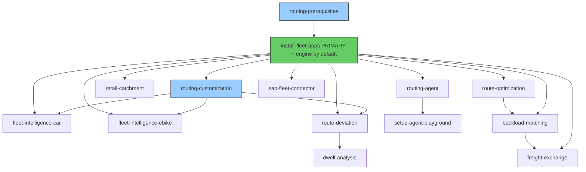

# AGENTS.md

Project-level guidance for AI coding assistants (Cortex Code, Cursor, Copilot, etc.) working in this repository.

## Repository Overview

Cortex Code skills that deploy routing, fleet intelligence, and geospatial analytics on Snowflake - powered by the OpenRouteService (ORS) App on Snowpark Container Services (SPCS).

Skills live in `.cortex/skills/`. Each is a self-contained deployment playbook an AI agent follows step-by-step.

## Architecture Tenets (synapse + Solution Accelerator)

**MANDATORY before evolving the SA app, synapse tool bundles, routing contract, or data-contract packs:** read [`TENETS.md`](TENETS.md). It codifies the load-bearing invariants of the agent-first analytics app (`feature/sa-synapse-app`) so future changes preserve swappability, role isolation, auditability, and reproducible deploys:

1. **Two swappable seams** - routing-engine seam (`ROUTING_PLATFORM.CONTRACT.*`) + data seam (data-contract packs). Consumers bind to neutral contracts, never a named engine or physical source.
2. **Best-of-both topology, one repo** - SA owns UI/agent/distribution; synapse owns the typed/audited tool layer; upstream SA + synapse repos are read-only references, everything vendored here.
3. **Role-scoped bundles = isolation** - User/Ops/Admin each get their own MCP server; the consumer agent attaches the User MCP only.
4. **Config-driven, not code-edited** - a domain swap requires zero TS edits; `app-config.json` is the single config surface, fleet literals are fallbacks only.
5. **Self-building, contract-bound data** - analytic layer rebuilt from raw sources, bit-for-bit verifiable; dashboards/SVs read the neutral `FLEET_APP` contract.
6. **Hybrid provisioning** - heavy substrate (graphs, image pipeline) stays in the control app; SA+synapse is the thin surface.
7. **Audited envelope** - every verb flows through the synapse envelope (`VERB_ATTEMPT` + idempotency); no direct unaudited tool calls.
8. **New-deployment-first** - fixes land in pack/config/synapse source so a fresh deploy is correct; live hotfix is always secondary.
9. **Live routing, not precomputed** - demo analytics that depend on drive-time reachability, catchments, matrices, or optimization MUST call the ORS functions (`OPENROUTESERVICE_APP.CORE.ISOCHRONES` / `MATRIX` / `MATRIX_TABULAR` / `OPTIMIZATION`) at interaction time, NOT read materialized/precomputed ORS results. Precomputing isochrone or matrix output into tables is an anti-pattern: it hides the routing engine (the thing being demoed), goes stale when the estate/region/params change, and diverges from what a customer would build. Config-driven views call ORS inline by resolving the interactive selection into scalar-subquery / bind args (ORS SQL functions only evaluate with literal, scalar-subquery, or bind args - NOT correlated per-row columns; `ISOCHRONES` range is in MINUTES). Guard with `COALESCE(:selection, <default>)` so nothing is called with a NULL arg, and remember every ORS call requires the region's service RESUMED (a suspended service returns an embedded error, not a throw). Precomputed **non-ORS** reference data (Overture POI subsets, address/household density, synthetic commercials) is fine - the rule is specifically about not caching ORS engine output.

See `TENETS.md` for each tenet's *how to apply* + the anti-pattern it prevents.

## Repository Structure

```
.cortex/skills/              # All Cortex Code skills
  ├── <skill-name>/
  │   ├── SKILL.md           # Skill definition (frontmatter + instructions)
  │   ├── references/        # Detailed SQL, code, docs (loaded on demand)
  │   └── assets/            # Notebooks and other deployable artifacts
  ├── evals/                 # Eval framework (trigger, quality, xref)
docs/                        # Documentation (dev/ and guides/)
archive/                     # Archived materials
```

## Build, Test, and Lint

```bash
# Run skill evals (trigger accuracy, quality checks, cross-ref validation)
python3 .cortex/skills/evals/run_evals.py

# Audit a single skill interactively
# Invoke the skill-optimiser skill in Cortex Code: "audit skill <name>"

# Validate ORS image tags match image-versions.env (also run by deploy.sh pre-flight)
bash .cortex/skills/install-fleet-apps/scripts/check_image_versions.sh

# Validate ORS services are running
snow sql -q "SHOW SERVICES IN DATABASE OPENROUTESERVICE_APP;"
```

**Optional pre-commit hook** (blocks commits when `image-versions.env`, service YAMLs, SQL modules, or scripting guidelines drift):

```bash
chmod +x .githooks/pre-commit
git config core.hooksPath .githooks
```

No global build/lint step - each skill is independently deployable via its own SKILL.md workflow.

## Skills Inventory

| Skill | Category | Purpose |
|-------|----------|---------|
| `install-fleet-apps` | infrastructure | **PRIMARY** and sole installer for the synapse-based, vehicle/industry-AGNOSTIC architecture: FLEET_SA_APP + FLEET_ADMIN_APP + synapse MCP bundles + FLEET_APP data contract + roles + agents + (by default; skip with `--no-engine`) the live ORS/VROOM routing engine. Self-owning: relocated artifacts, self-provisioned infra, static seed, and the engine build substrate (SQL modules + 4 engine images + build scripts). |
| `routing-prerequisites` | infrastructure | Checks local build prerequisites (Docker, Snow CLI) |
| `routing-customization` | configuration | Router with 3 subskills for ORS config changes |
| `route-optimization` | demo | VRP demo with Marketplace data + notebook |
| `fleet-intelligence-car` | fleet-intelligence | Taxi GPS telemetry generation + React dashboard |
| `fleet-intelligence-ebike` | fleet-intelligence | Food delivery courier telemetry + React app |
| `retail-catchment` | demo | Retail location analysis with isochrone catchment zones |
| `location-diagnostics` | demo | Region-agnostic retail site cannibalisation + closure modelling. A POI subset becomes the store estate (OWNED/CANDIDATE), Overture addresses are the household proxy, ORS drive-time bands drive the overlap and next-closest-store logic. Adds `FLEET_INTELLIGENCE.LOCATION` + `FLEET_APP.LOCATION` views + `SV_LOCATION` + Site Impact / Closure Impact app views. Commercials are synthetic proxies; extendable to first-party via Data Studio. |
| `route-deviation` | demo | Detour detection ETL pipeline + React dashboard |
| `dwell-analysis` | demo | 12-step Dynamic Table pipeline for dwell/congestion |
| `routing-agent` | advanced | Snowflake Intelligence agent wrapping ORS functions |
| `setup-agent-playground` | demo-setup | Uploads `agent-demos.json` so the Agent Playground shows catchment/delivery/network scenarios. The 3 demo tools now source live region-scoped Overture POIs (no static `DEMO_*` needed); the legacy static seed in `references/deploy-demo-data.sql` is deprecated/optional. `install-fleet-apps` already uploads `agent-demos.json` (step 4.6). |
| `skill-optimiser` | developer-tools | Audits and optimizes skills per Anthropic best practices |
| `routing-solution-cleanup` | developer-tools | Discovers and removes skill-created Snowflake objects via COMMENT tag |
| `backload-matching` | demo | DHL Freight backload VRP demo: solves trailer<->load assignment via OPENROUTESERVICE_APP.CORE.OPTIMIZATION, with internal-first priority and Cortex rationale |
| `freight-exchange` | demo | Dispatcher-grade marketplace cockpit (parallel page to Backload Matching). Browse + filter + map of synthesized freight offers per active preset, with trust-score (credit/KYC/blacklist) and market-rate (vs. weekly p25/p50/p75 USD/km RATE_INDEX dynamic table) badges. Powered by FLEET_INTELLIGENCE.MARKETPLACE projection views over per-preset SYNTHETIC_DATASETS.UNIFIED data. |
| `emergency-response` | demo | Single-page, multi-step evacuation-planning wizard. Step 1 colors a state's ZIP codes by FEMA NRI flood/wildfire risk; Step 2 seeds CareConnect PACE centers + Overture participant addresses sampled uniformly across the union of per-center drive-time isochrones (union drawn as a sanity overlay); Step 3 sets per-center vehicles/capacity + max trips per vehicle; Step 4 solves a capacitated multi-depot, multi-trip evacuation VRP (`OPTIMIZATION`, `pickup:[1]` jobs - each van expanded into up to maxTrips round trips) over participants at/above a chosen ZIP risk level, with a selectable trips list, numbered stop markers, and an overflow warning when the trip cap is exceeded. Fully client-driven via read-only `sfQuery`; risk = `V_ZIP_RISK` (NRI county risk joined to ZIP by county FIPS). States via `STATE_REGION_MAP` (CA/CO/PA). |
| `sap-fleet-connector` | infrastructure | Binds landed SAP (EAM/SD/TM) + fleet telematics into the existing `FLEET_APP` neutral contract and `SV_FLEET_OPS`, so the dashboards, Cortex agent, and Cortex Analyst run on a customer's real SAP data with zero edits above the contract. Semantic-binding only (SAP+telematics assumed already landed via Fivetran/SLT/Datasphere). Maps EQUI/IFLOT/IMRG/AUFK/QMEL/LIKP+telematics to the neutral entities via a mandatory configurable `ASSET_CROSSWALK` (`native_serial`/`vin_2hop`/`vin_external`/`marine` + `normalize_serial`), dedupes CDC-landed tables to current rows, and repoints the `FLEET_APP.UNIFIED_FLEET` source seam. Config-driven via `sap-mapping.yaml` (generic strategy-archetype profiles). Users can discover bindable tables from the app UI: the chat agent's `introspect_sap` verb (wrapping read-only `ROUTING_TOOLS.TOOL_SAP_INTROSPECT`) scans a database's `INFORMATION_SCHEMA` and lists the SAP fleet objects, CDC fingerprint, telematics columns, and a suggested join strategy (`scripts/mock_sap_seed.sql` provides a demo `MOCK_SAP`/`MOCK_TELEMATICS`). Maintenance pack (AUFK/QMEL/IMRG -> new `fact_maintenance`) and SAP write-back are later phases. |

## Skill Conventions (Quick Reference)

For the full rule set, read `.cortex/skills/skill-optimiser/SKILL.md` and its `references/` directory. That skill encodes all conventions from "The Complete Guide to Building Skills for Claude" (Anthropic, Jan 2026).

Key rules:
- Folder name: **kebab-case**, must match `name` in YAML frontmatter
- Main file: exactly `SKILL.md` (case-sensitive). No `README.md` inside skill folders.
- Description: under **1024 chars**, formula: `[What] + [When] + [Triggers] + [Do NOT use for]`
- Body: under **5,000 words**. Move detailed content to `references/`
- No XML angle brackets in frontmatter. No "claude" or "anthropic" in skill names.
- Cross-skill references use full relative paths from repo root:
  ```
  > Read and follow `.cortex/skills/routing-customization/SKILL.md`
  ```
- Subskills nest as child folders; parent SKILL.md acts as a router
- All skills use `metadata.author: Snowflake SIT-IS` and `metadata.version: 1.0.0`
- Deployment skills must include `depends_on` in frontmatter listing prerequisite skills
- Deployment skills must include a `## Configuration` table with parameterized defaults
- Deployment skills must include a `## Required Privileges` table (no ACCOUNTADMIN assumptions)
- Deployment skills must include a `## Cleanup` section with DROP statements

## Fix Discipline (new-deployment-first)

**MANDATORY:** Every bug fix or improvement MUST first land in the source artifacts that a fresh, from-scratch deployment consumes, so the next clean install is correct with no manual step. A live-environment hotfix is always secondary and is only valid once the same change exists in the repo source.

- **Data / SQL fixes** -> the skill SQL (`references/*.sql`), `datasets/load-seed-data.sql`, and/or the control app's `init.ts` boot path. NOT just an ad-hoc `snow sql` run against a live account.
- **App behavior fixes** (React/server) -> the source under `.cortex/skills/install-fleet-apps/fleet_admin_app/` or `fleet_sa_app/` PLUS an image-version bump (`image-versions.env` + service YAML + `references/snowflake-scripting-guidelines.md`, enforced by `check_image_versions.sh`). NOT just a redeploy of an unchanged image.
- **Config/pointer/seed fixes** -> seed them in the loader or the boot init (data-derived, not hardcoded), so a fresh install never depends on a demo skill or a restart to become correct.

Before considering any fix done, reason through the fresh-install path (`install-fleet-apps` orchestrator layers 0-8, with the routing engine built by default unless `--no-engine`): "does a brand-new deploy of this repo already include this fix without manual intervention?" If not, fix the source first, then (optionally) apply the same change to the live install. When both are needed, do the repo source edit BEFORE the live hotfix.

## Error Logging

When any step fails or produces unexpected results (SQL errors, missing objects, wrong row counts, service failures, deployment issues), log the issue to `logs/` following the format in `logs/README.md`. Create one log file per execution: `<skill-name>_{YYYY-MM-DD}_{HH-MM}.md`. Continue execution where possible, logging all issues encountered. If execution completes with no issues, do not create a log file.

## Commit Discipline

**MANDATORY:** After each logical change is completed and verified, create a new git commit on the user's single shared branch AND push it immediately. Do not batch unrelated changes into a single commit, and do not leave commits unpushed at the end of a turn.

### Branching Rules (NON-NEGOTIABLE)
- **NEVER commit directly to `main`.** `main` is protected - changes only land via merged PRs from `dev`.
- **NEVER commit directly to `dev`.** `dev` is the integration branch - changes only land via merged PRs from per-user branches.
- **All work happens on ONE long-lived branch per user per feature, named `feat/<GITHUB_LOGIN>-<feat-name>`** (e.g. `feat/sfc-gh-obielov-sa-synapse-app`). The GitHub login MUST be detected dynamically at the start of every session - never hardcoded. `<feat-name>` is a short kebab-case feature topic chosen once for the branch.
  ```bash
  GITHUB_LOGIN=$(gh api user --jq .login)
  FEAT_NAME="sa-synapse-app"   # short kebab-case feature topic for this branch
  USER_BRANCH="feat/${GITHUB_LOGIN}-${FEAT_NAME}"
  ```
  Example: for login `sfc-gh-obielov` and feature `sa-synapse-app` the branch is `feat/sfc-gh-obielov-sa-synapse-app`.
  The feature branch is shared by all parallel Cortex Code chats working on the same feature on the user's machine, so no branch switching is needed mid-feature.
- **Do NOT create per-change branches.** No `<username>/work`, no `<username>/<topic>`, no `fix/*` / `docs/*` per-change branches. One feature, one branch (per user). Multiple parallel chats working on the same feature share one working tree and must all commit to that feature branch - separate per-change branches cause constant `git checkout` thrashing and lost work.
- **All PRs target `dev`** (not `main`). Only release/promotion PRs go from `dev` → `main`, and those are opened by humans, not assistants.
- Before starting work, detect the user branch and verify you are on it:
  ```bash
  GITHUB_LOGIN=$(gh api user --jq .login)
  FEAT_NAME="sa-synapse-app"   # short kebab-case feature topic for this branch
  USER_BRANCH="feat/${GITHUB_LOGIN}-${FEAT_NAME}"
  CURRENT=$(git branch --show-current)
  if [ "$CURRENT" != "$USER_BRANCH" ]; then
    git checkout "$USER_BRANCH" 2>/dev/null || git checkout -b "$USER_BRANCH"
  fi
  ```
  If `gh` is not authenticated, stop and ask the user to run `gh auth login` - never fall back to a hardcoded branch name.
- After EVERY commit, push the branch immediately. Do not leave local commits unpushed:
  ```bash
  git push -u origin "$USER_BRANCH"
  ```
- Open / update a single PR into `dev` for the branch when there is reviewable work:
  ```bash
  gh pr create --base dev --head "$USER_BRANCH" --title "..." --body "..."
  ```
- A PR may include several commits from the branch. Keep PRs scoped to one logical theme - open a new PR rather than piling unrelated commits into one.

### Commit Rules
- One commit per logical change (one skill edit, one bug fix, one doc update, one refactor)
- Commits land on `$USER_BRANCH` (i.e. `feat/<GITHUB_LOGIN>-<feat-name>`). Never on a fresh per-change branch.
- After every commit, run `git push origin "$USER_BRANCH"` immediately. A change is not "done" until it is pushed to remote.
  - **CRITICAL: Plain `git push` will fail with SSH permission denied.** Before your first push in a session, ALWAYS read `/memories/git-push-method.md` for the working command (uses `gh auth token` + `GIT_CONFIG_GLOBAL=/dev/null` to bypass the global SSH `insteadOf` rule). Do NOT attempt `git push origin <branch>` directly - it always fails for this repo.
- Verify the change works (SQL compiles, skill evals pass, notebook runs) BEFORE committing
- Stage only files related to the current change - never use blanket `git add .` if unrelated edits exist
- Commit message format: `<type>(<scope>): <subject>` where type is one of `feat`, `fix`, `docs`, `refactor`, `chore`, `test`
  - Examples:
    - `feat(fleet-intelligence-car): add H3 resolution config parameter`
    - `fix(install-fleet-apps): handle ARM Mac esbuild segfault`
    - `docs(AGENTS.md): add commit discipline rule`
- If a change spans multiple skills, prefer multiple smaller commits over one large one
- Never amend or force-push commits the user has not explicitly authorized
- Never push directly to `main` or `dev` - push only to `$USER_BRANCH` (`feat/<GITHUB_LOGIN>-<feat-name>`)

### Deploy → Commit Immediately (preserve history, avoid overwrites)
**MANDATORY: a deploy is not "done" until the source it was built from is committed AND pushed.** As soon as a build/deploy succeeds (SPCS image push + `ALTER SERVICE`, app redeploy, or any artifact that ships edited source), commit and push the exact source that produced it - before any further iteration, and never at "end of turn only."

Why this is non-negotiable here:
- The per-user branch is ONE shared working tree used by multiple parallel Cortex Code chats AND by the human via GitHub Desktop. An external **"Discard changes"** (or another chat's `git checkout`) can silently revert your uncommitted edits to the HEAD baseline **even though those edits are already live in SPCS** - leaving the repo and the running app out of sync and the work apparently lost.
- Tag-bump deploys (`image-versions.env` + the service YAML) only make sense paired with the source change in the same commit; committing the source promptly keeps the deployed image tag and the source in lockstep.

Rules:
- After a successful deploy, run the verified-and-tested change through the normal commit+push flow right away (one logical commit, pushed to `$USER_BRANCH`).
- Do NOT keep deploying newer image tags on top of still-uncommitted source - every deployed tag should correspond to a pushed commit.
- If you discover deployed-but-uncommitted source has been reverted on disk, you can usually recover it: the last local `.next/server/chunks/*.js` from the build (minified, not clean source) plus the conversation edit history let you reconstruct the file; then `tsc`/build to verify and cross-check distinctive strings against the built bundle to confirm parity with what is deployed, and commit immediately.

## Friction Logging

**MANDATORY:** After every `install-fleet-apps` execution (which builds the engine by default, regardless of success or failure), generate a friction log in `logs/`. This is NOT optional - every run produces a friction log, even if everything went smoothly.

File name: `friction-log_{YYYY-MM-DD}_{HH-MM}.md`

Follow the friction log template in `logs/README.md`. The log must capture:
- Exact wall-clock duration of each step
- Any friction points (confusing instructions, slow operations, unexpected behavior)
- **For each friction point:** what was done to resolve it during this run, and a recommendation for how to prevent it in future runs (e.g., skill wording change, new validation step, default change)
- A step-by-step status table showing OK/FAILED/SKIPPED for each workflow step
- Final summary with total execution time and overall outcome

If no friction was encountered, the log should still be created with "No friction points" and the step timing table.

## Creating a New Skill

1. Create folder: `.cortex/skills/my-new-skill/`
2. Create `SKILL.md` with YAML frontmatter + body (use `skill-optimiser` for the template)
3. Add `references/` for detailed SQL/code if body would exceed 5,000 words
4. Add `assets/` for notebooks or other deployable artifacts
5. Audit: invoke `skill-optimiser` or run `python3 .cortex/skills/evals/run_evals.py`
6. Update the Skills Inventory table above

## Do NOT

- **Use em dashes or en dashes (the wide Unicode dashes) in ANY text - including your chat/conversational replies to the user** - write plain ASCII hyphens (-) only. This applies to EVERYTHING you produce: your chat responses in the assistant panel, plan text, todo items, commit/PR messages, AND file content (docs, SKILL.md prose, code comments, string literals, friction/error logs). There is NO exception for conversational output - the ban is total. Never paste the wide Unicode dash characters; use a normal hyphen (or reword with a comma/colon/parentheses). This ALSO covers the JSON/JS escaped forms `\u2014` (em) and `\u2013` (en) - e.g. in `app-views.json` / `app-config.json` descriptions - since they decode to the wide dash at runtime; replace those escapes with a plain hyphen too. When auditing for dashes, scan for BOTH the literal codepoints (U+2013/U+2014) AND the `\u2013`/`\u2014` escape sequences.
- **Inline large SQL blocks in SKILL.md** - put them in `references/*.md` and link
- **Modify a `FLEET_INTELLIGENCE.ROUTE_OPTIMIZATION.*` (or any other shared) view in `references/asset-velocity-views.sql` (or its sibling `*.sql` under `references/`) without also updating its parallel definition in `.cortex/skills/install-fleet-apps/fleet_admin_app/ui/src/server/lib/init.ts`.** The control app's `init.ts` runs on every container start and `CREATE OR REPLACE`s the views it owns, silently overwriting any out-of-band changes. If a page references a column that `init.ts` hasn't recreated, the query fails and the page renders empty data with no obvious failure. When in doubt, search `init.ts` for the view name before changing a reference SQL file. **The Asset Velocity views specifically live in the `assetVelocityStmts()` helper consumed by the exported `ensureAssetVelocityViews()` in `init.ts` - that function is the single runtime owner (called both at boot and lazily by `POST /api/asset-velocity/ensure`). Edit `assetVelocityStmts()` and keep `references/asset-velocity-views.sql` in sync.**
- **Inline JSON in SQL via single-quoted string literals.** Free-text fields (POI names, addresses, listing text) routinely contain apostrophes, backslashes, and double-quotes that break Snowflake's `PARSE_JSON` once the host string is single-quoted. Emit such payloads as a dollar-quoted (`$$...$$`) literal instead, and make the call throw on error whenever it sits behind a user-visible button - silent `[]` returns are the canonical mask for this entire bug class.
- **Skip the query tag** - every skill must set the session query tag for attribution tracking:
  ```sql
  ALTER SESSION SET query_tag = '{"origin":"sf_sit-is-fleet","name":"oss-<skill-name>","version":{"major":1,"minor":0},"attributes":{"is_quickstart":1,"source":"sql"}}';
  ```
- **Skip the object COMMENT** - every CREATE statement must include a COMMENT tracking tag (or `ALTER ... SET COMMENT` for CTAS):
  ```sql
  COMMENT = '{"origin":"sf_sit-is-fleet","name":"oss-<skill-name>","version":{"major":1,"minor":0},"attributes":{"is_quickstart":1,"source":"<sql|notebook|app>"}}';
  ```
- **Assume ORS is running** - always verify with `SHOW SERVICES IN DATABASE OPENROUTESERVICE_APP;` (all 5 services must be RUNNING)
- **Precompute / materialize ORS output for demos** - do NOT cache isochrone polygons, travel-time matrices, or optimization results into tables and read them back in a view. Call `ISOCHRONES` / `MATRIX` / `MATRIX_TABULAR` / `OPTIMIZATION` live at interaction time (see Architecture Tenet 9). Precomputing non-ORS reference data (POI subsets, address/household density, synthetic facts) is fine.
- **Hardcode city/region** - skills must be configurable via parameters, not baked-in coordinates
- **Add README.md inside skill folders** - all docs go in SKILL.md or `references/`
- **Duplicate conventions** - point to `skill-optimiser` references instead of repeating rules
- **Require ACCOUNTADMIN** - document minimum privileges in `## Required Privileges`; never assume ACCOUNTADMIN
- **Skip cleanup instructions** - every deployment skill must have a `## Cleanup` section with DROP statements
- **Skip committing AND pushing after a completed change** - every verified change must result in a commit AND a push to `feat/<GITHUB_LOGIN>-<feat-name>` before the turn ends (see `## Commit Discipline`)
- **Commit directly to `main` or `dev`** - both are protected. All work goes on `feat/<GITHUB_LOGIN>-<feat-name>` with PRs targeting `dev`. Only humans promote `dev` → `main`.
- **Hardcode the user branch name** - always derive the login from `gh api user --jq .login` at session start. Do not paste a literal branch like `feat/sfc-gh-obielov-sa-synapse-app` into AGENTS.md, skill files, or scripts.
- **Create a new branch per change** - there is one branch per user per feature (`feat/<GITHUB_LOGIN>-<feat-name>`). No `<username>/work`, no `<username>/<topic>`, no `fix/*` / `docs/*` per-change branches. Multiple Cortex Code chats running in parallel against the same working tree must all commit to the same feature branch.
- **Create any Snowflake object or run any query without tracking tags** - this is a hard requirement with no exceptions. Every new Snowflake object (TABLE, VIEW, PROCEDURE, FUNCTION, STAGE, SCHEMA, DATABASE, WAREHOUSE, TASK, DYNAMIC TABLE, STREAMLIT, SERVICE, AGENT) MUST have a COMMENT tracking tag. Every SQL session MUST set `query_tag` before executing statements. This applies to all skills, notebooks, stored procedures, dynamic SQL inside procedure bodies, ORS control app server code, and any other code path that creates objects or runs queries. For objects created via CTAS or dynamic SQL, use `ALTER ... SET COMMENT` immediately after creation. For service functions (`SERVICE=...` clause) that do not support COMMENT, document the limitation and ensure the parent procedure has a COMMENT tag.

## Skill Dependency Graph


```mermaid
graph TD
    RP[routing-prerequisites] --> IFA[install-fleet-apps PRIMARY + engine by default]
    IFA --> RC[routing-customization]
    IFA --> RO[route-optimization]
    IFA --> FIT[fleet-intelligence-car]
    IFA --> FIFD[fleet-intelligence-ebike]
    IFA --> RET[retail-catchment]
    IFA --> RD[route-deviation]
    IFA --> RA[routing-agent]
    RA --> SAP[setup-agent-playground]
    RO --> BM[backload-matching]
    IFA --> BM
    BM --> FX[freight-exchange]
    IFA --> FX
    RC --> FIT
    RC --> FIFD
    RC --> RD
 RD --> DA[dwell-analysis]
    IFA --> SFC[sap-fleet-connector]

 style IFA fill:#6c6,stroke:#333
 style RP fill:#9cf,stroke:#333
 style RC fill:#9cf,stroke:#333
```

**Legend:** Green = primary + sole installer (owns the analytics stack AND the ORS engine build, on by default; skip with `--no-engine`). Blue = configuration/prerequisites. White = legacy demo/feature skills.

`install-fleet-apps` is the single infrastructure skill: it self-provisions infra/data, builds + provisions the live ORS engine by default (skip with `--no-engine`), and owns the FLEET_APP data contract. The legacy per-vehicle/vertical demo skills (taxis, food-delivery, retail-catchment, backload, freight-exchange) now depend on `install-fleet-apps` and are NOT part of the agnostic installer.

## Common Patterns

- **ORS dependency**: most demo skills require 4 running ORS services. Use `routing-prerequisites` to verify.
- **Synapse verb procs need `IDEMPOTENCY_KEY ... DEFAULT NULL` + agents must be recreated after any bundle redeploy**: The Cortex Agent MCP server calls each verb with NAMED args and omits the optional `idempotency_key`, so the trailing proc arg MUST have `DEFAULT NULL` (emitted by `fleet_tools/vendor/synapse/dist/build/ddl.js`); without it Snowflake raises "named arguments [...] do not match any signature" before the body runs and the agent reports a generic "Error parsing response" with NO `VERB_ATTEMPT` row. Separately, `npx synapse deploy` does `CREATE OR REPLACE MCP SERVER`, so any `install_synapse_bundles.sh` run (even out-of-band) MUST be followed by `create_agents.sh <connection>` - agents bind to the MCP server at creation time and go stale when it is replaced. Invariant: every agent `created_on` > its MCP server `created_on`. Full detail in `.cortex/skills/install-fleet-apps/references/synapse-bundles.md`.
- **DIM_DATASETS bootstrap invariant (friction-log F4 fix, v1.1.58)**: `init.ts` MUST call `ensureUnifiedTables()` (from `server/studio/ensure-tables.ts`) BEFORE any `CREATE OR REPLACE VIEW SYNTHETIC_DATASETS.UNIFIED.V_*_CURRENT` statement. The `V_*_CURRENT` views JOIN to `FLEET_INTELLIGENCE.CORE.DIM_DATASETS`, which is created by `ensureUnifiedTables`. On a fresh install no Studio job has ever run, so without the explicit ensure-tables call at boot start the views fail with "object does not exist" and every demo that reads through them silently breaks. Symmetrically: any SQL that ALTERs `SYNTHETIC_DATASETS.UNIFIED.DIM_FLEET` (e.g. `extend-dim-fleet-hgv.sql`) MUST `DROP VIEW IF EXISTS V_DIM_FLEET_CURRENT` first, otherwise `ADD COLUMN` invalidates the view's declared column count and the next boot fails until the view is dropped manually.
- **Agent Playground region awareness**: The control-app's Agent Playground sends `region`, `vehicle_type`, and the derived ORS `profile` on every `/api/agent/chat` call. The backend prepends a hidden context turn so the Cortex Agent defaults tool args to the active region/profile, and uses the same values as the local geometry-recovery re-execution defaults (no more hard-coded `California` / `driving-car`). Example chips are generated live by `GET /api/agent/examples` via `SNOWFLAKE.CORTEX.COMPLETE` per (region, vehicle); fallback is `config/agent-demos.json` on `ORS_SPCS_STAGE`. No caching - regenerated on every selection change (300 ms debounce).
- **Overture Maps POI data**: fleet skills use Overture Maps for realistic locations. Fallback: synthetic points within configured bounding boxes.
- **ORS Control App deployment**: Edit source → `docker build` (multi-stage, no manual dist/ step) → `docker push` → update YAML version → `snow stage copy` spec to stage → `ALTER SERVICE FROM @stage SPECIFICATION_FILE=...`.
- **Object tracking**: Two tracking mechanisms - session `query_tag` (tracks queries) and object `COMMENT` (tracks created objects). Both are required. For CTAS (`CREATE TABLE ... AS SELECT`), use `ALTER TABLE ... SET COMMENT` after creation since CTAS doesn't support inline COMMENT.
- **REBUILD_GRAPHS management (Issue #59)**: Routing graphs are persisted on `@ORS_GRAPHS_SPCS_STAGE/<region>/` and MUST be reused across suspend/resume cycles. The `create_region_ors_service` proc probes the stage and sets `REBUILD_GRAPHS="false"` if graphs already exist. After first-time provisioning completes (`service_ready=true`), `PROVISION_REGION_WRAPPER` auto-calls `SET_REBUILD_GRAPHS_FLAG(region, 'false')` so the next resume is instant (~1-2 min). For forced rebuilds (PBF update / corruption), call `REBUILD_REGION_GRAPHS(region)`.
- **Parallel graph load on resume**: `ors-config.yml` for every region sets `ors.engine.init_threads` via `WRITE_ORS_CONFIG` to `min(N_profiles, cap)` where cap is **2** for `S`, **4** for `L`, **8** for `XXL` (S-tier 2G heap OOMs above 2 parallel profile loads). Effective on the next suspend/resume cycle after the staged config is re-written (`REROLL_ORS_CONFIG_INIT_THREADS` on deploy, or any provision/re-provision).
- **Per-region VROOM (multi-region OPTIMIZATION)**: Each provisioned region gets its own `VROOM_SERVICE_<REGION>` co-located in `ORS_POOL_<REGION>` (same compute pool as the region's ORS). The VROOM image (`vroom-docker:v1.0.4`) reads `ORS_HOST` from env and substitutes it into `/conf/config.yml` at startup, so the same image serves any region without rebuild. `BUILD_VROOM_SERVICE_SPEC(region)` + `create_region_vroom_service(region)` mirror the ORS pattern; `PROVISION_REGION_WRAPPER` calls `create_region_vroom_service` after the ORS service is up. The routing gateway's `resolve_vroom_host(region)` returns `vroom-service-<region>` and routes `/optimization` there, so VROOM's internal ORS calls land on the right regional graph. To add a new region, no code change is needed - the existing provisioning flow auto-deploys the per-region VROOM. Drop with `drop_region_vroom(region)` (also called by `drop_region_ors`). **v1.1.0 unification**: there is NO global `ORS_SERVICE`/`VROOM_SERVICE` anymore - even the default region (`SanFrancisco`) is served by `ORS_SERVICE_SANFRANCISCO` + `VROOM_SERVICE_SANFRANCISCO` in `ORS_POOL_SANFRANCISCO`. The gateway resolves a missing/NULL `region` to the env var `DEFAULT_REGION_NAME` (default: `SanFrancisco`) so callers may still omit the argument; both omitted and explicit-region paths land on the same per-region service. Passing `region` is recommended in all multi-region payloads to be self-documenting and to avoid relying on the DEFAULT_REGION_NAME setting. The `_OPTIMIZATION_TABULAR_RAW(jobs, vehicles, matrices, region)` form requires region as the 4th arg (do not pass `NULL`). VROOM's `config.yml` body-parser limit is set to `50mb` to fit pre-computed matrices for VRPs up to ~1000 locations.
- **AUTO_SUSPEND_SECS invariant (per-stage contract)**: Only services *strictly involved in the active build* are pinned at `AUTO_SUSPEND_SECS=0`. Every other service stays at the steady-state default. Active build = a row in `REGION_PROVISION_JOBS` with `STATUS IN ('PENDING','RUNNING')` at a specific `STAGE`, OR a row in `MATRIX_BUILD_JOBS` with `STATUS IN ('PENDING','RUNNING')` and `STAGE NOT IN ('COMPLETE','ERROR')`, OR a row in `FLEET_INTELLIGENCE.CORE.GENERATION_JOBS` with `STATUS IN ('PENDING','RUNNING')` (Data Studio synthetic-generation job). The contract:
  - `STAGE = 'DOWNLOADING'` → pin `DOWNLOADER`, `ORS_SERVICE_<REGION>`, and `ORS_POOL_<REGION>` to 0.
  - `STAGE IN ('CONFIGURING','STARTING_SERVICE','WAITING_FOR_SERVICE','BUILDING_GRAPH')` → pin `ORS_SERVICE_<REGION>` and `ORS_POOL_<REGION>` to 0; `DOWNLOADER` returns to 14400 (the PBF is already on stage).
  - Matrix job `STATUS IN ('PENDING','RUNNING')` → pin `routing_gateway_service`, `ORS_SERVICE_<REGION>`, `VROOM_SERVICE_<REGION>`, and `ORS_POOL_<REGION>` to 0.
  - Studio (Data Studio) generation job `STATUS IN ('PENDING','RUNNING')` → pin `routing_gateway_service`, `ORS_SERVICE_<REGION>`, `VROOM_SERVICE_<REGION>`, and `ORS_POOL_<REGION>` to 0. The control-app's `captureAndScaleUp()` performs this pinning in-process at job start and `scaleDown()` restores the captured baselines on every exit. `RECONCILE_AUTO_SUSPEND()` is the global safety net for the case where the control-app container restarts mid-run.
  - All other times → services = `14400` (4h), per-region pools = `3600` (1h). `OPENROUTERSERVICE_APP_COMPUTE_POOL` is unrelated to this invariant (its default is `600`).
  - The fleet control apps (`FLEET_SA_APP`, `FLEET_ADMIN_APP`) have public endpoints and therefore no `AUTO_SUSPEND_SECS` - they are excluded.
  - Every procedure that flips a value to `0` is responsible for restoring its default on ALL exits (happy path, timeout, early return, exception).
  - The idempotent safety net `OPENROUTESERVICE_APP.CORE.RECONCILE_AUTO_SUSPEND()` is the single source of truth and now reconciles `routing_gateway_service`, `ORS_SERVICE_%`, `VROOM_SERVICE_%`, `DOWNLOADER`, and `ORS_POOL_%` against `REGION_PROVISION_JOBS`, `MATRIX_BUILD_JOBS`, AND `FLEET_INTELLIGENCE.CORE.GENERATION_JOBS`. Auto-called by `SUSPEND_ALL_SERVICES` and `SUSPEND_SERVICE`; safe to call at any time.
- **v1.1.4 default-sentinel retirement**: The legacy `region:'default'` sentinel returned by `/api/regions/provisioned` was retired. `LIST_REGIONS()` now returns SanFrancisco as a regular row in `REGION_ORS_MAP` (with new `IS_DEFAULT BOOLEAN` column, seeded `TRUE` for the canonical default). The control-app server no longer synthesizes a `region:'default'` entry, no longer makes 0-arg `ORS_STATUS()` calls, and no longer special-cases `'default'` in studio job pool scaling, ors-readiness, or stage probing. The `isDefault` boolean is preserved as a pure UI hint (dropdown auto-selection + "(Default)" badge) but is decoupled from SQL routing. Inbound API requests passing `'default'` or empty region are still resolved at the gateway boundary via `normalizeRegion()` -> `DEFAULT_REGION_NAME`, but internal contracts assume real region keys.
- **Dataset versioning (Studio runs are non-destructive)**: Each Data Studio run is recorded as an immutable dataset in `FLEET_INTELLIGENCE.CORE.DIM_DATASETS` keyed by `JOB_ID`. At most ONE row per `(REGION, VEHICLE_TYPE)` has `IS_ACTIVE = TRUE`. Re-running Studio for the same `(REGION, VEHICLE_TYPE)` does NOT delete prior `DIM_*` / `FACT_OFFERS` / `DIM_PARTNERS` / `FACT_PARTNER_HISTORY` rows - the prior `DIM_DATASETS` row is just flipped to `IS_ACTIVE = FALSE` and a new row is inserted as active (`archivePriorDatasets()` in `server/studio/jobs.ts`). All downstream consumers MUST read from dataset-scoped projection views and never from base tables directly: `SYNTHETIC_DATASETS.UNIFIED.V_DIM_FLEET_CURRENT`, `V_DIM_POIS_CURRENT`, `V_FACT_OFFERS_CURRENT`, `V_DIM_PARTNERS_CURRENT`, `V_FACT_PARTNER_HISTORY_CURRENT`, `V_FACT_TRIPS_CURRENT`, `V_FACT_VEHICLE_TELEMETRY_CURRENT`, `V_DIM_TRIP_SCHEDULE_CURRENT`, plus app-scoped `FLEET_INTELLIGENCE.ROUTE_OPTIMIZATION.V_PLACES_CURRENT` and `FLEET_INTELLIGENCE.MARKETPLACE.V_FACT_OFFER_ROUTES_CURRENT`. Intentional exceptions that still read from base tables: `RATE_INDEX` dynamic table (market-rate signal across all data), `region-sync.ts` / `regions/lifecycle.ts` (telemetry hull derivation wants full spatial coverage). Old datasets are deleted only via the explicit `DELETE /api/studio/datasets/:id` endpoint (Studio Datasets panel "Delete" button) - there is NO auto-prune. The legacy destructive `clearRegionScope()` helper is retained but is now invoked only from this endpoint, never from a generation run. On a `FAILED` run that produced 0 rows, `revertArchivePriorDatasets()` removes the new `DIM_DATASETS` row and re-activates the most recent prior dataset, so a failed empty run never replaces the active one. The Studio Datasets panel UI lists every dataset with row counts and per-row Activate / Rename / Delete buttons; Delete is refused with HTTP 409 if the target is the only dataset in its scope.

## Geospatial Conventions

### Prefer Boundary Polygons over Bounding Boxes

Whenever a region's polygon is available - and it almost always is, because `OPENROUTESERVICE_APP.CORE.REGION_CATALOG.BOUNDARY` is baked for every provisioned region (Geofabrik poly, bbbike bbox, or fallback) - filter spatial data with the polygon, not the bbox. Bbox over-includes ocean, neighbouring states, and even neighbouring countries (e.g. a Germany bbox grabs Czechia, Switzerland, Austria, the North Sea).

| Use case | Bbox (avoid) | Boundary (preferred) |
|---|---|---|
| Filter rows in a region | `LON BETWEEN ... AND LAT BETWEEN ...` | `ST_WITHIN(geog, rc.BOUNDARY)` |
| Map recenter | midpoint of `MIN_LON/MAX_LON, MIN_LAT/MAX_LAT` | `BOUNDARY_CENTROID_LON/LAT` from `/api/regions` |
| Region picker enrich | `REGION_ORS_MAP.MIN_LAT/MAX_LAT/...` | `REGION_CATALOG.BOUNDARY` joined via `LOOKUP_NAME` / `REGION_KEY` |
| Live POI / address query | bbox SET vars at ingest | `JOIN REGION_CATALOG ON ST_WITHIN` at query time |

Standard join pattern (use this verbatim across SQL and React queries):
```sql
JOIN OPENROUTESERVICE_APP.CORE.REGION_CATALOG rc
  ON rc.BOUNDARY IS NOT NULL
 AND (UPPER(rc.LOOKUP_NAME) = UPPER('<region>')
      OR UPPER(rc.REGION_KEY) = UPPER('<region>'))
WHERE ST_WITHIN(<your_geog_col>, rc.BOUNDARY)
```

In React components, prefer the resolved ORS key (the one that successfully answered `ORS_STATUS`) as the `<region>` literal in the join. Do NOT serialize `BOUNDARY_GEOJSON` into the query - it is large (multi-MB for country-sized polygons) and the join keeps the polygon server-side.

Bbox is acceptable ONLY when:
- The boundary doesn't yet exist (e.g. brand new user-added region not yet in `REGION_CATALOG`).
- The downstream API requires bbox literals (Geofabrik PBF download URL builder, ORS provisioning input).
- A `CLUSTER BY` expression is required (GEOGRAPHY isn't allowed in `CLUSTER BY`).
- Performance probing where a cheap bbox prefilter is layered ahead of `ST_WITHIN` - but the `ST_WITHIN` MUST still be present as the authoritative filter.

For SQL pipelines that pre-filter at ingest time, prefer
`ST_WITHIN(geom, (SELECT BOUNDARY FROM OPENROUTESERVICE_APP.CORE.REGION_CATALOG WHERE UPPER(LOOKUP_NAME)=UPPER('<region>') OR UPPER(REGION_KEY)=UPPER('<region>') LIMIT 1))`
over the legacy `SET BBOX_*` pattern when the polygon exists.

### GEOGRAPHY-First Schema Design
- Store point locations as `GEOGRAPHY` columns (not separate FLOAT lat/lon).
- Construct via `ST_MAKEPOINT(longitude, latitude)` - note: **longitude first**.
- Line/polygon geometries: use `TO_GEOGRAPHY('LINESTRING(lon lat, ...)')` or `ST_MAKELINE`.
- Keep redundant FLOAT lat/lon only when required (CLUSTER BY, ORS ARRAY_CONSTRUCT API args, bounding-box configs).

### Preferred Functions
| Instead of | Use |
|---|---|
| `H3_LATLNG_TO_CELL(lat, lon, res)` | `H3_POINT_TO_CELL_STRING(geography, res)` |
| `HAVERSINE(lat1, lon1, lat2, lon2)` (returns km) | `ST_DISTANCE(geog_a, geog_b) / 1000` (meters→km) |
| `ST_DISTANCE` + filter | `ST_DWITHIN(geog_a, geog_b, meters)` (uses spatial index) |
| Separate FLOAT lat/lon in WHERE | `ST_WITHIN`, `ST_INTERSECTS`, `ST_CONTAINS` |

### H3 Index Storage
- Always store H3 indices as `VARCHAR` (string format, e.g. `'8928308280fffff'`).
- Use `H3_POINT_TO_CELL_STRING` (returns VARCHAR directly) - not `H3_LATLNG_TO_CELL` which returns NUMBER.
- Never cast H3 between NUMBER and STRING at query time - store as string from the start.

### Loading GEOGRAPHY Data
- **COPY INTO with transform**: use `ST_MAKEPOINT($col_lon, $col_lat)` or `TO_GEOGRAPHY($col_wkb)` in the SELECT.
- **INSERT via SELECT…UNION ALL**: compute `ST_MAKEPOINT(lon, lat)` inline (VALUES clauses cannot contain function calls).
- `MATCH_BY_COLUMN_NAME` cannot be used when adding computed columns - switch to explicit transform SELECT.

### Direct GEOGRAPHY Column References
All tables are created with GEOGRAPHY columns from the start. Reference them directly:
```sql
t.POINT_GEOM    -- telemetry point
t.ORIGIN        -- trip origin
t.DESTINATION   -- trip destination
```

### deck.gl Layer Selection
| Layer | Data format | Extraction |
|---|---|---|
| `ScatterplotLayer` | `[lng, lat]` array | `ST_X(geog)` / `ST_Y(geog)` in SQL |
| `H3HexagonLayer` | H3 string index | `H3_POINT_TO_CELL_STRING(geog, res)` in SQL |
| `GeoJsonLayer` | GeoJSON string | `ST_ASGEOJSON(geog)::STRING` in SQL |
| `PathLayer` | coordinate array | `ST_ASGEOJSON(geog)` → parse coords client-side |

### When FLOAT lat/lon is Acceptable
- ORS function arguments (`ARRAY_CONSTRUCT` of numeric coords for DIRECTIONS/MATRIX)
- Bounding-box configs (REGION_REGISTRY, city provisioner)
- `CLUSTER BY` expressions (GEOGRAPHY not supported in CLUSTER BY)
- Direct deck.gl `getPosition` callbacks expecting `[Number, Number]`

## Documentation

- `docs/guides/QUICKSTART.md` - End-to-end deployment quickstart
- `docs/dev/server-architecture.md` - One-page map of the fleet control-app server modules (`ui/src/server/{lib,studio}/`) and decision tree for "where do I add X?"
- `docs/README.md` - Full index
