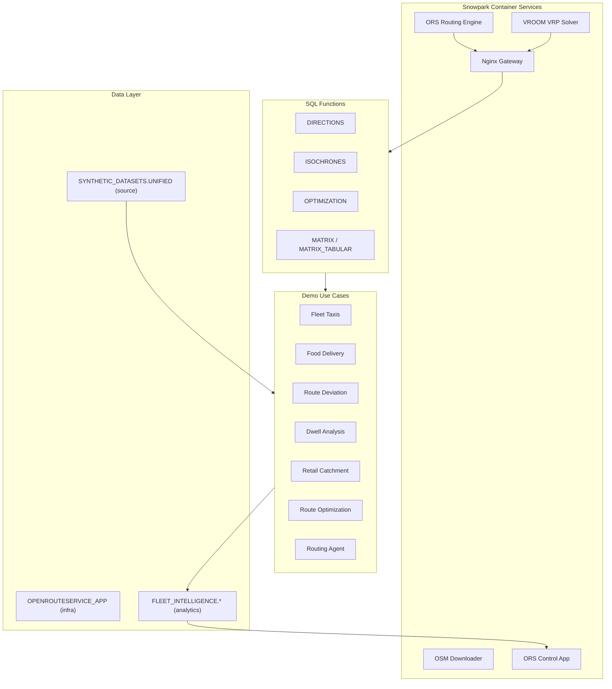
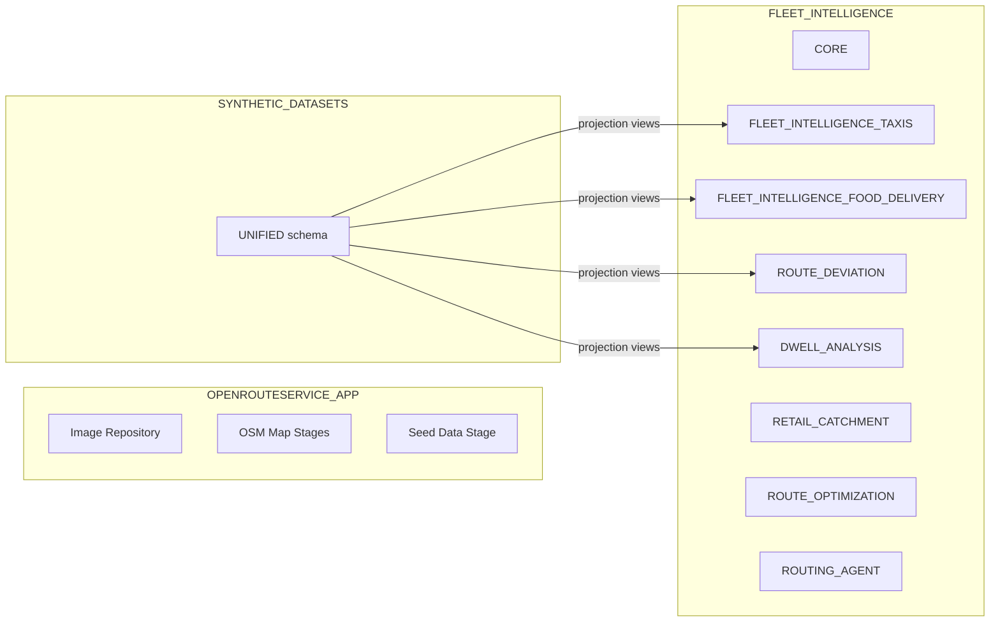
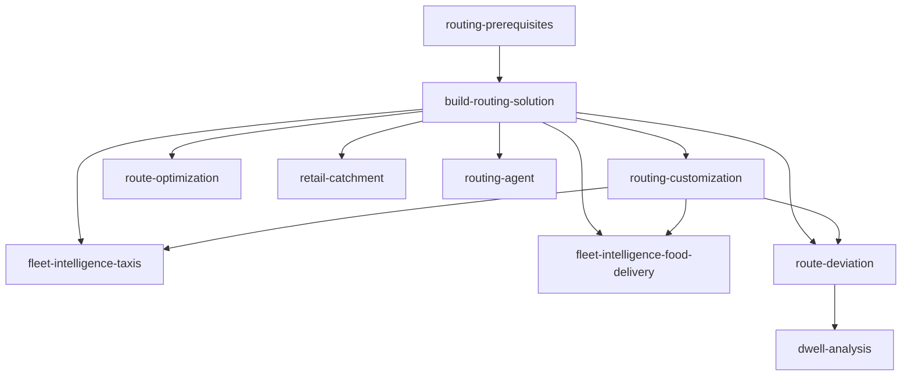

# Route Optimisation and Fleet Intelligence on Snowflake

**Click the button below to get access to the full Snowflake Guide:**

[](https://www.snowflake.com/en/developers/guides/oss-install-openrouteservice-native-app/)


[OpenRouteService](https://openrouteservice.org/) routing engine running inside Snowflake on Snowpark Container Services (SPCS), with ready-to-deploy demo use cases for fleet intelligence, route optimization, and retail analytics.

Deploy and extend the solution using [Cortex Code](https://docs.snowflake.com/en/user-guide/cortex-code) skills -- each skill is a self-contained playbook the AI agent follows step-by-step.

## Quick Start

1. Open this repository in Cortex Code
2. Say **"check build prerequisites"** to verify your environment
3. Say **"build routing solution"** to deploy the routing engine
4. Say **"deploy route optimization demo"** (or any other demo) to add use cases

## What You Get

### SPCS Services

Five container services run inside your Snowflake account:

| Service | Purpose |
|---------|---------|
| `ors_service` | Core routing engine -- directions, isochrones, matrix |
| `vroom_service` | Vehicle Routing Problem (VRP) optimizer |
| `routing_gateway_service` | Nginx reverse proxy routing requests to per-region ORS instances |
| `downloader` | Downloads OSM map files from Geofabrik |
| `ors_control_app` | Web-based control panel and demo dashboards |

### SQL Functions

Eight SQL functions you can call from any worksheet, notebook, or stored procedure:

| Function | Description |
|----------|-------------|
| `DIRECTIONS(origin, destination, profile)` | Point-to-point routing with geometry, distance, and duration |
| `ISOCHRONES(location, range, profile)` | Reachability polygons (time or distance based) |
| `OPTIMIZATION(jobs, vehicles)` | Multi-stop VRP with time windows and capacity constraints |
| `MATRIX(locations, profile)` | N x N travel time / distance matrix |
| `MATRIX_TABULAR(locations, profile)` | Matrix output as tabular rows (for joins and analytics) |
| `ORS_STATUS()` | Current service status and loaded routing profiles |
| `CHECK_HEALTH()` | Health check across all services |
| `LIST_REGIONS()` | List provisioned geographic regions |

All functions support an optional `region` parameter for multi-region deployments.

### Seed Data

Sample data is pre-loaded so dashboards work out of the box:

- **500 intro routes** in San Francisco (animated on the Home page)
- **472K GPS telemetry points** for 50 SF electric bikes across 6K trips
- **5K points of interest** (restaurants, depots, delivery zones)

## Demo Use Cases

| Demo | What It Does | Dashboard Pages | Deploy With |
|------|-------------|-----------------|-------------|
| **Fleet Taxis** | Realistic taxi GPS telemetry using Overture Maps POIs and ORS road-following routes. Configurable city, fleet size, and shift patterns. | Fleet Overview, Driver Routes, Heat Map | `generate driver locations` |
| **Food Delivery** | Food delivery courier telemetry with configurable restaurant density and courier counts. | Delivery Dashboard, Fleet Map, Catchment Panel, Courier Heatmap | `setup food delivery fleet` |
| **Route Deviation** | Compare actual GPS paths vs planned routes to detect detours and analyze deviation patterns. | Deviation Dashboard, Route Comparison, Route Inspector | `deploy route deviation` |
| **Dwell Analysis** | 12-step Dynamic Table pipeline: state detection, dwell sessionization, H3 congestion heatmaps, SLA breach alerts, facility utilization, daily trends. | Overview, Congestion Map, Facility Utilization, SLA Alerts, Trip Inspector, Driver Performance, Live Operations | `deploy dwell analysis` |
| **Route Optimization** | VRP demo using Overture Maps + CARTO Marketplace data with Snowflake notebooks. | Route Optimization (VRP simulator) | `deploy route optimization demo` |
| **Retail Catchment** | Isochrone-based catchment zones, competitor proximity analysis, and address density metrics. | Retail Catchment | `deploy retail catchment` |

### Advanced

| Demo | What It Does | Dashboard Pages | Deploy With |
|------|-------------|-----------------|-------------|
| **Routing Agent** | A Snowflake Intelligence (Cortex Agent) that wraps ORS functions as tools. Natural-language route planning with AI-powered geocoding. | Routing Agent (chat interface) | `create routing agent` |

## ORS Control App

A web-based control panel and demo dashboard running as a Snowpark Container Service. All demos are accessible from a single app -- no separate tools needed.

### Demo Pages

| Section | Pages | Data Source |
|---------|-------|-------------|
| **Home** | Landing page with animated route visualization | Seed intro trips |
| **Dwell Analysis** | Overview, Congestion Map, Facility Utilization, SLA Alerts, Trip Inspector, Driver Performance, Live Operations (7 pages) | `DWELL_ANALYSIS` Dynamic Tables |
| **Fleet Delivery** | Delivery Dashboard, Fleet Map, Catchment Panel, Courier Heatmap (4 pages) | `FLEET_INTELLIGENCE_FOOD_DELIVERY` views |
| **Fleet Taxis** | Fleet Overview, Driver Routes, Heat Map (3 pages) | `FLEET_INTELLIGENCE_TAXIS` tables |
| **Route Deviation** | Deviation Dashboard, Route Comparison, Route Inspector (3 pages) | `ROUTE_DEVIATION` ETL tables |
| **Route Optimization** | VRP simulator with interactive map | `ROUTE_OPTIMIZATION` + live ORS calls |
| **Retail Catchment** | Isochrone analysis with competitor mapping | `RETAIL_CATCHMENT` + live ORS calls |
| **Routing Agent** | Natural-language chat interface with interactive map | Live Cortex Agent calls |
| **Travel Time Explorer** | H3 hexagon travel time visualization | `TRAVEL_MATRIX` tables |
| **Data Studio** | Synthetic telemetry data generation | Writes to `SYNTHETIC_DATASETS.UNIFIED` |

### Admin Pages

| Page | Purpose |
|------|---------|
| **Status** | View SPCS service status, resume/suspend services |
| **Region Builder** | Provision new geographic regions (download OSM data, build routing graphs) |
| **Matrix Builder** | Configure and run H3 travel time matrix computations |
| **Matrix Viewer** | Browse and explore computed travel time matrices |
| **Functions** | Interactive testing console for all ORS SQL functions |
| **Diagnostics** | System health, server logs, environment info |

### Shared Components

- **Region Switcher** -- switch between provisioned geographic regions
- **Vehicle Type Switcher** -- filter dashboards by vehicle type
- **MapView** -- deck.gl map wrapper used across all geo pages
- **DataTable** -- sortable, filterable data table
- **MetricCard** -- KPI display cards

## How to Use

### Invoking Skills

Open this repo in Cortex Code and type any of these phrases:

| What You Want | What to Say |
|---------------|-------------|
| Deploy the routing engine | `build routing solution` |
| Check environment | `check build prerequisites` |
| Change to London | `change location to London` |
| Enable cycling profile | `change routing profile` |
| Deploy taxi fleet demo | `generate driver locations` |
| Deploy food delivery demo | `setup food delivery fleet` |
| Deploy route deviation | `deploy route deviation` |
| Deploy dwell analysis | `deploy dwell analysis` |
| Deploy retail catchment | `deploy retail catchment` |
| Deploy route optimization | `deploy route optimization demo` |
| Create routing agent | `create routing agent` |
| Clean up everything | `routing-solution-cleanup` |

### Multi-Region Support

The solution supports multiple geographic regions simultaneously:

1. Deploy the routing engine (defaults to San Francisco)
2. Use **"change location to [city]"** to provision additional regions
3. The Region Switcher in the Control App lets you switch between regions
4. Each demo's CONFIG table can be pointed to any provisioned region

### Cleanup

Say **"routing-solution-cleanup"** in Cortex Code to discover and remove all Snowflake objects created by the solution. Supports dry-run mode and per-skill filtering.

## Prerequisites

- [Cortex Code](https://docs.snowflake.com/en/user-guide/cortex-code) with an active Snowflake connection
- Snowflake account with privileges to create databases, warehouses, compute pools, and application packages
- Docker or Podman (required only for building container images)

---

## For Developers

### Architecture Overview



### Repository Structure

```
.cortex/skills/                    # All Cortex Code skills
  +-- <skill-name>/
  |   +-- SKILL.md                 # Skill definition (YAML frontmatter + instructions)
  |   +-- references/              # Detailed SQL, code, and documentation
  |   +-- assets/                  # Notebooks and other deployable artifacts
  +-- build-routing-solution/      # Core deployment (ORS app, Docker configs, deploy scripts)
  +-- evals/                       # Eval framework (trigger, quality, cross-ref)
datasets/                          # Seed data (parquet files loaded during core deployment)
docs/                              # Guides and documentation
logs/                              # Skill execution error logs
archive/                           # Archived / deprecated materials
AGENTS.md                          # AI assistant project guidance
```

### Data Architecture

#### Three-Database Layout



| Database | Purpose |
|----------|---------|
| `OPENROUTESERVICE_APP` | App infrastructure: container image repository, OSM map stages, graph caches, elevation data, seed datasets |
| `SYNTHETIC_DATASETS` | Source telemetry data in a unified star schema, written by Data Studio |
| `FLEET_INTELLIGENCE` | Analytics output -- one schema per skill for demo tables, views, and pipelines |

#### Unified Star Schema (SYNTHETIC_DATASETS.UNIFIED)

All vehicle telemetry data lives in a single unified star schema, regardless of vehicle type (taxis, e-bikes, trucks, delivery couriers). Data is generated by the **Data Studio** page in the ORS Control App.

| Table | Type | Description |
|-------|------|-------------|
| `FACT_VEHICLE_TELEMETRY` | Fact | GPS points: lat/lon, speed, heading, status, timestamp |
| `FACT_TRIPS` | Fact | Trip-level: route geometry, planned vs actual, distance, detour flag |
| `DIM_FLEET` | Dimension | Vehicle definitions: type, ORS profile, shift pattern, driver profile |
| `DIM_POIS` | Dimension | Points of interest: name, category, location, type |
| `DIM_TRIP_SCHEDULE` | Dimension | Planned schedules: origin/destination POI, trip date |

Every row includes `VEHICLE_TYPE`, `REGION`, and `JOB_ID` columns for multi-tenant filtering and data lineage.

#### CONFIG Table Pattern

Each demo skill creates a single-row `CONFIG` table in its schema that stores the active `VEHICLE_TYPE` and `REGION`. Projection views (`VW_*`) join against this CONFIG to filter the unified dataset, so each skill only sees data relevant to its use case.

```
Data Studio --> SYNTHETIC_DATASETS.UNIFIED
                       |
              Skill CONFIG table
            (VEHICLE_TYPE + REGION)
                       |
              VW_* projection views
                (filtered dataset)
                       |
              Skill ETL pipeline
                       |
         FLEET_INTELLIGENCE.{SKILL_SCHEMA}
                       |
            ORS Control App dashboards
```

#### Skill Schemas in FLEET_INTELLIGENCE

| Schema | Skill | Key Objects |
|--------|-------|-------------|
| `CORE` | build-routing-solution | `REGION_REGISTRY`, `GENERATION_JOBS`, `PROVISION_REGION` procedure |
| `FLEET_INTELLIGENCE_TAXIS` | fleet-intelligence-taxis | Driver locations, trip summaries, route analytics views |
| `FLEET_INTELLIGENCE_FOOD_DELIVERY` | fleet-intelligence-food-delivery | CONFIG, `DELIVERIES` view, `RESTAURANTS_ENRICHED` view |
| `ROUTE_DEVIATION` | route-deviation | CONFIG, 5 projection views, `TRIP_DEVIATION_ANALYSIS`, deviation trends |
| `DWELL_ANALYSIS` | dwell-analysis | CONFIG, 8 Dynamic Tables, `SLA_ALERT_LOG`, geofences, SLA thresholds |
| `RETAIL_CATCHMENT` | retail-catchment | `RETAIL_POIS`, regional addresses, competitor data |
| `ROUTE_OPTIMIZATION` | route-optimization | Overture Maps places, CARTO data, VRP notebooks |
| `ROUTING_AGENT` | routing-agent | 3 tool procedures + Cortex Agent definition |

### ORS Control App Development

The Control App is a React SPA (Vite + TypeScript) with an Express.js backend:

```
ors_control_app/
  src/                    # React frontend
    components/           # Page components (30+ pages)
    shared/               # Reusable components (MapView, DataTable, etc.)
    hooks/                # useSnowflake, useRegion, useVehicleType
  server/                 # Express.js backend
    index.ts              # Core API routes (44 endpoints)
    studio/               # Data Studio sub-router
```

Deploy flow: `npm run build` -> Docker build (linux/amd64) -> push to SPCS registry -> upload spec to stage -> `ALTER SERVICE FROM @stage SPECIFICATION_FILE=...`.

### Object Tracking and Cleanup

Every Snowflake object created by a skill is tracked with two mechanisms:

1. **Session query tag** -- set at session start for query attribution:
   ```json
   {"origin":"sf_sit-is-fleet","name":"oss-<skill-name>","version":{"major":1,"minor":0}}
   ```

2. **Object COMMENT** -- JSON tag on every CREATE statement for object discovery:
   ```json
   {"origin":"sf_sit-is-fleet","name":"oss-<skill-name>","version":{"major":1,"minor":0}}
   ```

The `routing-solution-cleanup` skill queries `INFORMATION_SCHEMA` for objects matching the tracking tag and generates DROP statements in reverse-dependency order.

### Creating a New Skill

1. Create folder: `.cortex/skills/my-new-skill/`
2. Create `SKILL.md` with YAML frontmatter and step-by-step instructions
3. Add `references/` for detailed SQL if the body exceeds 5,000 words
4. Add `assets/` for notebooks or deployable artifacts
5. Audit with: `audit skill my-new-skill` (invokes the skill-optimiser)
6. See `AGENTS.md` for full conventions and rules

### Dependency Graph



Deploy order: top to bottom. Teardown order: bottom to top.

### Infrastructure Skills

| Skill | What It Does | Invoke With |
|-------|-------------|-------------|
| **build-routing-solution** | Builds 5 container images, creates databases/stages, deploys the ORS app, starts SPCS services, loads seed data. Foundation for all other skills. | `build routing solution` |
| **routing-prerequisites** | Checks local environment: Docker/Podman, Snow CLI, Git, network access to Snowflake registry. | `check build prerequisites` |
| **routing-customization** | Routes to subskills for changing geographic region, routing profiles, or reading current config. | `change location`, `change routing profile` |

### Developer Tools

| Skill | What It Does | Invoke With |
|-------|-------------|-------------|
| **skill-optimiser** | Audits, optimizes, and creates Cortex Code skills following Anthropic best practices. | `audit skill`, `optimize skill` |
| **routing-solution-cleanup** | Discovers all Snowflake objects created by any skill (via JSON COMMENT tags) and generates DROP statements. Supports dry-run mode, per-skill filtering, and reverse-dependency drop order. | `routing-solution-cleanup`, `cleanup`, `teardown` |

## License

Apache License 2.0
