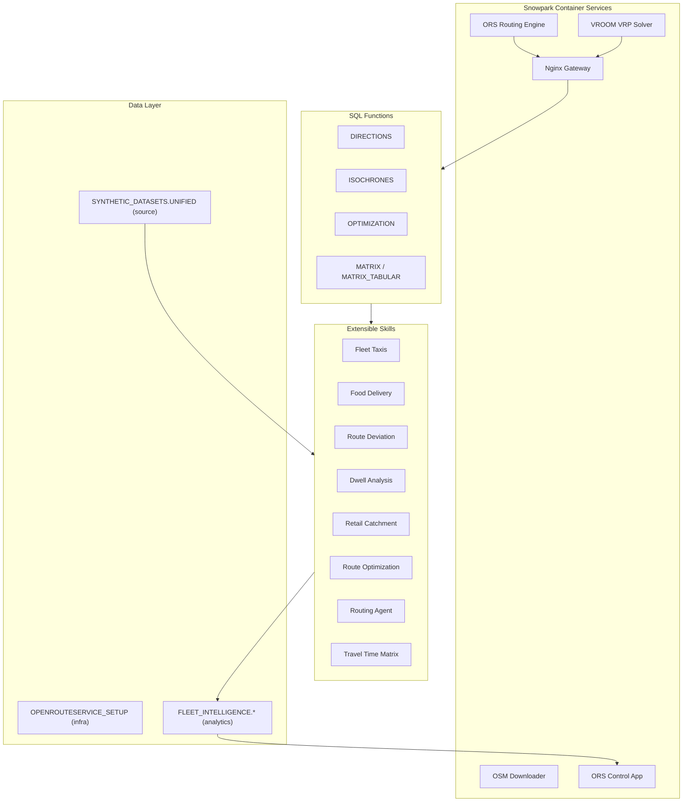
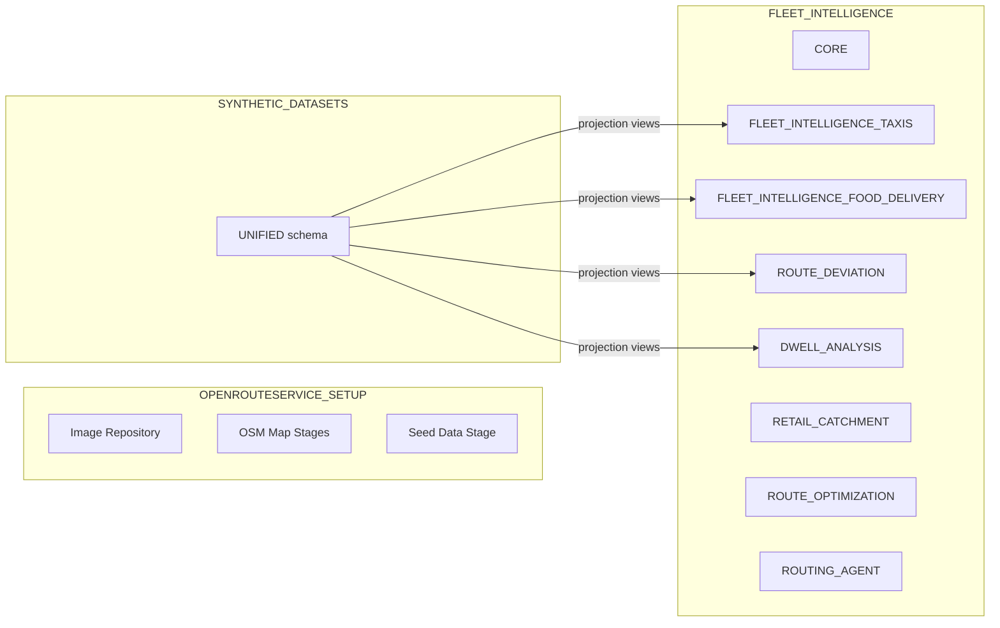
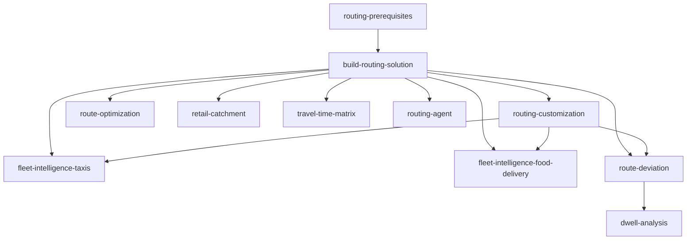

# Route Optimisation and Fleet Intelligence on Snowflake

An end-to-end geospatial analytics platform deployed entirely on Snowflake. It packages the [OpenRouteService](https://openrouteservice.org/) routing engine as a Native App on Snowpark Container Services (SPCS), then layers fleet intelligence, route analysis, and retail analytics on top through modular Cortex Code skills.

Everything is deployed and operated through natural-language conversations in [Cortex Code](https://docs.snowflake.com/en/user-guide/cortex-code) -- each skill is a self-contained playbook the AI agent follows step-by-step.

## Quick Start

1. Open this repository in Cortex Code
2. Say **"check build prerequisites"** to verify your environment
3. Say **"build routing solution"** to deploy the core platform
4. Say **"deploy route optimization demo"** (or any other skill) to extend

## Architecture Overview



---

## Core Solution

The `build-routing-solution` skill deploys the foundational platform. Everything below is created automatically.

### Databases

| Database | Purpose |
|----------|---------|
| `OPENROUTESERVICE_SETUP` | Provider infrastructure: container image repository, OSM map stages, graph caches, elevation data, seed datasets |
| `SYNTHETIC_DATASETS` | Source telemetry data in a unified star schema, written by Data Studio |
| `FLEET_INTELLIGENCE` | Analytics output -- one schema per skill for demo tables, views, and pipelines |

### Native App

The application `OPENROUTESERVICE_NATIVE_APP` is installed from the package `OPENROUTESERVICE_NATIVE_APP_PKG` and contains:

- **Compute Pool**: `OPENROUTESERVICE_NATIVE_APP_COMPUTE_POOL` (HIGHMEM_X64_S, 1-5 nodes, auto-suspend)
- **Warehouse**: `ROUTING_ANALYTICS` (MEDIUM, auto-suspend 60s)

### SPCS Services

Five container services run inside the native app:

| Service | Image | Purpose |
|---------|-------|---------|
| `ors_service` | `openrouteservice:v9.0.0` | Core routing engine (directions, isochrones, matrix) |
| `vroom_service` | `vroom-docker:v1.0.1` | Vehicle Routing Problem (VRP) optimizer |
| `routing_gateway_service` | `routing_reverse_proxy:v0.9.6` | Nginx reverse proxy routing requests to per-region ORS instances |
| `downloader` | `downloader:v0.0.3` | Downloads OSM PBF map files from Geofabrik |
| `ors_control_app` | `ors_control_app:v1.0.86` | React admin panel and demo dashboards (Express.js backend) |

### SQL Functions

Eight public SQL functions are exposed by the native app for use in any Snowflake worksheet, notebook, or stored procedure:

| Function | Description |
|----------|-------------|
| `DIRECTIONS(origin, destination, profile)` | Point-to-point routing with geometry, distance, and duration |
| `ISOCHRONES(location, range, profile)` | Reachability polygons (time or distance based) |
| `OPTIMIZATION(jobs, vehicles)` | Multi-stop VRP with time windows and capacity constraints |
| `MATRIX(locations, profile)` | N x N travel time / distance matrix |
| `MATRIX_TABULAR(locations, profile)` | Matrix output as tabular rows (for joins and analytics) |
| `ORS_STATUS()` | Current service status and loaded routing profiles |
| `CHECK_HEALTH()` | Health check across all services |
| `LIST_REGIONS()` | List provisioned geographic regions |

All functions support an optional `region` parameter for multi-region deployments.

### Seed Data

The core deployment pre-loads sample data so dashboards work immediately:

- **500 intro routes** in San Francisco (animated on the Home page)
- **472K GPS telemetry points** for 50 SF electric bikes across 6K trips
- **5K points of interest** (restaurants, depots, delivery zones)
- Metadata in `FLEET_INTELLIGENCE.CORE` (region registry, generation jobs)

---

## Data Architecture

### Three-Database Layout



### Unified Star Schema (SYNTHETIC_DATASETS.UNIFIED)

All vehicle telemetry data lives in a single unified star schema, regardless of vehicle type (taxis, e-bikes, trucks, delivery couriers). Data is generated by the **Data Studio** page in the ORS Control App.

| Table | Type | Description |
|-------|------|-------------|
| `FACT_VEHICLE_TELEMETRY` | Fact | GPS points: lat/lon, speed, heading, status, timestamp |
| `FACT_TRIPS` | Fact | Trip-level: route geometry, planned vs actual, distance, detour flag |
| `DIM_FLEET` | Dimension | Vehicle definitions: type, ORS profile, shift pattern, driver profile |
| `DIM_POIS` | Dimension | Points of interest: name, category, location, type |
| `DIM_TRIP_SCHEDULE` | Dimension | Planned schedules: origin/destination POI, trip date |

Every row includes `VEHICLE_TYPE`, `REGION`, and `JOB_ID` columns for multi-tenant filtering and data lineage.

### CONFIG Table Pattern

Each downstream skill creates a single-row `CONFIG` table in its schema that stores the active `VEHICLE_TYPE` and `REGION`. Projection views (`VW_*`) join against this CONFIG to filter the unified dataset, so each skill only sees data relevant to its use case.

```
Data Studio --> SYNTHETIC_DATASETS.UNIFIED
                       |
              Skill CONFIG table
            (VEHICLE_TYPE + REGION)
                       |
              VW_* projection views
                (filtered dataset)
                       |
              Skill ETL pipeline
                       |
         FLEET_INTELLIGENCE.{SKILL_SCHEMA}
                       |
            ORS Control App dashboards
```

### Skill Schemas in FLEET_INTELLIGENCE

| Schema | Skill | Key Objects |
|--------|-------|-------------|
| `CORE` | build-routing-solution | `REGION_REGISTRY`, `GENERATION_JOBS`, `PROVISION_REGION` procedure |
| `FLEET_INTELLIGENCE_TAXIS` | fleet-intelligence-taxis | Driver locations, trip summaries, route analytics views |
| `FLEET_INTELLIGENCE_FOOD_DELIVERY` | fleet-intelligence-food-delivery | CONFIG, `DELIVERIES` view, `RESTAURANTS_ENRICHED` view |
| `ROUTE_DEVIATION` | route-deviation | CONFIG, 5 projection views, `TRIP_DEVIATION_ANALYSIS`, deviation trends |
| `DWELL_ANALYSIS` | dwell-analysis | CONFIG, 8 Dynamic Tables, `SLA_ALERT_LOG`, geofences, SLA thresholds |
| `RETAIL_CATCHMENT` | retail-catchment | `RETAIL_POIS`, regional addresses, competitor data |
| `ROUTE_OPTIMIZATION` | route-optimization | Overture Maps places, CARTO data, VRP notebooks |
| `ROUTING_AGENT` | routing-agent | 3 tool procedures + Cortex Agent definition |

---

## Skills Reference

### Dependency Graph



Deploy order: top to bottom. Teardown order: bottom to top.

### Infrastructure (3 skills)

| Skill | What It Does | Invoke With |
|-------|-------------|-------------|
| **build-routing-solution** | Builds 5 container images, creates databases/stages, deploys the native app, starts SPCS services, loads seed data. This is the foundation -- all other skills depend on it. | `build routing solution` |
| **routing-prerequisites** | Checks local environment: Docker/Podman, Snow CLI, Git, network access to Snowflake registry. Run first if unsure about your setup. | `check build prerequisites` |
| **routing-customization** | Routes to 3 subskills for changing the ORS deployment: swap geographic region (download new OSM data), switch routing profiles (driving-car, cycling-electric, foot-walking, etc.), or read current config. | `change location`, `change routing profile` |

### Demo Solutions (6 skills)

| Skill | What It Does | Dashboard Pages | Invoke With |
|-------|-------------|-----------------|-------------|
| **fleet-intelligence-taxis** | Generates realistic taxi GPS telemetry using Overture Maps POIs and ORS road-following routes. Configurable city, fleet size, and shift patterns. | Fleet Overview, Driver Routes, Heat Map | `generate driver locations` |
| **fleet-intelligence-food-delivery** | Food delivery courier telemetry. Reads from unified schema via projection views. Configurable restaurant density and courier counts. | Delivery Dashboard, Fleet Map, Catchment Panel, Courier Heatmap | `setup food delivery fleet` |
| **route-deviation** | 3-step ETL pipeline comparing actual GPS paths vs planned routes to detect detours and analyze deviation patterns. Vehicle-type agnostic. | Deviation Dashboard, Route Comparison, Route Inspector | `deploy route deviation` |
| **dwell-analysis** | 12-step Dynamic Table pipeline: state detection, dwell sessionization, H3 congestion heatmaps, SLA breach alerts, facility utilization, daily trends. Most sophisticated pipeline in the platform. | Overview, Congestion Map, Facility Utilization, SLA Alerts, Trip Inspector, Driver Performance, Live Operations | `deploy dwell analysis` |
| **route-optimization** | VRP demo using Overture Maps + CARTO Marketplace data. Includes Snowflake notebooks demonstrating the OPTIMIZATION function with time windows and capacity constraints. | Route Optimization (VRP simulator) | `deploy route optimization demo` |
| **retail-catchment** | Retail location analysis using Overture Maps. Generates isochrone-based catchment zones, competitor proximity analysis, and address density metrics. | Retail Catchment | `deploy retail catchment` |

### Advanced (2 skills)

| Skill | What It Does | Dashboard Pages | Invoke With |
|-------|-------------|-----------------|-------------|
| **travel-time-matrix** | Computes city-to-country scale travel time matrices at configurable H3 resolutions. Uses parallel workers, Task DAG orchestration, and FLATTEN post-processing. | Travel Time Explorer, Matrix Builder, Matrix Viewer | `build travel time matrix` |
| **routing-agent** | Creates a Snowflake Intelligence (Cortex Agent) that wraps ORS functions as tools. Enables natural-language route planning with AI-powered geocoding. | Routing Agent (chat interface) | `create routing agent` |

### Developer Tools (2 skills)

| Skill | What It Does | Invoke With |
|-------|-------------|-------------|
| **skill-optimiser** | Audits, optimizes, and creates Cortex Code skills following Anthropic best practices. Checks SKILL.md structure, triggers, progressive disclosure, and frontmatter. | `audit skill`, `optimize skill` |
| **routing-solution-cleanup** | Discovers all Snowflake objects created by any skill (via JSON COMMENT tags) and generates DROP statements. Supports dry-run mode, per-skill filtering, and reverse-dependency drop order. | `routing-solution-cleanup`, `cleanup`, `teardown` |

---

## ORS Control App

The ORS Control App is a React single-page application with an Express.js backend, running as a Snowpark Container Service inside the native app. It serves as the unified dashboard for the entire platform -- no separate apps needed.

### Demo Pages

| Section | Pages | Data Source |
|---------|-------|-------------|
| **Home** | Landing page with animated route visualization | Seed intro trips |
| **Dwell Analysis** | Overview, Congestion Map, Facility Utilization, SLA Alerts, Trip Inspector, Driver Performance, Live Operations (7 pages) | `DWELL_ANALYSIS` Dynamic Tables |
| **Fleet Delivery** | Delivery Dashboard, Fleet Map, Catchment Panel, Courier Heatmap (4 pages) | `FLEET_INTELLIGENCE_FOOD_DELIVERY` views |
| **Fleet Taxis** | Fleet Overview, Driver Routes, Heat Map (3 pages) | `FLEET_INTELLIGENCE_TAXIS` tables |
| **Route Deviation** | Deviation Dashboard, Route Comparison, Route Inspector (3 pages) | `ROUTE_DEVIATION` ETL tables |
| **Route Optimization** | VRP simulator with interactive map | `ROUTE_OPTIMIZATION` + live ORS calls |
| **Retail Catchment** | Isochrone analysis with competitor mapping | `RETAIL_CATCHMENT` + live ORS calls |
| **Routing Agent** | Natural-language chat interface for route planning | Live Cortex Agent calls |
| **Travel Time Explorer** | H3 hexagon travel time visualization | `TRAVEL_MATRIX` tables |
| **Data Studio** | Synthetic telemetry data generation UI | Writes to `SYNTHETIC_DATASETS.UNIFIED` |

### Admin Pages

| Page | Purpose |
|------|---------|
| **Status** | View SPCS service status, resume/suspend services |
| **City Builder** | Provision new geographic regions (download OSM data, build routing graphs) |
| **Matrix Builder** | Configure and run H3 travel time matrix computations |
| **Matrix Viewer** | Browse and explore computed travel time matrices |
| **Functions** | Interactive testing console for all ORS SQL functions |
| **Diagnostics** | System health, server logs, environment info |

### Shared Components

- **Region Switcher** -- switch between provisioned geographic regions
- **Vehicle Type Switcher** -- filter dashboards by vehicle type
- **MapView** -- deck.gl map wrapper used across all geo pages
- **DataTable** -- sortable, filterable data table
- **MetricCard** -- KPI display cards

---

## For Users

### Deployment Flow

```
1. Check prerequisites     -->  "check build prerequisites"
2. Deploy core platform    -->  "build routing solution"
3. (Optional) Change city  -->  "change location to London"
4. Deploy any skill        -->  "deploy dwell analysis" / "setup food delivery fleet" / etc.
5. Open ORS Control App    -->  Dashboard URL printed after deployment
```

### Invoking Skills

Open this repo in Cortex Code and type any of these phrases:

| What You Want | What to Say |
|---------------|-------------|
| Deploy the platform | `build routing solution` |
| Check environment | `check build prerequisites` |
| Change to London | `change location to London` |
| Enable cycling profile | `change routing profile` |
| Deploy taxi fleet demo | `generate driver locations` |
| Deploy food delivery demo | `setup food delivery fleet` |
| Deploy route deviation | `deploy route deviation` |
| Deploy dwell analysis | `deploy dwell analysis` |
| Deploy retail catchment | `deploy retail catchment` |
| Deploy route optimization | `deploy route optimization demo` |
| Build travel time matrix | `build travel time matrix` |
| Create routing agent | `create routing agent` |
| Clean up everything | `routing-solution-cleanup` |

### Multi-Region Support

The platform supports multiple geographic regions simultaneously:

1. Deploy the core solution (defaults to San Francisco)
2. Use **"change location to [city]"** to provision additional regions
3. The Region Switcher in the Control App lets you switch between regions
4. Each skill's CONFIG table can be pointed to any provisioned region

---

## For Developers

### Repository Structure

```
.cortex/skills/                    # All Cortex Code skills
  +-- <skill-name>/
  |   +-- SKILL.md                 # Skill definition (YAML frontmatter + instructions)
  |   +-- references/              # Detailed SQL, code, and documentation
  |   +-- assets/                  # Notebooks and other deployable artifacts
  +-- evals/                       # Eval framework (trigger, quality, cross-ref)
build-routing-solution/
  +-- native_app/
  |   +-- app/
  |   |   +-- setup_script.sql     # Thin orchestrator calling 6 modules
  |   |   +-- manifest.yml         # Native app manifest
  |   |   +-- modules/             # 6 SQL module files
  |   +-- services/
  |       +-- ors_control_app/     # React + Express.js dashboard app
  |       +-- openrouteservice/    # ORS Docker config
  |       +-- vroom-docker/        # VROOM Docker config
  |       +-- routing_reverse_proxy/ # Nginx gateway config
  |       +-- downloader/          # OSM file downloader
  +-- deploy.sh                    # Full deployment script
  +-- upgrade_app.sh               # Setup script upgrade only
docs/                              # Guides and documentation
archive/                           # Archived / deprecated materials
AGENTS.md                          # AI assistant project guidance
```

### Native App Module System

The native app's `setup_script.sql` is a thin orchestrator that calls six domain-specific SQL modules:

| Module | Domain | What It Creates |
|--------|--------|-----------------|
| `01_core_infra.sql` | Compute, stages, services | Compute pool, stages, all 5 SPCS services, lifecycle callbacks |
| `02_routing_functions.sql` | SQL functions | 8 public functions + 7 internal `_RAW` service functions, `MAP_CONFIG`, `VERSION_INFO` |
| `03_city_management.sql` | Multi-region | `CITY_ORS_MAP`, `CITY_PROVISION_JOBS`, provisioning procedures |
| `04_service_lifecycle.sql` | Service ops | Resume, suspend, scale, status procedures |
| `05_matrix_pipeline.sql` | Matrix build | `MATRIX_BUILD_JOBS`, build/flatten procedures |
| `06_matrix_ops.sql` | Matrix ops | Status, inventory, delete procedures |

Changes to any module must go through `upgrade_app.sh` -- never create objects directly via SQL.

### ORS Control App Development

The Control App is a React SPA (Vite + TypeScript) with an Express.js backend:

```
ors_control_app/
  src/                    # React frontend
    components/           # Page components (30+ pages)
    shared/               # Reusable components (MapView, DataTable, etc.)
    hooks/                # useSnowflake, useRegion, useVehicleType
  server/                 # Express.js backend
    index.ts              # Core API routes (44 endpoints)
    studio/               # Data Studio sub-router
  deploy.sh               # Build + Docker push + upgrade
```

Deploy flow: `npm run build` -> Docker build (linux/amd64) -> push to SPCS registry -> `ALTER APPLICATION UPGRADE`.

### Object Tracking and Cleanup

Every Snowflake object created by a skill is tracked with two mechanisms:

1. **Session query tag** -- set at session start for query attribution:
   ```json
   {"origin":"sf_sit-is-fleet","name":"oss-<skill-name>","version":{"major":1,"minor":0}}
   ```

2. **Object COMMENT** -- JSON tag on every CREATE statement for object discovery:
   ```json
   {"origin":"sf_sit-is-fleet","name":"oss-<skill-name>","version":{"major":1,"minor":0}}
   ```

The `routing-solution-cleanup` skill queries `INFORMATION_SCHEMA` for objects matching the tracking tag and generates DROP statements in reverse-dependency order.

### Creating a New Skill

1. Create folder: `.cortex/skills/my-new-skill/`
2. Create `SKILL.md` with YAML frontmatter and step-by-step instructions
3. Add `references/` for detailed SQL if the body exceeds 5,000 words
4. Add `assets/` for notebooks or deployable artifacts
5. Audit with: `audit skill my-new-skill` (invokes the skill-optimiser)
6. See `AGENTS.md` for full conventions and rules

---

## Prerequisites

- [Cortex Code](https://docs.snowflake.com/en/user-guide/cortex-code) with an active Snowflake connection
- Snowflake account with privileges to create databases, warehouses, compute pools, and application packages
- Docker or Podman (required only for building container images)

## License

Apache License 2.0
