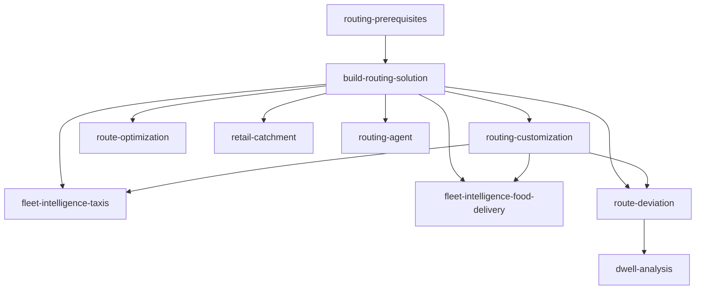

# Route Optimisation and Fleet Intelligence on Snowflake

**Click the button below to get access to the full Snowflake Guide:**

[](https://www.snowflake.com/en/developers/guides/oss-install-openrouteservice-native-app/)


The [OpenRouteService](https://openrouteservice.org/) routing engine running inside Snowflake on Snowpark Container Services (SPCS), with ready-to-deploy demo use cases for fleet intelligence, route optimization, and retail analytics.

Deploy and extend the solution using [Cortex Code](https://docs.snowflake.com/en/user-guide/cortex-code) skills. Each skill is a self-contained playbook the AI agent follows step by step.

> **Platform note:** Today, this solution is primarily developed and tested on macOS. Windows users may encounter friction during installation and build steps around container image builds but Cortex Code should be able to resolve it.

## Prerequisites

- [Cortex Code](https://docs.snowflake.com/en/user-guide/cortex-code) with an active Snowflake connection
- Snowflake account with privileges to create databases, warehouses, compute pools, and application packages
- Docker or Podman (required only for building container images)

**Estimated deployment time:** 15 to 30 minutes.

## Quick start

1. Open this repository in Cortex Code
2. Say **"check build prerequisites"** to verify your environment
3. Say **"build routing solution"** to deploy the routing engine
4. Say **"deploy route optimization demo"** (or any other demo) to add use cases

## What you get

### SPCS services

Five container services run inside your Snowflake account:

| Service | Purpose |
|---------|---------|
| `ors_service` | Core routing engine: directions, isochrones, matrix |
| `vroom_service` | Vehicle Routing Problem (VRP) optimizer |
| `routing_gateway_service` | Reverse proxy that routes requests to per-region ORS instances |
| `downloader` | Downloads OSM map files from Geofabrik |
| `ors_control_app` | Web-based control panel and demo dashboards |

### SQL functions

Eight SQL functions you can call from any worksheet, notebook, or stored procedure:

| Function | Description |
|----------|-------------|
| `DIRECTIONS(origin, destination, profile)` | Point-to-point routing with geometry, distance, and duration |
| `ISOCHRONES(location, range, profile)` | Reachability polygons (time or distance based) |
| `OPTIMIZATION(jobs, vehicles)` | Multi-stop VRP with time windows and capacity constraints |
| `MATRIX(locations, profile)` | N x N travel time and distance matrix |
| `MATRIX_TABULAR(locations, profile)` | Matrix output as tabular rows (for joins and analytics) |
| `ORS_STATUS()` | Current service status and loaded routing profiles |
| `CHECK_HEALTH()` | Health check across all services |
| `LIST_REGIONS()` | List provisioned geographic regions |

All functions support an optional `region` parameter for multi-region deployments.

### Seed data

Sample data is pre-loaded so dashboards work out of the box:

- **500 intro routes** in San Francisco (animated on the Home page)
- **472K GPS telemetry points** for 50 SF electric bikes across 6K trips
- **5K points of interest** (restaurants, depots, delivery zones)

## Demo use cases

| Demo | What it does | Deploy with |
|------|-------------|-------------|
| **Fleet Taxis** | Realistic taxi GPS telemetry using Overture Maps POIs and ORS road-following routes. Configurable city, fleet size, and shift patterns. | `generate driver locations` |
| **Food Delivery** | Food delivery courier telemetry with configurable restaurant density and courier counts. | `setup food delivery fleet` |
| **Route Deviation** | Compares actual GPS paths against planned routes to detect detours and analyze deviation patterns. | `deploy route deviation` |
| **Dwell Analysis** | 12-step Dynamic Table pipeline: state detection, dwell sessionization, H3 congestion heatmaps, SLA breach alerts, facility utilization, daily trends. | `deploy dwell analysis` |
| **Route Optimization** | VRP demo using Overture Maps and CARTO Marketplace data with Snowflake notebooks. | `deploy route optimization demo` |
| **Retail Catchment** | Isochrone-based catchment zones, competitor proximity analysis, and address density metrics. | `deploy retail catchment` |

### Advanced

| Demo | What it does | Deploy with |
|------|-------------|-------------|
| **Routing Agent** | A Snowflake Intelligence (Cortex Agent) that wraps ORS functions as tools. Natural-language route planning with AI-powered geocoding. | `create routing agent` |

## ORS Control App

The ORS Control App is a web-based control panel that runs as a Snowpark Container Service. All deployed demos are accessible from a single navigation menu.

Admin pages:

- **Status**: View SPCS service status, resume and suspend services
- **Region Builder**: Provision new geographic regions (download OSM data, build routing graphs)
- **Matrix Builder**: Configure and run H3 travel-time matrix computations
- **Matrix Viewer**: Browse and explore computed travel-time matrices
- **Functions**: Interactive testing console for all ORS SQL functions
- **Diagnostics**: System health, server logs, environment info

## How to use

### Invoking skills

Open this repo in Cortex Code and type any of these phrases:

| What you want | What to say |
|---------------|-------------|
| Deploy the routing engine | `build routing solution` |
| Check environment | `check build prerequisites` |
| Change to London | `change location to London` |
| Enable cycling profile | `change routing profile` |
| Deploy taxi fleet demo | `generate driver locations` |
| Deploy food delivery demo | `setup food delivery fleet` |
| Deploy route deviation | `deploy route deviation` |
| Deploy dwell analysis | `deploy dwell analysis` |
| Deploy retail catchment | `deploy retail catchment` |
| Deploy route optimization | `deploy route optimization demo` |
| Create routing agent | `create routing agent` |
| Clean up everything | `routing-solution-cleanup` |

### Multi-region support

The solution supports multiple geographic regions simultaneously:

1. Deploy the routing engine (defaults to San Francisco).
2. Use **"change location to [city]"** to provision additional regions.
3. The Region Switcher in the Control App lets you switch between regions.
4. Each demo's CONFIG table can be pointed to any provisioned region.

### Cleanup

Say **"routing-solution-cleanup"** in Cortex Code to discover and remove all Snowflake objects created by the solution. The cleanup skill supports dry-run mode and per-skill filtering.

---

## For developers

### Repository structure

```
.cortex/skills/                    # All Cortex Code skills
  ├── <skill-name>/
  │   ├── SKILL.md                 # Skill definition (YAML frontmatter + instructions)
  │   ├── references/              # Detailed SQL, code, and documentation
  │   └── assets/                  # Notebooks and other deployable artifacts
  ├── build-routing-solution/      # Core deployment (ORS app, Docker configs, deploy scripts)
  └── evals/                       # Eval framework (trigger, quality, cross-ref)
datasets/                          # Seed data (parquet files loaded during core deployment)
docs/                              # Guides and documentation
logs/                              # Skill execution error logs
archive/                           # Archived and deprecated materials
AGENTS.md                          # AI assistant project guidance
```

### Dependency graph



Deploy order: top to bottom. Teardown order: bottom to top.

For the full architecture reference (database layout, star schema, object tracking, Control App internals), see [docs/ARCHITECTURE.md](docs/ARCHITECTURE.md).

For skill conventions and developer rules, see [AGENTS.md](AGENTS.md).

## Questions and feedback

If you have questions or suggestions about this solution, contact [fleet-intelligence@snowflake.com](mailto:fleet-intelligence@snowflake.com).

## License

Apache License 2.0
