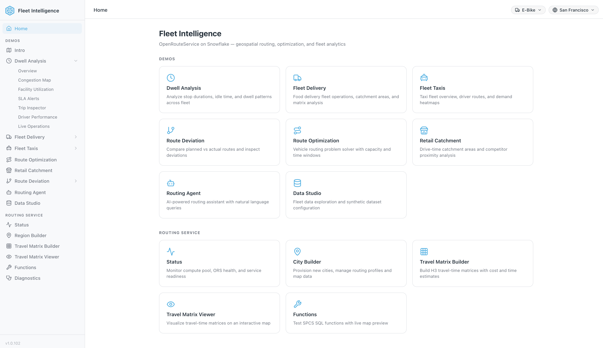
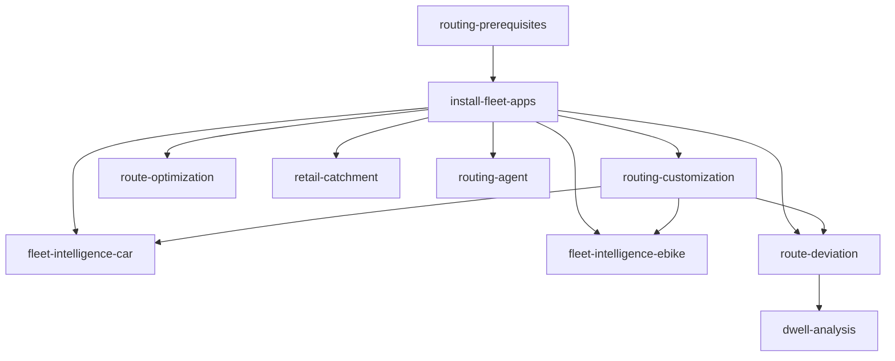

# Route Optimisation and Fleet Intelligence on Snowflake

### Watch the 4-minute demo

[](https://www.youtube.com/watch?v=wT9fRQLIL7E)

**Click the button below to get access to the full Snowflake Guide:**

[](https://www.snowflake.com/en/developers/guides/oss-install-openrouteservice-native-app/)



The [OpenRouteService](https://openrouteservice.org/) routing engine running inside Snowflake on Snowpark Container Services (SPCS), with ready-to-deploy demo use cases for fleet intelligence, route optimization, and retail analytics.

Deploy and extend the solution using [Cortex Code](https://docs.snowflake.com/en/user-guide/cortex-code) skills. Each skill is a self-contained playbook the AI agent follows step by step.

> **Platform note:** Today, this solution is primarily developed and tested on macOS. Windows users may encounter friction during installation and build steps around container image builds but Cortex Code should be able to resolve it.

## Prerequisites

- [Cortex Code](https://docs.snowflake.com/en/user-guide/cortex-code) with an active Snowflake connection
- Snowflake account with privileges to create databases, warehouses, compute pools, and application packages
- Docker or Podman (required only for building container images)

**Estimated deployment time:** 15 to 30 minutes.

## Quick start

1. Open this repository in Cortex Code
2. Say **"check build prerequisites"** to verify your environment
3. Say **"install the fleet apps"** to deploy the whole stack in one command: the two web apps, the Cortex agents, the MCP tool bundles, the neutral data contract, and (by default) the live ORS/VROOM routing engine
4. Open the two app endpoints printed at the end, then ask the analytics agent a question or explore the dashboards

> The installer builds the routing engine by default. Add `--no-engine` to skip the heavy engine build (the analytics apps still run; only live routing verbs go inert).

## What you get

### SPCS services

Five container services run inside your Snowflake account:

| Service | Purpose |
|---------|---------|
| `ors_service` | Core routing engine: directions, isochrones, matrix |
| `vroom_service` | Vehicle Routing Problem (VRP) optimizer |
| `routing_gateway_service` | Reverse proxy that routes requests to per-region ORS instances |
| `downloader` | Downloads OSM map files from Geofabrik |
| `fleet_admin_app` | Privileged build/admin console: region builder, matrix builder, Data Studio, diagnostics |
| `fleet_sa_app` | Agent-first analytics app: business-problem dashboards plus a natural-language Cortex agent |

### SQL functions

Eight SQL functions you can call from any worksheet, notebook, or stored procedure:

| Function | Description |
|----------|-------------|
| `DIRECTIONS(origin, destination, profile)` | Point-to-point routing with geometry, distance, and duration |
| `ISOCHRONES(location, range, profile)` | Reachability polygons (time or distance based) |
| `OPTIMIZATION(jobs, vehicles)` | Multi-stop VRP with time windows and capacity constraints |
| `MATRIX(locations, profile)` | N x N travel time and distance matrix |
| `MATRIX_TABULAR(locations, profile)` | Matrix output as tabular rows (for joins and analytics) |
| `ORS_STATUS()` | Current service status and loaded routing profiles |
| `CHECK_HEALTH()` | Health check across all services |
| `LIST_REGIONS()` | List provisioned geographic regions |

All functions support an optional `region` parameter for multi-region deployments.

### Agentic analytics

The analytics app is agent-first. On top of the dashboards you get:

| Capability | What it is |
|------------|-----------|
| `FLEET_AGENT` (consumer) | Cortex agent behind the analytics app chat. Answers natural-language questions, calls routing tools, and grounds answers in the semantic views. |
| `FLEET_OPS_AGENT` (ops) | Operations-focused agent for the admin/ops surface. |
| Role-scoped MCP bundles | Three synapse tool servers (`ROUTING_MCP`, `FLEET_OPS_MCP`, `FLEET_ADMIN_MCP`). Each role gets only its bundle; the consumer agent attaches the user bundle only. |
| Cortex Analyst semantic views | Five semantic views (`SV_FLEET_OPS`, `SV_ROUTE_DEVIATION`, `SV_CATCHMENT`, `SV_DWELL_ANALYTICS`, `SV_ASSET_VELOCITY`) that ground agent answers in governed business metrics. |
| Audited verb envelope | Every tool call flows through the synapse envelope with idempotency and a `VERB_ATTEMPT` audit row - no direct, unaudited tool calls. |

### Neutral contracts (swappable seams)

Consumers bind to neutral contracts, never to a named engine or physical source:

- **Data seam** - dashboards and semantic views read the `FLEET_APP.*` contract, rebuilt from raw sources, not the physical tables directly.
- **Routing seam** - live routing calls go through `ROUTING_PLATFORM.CONTRACT.*`, which fronts the ORS/VROOM engine.

This is what makes a domain swap config-driven: point the contract at a different dataset and the apps, agents, and semantic views follow with no code edits.

### Seed data

Sample data is pre-loaded so dashboards work out of the box:

- **500 intro routes** in San Francisco (animated on the Home page)
- **472K GPS telemetry points** for 50 SF electric bikes across 6K trips
- **5K points of interest** (restaurants, depots, delivery zones)

## Demo use cases

| Demo | What it does | Deploy with |
|------|-------------|-------------|
| **Car Fleet** | Realistic vehicle GPS telemetry using Overture Maps POIs and ORS road-following routes. Configurable city, fleet size, and shift patterns. | `generate driver locations` |
| **E-Bike Fleet** | E-bike fleet telemetry with configurable POI density and fleet size. | `setup e-bike fleet` |
| **Route Deviation** | Compares actual GPS paths against planned routes to detect detours and analyze deviation patterns. | `deploy route deviation` |
| **Dwell Analysis** | 12-step Dynamic Table pipeline: state detection, dwell sessionization, H3 congestion heatmaps, SLA breach alerts, facility utilization, daily trends. | `deploy dwell analysis` |
| **Route Optimization** | VRP demo using Overture Maps and CARTO Marketplace data with Snowflake notebooks. | `deploy route optimization demo` |
| **Retail Catchment** | Isochrone-based catchment zones, competitor proximity analysis, and address density metrics. | `deploy retail catchment` |

### Advanced

| Demo | What it does | Deploy with |
|------|-------------|-------------|
| **Routing Agent** | A Snowflake Intelligence (Cortex Agent) that wraps ORS functions as tools. Natural-language route planning with AI-powered geocoding. | `create routing agent` |

## The two apps

The solution ships two Next.js web apps, each running as a Snowpark Container Service.

### FLEET_ADMIN_APP (build and admin console)

The privileged console for standing up and operating the platform:

- **Status**: view SPCS service status, resume and suspend services
- **Region Builder**: provision new geographic regions (download OSM data, build routing graphs)
- **Matrix Builder**: configure and run H3 travel-time matrix computations
- **Matrix Viewer**: browse and explore computed travel-time matrices
- **Data Studio**: generate synthetic telemetry datasets into `SYNTHETIC_DATASETS.UNIFIED`
- **Functions**: interactive testing console for all ORS SQL functions
- **Diagnostics**: system health, server logs, environment info

### FLEET_SA_APP (agent-first analytics)

The consumer-facing analytics app. It presents vehicle/industry-agnostic business-problem views (Fleet/Asset Status, Asset Map, Demand Density, Trip Inspection, Operator Performance, Top Origins, Dwell and Congestion, Route Deviation, Asset Utilization, VRP, Catchment) alongside a natural-language chat backed by `FLEET_AGENT`. Ask a question in plain English and the agent calls the routing tools and semantic views to answer it.

## How to use

### Invoking skills

Open this repo in Cortex Code and type any of these phrases:

| What you want | What to say |
|---------------|-------------|
| Deploy the full stack (apps, agents, MCP, engine) | `install the fleet apps` |
| Check environment | `check build prerequisites` |
| Change to London | `change location to London` |
| Enable cycling profile | `change routing profile` |
| Deploy car fleet demo | `generate driver locations` |
| Deploy e-bike fleet demo | `setup e-bike fleet` |
| Deploy route deviation | `deploy route deviation` |
| Deploy dwell analysis | `deploy dwell analysis` |
| Deploy retail catchment | `deploy retail catchment` |
| Deploy route optimization | `deploy route optimization demo` |
| Create routing agent | `create routing agent` |
| Clean up everything | `routing-solution-cleanup` |

The `install the fleet apps` command is the primary path and installs the complete agnostic stack. The per-vehicle and per-vertical demo skills (car fleet, e-bike fleet, route deviation, dwell, retail catchment, routing agent) are optional add-ons layered on top.

### Multi-region support

The solution supports multiple geographic regions simultaneously:

1. Deploy the stack (the engine defaults to San Francisco).
2. Use **"change location to [city]"** to provision additional regions.
3. The Region Switcher in each app lets you switch between regions.
4. Each demo's CONFIG table can be pointed to any provisioned region.

### Cleanup

Say **"routing-solution-cleanup"** in Cortex Code to discover and remove all Snowflake objects created by the solution. The cleanup skill supports dry-run mode and per-skill filtering.

---

## For developers

### Repository structure

```
.cortex/skills/                    # All Cortex Code skills
  ├── <skill-name>/
  │   ├── SKILL.md                 # Skill definition (YAML frontmatter + instructions)
  │   ├── references/              # Detailed SQL, code, and documentation
  │   └── assets/                  # Notebooks and other deployable artifacts
  ├── install-fleet-apps/          # Primary installer (ORS engine + fleet apps + synapse tools)
  └── evals/                       # Eval framework (trigger, quality, cross-ref)
datasets/                          # Seed data (parquet files loaded during core deployment)
docs/                              # Guides and documentation
logs/                              # Skill execution error logs
archive/                           # Archived and deprecated materials
AGENTS.md                          # AI assistant project guidance
```

### Dependency graph


```mermaid
graph TD
    RP[routing-prerequisites] --> IFA[install-fleet-apps]
    IFA --> RC[routing-customization]
    IFA --> RO[route-optimization]
    IFA --> FIT[fleet-intelligence-car]
    IFA --> FIFD[fleet-intelligence-ebike]
    IFA --> RET[retail-catchment]
    IFA --> RD[route-deviation]
    IFA --> RA[routing-agent]
    RC --> FIT
    RC --> FIFD
    RC --> RD
    RD --> DA[dwell-analysis]
```

Deploy order: top to bottom. Teardown order: bottom to top.

For the full architecture reference (database layout, star schema, object tracking, Control App internals), see [docs/ARCHITECTURE.md](docs/ARCHITECTURE.md).

For skill conventions and developer rules, see [AGENTS.md](AGENTS.md).

## Questions and feedback

If you have questions or suggestions about this solution, contact [fleet-intelligence@snowflake.com](mailto:fleet-intelligence@snowflake.com).

## License

Snowflake Skills License © 2026 Snowflake Inc. All rights reserved. See [LICENSE](LICENSE) for details.
