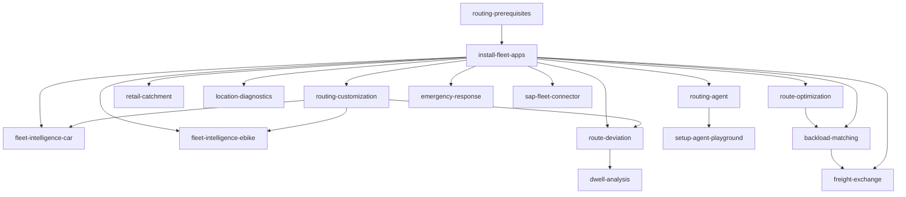

# Route Optimisation and Fleet Intelligence on Snowflake

### Watch the 4-minute demo

[](https://www.youtube.com/watch?v=wT9fRQLIL7E)

**Click the button below to get access to the full Snowflake Guide:**

[](https://www.snowflake.com/en/developers/guides/oss-install-openrouteservice-native-app/)


A vehicle-agnostic, industry-agnostic fleet analytics platform running entirely on Snowflake. The [OpenRouteService](https://openrouteservice.org/) routing engine and [VROOM](https://github.com/VROOM-Project/vroom) vehicle routing optimizer run on Snowpark Container Services (SPCS), fronted by two agent-first web apps, four role-scoped Cortex agents, and a neutral data contract that makes a domain swap config-driven.

Deploy and extend the solution using [Cortex Code](https://docs.snowflake.com/en/user-guide/cortex-code) skills. Each skill is a self-contained playbook the AI agent follows step by step.

> **Platform note:** Today, this solution is primarily developed and tested on macOS. Windows users may encounter friction during installation and build steps around container image builds but Cortex Code should be able to resolve it.

## Prerequisites

- [Cortex Code](https://docs.snowflake.com/en/user-guide/cortex-code) with an active Snowflake connection
- A Snowflake account and a role holding the privileges below
- Docker or Podman (required only for building container images)

**Estimated deployment time:** roughly 30 minutes on a recent run, dominated by the routing-engine build and the container image upload. Expect up to about 90 minutes on a constrained uplink. Adding `--no-engine` skips the engine build and completes in a few minutes.

### Required privileges

`ACCOUNTADMIN` satisfies everything below, but is **not** required - a custom role granted these will do:

| Privilege | Scope | Why |
|---|---|---|
| CREATE DATABASE / SCHEMA | account | `FLEET_INTELLIGENCE`, `FLEET_APP`, `ROUTING_PLATFORM`, `SYNTHETIC_DATASETS` |
| CREATE COMPUTE POOL | account | SPCS compute for the engine and the apps |
| CREATE IMAGE REPOSITORY | schema | pushing the app and engine container images |
| CREATE SERVICE | schema | the two apps and the per-region routing services |
| CREATE INTEGRATION | account | external access for CARTO basemaps and OSM downloads |
| CREATE ROLE + MANAGE GRANTS | account | the three app tiers plus `FLEET_APP_DYNAMIC_READER` |
| CREATE AGENT, CREATE MCP SERVER | schema | the four Cortex agents and the synapse tool bundles |
| `SNOWFLAKE.CORTEX_USER` | database role | Cortex Analyst and agent calls |

Two are optional:

| Privilege | Scope | What you lose without it |
|---|---|---|
| CREATE SNOWFLAKE INTELLIGENCE | account | Agents stay reachable by direct link and Snowsight, but do not appear in the CoWork agent list |
| CREATE DATASET / STAGE / FILE FORMAT / TASK, USE AI FUNCTIONS, EXECUTE TASK | schema + account | Agent evaluation sets and scheduled evaluation runs |

No application packages are created, so no provider privileges are needed.

## Quick start

1. Open this repository in Cortex Code
2. Say **"check build prerequisites"** to verify your environment
3. Say **"install the fleet apps"** to deploy the whole stack in one command: the two web apps, the four Cortex agents, the MCP tool bundles, the neutral data contract, and (by default) the live ORS/VROOM routing engine
4. Open the two app endpoints printed at the end, then ask the analytics agent a question or explore the dashboards

> The installer builds the routing engine by default. Add `--no-engine` to skip the heavy engine build (the analytics apps still run; only live routing verbs go inert).

## What you get

### SPCS services

Container services run inside your Snowflake account. The routing services are provisioned per region (the default region is San Francisco):

| Service | Purpose |
|---------|---------|
| `ors_service_<region>` | Core routing engine: directions, isochrones, matrix |
| `vroom_service_<region>` | Vehicle Routing Problem (VRP) optimizer |
| `routing_gateway_service` | Reverse proxy that routes requests to per-region ORS/VROOM instances |
| `downloader` | Downloads OSM map files from Geofabrik |
| `fleet_admin_app` | Privileged build/admin console: region builder, matrix builder, Data Studio, diagnostics |
| `fleet_sa_app` | Agent-first analytics app: 24 business-problem dashboards plus a natural-language Cortex agent |

### SQL functions

Call these from any worksheet, notebook, or stored procedure. All of them take an optional trailing `region` argument for multi-region deployments.

**Routing and reachability**

| Function | Description |
|----------|-------------|
| `DIRECTIONS(method, origin, destination, region)` | Point-to-point routing with geometry, distance, and duration |
| `ISOCHRONES(method, lon, lat, range, region)` | Reachability polygons. Returns `RESPONSE VARIANT` plus a mappable `GEOJSON GEOGRAPHY`. Range on the scalar overload is in **minutes** |
| `ISOCHRONES_CLIPPED(method, lon, lat, range, region)` | Same, clipped to the region boundary polygon so rings do not spill into water or neighbouring countries |
| `OPTIMIZATION(jobs, vehicles, region)` | Multi-stop VRP with time windows and capacity constraints. Returns solved tours as `GEOJSON GEOGRAPHY` |

**Travel-time matrices**

| Function | Description |
|----------|-------------|
| `MATRIX(method, locations, region)` | N x N travel time and distance matrix |
| `MATRIX_TABULAR(method, origins, destinations, region)` | Matrix output as tabular rows, for joins and analytics |
| `MATRIX_TABULAR_W(region, method, origin, destinations)` | Region-first argument order, convenient when the region is a bind |

**Snapping and map matching**

| Function | Description |
|----------|-------------|
| `SNAP(method, locations, radius, region)` | Snap coordinates to the nearest road segment (raw VARIANT) |
| `SNAP_POINTS(method, locations, radius, region)` | Tabular snap: input geography, snapped geography, and snapped distance per point |
| `MATCH(method, features, region)` | Map-match a GPS trace to the road network |
| `MATCH_PATH(method, linestring, region)` | Map-match returning the traversed road-segment geometry and a matched-edge count |

**Status and region lookup**

| Function | Description |
|----------|-------------|
| `ORS_STATUS(region)` | Service status, loaded routing profiles, graph date, and gateway version |
| `CHECK_HEALTH()` | Boolean health check across the routing services |
| `REGION_FOR_POINT(lon, lat)` | Which provisioned region contains a point |
| `POINT_IN_REGION(lon, lat, region)` | Whether a point falls inside a named region's boundary |
| `SAMPLE_ADDRESSES_FOR_REGION(region)` | Sample real addresses from a region, for demos and validation |

Region provisioning and lifecycle are **stored procedures**, not functions: `LIST_REGIONS()`, `PROVISION_REGION_WRAPPER(region)`, `DROP_REGION_ORS(region)`, `SUSPEND_SERVICE(name)`, and `RECONCILE_AUTO_SUSPEND()`.

Dashboards do not call these directly. They go through the engine-agnostic `ROUTING_PLATFORM.CONTRACT.*` seam, so the engine can be swapped without touching a view.

### Agentic analytics

The analytics app is agent-first. On top of the dashboards you get:

| Capability | What it is |
|------------|-----------|
| **Four Cortex agents** | `FLEET_AGENT` (consumer), `FLEET_OPS_AGENT` (ops), `FLEET_ADMIN_AGENT` (admin), `FLEET_SUPER_AGENT` (all three bundles, admin-only). Each answers natural-language questions by calling routing tools and semantic views. |
| **Role-scoped MCP bundles** | Three synapse tool servers (`ROUTING_MCP`, `FLEET_OPS_MCP`, `FLEET_ADMIN_MCP`). Each role gets only its bundle; the consumer agent attaches the user bundle only. |
| **Cortex Analyst semantic views** | Twelve semantic views that ground agent answers in governed business metrics rather than free-form SQL (listed below). |
| **Synapse verb envelope** | Every tool call flows through the synapse envelope with idempotency and a `VERB_ATTEMPT` audit row - no direct, unaudited tool calls. |
| **Snowflake CoWork integration** | All four agents are registered in Snowflake Intelligence so they appear in the CoWork agent list. |
| **Agent evaluations** | Per-agent evaluation datasets, scheduled daily evaluation tasks, and a CI quality gate (`check_agent_eval_thresholds.py`) for automated regression detection. |

#### Semantic views

Each view models one business domain as dimensions, metrics, and relationships, so the agent answers from governed definitions instead of improvised SQL. They also project map-ready geometry (latitude/longitude floats, GeoJSON strings, H3 cells) because a semantic view cannot hold a `GEOGRAPHY` column.

| Semantic view | Domain |
|---|---|
| `SV_FLEET_OPS` | Core fleet: vehicles, trips, telemetry, operators, risk events |
| `SV_ROUTE_DEVIATION` | Planned vs actual paths and detour cost |
| `SV_CATCHMENT` | Drive-time catchment zones and reachable demand |
| `SV_DWELL_ANALYTICS` | Dwell sessions, facility utilization, SLA breaches |
| `SV_ASSET_VELOCITY` | Idle assets and the cost of idleness |
| `SV_LOCATION` | Site cannibalization and closure impact |
| `SV_SOURCING` | Plant-to-customer sourcing on real road distance |
| `SV_DELIVERY_SYNC` | Site arrival, unload, and departure readiness |
| `SV_BACKLOAD_MATCHING` | Backhaul candidates, constraints, and proposal decisions |
| `SV_EMERGENCY_RESPONSE` | Hazard exposure, participants, and evacuation plans |
| `SV_OFFERS` | Freight marketplace offers, trust scores, rate index |
| `SV_FLEET_DEPLOYMENT` | Platform deployment and service history (ops/admin only) |

`SV_FLEET_DEPLOYMENT` sits in the `SEMANTIC_OPS` schema rather than `SEMANTIC`, so the consumer role's blanket grant on `SEMANTIC` cannot reach it.

### Neutral contracts (swappable seams)

Consumers bind to neutral contracts, never to a named engine or physical source:

- **Data seam** - dashboards and semantic views read the `FLEET_APP.*` contract, rebuilt from raw sources, not the physical tables directly. Swap the data via config-driven packs.
- **Routing seam** - live routing calls go through `ROUTING_PLATFORM.CONTRACT.*`, which fronts the ORS/VROOM engine. No dashboard calls ORS directly.

This is what makes a domain swap config-driven: point the contract at a different dataset and the apps, agents, and semantic views follow with no code edits.

### Seed data

A San Francisco e-bike dataset is pre-loaded so the dashboards work out of the box, with no generation step:

| Seeded data | Rows |
|---|---|
| GPS telemetry points | 1,579,065 |
| Places (Overture POI estate) | 70,723 |
| Trips (and matching planned schedule) | 13,721 |
| Points of interest | 4,996 |
| Hazard grid cells | 3,546 |
| Evacuation participants | 3,000 |
| Care-centre anchors | 2,756 |
| Area demographics | 972 |
| Partner lane history | 511 |
| Intro page routes | 500 |
| Freight offers | 300 |
| Vehicles | 100 |
| Partners | 80 |

Because the hazard grid, participants, and freight offers ship with the seed, **Emergency Response and the backload/marketplace dashboards work immediately** on a fresh install - they are not gated behind a generation run.

Use **Data Studio** in the admin app to generate data for other regions, vehicle types, or scenarios. Each run is an immutable, versioned dataset: generating a second dataset does not overwrite the seed.

## What's included

**You do not run a skill per demo.** The single `install the fleet apps` command deploys the platform *and* the analytics app with all 24 dashboards. The bundled San Francisco seed activates every one of them out of the box, including Emergency Response and the backload/marketplace pages.

Every dashboard carries an **"i" business-context overlay** aimed at whoever is presenting it. Open it and you get the headline, the business question the page answers, the audience and industries it lands with, a step-by-step talk track, which Snowflake capabilities are actually being demonstrated, what data a customer would need to reproduce it, the value drivers, the method, and - deliberately - the caveats, including which figures are synthetic or computed in hindsight. The same content feeds the agent's cross-view solution catalog, so you can ask "what could we show this customer?" and get an answer grounded in the real dashboard inventory rather than an invention.

### Core fleet dashboards

| Dashboard | What it shows |
|-----------|---------------|
| **Live Asset Operations** | Real-time asset map and status across the fleet |
| **Journey Inspector** | Per-trip drill-down: planned vs actual path, stops, dwell, speed |
| **Operator Performance** | Per-operator scorecards, distance, deviation, and risk events |
| **Space-Time Density** | H3 hexagon heatmap of activity, animated hour by hour |
| **Plan-vs-Actual Performance** | Which journeys left the plan, where they diverged, and the cost |
| **Dispatch Execution Board** | Today's committed work vs what is actually happening |
| **Safety / Risk Scorecard** | Event volume by severity, behaviour mix, and hot spots |
| **Top Origins** | Where journeys begin, ranked by volume |
| **Asset Velocity** | Idle-asset cost of idleness plus live repositioning suggestions |

### Delivery and logistics

| Dashboard | What it shows |
|-----------|---------------|
| **Delivery Sync** | Live approach-ring view: tell the receiving crew exactly when a load is on the floor, with geofence-based arrival/unload/departure status |

### Dwell and facility analytics

| Dashboard | What it shows |
|-----------|---------------|
| **Dwell Overview** | How much of the day the fleet spends standing still and SLA trends |
| **Facility Utilization** | Which sites absorb the fleet's standing time, ranked by load |
| **SLA Alerts** | The breach queue: every dwell session over SLA, by severity |

### Location intelligence

| Dashboard | What it shows |
|-----------|---------------|
| **Catchment** | Live drive-time market analysis: who and what is reachable in 5, 10, 15 minutes |
| **Site Impact** | Cannibalization what-if: how much of a new site's revenue is genuinely new vs taken from your estate |
| **Closure Impact** | Closure what-if: which surviving sites inherit customers and which revenue leaks away |
| **Freight Sourcing Optimizer** | Serve each customer from the cheapest plant that can make their product, priced on real road distance |
| **Product Mix Sourcing** | For a multi-product order: ship direct from several plants or consolidate into one truckload |

### Route optimization and backload

| Dashboard | What it shows |
|-----------|---------------|
| **Route Optimization Simulator** | Turn a depot and a pile of stops into a solved, drivable multi-vehicle route plan |
| **Backload Matching** | Fill the empty return leg: match idle vehicles to internal loads first, then external freight |
| **Backload Proposals** | Four backhaul strategies fused into one graded recommendation per vehicle, with pass/fail chips per constraint |

### Emergency response

| Dashboard | What it shows |
|-----------|---------------|
| **Emergency Response** | Evacuation-planning wizard: procedural H3 hazard risk, participant seeding, and a capacitated multi-depot evacuation VRP |

### Operations

| Dashboard | What it shows |
|-----------|---------------|
| **Ops Console** | Service lifecycle, active region, and platform health at a glance |
| **SAP Binding** | How to point the dashboards at a customer's real SAP + telematics data |

On top of the dashboards, the app has a natural-language **Cortex agent** (`FLEET_AGENT`) that answers questions by calling the live routing tools and the semantic views.

## Customize it for your needs

These steps are **optional** and run *after* the base install. Type the phrase into Cortex Code only when you actually need it - none of them are required to see the dashboards above.

| Optional action | When you'd use it | Invoke with |
|-----------------|-------------------|-------------|
| Provision another region / change the map | Analyze a city other than San Francisco | `change location to London` |
| Generate data for a new region or vehicle type | Stand up a POC in the customer's own geography | Data Studio (admin app), or `generate driver locations` |
| Replace synthetic data with real data | Point the dashboards at a customer's real fleet source (SAP EAM/SD/TM + telematics) | `SAP connector` |
| Add a natural-language routing-agent playground | Ad-hoc route planning with AI geocoding | `create routing agent` |

## The two apps

The solution ships two Next.js web apps, each running as a Snowpark Container Service.

### FLEET_ADMIN_APP (build and admin console)

The privileged console for standing up and operating the platform:

- **Status**: view SPCS service status, resume and suspend services
- **Region Builder**: provision new geographic regions (download OSM data, build routing graphs)
- **Matrix Builder**: configure and run H3 travel-time matrix computations
- **Matrix Viewer**: browse and explore computed travel-time matrices
- **Data Studio**: generate versioned synthetic telemetry datasets into `SYNTHETIC_DATASETS.UNIFIED` (non-destructive: each run is an immutable dataset that can be activated, renamed, or deleted)
- **Functions**: interactive testing console for all ORS SQL functions (Directions, Isochrones, Matrix, Optimization, Snap Points, Match, Match Path)
- **Agent Playground**: test the Cortex agent with region-aware context and live tool calls
- **Diagnostics**: system health, server logs, environment info

### FLEET_SA_APP (agent-first analytics)

The consumer-facing analytics app with 24 business-problem dashboards grouped into core fleet, delivery, dwell, location intelligence, route optimization, emergency response, and operations categories. A natural-language chat panel backed by `FLEET_AGENT` runs alongside every dashboard - ask a question in plain English and the agent calls the routing tools and semantic views to answer it. Each dashboard surfaces automatically once its underlying data is present.

The app is vehicle-agnostic and industry-agnostic: labels, entities, and vocabulary adapt to the active dataset (e.g. "truck" vs "e-bike", "trip" vs "delivery run") via `app-config.json`.

## How to use

### Invoking skills

Open this repo in Cortex Code and type any of these phrases:

| What you want | What to say |
|---------------|-------------|
| Deploy the full stack (apps, agents, MCP, engine, dashboards) | `install the fleet apps` |
| Check environment | `check build prerequisites` |
| Provision another region / change the map | `change location to London` |
| Enable cycling profile | `change routing profile` |
| Generate data for a new region or vehicle type | `generate driver locations` |
| Replace synthetic data with a real source | `SAP connector` |
| Add a natural-language routing-agent playground | `create routing agent` |
| Clean up everything | `routing-solution-cleanup` |

`install the fleet apps` is the primary path: it installs the complete agnostic stack **and every dashboard**, so you do not deploy demos one by one. The phrases above the cleanup row are optional customizations you run only when needed (provision a new region, generate data for another geography, bind real data, or add the routing-agent playground). The San Francisco seed activates the core dashboards automatically.

### Multi-region support

The solution supports multiple geographic regions simultaneously. Each region gets its own `ors_service_<region>` and `vroom_service_<region>` co-located in a shared compute pool, with graph caching for instant resume:

1. Deploy the stack (the engine defaults to San Francisco).
2. Use **"change location to [city]"** to provision additional regions.
3. The Dataset Picker in each app lets you switch between regions.
4. Generate data for the new region in Data Studio; the dashboards follow the active region automatically.

Regions auto-suspend after idle periods and auto-resume on the next routing request or dashboard interaction.

### Cost controls

SPCS compute is the main running cost, so the solution suspends what it is not using and keeps warm only what it is.

**Auto-suspend defaults.** Each service class has its own idle window, because the SPCS native idle timer resets on ingress but **not** on the gateway's internal service-to-service calls:

| Service class | Idle window | Why |
|---|---|---|
| `routing_gateway_service` | 1 hour | Receives direct HTTP, so its idle timer is real |
| `ors_service_<region>`, `vroom_service_<region>` | 4 hours | Gateway-routed traffic does not reset their timer, so a shorter value risks suspending a region mid-use |
| `ORS_POOL_<region>` | 1 hour | Pool suspension forces an expensive graph reload, so it trails the services |
| Both apps | no auto-suspend | They have public endpoints |

**Keep-warm.** A region with a routing request logged in the last 90 minutes has its services pinned against suspension, so an actively-used region cannot be killed by the blind native timer. Once activity ages past the window, the finite defaults are restored and the region suspends normally. Services pinned this way report `AUTO_SUSPEND_SECS=0`, which is an expected steady state, not drift - the app UIs label it "no-suspend".

**Tuning.** `FLEET_INTELLIGENCE.CORE.COST_SETTINGS` holds the global toggles: `HIBERNATE_ENABLED` (default on), `HIBERNATE_IDLE_HOURS` (default 4), and `KEEPWARM_IDLE_MINUTES` (default 90). `OPENROUTESERVICE_APP.CORE.RECONCILE_AUTO_SUSPEND()` is an idempotent safety net you can call at any time to reconcile every service against active builds and recent activity.

**Stopping idle spend without a teardown.** Several dynamic tables refresh on short lags and a few background tasks are resumed at deploy, so the shared `ROUTING_ANALYTICS` warehouse and the serverless task layer can accrue credits even when nobody is using the app. Suspending a dynamic table does **not** stop a task that reads it. Run [docs/guides/cost-safe-teardown.sql](docs/guides/cost-safe-teardown.sql) to suspend the tasks, dynamic tables, and services in one pass. It is fully reversible - a resume block sits at the bottom of the same file. `COST_SAFE_MODE()` and `RESUME_FLEET()` give the same control as one-click procedures, and the admin app's Service Manager exposes the toggle.

**A hard ceiling.** For a spend cap plus alerting rather than best-effort suspension, apply the opt-in `references/cost-guardrails.sql` in the installer skill: a `RESOURCE MONITOR` on the `ROUTING_ANALYTICS` warehouse and a `SNOWFLAKE.CORE.BUDGET` covering the compute pools. It is not run by the installer because it needs a deployment-specific credit budget and a notification address. The same script grants `SNOWFLAKE.USAGE_VIEWER`, which the admin app's Observability page needs to render its daily-consumption chart.

### Cleanup

Say **"routing-solution-cleanup"** in Cortex Code to discover and remove all Snowflake objects created by the solution. The cleanup skill finds objects by their JSON COMMENT tracking tag, supports dry-run mode, and per-skill filtering.

To pause spend without destroying anything, use [docs/guides/cost-safe-teardown.sql](docs/guides/cost-safe-teardown.sql) instead.

---

## Architecture

### Databases

| Database | Purpose |
|----------|---------|
| `OPENROUTESERVICE_APP` | Engine substrate: ORS/VROOM services, routing functions, gateway, observability |
| `FLEET_INTELLIGENCE` | Analytics layer: star schema, semantic views, synapse MCP bundles, agents, evaluations |
| `FLEET_APP` | Neutral data contract: all dashboards and semantic views read these views |
| `ROUTING_PLATFORM` | Engine-agnostic routing contract: `CONTRACT.ISOCHRONES`, `CONTRACT.MATRIX`, etc. |
| `SYNTHETIC_DATASETS` | Data Studio output: versioned `UNIFIED` star schema per (region, vehicle_type) |

### Role model

Three tiers plus one capability role:

| Role | Access |
|------|--------|
| `FLEET_APP_USER` | Consumer dashboards, `FLEET_AGENT`, `ROUTING_MCP` |
| `FLEET_APP_OPS` | Ops console, `FLEET_OPS_AGENT`, `FLEET_OPS_MCP`, deployment semantic view |
| `FLEET_APP_ADMIN` | Full access, `FLEET_ADMIN_AGENT`, `FLEET_ADMIN_MCP`, `FLEET_SUPER_AGENT` |
| `FLEET_APP_DYNAMIC_READER` | Capability role, deliberately outside the tier hierarchy. Agent-authored queries for prompt-generated pages run under this role, which can reach **only** the neutral `FLEET_APP` contract - never the base tables. This is the data boundary for generated SQL. |

`FLEET_SUPER_AGENT` is granted to `FLEET_APP_ADMIN` only. Granting it to `FLEET_APP_USER` would hand every app user service suspension and region deletion.

### Data-contract packs

The analytic layer is assembled from composable packs in `packs/fleet/`. Each pack owns a slice of the star schema:

| Pack | What it builds |
|------|----------------|
| `unified_fleet` | Core fleet facts (telemetry, trips, vehicles, POIs, trip schedule) |
| `fleet_ops` | Operator performance, safety events, dispatch adherence |
| `catchment` | Drive-time catchment zones with address density |
| `route_optimization` | Asset velocity, idle-cost, and VRP simulator views |
| `dwell` | Dwell sessions, facility utilization, SLA alerts |
| `route_deviation` | Detour detection: planned vs actual GPS paths |
| `backload_matching` | Backload matching, freight exchange, and multi-strategy proposals |
| `emergency_response` | Hazard grid, participants, care-centre anchors, evacuation plans |

## For developers

### Repository structure

```
.cortex/skills/                    # All Cortex Code skills
  ├── <skill-name>/
  │   ├── SKILL.md                 # Skill definition (YAML frontmatter + instructions)
  │   ├── references/              # Detailed SQL, code, and documentation
  │   └── assets/                  # Notebooks and other deployable artifacts
  ├── install-fleet-apps/          # Primary installer (ORS engine + fleet apps + synapse tools)
  │   ├── fleet_sa_app/            # SA app source (Next.js)
  │   ├── fleet_admin_app/         # Admin app source (Next.js)
  │   ├── fleet_tools/             # Synapse MCP bundles (user/ops/admin)
  │   ├── scripts/                 # Install, deploy, and validation scripts
  │   └── packs/                   # Data-contract packs
  ├── evals/                       # Eval framework (trigger, quality, cross-ref, agent evals)
  └── ...                          # Demo and infrastructure skills
datasets/                          # Seed data (parquet files loaded during core deployment)
docs/                              # Guides and architecture documentation
logs/                              # Skill execution and friction logs
AGENTS.md                          # AI assistant project guidance
TENETS.md                          # 10 architecture tenets (load-bearing invariants)
```

### Skills inventory

| Skill | Purpose |
|-------|---------|
| `install-fleet-apps` | **Primary installer**: both apps, agents, MCP bundles, data contract, and (by default) the live ORS/VROOM engine |
| `routing-prerequisites` | Check Docker, Snow CLI, and Snowflake connectivity |
| `routing-customization` | Change location, routing profiles, or read current ORS config |
| `route-optimization` | VRP demo with Marketplace data and notebook |
| `fleet-intelligence-car` | Taxi GPS telemetry generation and dashboard |
| `fleet-intelligence-ebike` | Food delivery courier telemetry and app |
| `retail-catchment` | Retail location analysis with isochrone catchment zones |
| `location-diagnostics` | Retail site cannibalization and closure modeling |
| `route-deviation` | Detour detection ETL pipeline and dashboard |
| `dwell-analysis` | 12-step Dynamic Table pipeline for dwell and congestion |
| `backload-matching` | Backload matching and multi-strategy proposals cockpit |
| `freight-exchange` | Freight marketplace cockpit with trust-score and rate-index badges |
| `emergency-response` | Multi-step evacuation planning wizard |
| `routing-agent` | Snowflake Intelligence agent wrapping ORS functions |
| `setup-agent-playground` | Agent Playground demo scenarios |
| `sap-fleet-connector` | Bind SAP EAM/SD/TM + telematics to the FLEET_APP contract |
| `skill-optimiser` | Audit and optimize skills per Anthropic best practices |
| `routing-solution-cleanup` | Discover and remove all tagged Snowflake objects |

### Dependency graph


```mermaid
graph TD
    RP[routing-prerequisites] --> IFA[install-fleet-apps]
    IFA --> RC[routing-customization]
    IFA --> RO[route-optimization]
    IFA --> FIT[fleet-intelligence-car]
    IFA --> FIFD[fleet-intelligence-ebike]
    IFA --> RET[retail-catchment]
    IFA --> LD[location-diagnostics]
    IFA --> RD[route-deviation]
    IFA --> RA[routing-agent]
    IFA --> ER[emergency-response]
    IFA --> SFC[sap-fleet-connector]
    RA --> SAP[setup-agent-playground]
    RO --> BM[backload-matching]
    IFA --> BM
    BM --> FX[freight-exchange]
    IFA --> FX
    RC --> FIT
    RC --> FIFD
    RC --> RD
    RD --> DA[dwell-analysis]
```

Deploy order: top to bottom. Teardown order: bottom to top.

### Testing and validation

```bash
# Run skill evals (trigger accuracy, quality, cross-ref)
python3 .cortex/skills/evals/run_evals.py

# Validate every SA app view returns data (needs a live deployed stack)
python3 .cortex/skills/install-fleet-apps/scripts/validate_app_views.py -c <connection>

# Run agent behavioral evals (needs a live stack + PAT)
export FLEET_EVAL_PAT=<programmatic access token>
python3 .cortex/skills/evals/run_agent_evals.py

# CI quality gate: check agent eval scores against thresholds
python3 .cortex/skills/install-fleet-apps/scripts/check_agent_eval_thresholds.py -c <connection>

# Validate image tags, view use-cases, tracking tags, and install order
bash .cortex/skills/install-fleet-apps/scripts/check_image_versions.sh
python3 .cortex/skills/install-fleet-apps/scripts/check_view_usecases.py
python3 .cortex/skills/install-fleet-apps/scripts/check_tracking_tags.py
python3 .cortex/skills/install-fleet-apps/scripts/check_install_order.py
```

### Further reading

| Document | What it covers |
|---|---|
| [docs/README.md](docs/README.md) | Full documentation index |
| [docs/guides/QUICKSTART.md](docs/guides/QUICKSTART.md) | End-to-end deployment walkthrough |
| [docs/ARCHITECTURE.md](docs/ARCHITECTURE.md) | Database layout, star schema, object tracking, app internals |
| [TENETS.md](TENETS.md) | The 10 load-bearing architecture invariants - read before changing the apps, tool bundles, routing contract, or packs |
| [AGENTS.md](AGENTS.md) | Skill conventions and developer rules for AI coding assistants |
| [docs/tracking-tags.md](docs/tracking-tags.md) | Query-tag and object-COMMENT tracking conventions |
| [docs/dev/](docs/dev/) | Server architecture, page layout, Data Studio generation, seed classification |

## Questions and feedback

If you have questions or suggestions about this solution, contact [fleet-intelligence@snowflake.com](mailto:fleet-intelligence@snowflake.com).

## License

Snowflake Skills License (c) 2026 Snowflake Inc. All rights reserved. See [LICENSE](LICENSE) for details.
