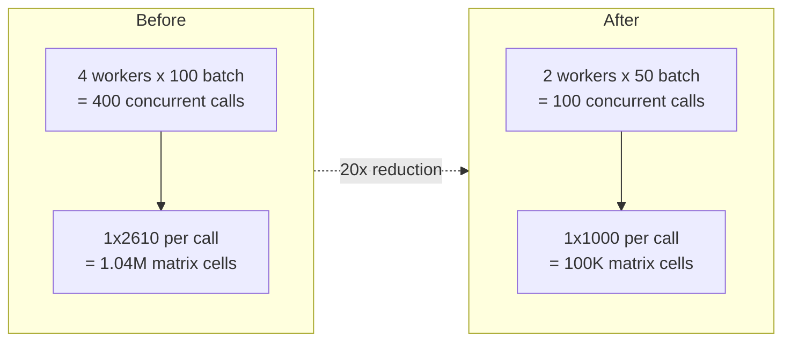

# Plan: Combined Matrix Resilience

## Strategy

Two complementary defenses against ORS overload:

1. **Fixed-size payloads (your approach)**: Chunk destinations to max 1000 per work queue row, so every ORS call is always 1x1000 regardless of resolution
2. **Adaptive parallelism (my approach)**: Scale workers and batch sizes based on target service instance count, and batch error retries



| Metric | Before | Chunks only | Parallelism only | Combined |
|--------|--------|-------------|-----------------|----------|
| Payload per call | 1x2610 | 1x1000 | 1x2610 | **1x1000** |
| Concurrent calls | 400 | 200 | 100 | **100** |
| Peak matrix cells | 1.04M | 200K | 261K | **100K** |
| Safety margin | None | Medium | Medium | **High** |

## Files Changed

| File | Procedure | Change |
|------|-----------|--------|
| [05_matrix_pipeline.sql](native_app/app/modules/05_matrix_pipeline.sql) | `BUILD_WORK_QUEUE` | Chunk destinations into groups of 1000 |
| [05_matrix_pipeline.sql](native_app/app/modules/05_matrix_pipeline.sql) | `BUILD_TRAVEL_TIME_RANGE` | Uniform batch_size=50, batched error retry |
| [05_matrix_pipeline.sql](native_app/app/modules/05_matrix_pipeline.sql) | `BUILD_TRAVEL_TIME_RANGE_REGION` | Uniform batch_size=50, batched error retry |
| [05_matrix_pipeline.sql](native_app/app/modules/05_matrix_pipeline.sql) | `BUILD_MATRIX_FOR_REGION` | Adaptive parallelism |
| [05_matrix_pipeline.sql](native_app/app/modules/05_matrix_pipeline.sql) | `BUILD_MATRIX_JOB_WRAPPER` | Adaptive parallelism, wrapper-level retry sweep |
| [MatrixBuilder.tsx](native_app/services/ors_control_app/src/components/MatrixBuilder.tsx) | UI progress | Show "chunks" instead of "origins" during BUILDING |

---

## Task 1: Chunk Destinations in BUILD_WORK_QUEUE

**File**: [05_matrix_pipeline.sql](native_app/app/modules/05_matrix_pipeline.sql), lines 137-192

Replace the current query (lines 157-182) that creates 1 row per origin with ALL destinations, with a query that splits destinations into groups of 1000.

**Current** (lines 157-182):
```sql
WITH pairs AS (
    SELECT a.H3_INDEX AS origin_h3, ...
           b.H3_INDEX AS dest_h3
    FROM hex_table a CROSS JOIN hex_table b
    WHERE a.H3_INDEX != b.H3_INDEX
),
grouped AS (
    SELECT origin_h3, ...,
           ARRAY_AGG(ARRAY_CONSTRUCT(d.CENTER_LON, d.CENTER_LAT)) AS dest_coords,
           ARRAY_AGG(p.dest_h3) AS dest_hex_ids
    FROM pairs p JOIN hex_table d ON ...
    GROUP BY origin_h3, origin_lon, origin_lat   -- one row per origin
)
SELECT ROW_NUMBER() OVER (ORDER BY origin_h3) AS seq_id, ...
FROM grouped
```

**New**:
```sql
WITH numbered_pairs AS (
    SELECT
        a.H3_INDEX AS origin_h3,
        a.CENTER_LON AS origin_lon,
        a.CENTER_LAT AS origin_lat,
        b.H3_INDEX AS dest_h3,
        b.CENTER_LON AS dest_lon,
        b.CENTER_LAT AS dest_lat,
        ROW_NUMBER() OVER (PARTITION BY a.H3_INDEX ORDER BY b.H3_INDEX) AS dest_seq
    FROM hex_table a
    CROSS JOIN hex_table b
    WHERE a.H3_INDEX != b.H3_INDEX
),
chunked AS (
    SELECT
        origin_h3, origin_lon, origin_lat,
        FLOOR((dest_seq - 1) / 1000) AS chunk_idx,
        ARRAY_AGG(ARRAY_CONSTRUCT(dest_lon, dest_lat)) AS dest_coords,
        ARRAY_AGG(dest_h3) AS dest_hex_ids
    FROM numbered_pairs
    GROUP BY origin_h3, origin_lon, origin_lat, chunk_idx
)
SELECT
    ROW_NUMBER() OVER (ORDER BY origin_h3, chunk_idx) AS seq_id,
    origin_h3, origin_lon, origin_lat, dest_coords, dest_hex_ids
FROM chunked
```

**Effect**: Berlin RES8: 2611 origins x ~3 chunks each = ~7833 work queue rows, each with max 1000 destinations. Small resolutions (RES7 with 372 dests) get 1 row per origin -- no change.

---

## Task 2: Uniform Batch Size (batch_size = 50)

**File**: [05_matrix_pipeline.sql](native_app/app/modules/05_matrix_pipeline.sql)

In both `BUILD_TRAVEL_TIME_RANGE` (lines 224-236) and `BUILD_TRAVEL_TIME_RANGE_REGION` (lines 356-368), replace the per-resolution batch size blocks with a single uniform value.

**Current** (both procedures):
```sql
IF (P_RES = 'RES5') THEN
    batch_size := 10;
ELSEIF (P_RES = 'RES6') THEN
    batch_size := 25;
ELSEIF (P_RES = 'RES7') THEN
    batch_size := 50;
ELSEIF (P_RES = 'RES8') THEN
    batch_size := 100;
ELSEIF (P_RES = 'RES9') THEN
    batch_size := 50;
ELSE
    batch_size := 25;
END IF;
```

**New** (both procedures):
```sql
batch_size := 50;
```

**Rationale**: With every work queue row now capped at 1x1000, a batch of 50 = 50 concurrent 1x1000 ORS calls. This is uniform and predictable. The old per-resolution sizes were compensating for variable payload sizes, which is no longer needed.

---

## Task 3: Batched Error Retry in Both Worker Procedures

**File**: [05_matrix_pipeline.sql](native_app/app/modules/05_matrix_pipeline.sql)

The post-build error retry loop in `BUILD_TRAVEL_TIME_RANGE_REGION` (lines 419-451) fires ALL failed rows in a single INSERT. Replace with batched retry. The same pattern applies to `BUILD_TRAVEL_TIME_RANGE` (which has no post-build retry yet -- it should get one too for completeness, but it's the less-used procedure).

**Current** (lines 425-451):
```sql
WHILE (retry_pass < max_error_retries) DO
    -- count errors
    IF (error_origin_count = 0) THEN break;
    ELSE
        -- DELETE all errors
        -- INSERT ALL missing at once   <-- PROBLEM: unbatched
    END IF;
END WHILE;
```

**New**:
```sql
WHILE (retry_pass < max_error_retries) DO
    error_retry_sql := 'SELECT COUNT(*) AS CNT FROM ' || raw_table ||
        ' WHERE SEQ_ID BETWEEN ' || P_START_SEQ || ' AND ' || P_END_SEQ ||
        ' AND MATRIX_RESULT:durations IS NULL';
    rs := (EXECUTE IMMEDIATE :error_retry_sql);
    LET ec CURSOR FOR rs;
    FOR r IN ec DO error_origin_count := r.CNT; END FOR;

    IF (error_origin_count = 0) THEN
        retry_pass := max_error_retries;
    ELSE
        retry_pass := retry_pass + 1;
        EXECUTE IMMEDIATE 'SELECT SYSTEM$WAIT(30)';

        EXECUTE IMMEDIATE 'DELETE FROM ' || raw_table ||
            ' WHERE SEQ_ID BETWEEN ' || P_START_SEQ || ' AND ' || P_END_SEQ ||
            ' AND MATRIX_RESULT:durations IS NULL';

        LET retry_min INTEGER;
        LET retry_max INTEGER;
        rs := (EXECUTE IMMEDIATE '
            SELECT MIN(q.SEQ_ID) AS MN, MAX(q.SEQ_ID) AS MX FROM ' || queue_table || ' q
            WHERE q.SEQ_ID BETWEEN ' || P_START_SEQ || ' AND ' || P_END_SEQ ||
            ' AND q.SEQ_ID NOT IN (SELECT SEQ_ID FROM ' || raw_table ||
            ' WHERE SEQ_ID BETWEEN ' || P_START_SEQ || ' AND ' || P_END_SEQ || ')');
        LET mc CURSOR FOR rs;
        FOR r IN mc DO retry_min := r.MN; retry_max := r.MX; END FOR;

        IF (retry_min IS NOT NULL) THEN
            LET rpos INTEGER := retry_min;
            WHILE (rpos <= retry_max) DO
                LET rend INTEGER := LEAST(rpos + batch_size - 1, retry_max);
                BEGIN
                    EXECUTE IMMEDIATE '
                    INSERT INTO ' || raw_table || '
                    SELECT q.SEQ_ID, q.ORIGIN_H3, q.DEST_HEX_IDS, ' || matrix_call || '
                    FROM ' || queue_table || ' q
                    WHERE q.SEQ_ID BETWEEN ' || rpos || ' AND ' || rend ||
                    ' AND q.SEQ_ID NOT IN (SELECT SEQ_ID FROM ' || raw_table ||
                    ' WHERE SEQ_ID BETWEEN ' || rpos || ' AND ' || rend || ')';
                EXCEPTION WHEN OTHER THEN NULL;
                END;
                rpos := rend + 1;
            END WHILE;
        END IF;
    END IF;
END WHILE;
```

---

## Task 4: Adaptive Parallelism in Wrappers

**File**: [05_matrix_pipeline.sql](native_app/app/modules/05_matrix_pipeline.sql)

### In BUILD_MATRIX_JOB_WRAPPER (lines 783-792)

**Current**:
```sql
LET parallel_count INTEGER := 4;
```

**New**: Query target service instance count, scale workers accordingly:
```sql
LET svc_instances INTEGER := 3;
IF (NOT is_default) THEN
    BEGIN
        SHOW SERVICES LIKE 'ORS_SERVICE_%' IN SCHEMA core;
        LET svc_rs2 RESULTSET := (
            SELECT "min_instances"::INTEGER AS MI
            FROM TABLE(RESULT_SCAN(LAST_QUERY_ID()))
            WHERE "name" = 'ORS_SERVICE_' || UPPER(P_REGION)
            LIMIT 1
        );
        LET sc CURSOR FOR svc_rs2;
        FOR r IN sc DO svc_instances := r.MI; END FOR;
    EXCEPTION WHEN OTHER THEN svc_instances := 1;
    END;
END IF;

LET parallel_count INTEGER := LEAST(GREATEST(svc_instances, 1), 4);
```

**Effect**: Berlin (1 instance) = 1 worker. Default (3 instances) = 3 workers. This combines with the 1x1000 chunks for minimal ORS load.

### In BUILD_MATRIX_FOR_REGION (lines 529, 569)

Same adaptive logic -- detect service instances and set `parallel_count` accordingly. This procedure also hardcodes `parallel_count DEFAULT 4` at line 529.

---

## Task 5: Wrapper-Level Retry Sweep

**File**: [05_matrix_pipeline.sql](native_app/app/modules/05_matrix_pipeline.sql), lines 793-830 (BUILD_MATRIX_JOB_WRAPPER, after AWAIT ALL)

After parallel workers finish but before the error counting (line 795), add a single-threaded retry sweep. This catches any remaining failed rows that the per-worker retry missed.

**Insert after line 793** (`AWAIT ALL;`):
```sql
LET sweep_pass INTEGER DEFAULT 0;
LET sweep_error_count INTEGER DEFAULT 0;
LET sweep_batch_size INTEGER := 25;

WHILE (sweep_pass < 2) DO
    rs := (EXECUTE IMMEDIATE 'SELECT COUNT(*) AS CNT FROM ' || prefix || '_MATRIX_RAW_' || P_RES ||
        ' WHERE MATRIX_RESULT:durations IS NULL');
    LET sc1 CURSOR FOR rs;
    FOR r IN sc1 DO sweep_error_count := r.CNT; END FOR;

    IF (sweep_error_count = 0) THEN
        sweep_pass := 2;
    ELSE
        sweep_pass := sweep_pass + 1;
        UPDATE travel_matrix.MATRIX_BUILD_JOBS
        SET MESSAGE='Retry sweep ' || :sweep_pass || ': fixing ' || :sweep_error_count || ' failed chunks'
        WHERE JOB_ID = :P_JOB_ID;

        EXECUTE IMMEDIATE 'DELETE FROM ' || prefix || '_MATRIX_RAW_' || P_RES ||
            ' WHERE MATRIX_RESULT:durations IS NULL';
        EXECUTE IMMEDIATE 'SELECT SYSTEM$WAIT(30)';

        LET sw_min INTEGER; LET sw_max INTEGER;
        rs := (EXECUTE IMMEDIATE '
            SELECT MIN(q.SEQ_ID) AS MN, MAX(q.SEQ_ID) AS MX
            FROM ' || prefix || '_WORK_QUEUE_' || P_RES || ' q
            WHERE q.SEQ_ID NOT IN (SELECT SEQ_ID FROM ' || prefix || '_MATRIX_RAW_' || P_RES || ')');
        LET swc CURSOR FOR rs;
        FOR r IN swc DO sw_min := r.MN; sw_max := r.MX; END FOR;

        IF (sw_min IS NOT NULL) THEN
            LET matrix_fn_call VARCHAR;
            IF (is_default) THEN
                matrix_fn_call := P_MATRIX_FN || '(''' || P_PROFILE || ''', ARRAY_CONSTRUCT(q.ORIGIN_LON, q.ORIGIN_LAT), q.DEST_COORDS)';
            ELSE
                matrix_fn_call := P_MATRIX_FN || '(''' || P_REGION || ''', ''' || P_PROFILE || ''', ARRAY_CONSTRUCT(q.ORIGIN_LON, q.ORIGIN_LAT), q.DEST_COORDS)';
            END IF;
            LET sw_pos INTEGER := sw_min;
            WHILE (sw_pos <= sw_max) DO
                LET sw_end INTEGER := LEAST(sw_pos + sweep_batch_size - 1, sw_max);
                BEGIN
                    EXECUTE IMMEDIATE '
                    INSERT INTO ' || prefix || '_MATRIX_RAW_' || P_RES || '
                    SELECT q.SEQ_ID, q.ORIGIN_H3, q.DEST_HEX_IDS, ' || matrix_fn_call || '
                    FROM ' || prefix || '_WORK_QUEUE_' || P_RES || ' q
                    WHERE q.SEQ_ID BETWEEN ' || sw_pos || ' AND ' || sw_end ||
                    ' AND q.SEQ_ID NOT IN (SELECT SEQ_ID FROM ' || prefix || '_MATRIX_RAW_' || P_RES ||
                    ' WHERE SEQ_ID BETWEEN ' || sw_pos || ' AND ' || sw_end || ')';
                EXCEPTION WHEN OTHER THEN NULL;
                END;
                sw_pos := sw_end + 1;
            END WHILE;
        END IF;
    END IF;
END WHILE;
```

---

## Task 6: Update UI Progress Label

**File**: [MatrixBuilder.tsx](native_app/services/ors_control_app/src/components/MatrixBuilder.tsx), line 270

With chunked work queues, `work_queue_rows` > `hexagons`. Update the label:

**Current**:
```tsx
{job.stage === 'BUILDING' && <span>{formatNumber(job.raw_rows)} / {formatNumber(job.work_queue_rows)} origins</span>}
```

**New**:
```tsx
{job.stage === 'BUILDING' && <span>{formatNumber(job.raw_rows)} / {formatNumber(job.work_queue_rows)} chunks ({formatNumber(job.hexagons)} origins)</span>}
```

---

## Task 7: Deploy and Verify

1. Run `snow app run --connection fleet_test_evals`
2. Trigger Berlin cycling-electric RES8 rebuild from UI
3. Monitor progress -- should see ~7833 chunks, 1 or 2 workers
4. Verify near-100% success rate on completion

## FLATTEN_MATRIX_RAW -- No Changes Needed

The flatten code (lines 478-492) already handles multiple rows per origin correctly:
```sql
SELECT
    r.ORIGIN_H3,
    r.DEST_HEX_IDS[f.INDEX]::VARCHAR AS DEST_H3,
    r.MATRIX_RESULT:durations[0][f.INDEX]::FLOAT AS TRAVEL_TIME_SECONDS,
    ...
FROM raw_table r,
    LATERAL FLATTEN(input => r.MATRIX_RESULT:durations[0]) f
WHERE r.MATRIX_RESULT:durations IS NOT NULL
```

Each row's `DEST_HEX_IDS` array matches its own `MATRIX_RESULT` indices, so chunked rows flatten correctly into the same origin-dest pairs.
