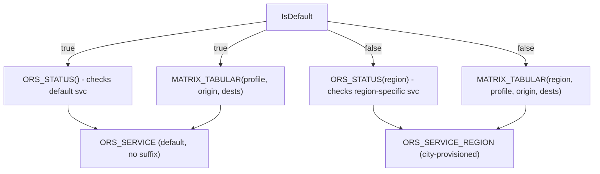

# Plan: Data-Driven Default Region Detection

## Problem

The codebase hardcodes checks like `UPPER(P_REGION) IN ('DEFAULT', 'SAN_FRANCISCO')` to determine if a region maps to the default `ORS_SERVICE` or a city-specific `ORS_SERVICE_<REGION>`. This breaks for any city name that doesn't match the hardcoded list (including `SanFrancisco` which uppercases to `SANFRANCISCO`, not `SAN_FRANCISCO`).

The problem exists in two layers:
- **SQL stored procedures** in `05_matrix_pipeline.sql`
- **TypeScript server** in `server/index.ts`

## Architecture



## Strategy

Instead of hardcoding region names, **check whether a region-specific service actually exists** via `SHOW SERVICES`. If `ORS_SERVICE_<REGION>` exists, it is a city-specific region. If not, it must be the default.

## Changes

### Task 1: Fix `BUILD_MATRIX_JOB_WRAPPER` in `05_matrix_pipeline.sql`

**Files:** [app/modules/05_matrix_pipeline.sql](.cortex/skills/build-routing-solution/native_app/app/modules/05_matrix_pipeline.sql) (line ~660-700)

Add a service-existence check near the top of the procedure (after the `STARTED_AT` update at line 674, before the service resume block at line 678):

```sql
LET is_default BOOLEAN DEFAULT TRUE;
BEGIN
    LET svc_rs RESULTSET := (EXECUTE IMMEDIATE
        'SHOW SERVICES LIKE ''ORS_SERVICE_' || UPPER(P_REGION) || ''' IN SCHEMA CORE');
    LET svc_c CURSOR FOR svc_rs;
    FOR r IN svc_c DO
        is_default := FALSE;
    END FOR;
EXCEPTION WHEN OTHER THEN NULL;
END;
```

Then replace **line 694** (the hardcoded check inside the WHILE loop):
```sql
-- BEFORE (hardcoded):
LET is_default BOOLEAN := (UPPER(P_REGION) IN ('DEFAULT', 'SAN_FRANCISCO', 'SANFRANCISCO'));
-- AFTER (uses the variable computed above):
-- (remove this line entirely; is_default is already set)
```

The `is_default` variable computed once at procedure start replaces the per-iteration check inside the WHILE loop. The `IF (is_default) THEN` on line 695 stays as-is but now uses the data-driven variable.

### Task 2: Fix `BUILD_TRAVEL_TIME_RANGE_REGION` in `05_matrix_pipeline.sql`

**Files:** Same file, line ~301-330

Add the same service-existence check at the top of this procedure (after line 327, before line 329):

```sql
LET is_default BOOLEAN DEFAULT TRUE;
BEGIN
    LET svc_rs RESULTSET := (EXECUTE IMMEDIATE
        'SHOW SERVICES LIKE ''ORS_SERVICE_' || UPPER(P_REGION) || ''' IN SCHEMA CORE');
    LET svc_c CURSOR FOR svc_rs;
    FOR r IN svc_c DO
        is_default := FALSE;
    END FOR;
EXCEPTION WHEN OTHER THEN NULL;
END;
```

Then replace **line 329**:
```sql
-- BEFORE (hardcoded):
IF (P_REGION IS NOT NULL AND UPPER(P_REGION) NOT IN ('DEFAULT', 'SAN_FRANCISCO', 'SANFRANCISCO')) THEN
-- AFTER (data-driven):
IF (NOT is_default) THEN
```

### Task 3: Fix `waitForOrsGraphReady` in TypeScript server

**File:** [server/index.ts](.cortex/skills/build-routing-solution/native_app/services/ors_control_app/server/index.ts) (line 40-44)

Replace the hardcoded check:
```ts
// BEFORE:
const isDefault = !safeRegion || safeRegion.toUpperCase() === 'DEFAULT' || safeRegion.toUpperCase() === 'SAN_FRANCISCO';

// AFTER:
let isDefault = !safeRegion || safeRegion.toUpperCase() === 'DEFAULT';
if (!isDefault) {
  try {
    const svcRows = await runSql(
      `SHOW SERVICES LIKE 'ORS_SERVICE_${safeRegion.toUpperCase()}' IN SCHEMA ${SF_DATABASE}.CORE`
    );
    isDefault = !svcRows || svcRows.length === 0;
  } catch { isDefault = true; }
}
```

This keeps the fast-path for `DEFAULT` and `''` but for any other region name, it checks if a region-specific service actually exists.

### Task 4: Sync deploy copies

Mirror all SQL changes from `app/modules/05_matrix_pipeline.sql` to `output/deploy/modules/05_matrix_pipeline.sql` (identical content).

### Task 5: Deploy and verify

1. Run `snow app run -c fleet_test_evals --warehouse ROUTING_ANALYTICS`
2. Verify procedure has data-driven check:
   ```sql
   SELECT CONTAINS(GET_DDL('PROCEDURE', '...BUILD_MATRIX_JOB_WRAPPER...'), 'SHOW SERVICES') AS FIXED;
   ```
3. Test with a matrix build using the default region

## Scope

Only the `build-routing-solution` skill is in scope. The `fleet-intelligence-food-delivery` skill has similar patterns but is a separate skill with its own deployment lifecycle -- it should be fixed separately if needed.