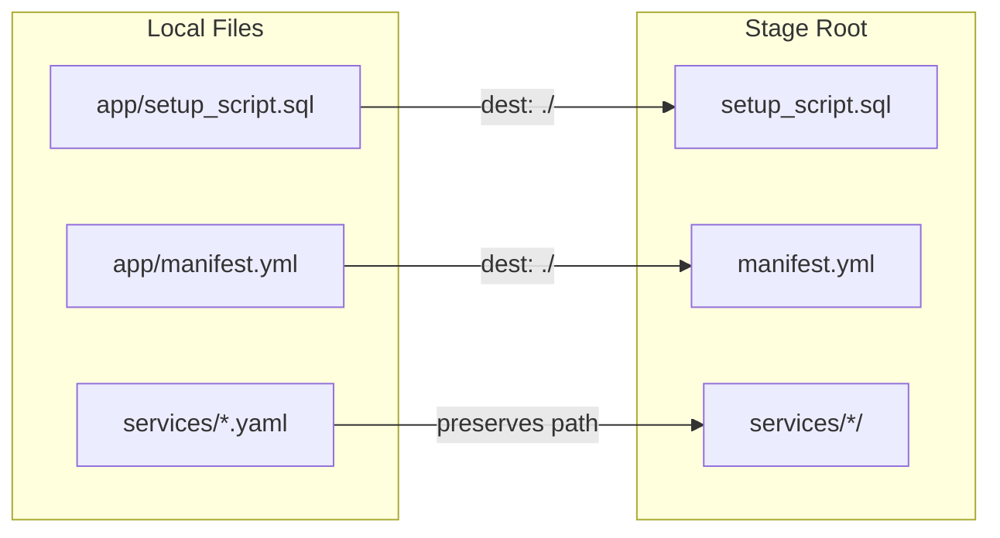

# Plan: Strengthen Guidelines with Stage File Map, Version Inspection, and Guardrails

## Problem

The same class of deployment mistakes keeps recurring:
1. PUTting files to the wrong stage path (`app/` vs root)
2. Not verifying what is actually deployed after upgrade
3. Stale version references in `manifest.yml` (still says `ors_control_app:v1.0.28`, should be `v1.0.29`)
4. No quick way to check "what version is live right now?"

## Changes

### 1. Add Stage File Map to [references/snowflake-scripting-guidelines.md](references/snowflake-scripting-guidelines.md)

Add a new section (after the existing Section 2 "Stage Path") with a complete map of every local file and its correct stage destination:

```
## Stage File Map

| Local File (relative to native_app/) | Stage Path | Deployed By |
|---------------------------------------|-----------|-------------|
| app/setup_script.sql | @STAGE/ (ROOT) | deploy.sh, manual PUT |
| app/manifest.yml | @STAGE/ (ROOT) | deploy.sh, snow app run |
| app/README.md | @STAGE/ (ROOT) | snow app run |
| services/ors_control_app/ors_control_app_service.yaml | @STAGE/services/ors_control_app/ | deploy.sh, ors_control_app/deploy.sh |
| services/gateway/routing-gateway-service.yaml | @STAGE/services/gateway/ | deploy.sh |
| services/openrouteservice/openrouteservice.yaml | @STAGE/services/openrouteservice/ | snow app run |
| services/downloader/downloader_spec.yaml | @STAGE/services/downloader/ | snow app run |
| services/vroom/vroom-service.yaml | @STAGE/services/vroom/ | snow app run |
| code_artifacts/streamlit/* | @STAGE/streamlit/ | snow app run |
```

The key insight is `snowflake.yml` maps `src: app/*` to `dest: ./` (stage root). So `app/setup_script.sql` becomes `@STAGE/setup_script.sql`, NOT `@STAGE/app/setup_script.sql`.

Include a diagram:



### 2. Add Deployment Verification SQL to [references/snowflake-scripting-guidelines.md](references/snowflake-scripting-guidelines.md)

Add a new section "Deployment Verification" with SQL queries to inspect the live state:

```sql
-- 1. Check staged file sizes and timestamps
LIST @OPENROUTESERVICE_NATIVE_APP_PKG.APP_SRC.STAGE PATTERN='.*setup_script.*';
LIST @OPENROUTESERVICE_NATIVE_APP_PKG.APP_SRC.STAGE PATTERN='.*manifest.*';

-- 2. Check procedure ownership (must be app name, NOT ACCOUNTADMIN)
SELECT PROCEDURE_NAME, PROCEDURE_OWNER, CREATED
FROM OPENROUTESERVICE_NATIVE_APP.INFORMATION_SCHEMA.PROCEDURES
WHERE PROCEDURE_SCHEMA = 'CORE'
  AND PROCEDURE_NAME IN ('BUILD_MATRIX_JOB_WRAPPER','BUILD_TRAVEL_TIME_RANGE_REGION','VERSION_INIT')
ORDER BY PROCEDURE_NAME;

-- 3. Check running service images (shows actual deployed image tags)
SELECT v.value:containerName::VARCHAR AS container,
       v.value:image::VARCHAR AS image,
       v.value:status::VARCHAR AS status
FROM TABLE(OPENROUTESERVICE_NATIVE_APP.INFORMATION_SCHEMA.SHOW_SERVICES_IN_SCHEMA('CORE')) s,
     LATERAL FLATTEN(PARSE_JSON(s."container_status")) v;

-- 4. Check manifest image list on stage (what upgrade WOULD deploy)
SELECT $1 FROM @OPENROUTESERVICE_NATIVE_APP_PKG.APP_SRC.STAGE/manifest.yml
WHERE $1 LIKE '%image_repository%';

-- 5. Verify a specific procedure has the expected fix
SELECT CASE
  WHEN POSITION('wait_secs' IN GET_DDL('PROCEDURE','OPENROUTESERVICE_NATIVE_APP.CORE.BUILD_MATRIX_JOB_WRAPPER(VARCHAR,VARCHAR,FLOAT,FLOAT,FLOAT,FLOAT,VARCHAR,VARCHAR,VARCHAR)')) > 0
  THEN 'OK: has wait_secs fix'
  ELSE 'STALE: missing wait_secs'
END AS status;

-- 6. Check for stale app/ copies
LIST @OPENROUTESERVICE_NATIVE_APP_PKG.APP_SRC.STAGE/app/ PATTERN='.*setup_script.*';
-- If any results: the stale copy should be removed
```

### 3. Add Pre-Deployment Checklist to [references/snowflake-scripting-guidelines.md](references/snowflake-scripting-guidelines.md)

A mandatory checklist to run before and after every deployment:

**Before deploying:**
- [ ] Sandbox-tested all changed SQL patterns
- [ ] PUT targets stage ROOT for `setup_script.sql` and `manifest.yml`
- [ ] No stale `@STAGE/app/setup_script.sql` on stage (remove if present)
- [ ] `manifest.yml` image tags match the actual pushed image tags
- [ ] Service YAML image tags match the actual pushed image tags

**After deploying:**
- [ ] Run verification queries (Section N) to confirm changes applied
- [ ] All `PROCEDURE_OWNER` values show app name, not ACCOUNTADMIN
- [ ] No stale `app/` copies remain on stage

### 4. Fix Stale Manifest Image Reference in [native_app/app/manifest.yml](native_app/app/manifest.yml)

The local `manifest.yml` line 14 says:
```yaml
- /openrouteservice_setup/public/image_repository/ors_control_app:v1.0.28
```
But the deployed service YAML at [services/ors_control_app/ors_control_app_service.yaml](services/ors_control_app/ors_control_app_service.yaml) line 4 says:
```yaml
image: /openrouteservice_setup/public/image_repository/ors_control_app:v1.0.29
```
Update `manifest.yml` to `v1.0.29` to match reality.

### 5. Add Guardrails Step to [SKILL.md](SKILL.md)

In the "Fast Deploy" section and "Example 3", add a mandatory reference:

> **Before any deployment**, review the pre-deployment checklist and verification queries in `references/snowflake-scripting-guidelines.md`.

Also add a new subsection right before "Cleanup":

```markdown
## Coding Guidelines

Before modifying `setup_script.sql` or any service YAML, read `references/snowflake-scripting-guidelines.md`. It covers:
- Variable binding rules (colon prefix gotchas)
- Stage file map (where each file must be PUT)
- Pre-deployment and post-deployment checklists
- Deployment verification SQL
- Sandbox testing workflow
- Common pitfalls and their fixes

These guidelines exist because past issues were caused by wrong stage paths, incorrect variable syntax, and missing verification steps. Follow them to avoid repeating these mistakes.
```

## Files Modified

| File | Change |
|------|--------|
| `references/snowflake-scripting-guidelines.md` | Add 3 new sections: Stage File Map, Deployment Verification SQL, Pre-Deployment Checklist |
| `native_app/app/manifest.yml` | Fix `ors_control_app:v1.0.28` to `v1.0.29` |
| `SKILL.md` | Add "Coding Guidelines" section referencing the guidelines doc |
