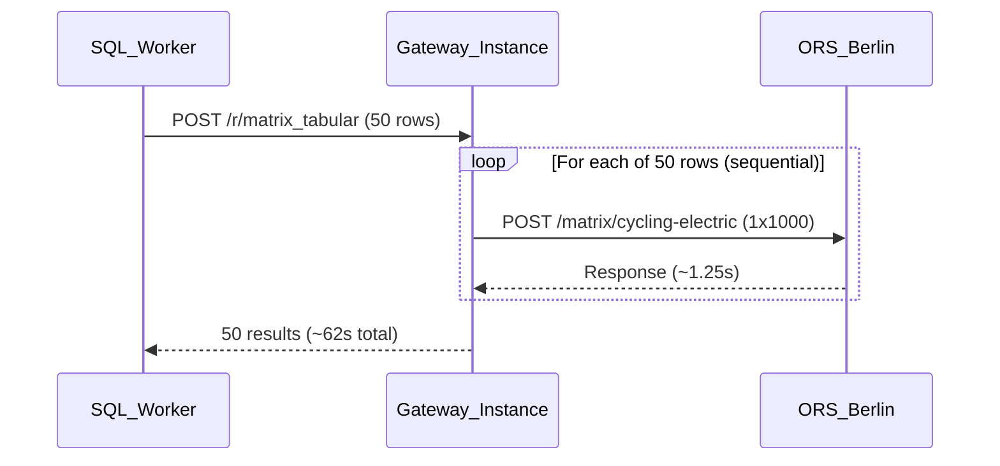
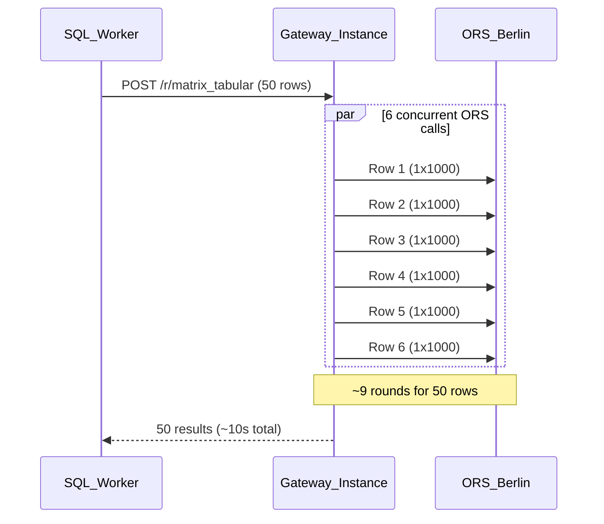

# Plan: Matrix Speed Optimization

## Problem Analysis

Berlin RES8 completed with 0 errors but took **163 minutes** for 7833 chunks (6.8M pairs). The bottleneck analysis:

```
7833 chunks / batch_size 50 = 157 batches
163 min / 157 batches = ~62 seconds per batch
Each batch = 50 ORS calls of 1x1000, processed SEQUENTIALLY by gateway
50 calls x ~1.25s each = ~62s -- matches observation exactly
```

The root cause is in [routing_service.py:636-654](native_app/services/gateway/routing_service.py): the gateway processes rows in a simple `for` loop -- every ORS call waits for the previous one to finish before starting.



## Proposed Changes (3 layers of speedup)

### Layer 1: Gateway Concurrent Processing (biggest impact, ~6x)

In [routing_service.py](native_app/services/gateway/routing_service.py), add `ThreadPoolExecutor` to process rows concurrently within each batch. Instead of 50 sequential ORS calls, process 6 at a time.

```python
from concurrent.futures import ThreadPoolExecutor

MATRIX_CONCURRENCY = int(os.getenv('MATRIX_CONCURRENCY', '6'))
```

For `post_matrix_tabular_region` (line 624) and `post_matrix_tabular` (line 590), replace the sequential `for` loop with:

```python
def _process_matrix_row(row_data):
    row, ors_host, method, has_dest = row_data
    body = _build_matrix_body(method, row[3:] if ors_host else row[2:], has_dest)
    resp = get_ors_response('matrix', method, body, format, ors_host)
    # ... error 6099 retry logic stays the same ...
    return [row[0], resp]

with ThreadPoolExecutor(max_workers=MATRIX_CONCURRENCY) as executor:
    output_rows = list(executor.map(_process_matrix_row, prepared_rows))
```

This is safe because:
- `requests` library is thread-safe
- ORS (Java/Tomcat) handles concurrent requests natively
- 6 concurrent calls is well within ORS capacity for 1x1000 matrices
- Order is preserved by `executor.map()` (unlike `as_completed`)
- Individual row failures still return error JSON, same as today

**Expected speedup: 50 sequential calls down to ~9 rounds of 6 = ~10s per batch instead of ~62s.**



### Layer 2: Gunicorn (production stability + concurrency)

Replace `python3 routing_service.py` (Flask dev server, single-threaded) with gunicorn:

In [Dockerfile](native_app/services/gateway/Dockerfile):
```dockerfile
RUN pip install flask requests polyline gunicorn
CMD ["gunicorn", "--bind", "0.0.0.0:8080", "--workers", "2", "--threads", "4", "--timeout", "300", "routing_service:app"]
```

- 2 workers x 4 threads = 8 concurrent request handlers
- `--timeout 300` prevents worker kills during long matrix batches
- This ensures the Flask app can handle concurrent requests from multiple SQL workers properly

### Layer 3: Allow 2 SQL Workers for City Services (additional ~2x)

In [05_matrix_pipeline.sql](native_app/app/modules/05_matrix_pipeline.sql), the adaptive parallelism currently caps city services at their instance count (1 for Berlin). Since the gateway has 3 instances and ORS can handle moderate concurrency, allow 2 workers even for 1-instance cities:

Currently (line 825):
```sql
LET parallel_count INTEGER := LEAST(GREATEST(svc_instances, 1), 4);
```

Change to (both BUILD_MATRIX_JOB_WRAPPER and BUILD_MATRIX_FOR_REGION):
```sql
LET parallel_count INTEGER := LEAST(GREATEST(svc_instances * 2, 2), 4);
```

- 1-instance city (Berlin): `LEAST(GREATEST(1*2, 2), 4)` = 2 workers
- 3-instance default: `LEAST(GREATEST(3*2, 2), 4)` = 4 workers (unchanged)
- Each worker sends batches to different gateway instances via SPCS load balancing
- Combined with gateway concurrency: 2 workers x 6 concurrent = 12 parallel ORS calls max

### Combined Expected Performance

| Metric | Current | After Changes |
|--------|---------|---------------|
| Gateway concurrency | 1 (sequential) | 6 (ThreadPool) |
| SQL workers (Berlin) | 1 | 2 |
| Effective ORS parallelism | 1 | ~12 |
| Time per batch of 50 | ~62s | ~10s |
| Batches (Berlin RES8) | 157 | ~79 (split across 2 workers) |
| **Estimated total time** | **163 min** | **~15-25 min** |

### Version and Deployment

- Bump gateway image tag from `v0.9.5` to `v0.9.6` in:
  - [routing-gateway-service.yaml](native_app/services/gateway/routing-gateway-service.yaml) (line 4)
  - `snow app run` will pick up the new image

- Build and push:
  ```bash
  cd native_app/services/gateway
  docker build --rm --platform linux/amd64 -t $REPO_URL/routing_reverse_proxy:v0.9.6 .
  docker push $REPO_URL/routing_reverse_proxy:v0.9.6
  ```

- Deploy: `snow app run --connection fleet_test_evals`

## Safety Assessment

| Change | Risk | Rollback |
|--------|------|----------|
| Gateway ThreadPoolExecutor | Low -- `requests` is thread-safe, ORS handles concurrency natively | Revert to v0.9.5 image |
| Gunicorn | Very low -- standard Flask production pattern | Revert Dockerfile CMD |
| 2 SQL workers for city | Low -- just 2 concurrent streams | Change multiplier back to 1 |

All changes are independently reversible. The retry/resilience layer from the previous deployment remains fully intact.
