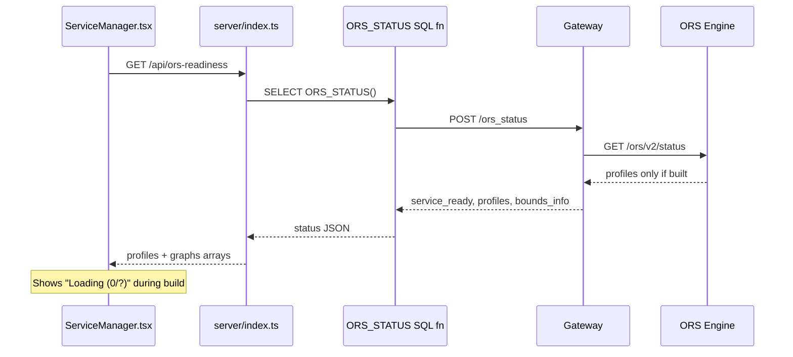

# Plan: Show Actual Graph Build Status in Services Tab

## Problem

When ORS starts, it takes 3-10 minutes to build routing graphs. During this time, the Services tab shows misleading info: services appear as "RUNNING" but the "Graphs" column shows `Loading (0/?)` because `ORS_STATUS()` returns no profiles until graphs are fully built. The `?` for expected profiles is the key issue -- the UI doesn't know how many profiles to expect.

## Data Flow (Current)



## Root Cause

1. **Gateway** (`_get_ors_status`): Only calls `/ors/v2/status` which returns profiles AFTER they're built. Does NOT call `/ors/v2/health` which distinguishes "building" from "error".
2. **Server** (`/api/ors-readiness`): Knows built profiles but NOT expected profiles. For the default region, expected profiles come from `ors-config.yml` on stage. For provisioned cities, they're stored in `CITY_PROVISION_JOBS.PROFILES`.
3. **UI** (`ServiceManager.tsx`): Tries to show `graphs.filter(g => g.ready).length / graphs.length` but `graphs` only contains built profiles, so during building it's `0/0` shown as `Loading (0/?)`.

## Changes

### 1. Gateway: Add ORS health check

**File:** [routing_service.py](build-routing-solution/Native_app/services/gateway/routing_service.py)

Enhance `_get_ors_status()` to also call `/ors/v2/health` and include `health_ready` in the response. This distinguishes "building" from "error" from "ready":

```python
# Inside _get_ors_status, after getting status_data:
try:
    health_url = f'http://{host}:{ORS_PORT}{ORS_API_PATH}/health'
    hr = requests.get(url=health_url, timeout=5)
    status_data['health_ready'] = hr.status_code == 200
except:
    status_data['health_ready'] = False
```

**Bump image version** to `v0.9.5` in:
- [routing-gateway-service.yaml](build-routing-solution/Native_app/services/gateway/routing-gateway-service.yaml)
- [manifest.yml](build-routing-solution/Native_app/app/manifest.yml) (container_services.images list)

### 2. Server: Return expected profiles alongside built profiles

**File:** [server/index.ts](build-routing-solution/Native_app/services/ors_control_app/server/index.ts)

Enhance the `/api/ors-readiness` endpoint to:

a) For the **default** region: read the expected profiles from the staged `ors-config.yml` (parse it to find enabled profiles) via SQL:
```sql
SELECT "$1" AS CONTENT FROM @CORE.ORS_SPCS_STAGE/SanFrancisco/ors-config.yml (FILE_FORMAT => (TYPE='CSV' FIELD_DELIMITER=NONE RECORD_DELIMITER=NONE))
```
Then parse the YAML text to extract profile names where `enabled: true`. Cache the result.

b) For **provisioned cities**: read expected profiles from `CITY_PROVISION_JOBS` table:
```sql
SELECT PROFILES FROM CITY_PROVISION_JOBS WHERE REGION = '...' AND STATUS = 'COMPLETED' ORDER BY COMPLETED_AT DESC LIMIT 1
```

c) Return enhanced readiness with `expected_profiles` list and `health_ready` flag:
```typescript
{
  service_ready: boolean,
  health_ready: boolean,         // NEW: from gateway health check
  profiles: string[],            // built profiles (existing)
  expected_profiles: string[],   // NEW: from config/provisioning
  graphs: OrsGraphInfo[],        // existing, but now includes expected unbuilt profiles
}
```

d) Build the `graphs` array to include ALL expected profiles, marking unbuilt ones as `ready: false`:
```typescript
const allProfiles = [...new Set([...builtProfiles, ...expectedProfiles])];
const graphs = allProfiles.map(p => ({
  profile: p,
  ready: builtProfiles.includes(p),
  build_date: boundsInfo[p]?.graph_build_date || null,
}));
```

**Bump image version** to `v1.0.28` in:
- [ors_control_app_service.yaml](build-routing-solution/Native_app/services/ors_control_app/ors_control_app_service.yaml)
- [manifest.yml](build-routing-solution/Native_app/app/manifest.yml) (container_services.images list)

### 3. Types: Add new fields

**File:** [types.ts](build-routing-solution/Native_app/services/ors_control_app/src/types.ts)

```typescript
export interface OrsRegionReadiness {
  service_ready: boolean;
  health_ready?: boolean;            // NEW
  profiles: string[];
  expected_profiles?: string[];       // NEW
  graphs: OrsGraphInfo[];
  error?: string;
}
```

### 4. UI: Show per-profile build progress

**File:** [ServiceManager.tsx](build-routing-solution/Native_app/services/ors_control_app/src/components/ServiceManager.tsx)

**Status card** (line 93-98): Replace `"Loading graphs..."` with actual progress:
```
"Building... (1/3 profiles)" or "Ready (3/3)"
```

**Services table Graphs column** (line 117-133): Show per-profile detail:
- Ready: `Ready (3/3)` with green badge
- Building: `Building (1/3)` with amber badge + list of profile statuses
- Error: `Error` with red badge

**Warning banner** (line 143-155): Show which profiles are built vs building:
```
Graphs Building: Default (San Francisco)
  - driving-car: Ready
  - driving-hgv: Building...
  - cycling-electric: Building...
```

### 5. Build, push, and deploy

Rebuild and push 2 images, then upgrade the native app:

```bash
# 1. Rebuild gateway (routing_reverse_proxy)
docker build --platform linux/amd64 -t $REPO_URL/routing_reverse_proxy:v0.9.5 .
docker push $REPO_URL/routing_reverse_proxy:v0.9.5

# 2. Rebuild control app (local build + runtime Dockerfile)
npm ci && npm run build && npm run build:server
docker build --platform linux/amd64 -f Dockerfile.runtime -t $REPO_URL/ors_control_app:v1.0.28 .
docker push $REPO_URL/ors_control_app:v1.0.28

# 3. Deploy via snow app run (or fast-deploy)
cd Native_app && snow app run -c fleet_test_evals --warehouse ROUTING_ANALYTICS
```

## UI Mockup (Services Tab)

```
+--------------------------------------------------+
| Compute Pool  | ORS Health | Services | Graphs    |
| ACTIVE        | Healthy    | 5/5      | Building  |
|               |            | running  | (1/3)     |
+--------------------------------------------------+

Services:
| Service                  | Status  | Graphs              |
|--------------------------|---------|----------------------|
| ORS_SERVICE              | RUNNING | Building (1/3)       |
|                          |         |   driving-car: Ready |
|                          |         |   driving-hgv: ...   |
|                          |         |   cycling-electric ...|
| ROUTING_GATEWAY_SERVICE  | RUNNING | N/A                  |
| VROOM_SERVICE            | RUNNING | N/A                  |
| DOWNLOADER_SERVICE       | RUNNING | N/A                  |
| ORS_CONTROL_APP          | RUNNING | N/A                  |

[!] Graphs Building: ORS is loading routing graphs.
    Functions will return errors until all profiles
    are ready. This typically takes 3-10 minutes.
      - driving-car: Ready
      - driving-hgv: Building...
      - cycling-electric: Building...
```

## Files Modified

| File | Change |
|------|--------|
| `build-routing-solution/Native_app/services/gateway/routing_service.py` | Add `/v2/health` call in `_get_ors_status` |
| `build-routing-solution/Native_app/services/gateway/routing-gateway-service.yaml` | Bump image tag to v0.9.5 |
| `build-routing-solution/Native_app/services/ors_control_app/server/index.ts` | Add expected profiles logic to `/api/ors-readiness` |
| `build-routing-solution/Native_app/services/ors_control_app/src/types.ts` | Add `health_ready`, `expected_profiles` fields |
| `build-routing-solution/Native_app/services/ors_control_app/src/components/ServiceManager.tsx` | Show per-profile build progress |
| `build-routing-solution/Native_app/services/ors_control_app/ors_control_app_service.yaml` | Bump image tag to v1.0.28 |
| `build-routing-solution/Native_app/app/manifest.yml` | Update image tags in container_services |
