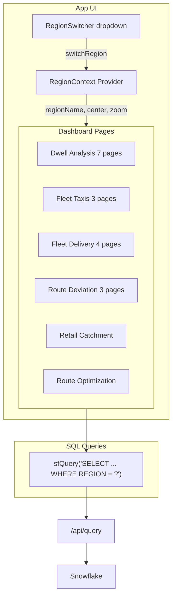

# Plan: Region Filter + San Francisco Data Regeneration

## Current State

All data across the app is a mix of regions:
- **Dwell Analysis** (11.3M rows): **Germany** (lat 50.91, lng 9.6) -- wrong
- **Route Deviation** (15M telemetry): **Germany** (lat 50.91, lng 9.6) -- wrong
- **Fleet Taxis**: **San Francisco** (approx -122.4, 37.77) -- correct
- **Fleet Delivery**: **San Francisco** (-122.42, 37.77) -- correct
- **Retail Catchment / Route Optimization**: **San Francisco** -- correct

The dwell and route-deviation data originates from `SYNTHETIC_DATASETS.FLEET_INTELLIGENCE.FACT_TRUCK_TELEMETRY` (15.1M rows) which was generated for Germany. The config `sf_trucks_retail.yml` is set up for SF but was never run -- someone ran the German config instead.

### Key Infrastructure Already in Place
- `useRegion()` hook exists at [src/hooks/useRegion.ts](src/hooks/useRegion.ts) with `RegionContext.Provider` wrapping the entire app in [App.tsx](src/App.tsx)
- `RegionSwitcher` dropdown UI exists at [src/shared/RegionSwitcher.tsx](src/shared/RegionSwitcher.tsx) but is **not rendered anywhere**
- Server endpoints `GET /api/regions` and `POST /api/regions/active` exist and query `FLEET_INTELLIGENCE.CORE.REGION_REGISTRY`
- 20+ page components already import `useRegion()` and destructure `{ regionName, center, zoom }`
- **REGION column exists** in tables across all 6 schemas (47 tables total)

## Architecture



## Task 1: Create SF Config and Run Synthetic Generator

Modify [scripts/config/sf_trucks_retail.yml](.cortex/skills/synthetic-datasets-generator/scripts/config/sf_trucks_retail.yml):

```yaml
fleet:
  num_trucks: 20          # was 100
time:
  start_date: "2026-03-01"
  end_date: "2026-03-07"  # was 2026-02-28 (28 days)
  chunk_size_days: 7
```

Run the generator:
```bash
cd .cortex/skills/synthetic-datasets-generator/scripts
SNOWFLAKE_CONNECTION_NAME=fleet_test_evals python main.py generate --config config/sf_trucks_retail.yml --load
```

This will generate ~750K telemetry rows for 20 trucks over 7 days in SF bbox (37.7-37.82 lat, -122.52 to -122.35 lng), with realistic dwell/detour STATUS labels, and load into `SYNTHETIC_DATASETS.FLEET_INTELLIGENCE` tables.

**Output tables**: `SF_DIM_WAREHOUSE`, `SF_DIM_STOP`, `SF_DIM_TRUCK`, `SF_DIM_DRIVER`, `SF_FACT_TRIP`, `SF_FACT_TRUCK_TELEMETRY`, `SF_FACT_VIOLATION`

## Task 2: Clean German Data and Reload Source Tables

The dwell/route-deviation DTs source from these tables in `SYNTHETIC_DATASETS.FLEET_INTELLIGENCE`:
- `FACT_TRUCK_TELEMETRY` (15.1M German rows)
- `TRUCK_FLEET` (500 German trucks)
- `GERMANY_DESTINATIONS` (75K)
- `GERMANY_REST_STOPS` (6.3K)
- `TRIP_SCHEDULE` (9.3K)

Strategy:
1. Drop/truncate German data from `FACT_TRUCK_TELEMETRY`, `TRUCK_FLEET`, `TRIP_SCHEDULE`
2. Rename generator output tables to match pipeline expectations:
   - `SF_FACT_TRUCK_TELEMETRY` -> repopulate `FACT_TRUCK_TELEMETRY`
   - `SF_DIM_TRUCK` -> repopulate `TRUCK_FLEET`
3. For `GERMANY_DESTINATIONS` and `GERMANY_REST_STOPS` (POI reference tables), regenerate from Overture Maps for SF bbox or use the generator's `SF_DIM_WAREHOUSE` + `SF_DIM_STOP` output
4. Rebuild `TRIP_SCHEDULE` from `SF_FACT_TRIP`

All new rows will have `REGION = 'SanFrancisco'`.

## Task 3: Rebuild Dwell Analysis Dynamic Table Pipeline

Run the full 12-step pipeline from [sql-pipeline.sql](.cortex/skills/dwell-analysis/references/sql-pipeline.sql), but with SF source data:

1. Recreate `GEOFENCE_POLYGONS` from SF POIs (SF_DIM_WAREHOUSE + SF_DIM_STOP instead of GERMANY_*)
2. Recreate `SLA_THRESHOLDS` (unchanged)
3. `CREATE OR REPLACE` all 8 Dynamic Tables (Steps 4-11) -- they automatically pick up new source data
4. Recreate SLA_ALERT_LOG, Stream, and Task (Step 12)

The DTs reference `SYNTHETIC_DATASETS.FLEET_INTELLIGENCE.FACT_TRUCK_TELEMETRY` -- once that table has SF data, the DTs auto-refresh.

**Warehouse note**: Pipeline references `COMPUTE_WH` but our warehouse is `ROUTING_ANALYTICS` -- need to substitute.

## Task 4: Rebuild Route Deviation ETL Pipeline

The route-deviation is a 5-step CTAS pipeline from [sql-pipeline.md](.cortex/skills/route-deviation/references/sql-pipeline.md):

1. **ROUTE_CACHE**: Run ORS `DIRECTIONS_GEO('driving-hgv')` for each distinct OD pair from the new SF `TRIP_SCHEDULE` (~200 pairs for 20 trucks). This requires ORS to have `driving-hgv` profile loaded for SanFrancisco.
2. **TRIP_ACTUAL_METRICS**: Window-function aggregation over new SF telemetry
3. **OD_EXPECTED_ROUTES**: Join schedule + destinations + route cache
4. **TRIP_DEVIATION_ANALYSIS**: Actual vs expected comparison
5. **DRIVER_DEVIATION_SUMMARY** + **DAILY_DEVIATION_TRENDS**: Aggregations

Key fix: The current data has `ACTUAL_DISTANCE_KM` and `EXPECTED_DISTANCE_KM` as NULL. The pipeline SQL must compute these from GEOGRAPHY path lengths:
```sql
ROUND(ST_LENGTH(ACTUAL_PATH) / 1000.0, 2) AS ACTUAL_DISTANCE_KM
```

## Task 5: Wire RegionSwitcher into App Header

[src/shared/RegionSwitcher.tsx](src/shared/RegionSwitcher.tsx) already exists as a complete dropdown component. Just import and render it in the App header bar.

In [src/App.tsx](src/App.tsx):
```tsx
import RegionSwitcher from './shared/RegionSwitcher';
// In the header area:
<RegionSwitcher />
```

The component already calls `useRegion()` internally and invokes `switchRegion()` on selection.

## Task 6: Add WHERE REGION Filter to All Dashboard Queries

### Approach: Modify each `helpers.ts` sfQuery function

Each dashboard has its own `sfQuery` in `helpers.ts`. Add the region parameter:

```tsx
// Before:
export async function sfQuery(sql: string, database = DB, schema = SCHEMA): Promise<any[]> {
  const res = await fetch('/api/query', { ... });
}

// After:
export async function sfQuery(sql: string, database = DB, schema = SCHEMA, region?: string): Promise<any[]> {
  const res = await fetch('/api/query', {
    body: JSON.stringify({ sql, database, schema, region }),
  });
}
```

However, since `sfQuery` is called from non-hook contexts, a simpler approach is to **inject the WHERE clause at the component level**. Each component already has access to `useRegion()`:

```tsx
const { regionName } = useRegion();
// In queries:
sfQuery(`SELECT ... FROM TABLE WHERE REGION = '${regionName}'`)
```

**Files to modify** (4 helpers.ts + ~20 component files):
- [src/components/dwell/helpers.ts](.cortex/skills/build-routing-solution/native_app/services/ors_control_app/src/components/dwell/helpers.ts)
- [src/components/fleet-taxis/helpers.ts](.cortex/skills/build-routing-solution/native_app/services/ors_control_app/src/components/fleet-taxis/helpers.ts)
- [src/components/fleet-delivery/helpers.ts](.cortex/skills/build-routing-solution/native_app/services/ors_control_app/src/components/fleet-delivery/helpers.ts)
- [src/components/route-deviation/helpers.ts](.cortex/skills/build-routing-solution/native_app/services/ors_control_app/src/components/route-deviation/helpers.ts)
- All ~20 component files that call sfQuery (add WHERE REGION clause)

**For components already using `useSfQuery` hook** (in `src/pages/` directory), the same pattern applies -- pass regionName into the SQL string.

## Task 7: Fix Map viewStates to Use Region Center

Currently many maps have hardcoded viewState (some Germany, some SF). Replace with dynamic values from `useRegion()`:

```tsx
const { center, zoom } = useRegion();
const [viewState, setViewState] = useState({
  longitude: center[1],  // center is [lat, lon]
  latitude: center[0],
  zoom: zoom,
  pitch: 0,
  bearing: 0,
});
```

**Components to update**: CongestionMap, LiveOperations, TripInspector, RouteComparison, RouteInspector, FleetMap, HeatMap, FleetOverview, DriverRoutes (~9 map components).

## Task 8: Build and Deploy v1.0.37

Standard deploy pipeline:
```bash
npm run build
npx tsc -p tsconfig.server.json
docker build -t ...ors_control_app:v1.0.37 --platform linux/amd64 .
docker push ...
snow stage copy ors_control_app_service.yaml @...STAGE/services/ors_control_app/ --overwrite
ALTER APPLICATION ... UPGRADE
CALL ...CREATE_CONTROL_APP()
```

Plus grant SELECT on any new tables/views to the native app.

## Risk Assessment

| Risk | Mitigation |
|------|------------|
| Synthetic generator fails or takes too long | Reduced to 20 trucks / 7 days (~750K rows). Can fall back to direct SQL seed. |
| ORS driving-hgv not available for SF | Check ORS region status first. Can use driving-car as fallback. |
| DT pipeline warehouse mismatch (COMPUTE_WH vs ROUTING_ANALYTICS) | Substitute warehouse name in all DDL. |
| Route deviation NULL distance columns persist | Add `ST_LENGTH(path)/1000` computation in ETL step. |
| Region filter breaks pages with no REGION column | All key tables already have REGION column (47 tables across all schemas). |
