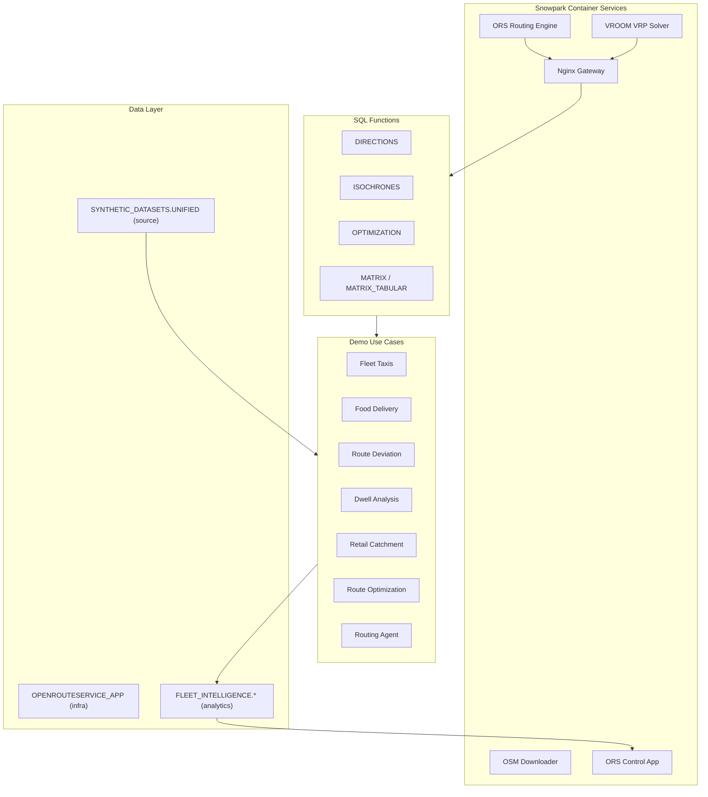
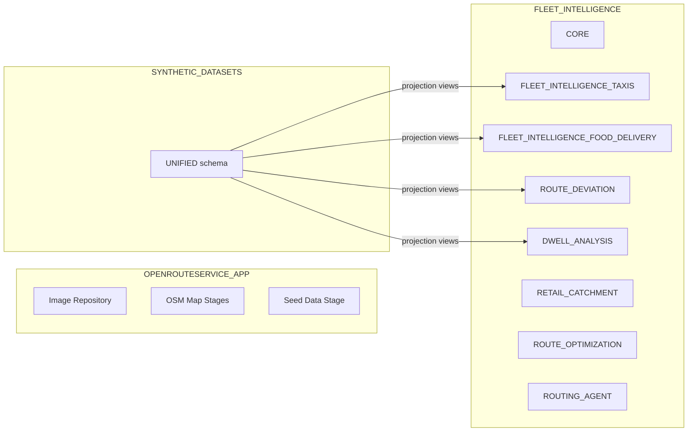

# Architecture reference

This document covers the internal architecture, data model, and developer workflows for the Route Optimisation and Fleet Intelligence solution. For user-facing quick start instructions, see [README-SF.md](../README-SF.md).

## Architecture overview



## Data architecture

### Three-database layout



| Database | Purpose |
|----------|---------|
| `OPENROUTESERVICE_APP` | App infrastructure: container image repository, OSM map stages, graph caches, elevation data, seed datasets |
| `SYNTHETIC_DATASETS` | Source telemetry data in a unified star schema, written by Data Studio |
| `FLEET_INTELLIGENCE` | Analytics output, one schema per skill for demo tables, views, and pipelines |

### Unified star schema (SYNTHETIC_DATASETS.UNIFIED)

All vehicle telemetry data lives in a single unified star schema, regardless of vehicle type (taxis, e-bikes, trucks, delivery couriers). Data is generated by the **Data Studio** page in the ORS Control App.

| Table | Type | Description |
|-------|------|-------------|
| `FACT_VEHICLE_TELEMETRY` | Fact | GPS points: lat/lon, speed, heading, status, timestamp |
| `FACT_TRIPS` | Fact | Trip-level: route geometry, planned vs actual, distance, detour flag |
| `DIM_FLEET` | Dimension | Vehicle definitions: type, ORS profile, shift pattern, driver profile |
| `DIM_POIS` | Dimension | Points of interest: name, category, location, type |
| `DIM_TRIP_SCHEDULE` | Dimension | Planned schedules: origin/destination POI, trip date |

Every row includes `VEHICLE_TYPE`, `REGION`, and `JOB_ID` columns for multi-tenant filtering and data lineage.

### CONFIG table pattern

Each demo skill creates a single-row `CONFIG` table in its schema that stores the active `VEHICLE_TYPE` and `REGION`. Projection views (`VW_*`) join against this CONFIG to filter the unified dataset, so each skill only sees data relevant to its use case.

```
Data Studio --> SYNTHETIC_DATASETS.UNIFIED
                       |
              Skill CONFIG table
            (VEHICLE_TYPE + REGION)
                       |
              VW_* projection views
                (filtered dataset)
                       |
              Skill ETL pipeline
                       |
         FLEET_INTELLIGENCE.{SKILL_SCHEMA}
                       |
            ORS Control App dashboards
```

### Skill schemas in FLEET_INTELLIGENCE

| Schema | Skill | Key objects |
|--------|-------|-------------|
| `CORE` | build-routing-solution | `REGION_REGISTRY`, `GENERATION_JOBS`, `PROVISION_REGION` procedure |
| `FLEET_INTELLIGENCE_TAXIS` | fleet-intelligence-taxis | Driver locations, trip summaries, route analytics views |
| `FLEET_INTELLIGENCE_FOOD_DELIVERY` | fleet-intelligence-food-delivery | CONFIG, `DELIVERIES` view, `RESTAURANTS_ENRICHED` view |
| `ROUTE_DEVIATION` | route-deviation | CONFIG, 5 projection views, `TRIP_DEVIATION_ANALYSIS`, deviation trends |
| `DWELL_ANALYSIS` | dwell-analysis | CONFIG, 8 Dynamic Tables, `SLA_ALERT_LOG`, geofences, SLA thresholds |
| `RETAIL_CATCHMENT` | retail-catchment | `RETAIL_POIS`, regional addresses, competitor data |
| `ROUTE_OPTIMIZATION` | route-optimization | Overture Maps places, CARTO data, VRP notebooks |
| `ROUTING_AGENT` | routing-agent | 3 tool procedures + Cortex Agent definition |

## ORS Control App

The Control App is a React SPA (Vite + TypeScript) with an Express.js backend:

```
ors_control_app/
  src/                    # React frontend
    components/           # Page components (30+ pages)
    shared/               # Reusable components (MapView, DataTable, and others)
    hooks/                # useSnowflake, useRegion, useVehicleType
  server/                 # Express.js backend
    index.ts              # Core API routes (44 endpoints)
    studio/               # Data Studio sub-router
```

Deploy flow: `npm run build` then Docker build (linux/amd64), push to SPCS registry, upload spec to stage, and `ALTER SERVICE FROM @stage SPECIFICATION_FILE=...`.

### Demo pages

| Section | Pages | Data source |
|---------|-------|-------------|
| **Home** | Landing page with animated route visualization | Seed intro trips |
| **Dwell Analysis** | Overview, Congestion Map, Facility Utilization, SLA Alerts, Trip Inspector, Driver Performance, Live Operations (7 pages) | `DWELL_ANALYSIS` Dynamic Tables |
| **Fleet Delivery** | Delivery Dashboard, Fleet Map, Catchment Panel, Courier Heatmap (4 pages) | `FLEET_INTELLIGENCE_FOOD_DELIVERY` views |
| **Fleet Taxis** | Fleet Overview, Driver Routes, Heat Map (3 pages) | `FLEET_INTELLIGENCE_TAXIS` tables |
| **Route Deviation** | Deviation Dashboard, Route Comparison, Route Inspector (3 pages) | `ROUTE_DEVIATION` ETL tables |
| **Route Optimization** | VRP simulator with interactive map | `ROUTE_OPTIMIZATION` + live ORS calls |
| **Retail Catchment** | Isochrone analysis with competitor mapping | `RETAIL_CATCHMENT` + live ORS calls |
| **Routing Agent** | Natural-language chat interface with interactive map | Live Cortex Agent calls |
| **Travel Time Explorer** | H3 hexagon travel-time visualization | `TRAVEL_MATRIX` tables |
| **Data Studio** | Synthetic telemetry data generation | Writes to `SYNTHETIC_DATASETS.UNIFIED` |

### Shared components

- **Region Switcher**: switch between provisioned geographic regions
- **Vehicle Type Switcher**: filter dashboards by vehicle type
- **MapView**: deck.gl map wrapper used across all geo pages
- **DataTable**: sortable, filterable data table
- **MetricCard**: KPI display cards

## Object tracking and cleanup

Every Snowflake object created by a skill is tracked with two mechanisms:

1. **Session query tag**, set at session start for query attribution:

   ```json
   {"origin":"sf_sit-is-fleet","name":"oss-<skill-name>","version":{"major":1,"minor":0}}
   ```

2. **Object COMMENT**, a JSON tag on every CREATE statement for object discovery:

   ```json
   {"origin":"sf_sit-is-fleet","name":"oss-<skill-name>","version":{"major":1,"minor":0}}
   ```

The `routing-solution-cleanup` skill queries `INFORMATION_SCHEMA` for objects matching the tracking tag and generates DROP statements in reverse-dependency order.

## Infrastructure skills

| Skill | What it does | Invoke with |
|-------|-------------|-------------|
| **build-routing-solution** | Builds 5 container images, creates databases and stages, deploys the ORS app, starts SPCS services, loads seed data. Foundation for all other skills. | `build routing solution` |
| **routing-prerequisites** | Checks local environment: Docker/Podman, Snow CLI, Git, network access to Snowflake registry. | `check build prerequisites` |
| **routing-customization** | Routes to subskills for changing geographic region, routing profiles, or reading current config. | `change location`, `change routing profile` |

## Developer tools

| Skill | What it does | Invoke with |
|-------|-------------|-------------|
| **skill-optimiser** | Audits, optimizes, and creates Cortex Code skills following Anthropic best practices. | `audit skill`, `optimize skill` |
| **routing-solution-cleanup** | Discovers all Snowflake objects created by any skill (via JSON COMMENT tags) and generates DROP statements. Supports dry-run mode, per-skill filtering, and reverse-dependency drop order. | `routing-solution-cleanup`, `cleanup`, `teardown` |

## Creating a new skill

1. Create folder: `.cortex/skills/my-new-skill/`
2. Create `SKILL.md` with YAML frontmatter and step-by-step instructions
3. Add `references/` for detailed SQL if the body exceeds 5,000 words
4. Add `assets/` for notebooks or deployable artifacts
5. Audit with: `audit skill my-new-skill` (invokes the skill-optimiser)
6. See [AGENTS.md](../AGENTS.md) for full conventions and rules
