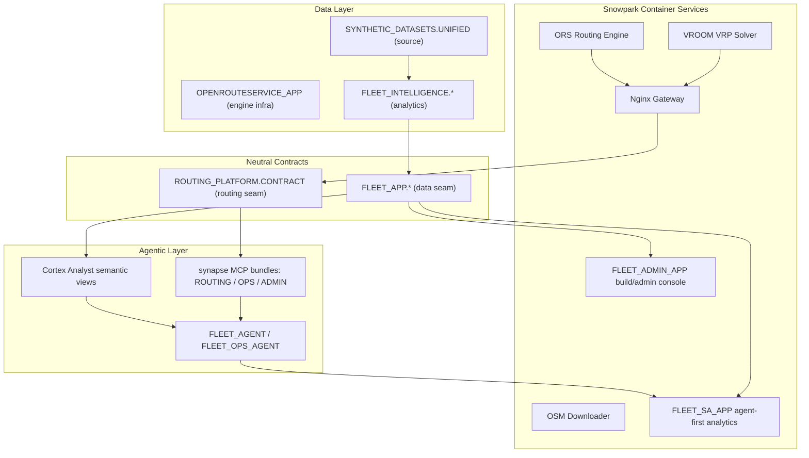
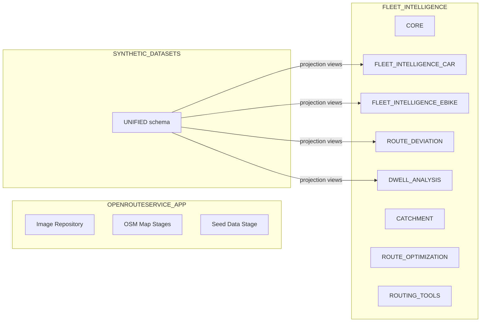

# Architecture reference

This document covers the internal architecture, data model, and developer workflows for the Route Optimisation and Fleet Intelligence solution. For user-facing quick start instructions, see the [README](../README.md). For the load-bearing architecture invariants (swappable seams, role isolation, audited envelope, live routing), see [TENETS.md](../TENETS.md).

## Architecture overview


```mermaid
graph TB
    subgraph spcs [Snowpark Container Services]
        ORS[ORS Routing Engine]
        VROOM[VROOM VRP Solver]
        GW[Nginx Gateway]
        DL[OSM Downloader]
        ADMIN[FLEET_ADMIN_APP build/admin console]
        SA[FLEET_SA_APP agent-first analytics]
    end

    subgraph agentic [Agentic Layer]
        AGENT[FLEET_AGENT / FLEET_OPS_AGENT]
        MCP[synapse MCP bundles: ROUTING / OPS / ADMIN]
        SV[Cortex Analyst semantic views]
    end

    subgraph contracts [Neutral Contracts]
        RC["ROUTING_PLATFORM.CONTRACT (routing seam)"]
        FA["FLEET_APP.* (data seam)"]
    end

    subgraph data [Data Layer]
        SETUP["OPENROUTESERVICE_APP (engine infra)"]
        SYNTH["SYNTHETIC_DATASETS.UNIFIED (source)"]
        FI["FLEET_INTELLIGENCE.* (analytics)"]
    end

    ORS --> GW
    VROOM --> GW
    GW --> RC
    SYNTH --> FI
    FI --> FA
    FA --> SV
    RC --> MCP
    SV --> AGENT
    MCP --> AGENT
    AGENT --> SA
    FA --> SA
    FA --> ADMIN
```

## Data architecture

### Three-database layout


```mermaid
graph LR
    subgraph setup ["OPENROUTESERVICE_APP"]
        IMG[Image Repository]
        OSM[OSM Map Stages]
        SEED[Seed Data Stage]
    end

    subgraph synth ["SYNTHETIC_DATASETS"]
        UNI[UNIFIED schema]
    end

    subgraph fi ["FLEET_INTELLIGENCE"]
        CORE[CORE]
        TAX[FLEET_INTELLIGENCE_CAR]
        DEL[FLEET_INTELLIGENCE_EBIKE]
        RD[ROUTE_DEVIATION]
        DW[DWELL_ANALYSIS]
        RC[CATCHMENT]
        RO[ROUTE_OPTIMIZATION]
        RA[ROUTING_TOOLS]
    end

    UNI -->|projection views| TAX
    UNI -->|projection views| DEL
    UNI -->|projection views| RD
    UNI -->|projection views| DW
```

| Database | Purpose |
|----------|---------|
| `OPENROUTESERVICE_APP` | Engine infrastructure: container image repository, OSM map stages, graph caches, elevation data, seed datasets |
| `ROUTING_PLATFORM` | Engine-agnostic routing seam. `ROUTING_PLATFORM.CONTRACT.*` fronts the ORS/VROOM engine so consumers never bind to a named engine |
| `SYNTHETIC_DATASETS` | Source telemetry data in a unified star schema, written by Data Studio. Runs are versioned (see dataset versioning below) |
| `FLEET_INTELLIGENCE` | Analytics output plus the semantic (`SEMANTIC`) and tool (`ROUTING_TOOLS`) schemas |
| `FLEET_APP` | Neutral data contract (`FLEET_APP.*` views). Dashboards and semantic views read this contract, not the physical tables |
| `STARTER_APP` | Minimal starter contract used by the starter pack |

### Dataset versioning

Each Data Studio run is recorded as an immutable dataset in `FLEET_INTELLIGENCE.CORE.DIM_DATASETS`, keyed by `JOB_ID`. At most one row per `(REGION, VEHICLE_TYPE)` is active. Downstream consumers read the dataset-scoped projection views (`SYNTHETIC_DATASETS.UNIFIED.V_*_CURRENT`), never the base tables directly, so re-running Data Studio is non-destructive.

### Unified star schema (SYNTHETIC_DATASETS.UNIFIED)

All vehicle telemetry data lives in a single unified star schema, regardless of vehicle type (cars, e-bikes, trucks). Data is generated by the **Data Studio** page in `FLEET_ADMIN_APP`.

| Table | Type | Description |
|-------|------|-------------|
| `FACT_VEHICLE_TELEMETRY` | Fact | GPS points: lat/lon, speed, heading, status, timestamp |
| `FACT_TRIPS` | Fact | Trip-level: route geometry, planned vs actual, distance, detour flag |
| `DIM_FLEET` | Dimension | Vehicle definitions: type, ORS profile, shift pattern, driver profile |
| `DIM_POIS` | Dimension | Points of interest: name, category, location, type |
| `DIM_TRIP_SCHEDULE` | Dimension | Planned schedules: origin/destination POI, trip date |

Every row includes `VEHICLE_TYPE`, `REGION`, and `JOB_ID` columns for multi-tenant filtering and data lineage.

### CONFIG table pattern

Each demo skill creates a single-row `CONFIG` table in its schema that stores the active `VEHICLE_TYPE` and `REGION`. Projection views (`VW_*`) join against this CONFIG to filter the unified dataset, so each skill only sees data relevant to its use case.

```
Data Studio --> SYNTHETIC_DATASETS.UNIFIED
                       |
              Skill CONFIG table
            (VEHICLE_TYPE + REGION)
                       |
              VW_* projection views
                (filtered dataset)
                       |
              Skill ETL pipeline
                       |
         FLEET_INTELLIGENCE.{SKILL_SCHEMA}
                       |
              FLEET_APP.* contract
                       |
            fleet app dashboards
```

### Skill schemas in FLEET_INTELLIGENCE

| Schema | Skill | Key objects |
|--------|-------|-------------|
| `CORE` | install-fleet-apps | `REGION_REGISTRY`, `GENERATION_JOBS`, `PROVISION_REGION` procedure |
| `FLEET_INTELLIGENCE_CAR` | fleet-intelligence-car | Driver locations, trip summaries, route analytics views |
| `FLEET_INTELLIGENCE_EBIKE` | fleet-intelligence-ebike | CONFIG, `TRIPS` view, `ORIGINS_ENRICHED` view |
| `ROUTE_DEVIATION` | route-deviation | CONFIG, 5 projection views, `TRIP_DEVIATION_ANALYSIS`, deviation trends |
| `DWELL_ANALYSIS` | dwell-analysis | CONFIG, 8 Dynamic Tables, `SLA_ALERT_LOG`, geofences, SLA thresholds |
| `CATCHMENT` | retail-catchment | `POIS`, regional addresses, competitor data |
| `ROUTE_OPTIMIZATION` | route-optimization | Overture Maps places, CARTO data, VRP notebooks |
| `ROUTING_TOOLS` | routing-agent | 9 routing/demo TOOL_* procedures (relocated from `ROUTING_AGENT`; standalone Cortex Agent retired in favor of the app-level FLEET_AGENT) |

## Fleet Control Apps

The control surfaces are two Next.js (TypeScript) apps served on SPCS:
`FLEET_ADMIN_APP` (privileged build/admin console) and `FLEET_SA_APP`
(agent-first analytics app). They share primitives via `@fleet-kit/core`.

```
fleet_admin_app/ (and fleet_sa_app/)
  ui/
    src/components/       # Page + view components
    src/server/           # server-side helpers
      lib/                #   init.ts (boot bootstrap), sql.ts, constants.ts
      studio/             # Data Studio helpers
    src/app/api/          # Next.js route handlers
```

Deploy flow: `scripts/deploy_fleet_admin_app.sh` / `scripts/deploy_fleet_sa_app.sh` - Docker build (linux/amd64), push to SPCS registry, upload spec to stage, and `CREATE/ALTER SERVICE FROM @stage SPECIFICATION_FILE=...`.

### FLEET_SA_APP business-problem views

The SA app is organized around vehicle/industry-agnostic business problems rather than per-vehicle demos. Views are config-driven (`app-config.json`) and read the neutral `FLEET_APP.*` contract.

| View | Data source |
|------|-------------|
| Fleet / Asset Status | `FLEET_APP` fleet-ops contract |
| Asset Map | `FLEET_APP` fleet-ops contract |
| Demand Density (H3) | `FLEET_APP` origins/demand |
| Trip Inspection | `FLEET_APP` trip/stop contract |
| Operator Performance | `FLEET_APP` fleet-ops contract |
| Top Origins | `FLEET_APP` origins/demand |
| Dwell and Congestion | `FLEET_APP` dwell contract |
| Route Deviation | `FLEET_APP` route-deviation contract |
| Asset Utilization | `FLEET_APP` asset-velocity contract |
| VRP | `FLEET_APP` + live `ROUTING_PLATFORM.CONTRACT` calls |
| Catchment | `FLEET_APP` + live `ROUTING_PLATFORM.CONTRACT` calls |
| Chat (agent) | `FLEET_AGENT` (semantic views + routing tools) |

### FLEET_ADMIN_APP pages

| Page | Purpose |
|------|---------|
| Status | SPCS service status, resume/suspend |
| Region Builder | Provision regions (OSM download, graph build) |
| Matrix Builder / Viewer | Configure, run, and browse H3 travel-time matrices |
| Data Studio | Generate synthetic telemetry into `SYNTHETIC_DATASETS.UNIFIED` |
| Functions | Interactive ORS SQL function console |
| Diagnostics | Health, logs, environment info |

### Agentic layer

The agent-first experience is built from four pieces, kept isolated by role:

| Component | Role | Notes |
|-----------|------|-------|
| `ROUTING_MCP` / `FLEET_OPS_MCP` / `FLEET_ADMIN_MCP` | user / ops / admin | Three synapse MCP tool servers. Each role gets only its bundle; the consumer agent attaches the user bundle only. |
| `FLEET_AGENT` | consumer | Behind the SA app chat. Attaches `ROUTING_MCP` + the consumer semantic views. |
| `FLEET_OPS_AGENT` | ops | Operations agent for the admin/ops surface. |
| `SV_FLEET_OPS`, `SV_ROUTE_DEVIATION`, `SV_CATCHMENT`, `SV_DWELL_ANALYTICS`, `SV_ASSET_VELOCITY` | - | Cortex Analyst semantic views that ground agent answers in governed metrics. |

Every verb call flows through the synapse envelope with an idempotency key and a `VERB_ATTEMPT` audit row; there are no direct, unaudited tool calls. Agents bind to their MCP server at creation time, so any MCP redeploy (`CREATE OR REPLACE MCP SERVER`) must be followed by recreating the agents.

### Shared components

- **Region Switcher**: switch between provisioned geographic regions
- **Vehicle Type Switcher**: filter dashboards by vehicle type
- **MapView**: deck.gl map wrapper used across all geo pages
- **DataTable**: sortable, filterable data table
- **MetricCard**: KPI display cards

## Object tracking and cleanup

Every Snowflake object created by a skill is tracked with two mechanisms:

1. **Session query tag**, set at session start for query attribution:

   ```json
   {"origin":"sf_sit-is-fleet","name":"oss-<skill-name>","version":{"major":1,"minor":0}}
   ```

2. **Object COMMENT**, a JSON tag on every CREATE statement for object discovery:

   ```json
   {"origin":"sf_sit-is-fleet","name":"oss-<skill-name>","version":{"major":1,"minor":0}}
   ```

The `routing-solution-cleanup` skill queries `INFORMATION_SCHEMA` for objects matching the tracking tag and generates DROP statements in reverse-dependency order.

## Infrastructure skills

| Skill | What it does | Invoke with |
|-------|-------------|-------------|
| **install-fleet-apps** | Builds the container images, creates databases and stages, deploys the ORS engine + fleet apps on SPCS, starts services, loads seed data. Foundation for all other skills. | `install the fleet apps` |
| **routing-prerequisites** | Checks local environment: Docker/Podman, Snow CLI, Git, network access to Snowflake registry. | `check build prerequisites` |
| **routing-customization** | Routes to subskills for changing geographic region, routing profiles, or reading current config. | `change location`, `change routing profile` |

## Developer tools

| Skill | What it does | Invoke with |
|-------|-------------|-------------|
| **skill-optimiser** | Audits, optimizes, and creates Cortex Code skills following Anthropic best practices. | `audit skill`, `optimize skill` |
| **routing-solution-cleanup** | Discovers all Snowflake objects created by any skill (via JSON COMMENT tags) and generates DROP statements. Supports dry-run mode, per-skill filtering, and reverse-dependency drop order. | `routing-solution-cleanup`, `cleanup`, `teardown` |

## Creating a new skill

1. Create folder: `.cortex/skills/my-new-skill/`
2. Create `SKILL.md` with YAML frontmatter and step-by-step instructions
3. Add `references/` for detailed SQL if the body exceeds 5,000 words
4. Add `assets/` for notebooks or deployable artifacts
5. Audit with: `audit skill my-new-skill` (invokes the skill-optimiser)
6. See [AGENTS.md](../AGENTS.md) for full conventions and rules
