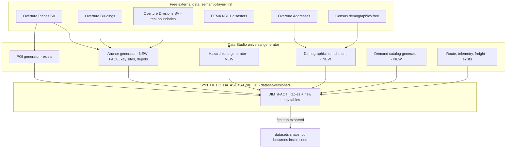

# Data Studio as the Universal, Overture + Marketplace-Backed Generator (strategy + roadmap)

> **Status:** roadmap / design. No code has been changed by this document.
> **Supersedes:** [`overture-seed-classification.md`](overture-seed-classification.md). That note recommended *against* a broad migration ("most heavy seeds have no Overture analog"). This document **deliberately reverses** that recommendation: free Snowflake Marketplace datasets (Census demographics, FEMA hazard) fill the demographics/hazard gaps the old note said had "no analog", and the goal is now to make **Data Studio the single generator for all data**.

## 1. North star

Today the repo has two parallel data origins:

1. **Data Studio** - a live, region/config-driven generator (`server/studio/`) that produces movement data (fleet, trips, telemetry, freight, partners) and pulls POIs live from Overture Places.
2. **Static seeds** - a frozen parquet snapshot (`datasets/synthetic_ebikes/*.parquet`) shipped as the install seed, plus hardcoded `DEMO_*` tables, a CareConnect CSV, and hardcoded demographics / demand catalogs / industry templates baked into demo skills.

The target end-state:

- Data Studio can generate **every non-route entity any use case needs** - POIs, PACE / health-facility anchors, key sites, depots, disaster/hazard zones, area demographics, demand catalogs - from **Overture Maps + free Marketplace datasets**, region/config-driven, with **no hardcoded city / pharma / company literals**.
- Sourcing is **semantic-layer-first**: query through vendor **semantic views** (Overture `OVERTUREMAPS_*_SEMANTIC_VIEW`, any Marketplace dataset's semantic layer) and Cortex Analyst for query shaping; use real **Overture Divisions** boundaries where they beat bbox/Geofabrik approximations; fall back to base tables only when no semantic layer exists.
- The **first Data Studio run becomes the seed**: run once, export via [`datasets/export-preset.sql`](../../datasets/export-preset.sql), and the resulting parquet *replaces* `datasets/synthetic_ebikes/`.
- The static `DEMO_*` tables and the CareConnect CSV are **retired**.



## 2. Inventory and classification (supersedes the old verdicts)

`SV?` = does a usable vendor semantic view exist for the target source. Source columns: `S` = static/hardcoded, `O` = Overture, `M` = Marketplace, `G` = generated by Data Studio.

| Entity / seed | Where today | Today | Target source | SV? | Verdict |
|---|---|---|---|---|---|
| `DIM_POIS` | `studio/engine/routability.ts` `loadPOIs()` | O (base table) | Overture Places via SV | Y | Re-point to SV; already Overture |
| `ROUTE_OPTIMIZATION.PLACES` | `15_route_optimization_seed.sql` | O (base table) | Overture Places via SV | Y | Re-point to SV |
| `CATCHMENT.*` | `analytic_layer.sql` | O (base) | Overture Places/Addresses via SV | Y/N | Keep; prefer SV for Places |
| `FACT_TRIPS`, `FACT_VEHICLE_TELEMETRY` | `engine.ts` + `interpolate.ts` | G (ORS+RNG) | unchanged (movement, not reference) | - | Keep generated |
| `DEMO_DELIVERY_STOPS` | `deploy-demo-data.sql` | S | Overture Places (category-filtered) | Y | **Migrate -> anchor gen** |
| `DEMO_KEY_SITES` | `deploy-demo-data.sql` | S | Overture Places (`pharmacy`/brand) | Y | **Migrate -> anchor gen** |
| `DEMO_DEPOT` | `deploy-demo-data.sql` | S | `ST_CENTROID` of Overture Buildings/POI cluster | Y | **Migrate -> anchor gen** |
| CareConnect PACE centers | `careconnect_centers_geocoded.csv` | S | Overture Places (`health`/`social_facility`) | Y | **Migrate -> anchor gen; retire CSV** |
| `DEMO_AREA_DEMOGRAPHICS` | `deploy-demo-data.sql` | S | Free Census demographics (ZIP/block-group) | check | **Migrate -> demographics enrichment** |
| FEMA hazard / `V_ZIP_RISK` | `emergency-response/sql-pipeline.sql` | M (FEMA NRI) | FEMA NRI + disasters; Overture Divisions for real boundary | N/Y | Generalize -> hazard gen |
| `STATE_REGION_MAP` (3 rows) | `sql-pipeline.sql` | S | derive from active region + Divisions | - | Make data-driven |
| `DEMO_DEMAND_CATALOG` (drugs) | `deploy-demo-data.sql` | S | neutral category-derived tiers (config) | - | **Migrate -> demand gen (neutral)** |
| `DIM_FLEET` | `studio/engine/fleet.ts` | G+S specs | config-driven (no movement source) | - | Keep generated; de-hardcode specs |
| `FACT_OFFERS` | `studio/engine/offers.ts` | G+S lists | geography-derived + optional firmographics | maybe | De-hardcode lists; firmographics optional |
| `DIM_PARTNERS`, `FACT_PARTNER_HISTORY` | `studio/engine/partners.ts` | G+S names | geography-derived + optional firmographics | maybe | De-hardcode `NAME_ROOTS`/country maps |
| `profiles.ts` `poi_categories` | `studio/profiles.ts` | S | persisted profile catalog (already exists for templates) | - | Move category lists to catalog |
| region boundaries | Geofabrik/BBBike parquet | S/O-poly | keep Geofabrik for provisioning; Overture Divisions for display/spatial | Y | Augment, don't replace provisioning |
| install seed | `datasets/synthetic_ebikes/*.parquet` | S (frozen run) | first Data Studio run, exported | - | **Replace via run-once export** |

## 3. Free Marketplace candidates (from live `cortex search marketplace`)

| Gap | Listing | Global name | SV? | Notes |
|---|---|---|---|---|
| Area demographics | No Fret Data - "U.S. Census Demographics + Geospatial Boundaries - Free" | `GZ1M6ZYDCF2` | verify | ZIP-level + boundaries |
| Area demographics (alt) | aterio - "US Census Data & Demographic Insights - Free" | `GZTSZ10H0398` | verify | ZIP historical + forecast |
| Hazard risk | FEMA National Risk Index | `GZSTZKU9FH9` | N | Already used (emergency-response) |
| Disaster declarations | BrainForgeAI - FEMA Disaster Declarations (OpenFEMA) | `GZT1ZS38HS` | verify | Public-domain OpenFEMA |
| POIs / anchors | Overture Places | `GZT0Z4CM1E9KR` | **Y** | `OVERTUREMAPS_PLACES_SEMANTIC_VIEW` |
| Addresses | Overture Addresses | `GZT0Z4CM1E9NQ` | N | No SV ships with the addresses share |
| Building-centroid depots | Overture Buildings (CARTO) | *(discover GZ id)* | verify | `ST_CENTROID` of building footprints |
| Real boundaries | Overture Divisions (CARTO) | *(discover GZ id)* | verify | Admin polygons for display + spatial filter |
| Firmographics (optional) | Equifax B2bConnect - free sample | `GZT0ZOSU8TV` | verify | Sample only; keep optional |

**Per-listing verification checklist** (run before committing to any source):

```sql
-- 1. Confirm the listing installs at $0 and the DB appears
SHOW DATABASES LIKE '<DB_NAME>';
-- 2. Inspect the schema + join keys (ZIP / county FIPS / geometry)
SHOW TABLES IN DATABASE <DB_NAME>;
DESCRIBE TABLE <DB_NAME>.<SCHEMA>.<TABLE>;
-- 3. Does it ship a semantic layer? (semantic-layer-first)
SHOW SEMANTIC VIEWS IN DATABASE <DB_NAME>;
-- 4. Sample to confirm coverage for the active region
SELECT * FROM <DB_NAME>.<SCHEMA>.<TABLE> LIMIT 20;
```

## 4. Semantic-layer-first sourcing spec

Every new generator follows this sourcing hierarchy:

1. **Vendor semantic view** if one exists. Shape queries against its facts/dimensions/metrics, and optionally drive generation/validation through **Cortex Analyst** (`call_cortex_analyst`, or attach the SV as an Analyst tool - the agent already attaches Overture Places as `query_overture_global`).
2. **Overture Divisions** for real administrative boundaries where a true polygon improves on the bbox/Geofabrik approximation (display + spatial filtering), while still keeping the cost-safe `ST_WITHIN(REGION_CATALOG.BOUNDARY)` refine for engine-routability.
3. **Base tables** only when no semantic layer exists (today's `loadPOIs` path), always with bbox-prune + `ST_WITHIN(BOUNDARY)` + a hard `LIMIT`.

Known reality of the Overture semantic views (see Appendix A): `OVERTUREMAPS_PLACES_SEMANTIC_VIEW` exposes **confidence metrics only** (AVG/MIN/MAX) - no COUNT - so "how many" queries still route to the base table or to `CATCHMENT` counts. The Addresses share ships **no** semantic view. Treat the SV as the preferred *shaping/discovery* surface and the base table as the *bulk extract* surface.

## 5. Target Data Studio architecture

New generators are added as **sibling modules** under `server/studio/engine/`, mirroring the existing seams:

- **Orchestration** - register each generator step in [`engine.ts`](../../.cortex/skills/install-fleet-apps/fleet_admin_app/ui/src/server/studio/engine.ts) (the `generateTelemetry` async generator) and the job lifecycle in `jobs.ts`.
- **DDL** - add `CREATE TABLE IF NOT EXISTS` for each new entity in [`ensure-tables.ts`](../../.cortex/skills/install-fleet-apps/fleet_admin_app/ui/src/server/studio/ensure-tables.ts) (today owns `FACT_VEHICLE_TELEMETRY`, `FACT_TRIPS`, `DIM_FLEET`, `DIM_POIS`, `DIM_TRIP_SCHEDULE`, `FACT_OFFERS`, `DIM_PARTNERS`, `FACT_PARTNER_HISTORY`, plus CORE `GENERATION_JOBS`/`JOB_EVENTS`/`DIM_DATASETS`).
- **Inserts** - add batch INSERT helpers in `inserters.ts`.
- **Config** - gate each generator with flags on `GenerationConfig` in [`profiles.ts`](../../.cortex/skills/install-fleet-apps/fleet_admin_app/ui/src/server/studio/profiles.ts) (`export interface GenerationConfig` ~line 183); move the hardcoded `poi_categories` arrays (lines 43/86/139) into the persisted profile catalog (`generation-profile-catalog.ts` already persists templates into `GENERATION_PROFILE_CATALOG`).
- **Versioning** - every new table carries `JOB_ID` + flows through the `DIM_DATASETS` IS_ACTIVE / `V_*_CURRENT` projection-view discipline (AGENTS.md invariant). Consumers read `V_*_CURRENT`, never base tables.

New generator modules:

| Module (new) | Output | Source (semantic-layer-first) |
|---|---|---|
| `engine/anchors.ts` | `DIM_ANCHORS` (PACE, key sites, depots, delivery stops) | Overture Places SV (category filter) + Overture Buildings `ST_CENTROID` for depots |
| `engine/hazard.ts` | `FACT_HAZARD_ZONES` / `V_ZIP_RISK`-equivalent | FEMA NRI + FEMA disasters; Overture Divisions for real boundary join |
| `engine/demographics.ts` | `DIM_AREA_DEMOGRAPHICS` | Free Census listing (ZIP/block-group), joined to region by ZIP/FIPS/geometry |
| `engine/demand.ts` | `DIM_DEMAND_CATALOG` | neutral category-derived tiers (`MOD(ABS(HASH(BASIC_CATEGORY)),3)+1`), config-labeled |

All four reuse the established **cost-safe query pattern** (Appendix A) and bind to the **active region** from `CATCHMENT.CONFIG` / region-sync, never to hardcoded coordinates.

## 6. Seed-from-first-run mechanism

Current state: `datasets/synthetic_ebikes/*.parquet` is a frozen export of a specific run (`JOB_ID = '59e656d4-...'`), loaded by [`datasets/load-seed-data.sql`](../../datasets/load-seed-data.sql); `export-preset.sql` already exports a chosen `JOB_ID` to `@SEED_DATA_STAGE/synthetic_ebikes/`.

Target flow:

1. Run Data Studio once for the canonical preset (with all new generators enabled), producing a complete dataset under one `JOB_ID`.
2. Extend `export-preset.sql` to also export the **new entity tables** (`DIM_ANCHORS`, `FACT_HAZARD_ZONES`, `DIM_AREA_DEMOGRAPHICS`, `DIM_DEMAND_CATALOG`) - same `COPY INTO @...SEED_DATA_STAGE/synthetic_ebikes/<table>/` + `ST_ASWKT(...)` for GEOGRAPHY columns pattern already used for telemetry/trips.
3. `snow stage copy` the stage back down into `datasets/synthetic_ebikes/`, replacing the frozen snapshot.
4. Update `load-seed-data.sql` to `COPY INTO` the new tables and to pin the new canonical `JOB_ID` (and the `DIM_DATASETS` active row).

Net effect: the install seed is no longer hand-authored; it is a reproducible Data Studio artifact.

## 7. Phased migration waves

| Wave | Scope | Retires | Depends on |
|---|---|---|---|
| 1 | `engine/anchors.ts`: PACE / key sites / depots / delivery stops from Overture Places SV + Buildings centroids | CareConnect CSV, `DEMO_KEY_SITES`, `DEMO_DEPOT`, `DEMO_DELIVERY_STOPS` | Overture Buildings acquired |
| 2 | `engine/demographics.ts` from free Census listing | `DEMO_AREA_DEMOGRAPHICS` | Demographics listing verified ($0 + join keys) |
| 3 | `engine/hazard.ts` generalizing emergency-response beyond the 3-state map; evaluate Overture Divisions for real boundaries | hardcoded `STATE_REGION_MAP` | FEMA disasters + Divisions verified |
| 4 | `engine/demand.ts` (neutral) + de-hardcode `freight.ts`/`partners.ts` (`NAME_ROOTS`, country maps, equipment lists); optional firmographics only if a good free + semantic-layer source exists | `DEMO_DEMAND_CATALOG` | - |
| 5 | Regenerate seed from a single Data Studio run; retire `DEMO_*` + CSV | `deploy-demo-data.sql` static path, `synthetic_ebikes` frozen snapshot | Waves 1-4 |

Each wave is independently shippable and reversible (config flag off + keep the legacy seed until parity is proven). Apply edits to the **live** `fleet_admin_app` source.

## 8. Risk register

- **Overture coverage** is strongest in the US/urban areas; rural or non-US regions may yield sparse anchors/POIs. Mitigation: category fallbacks + minimum-count guards per region.
- **Marketplace free tiers** are often *samples* (limited rows/geography) or rate-limited. Mitigation: the §3 verification checklist before committing; prefer listings explicitly labeled free with full coverage.
- **Semantic-view absence** - Addresses and some listings ship no SV; the hierarchy must degrade gracefully to base tables.
- **ORS graph boundary constraints** (documented gotchas): `MATRIX` errors all-or-nothing (code 6010) if any point is outside the graph; VROOM aborts (code 3, silent 0 rows) on unsnappable in-boundary points. Anchor/route generators MUST keep the `ST_WITHIN(BOUNDARY)` + `snapped_distance <= 350m` pre-filter.
- **Dataset-version invariants** - new tables must not break the `ensureUnifiedTables()`-before-`V_*_CURRENT` boot ordering or the `DIM_DATASETS` active-row contract.
- **Reserved word** - `rows` is reserved in Snowflake; use `out_rows` in any dynamic SQL.
- **Legacy mirror drift** - only edit the `fleet_admin_app` studio source.

## 9. Acceptance criteria

- A clean `install-fleet-apps` run with **zero** static `DEMO_*` / CSV dependencies.
- All 7 demo packs surface from a single Data Studio-generated, dataset-versioned dataset.
- Row-count / spatial parity vs. the retired seeds (anchors, demographics, hazard) for the canonical region.
- Every external source documented with its global name, free-tier status, and semantic-view availability.

---

## Appendix A - Overture Maps query reference

Reusable facts for shaping the new generators' SQL (validated in prior Overture integration work + `analytic_layer.sql`).

### Places (`OVERTURE_MAPS__PLACES.CARTO.PLACE`)
| Field | Access | Notes |
|---|---|---|
| Name | `NAMES:primary::VARCHAR` | |
| Category | `BASIC_CATEGORY` (preferred filter), `CATEGORIES:primary` | anchors: `pharmacy`, `hospital`, `health`/`social_facility` families |
| Geometry | `GEOMETRY` | `ST_X(GEOMETRY)`=lon, `ST_Y(GEOMETRY)`=lat |
| Address | `ADDRESSES[0]:freeform / :locality / :region / :postcode` | `:region` = state |
| Confidence | `CONFIDENCE` | the SV exposes AVG/MIN/MAX of this |
| BBox | `BBOX`; `ST_XMIN/XMAX/YMIN/YMAX` work on GEOGRAPHY | |

Semantic view: `OVERTURE_MAPS__PLACES.CARTO.OVERTUREMAPS_PLACES_SEMANTIC_VIEW` - **confidence metrics only, no COUNT**. Use for discovery/shaping; route counts to `CATCHMENT` or base-table aggregates.

### Addresses (`OVERTURE_MAPS__ADDRESSES.CARTO.ADDRESS`)
`ID`, `GEOMETRY`, `ADDRESS_LEVELS[1]:value::VARCHAR` (city), `POSTCODE`, `COUNTRY` (`'US'`). **No semantic view ships** with this share.

### Buildings / Divisions
- **Buildings** (CARTO): footprint polygons; depot centroids via `ST_CENTROID(GEOMETRY)` over a building or POI cluster. Acquire the listing first.
- **Divisions** (CARTO): administrative boundary polygons - the semantic-layer source for *real* region boundaries (display + spatial filter). Provisioning still requires the Geofabrik `.poly` clip mask; Divisions augments display/filtering, it does not replace provisioning input.

### Cost-safe extract pattern (reuse verbatim)
```sql
INSERT INTO <target>
SELECT ... ST_X(p.GEOMETRY) AS LONGITUDE, ST_Y(p.GEOMETRY) AS LATITUDE, p.GEOMETRY, ...
FROM OVERTURE_MAPS__PLACES.CARTO.PLACE p
CROSS JOIN <active_region_row> d            -- carries BBOX_* + BOUNDARY
WHERE p.BASIC_CATEGORY IN (<config category list>)
  AND p.GEOMETRY IS NOT NULL
  AND ST_X(p.GEOMETRY) BETWEEN d.BBOX_MIN_LON AND d.BBOX_MAX_LON   -- cheap bbox prune
  AND ST_Y(p.GEOMETRY) BETWEEN d.BBOX_MIN_LAT AND d.BBOX_MAX_LAT
  AND (d.BOUNDARY IS NULL OR ST_INTERSECTS(p.GEOMETRY, d.BOUNDARY)) -- authoritative refine
-- + a hard LIMIT for ad-hoc/agent queries
```
For engine-routability (VRP/optimization), additionally pre-filter candidates by `MATRIX(...):destinations[i].snapped_distance <= 350` to drop unsnappable points before the solve.

### Acquisition (idempotent)
```sql
CALL SYSTEM$ACCEPT_LEGAL_TERMS('DATA_EXCHANGE_LISTING', '<GZ_id>');
CREATE DATABASE IF NOT EXISTS <DB_NAME> FROM LISTING <GZ_id>;
-- grant for the consumer role
GRANT IMPORTED PRIVILEGES ON DATABASE <DB_NAME> TO ROLE FLEET_APP_USER;
```
