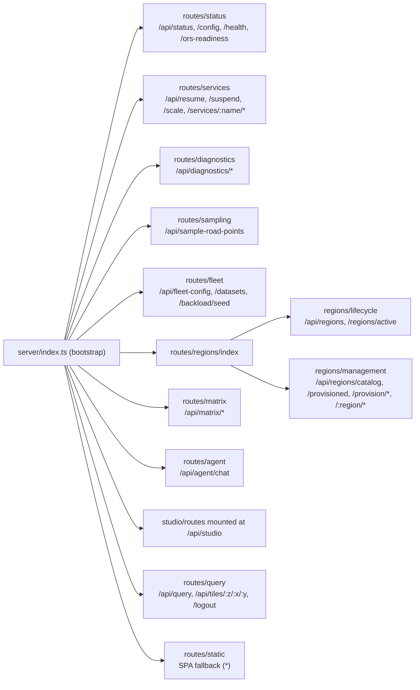

# `ors_control_app` Server Architecture (One-Page Map)

This is the post-refactor map of the ORS Control App Express server. After the
holistic refactor (May 2026), `server/index.ts` is a 128-line bootstrap. All
real work happens in domain-scoped modules under `server/{lib,routes,studio}/`.

Use this page to answer: **"Where do I add / change X?"**

---

## Directory tree

```
ors_control_app/
├── server/
│   ├── index.ts                # bootstrap: middleware + router mounts + listen
│   ├── constants.ts            # env, IS_SPCS, SF_DATABASE, SF_WAREHOUSE, CONN
│   ├── diagnostics.ts          # in-process log buffer (log/getEntries/clearEntries)
│   ├── lib/                    # cross-cutting helpers (no Express types)
│   │   ├── cache.ts            #   road-points cache + uptime formatter
│   │   ├── init.ts             #   ensureBackloadAndAssetVelocityObjects (boot init)
│   │   ├── ors.ts              #   ORS readiness + profile helpers
│   │   ├── region.ts           #   single source of truth for region names
│   │   │                       #   (normalizeRegion, safeRegionIdent,
│   │   │                       #    orsServiceName/Fqn, isDefaultRegion,
│   │   │                       #    currentRegionScalar, DEFAULT_REGION_NAME)
│   │   ├── sanitize.ts         #   identifier / float / int / string escapers
│   │   ├── sql.ts              #   snowSqlLocal/Spcs, runSql, callProcedure,
│   │   │                       #   submitSqlAsync, cancelStatement
│   │   ├── state.ts            #   activeRegionOverride get/set (shared mutable)
│   │   └── warehouse.ts        #   detectWarehouse (boot-time discovery)
│   ├── routes/                 # Express routers, one file per /api/* domain
│   │   ├── status.ts           #   /api/status, /api/config, /api/health,
│   │   │                       #   /api/ors-readiness
│   │   ├── services.ts         #   /api/resume, /api/suspend,
│   │   │                       #   /api/services/:name/{resume,suspend},
│   │   │                       #   /api/scale
│   │   ├── diagnostics.ts      #   /api/diagnostics/{logs,env,probe},
│   │   │                       #   /api/diagnostics/logs/clear
│   │   ├── sampling.ts         #   /api/sample-road-points
│   │   ├── fleet.ts            #   /api/fleet-config[*], /api/datasets[*],
│   │   │                       #   /api/backload/seed
│   │   ├── matrix.ts           #   /api/matrix/* (cost-estimate, build, status,
│   │   │                       #   inventory, viewer-inventory, reachability,
│   │   │                       #   random-origin, all-hexes, ring-stats, etc.)
│   │   ├── agent.ts            #   /api/agent/chat (Cortex Agent proxy)
│   │   ├── query.ts            #   /api/query, /api/tiles/:z/:x/:y, /logout
│   │   ├── static.ts           #   SPA fallback (serves dist/)
│   │   └── regions/            # split because /api/regions/* is large
│   │       ├── index.ts        #   composes the two routers below
│   │       ├── lifecycle.ts    #   /api/regions, /api/regions/active GET+POST
│   │       └── management.ts   #   /api/regions/catalog[*], provisioned,
│   │                           #   provision, provision/status, progress,
│   │                           #   build-progress, cancel, diagnose, healthcheck,
│   │                           #   largest-family, retry-strategy, build-history
│   └── studio/                 # Data Studio engine (long-running data jobs)
│       ├── routes.ts           # Express router mounted at /api/studio
│       ├── jobs.ts             # job lifecycle: queue, run, reconcile, SSE
│       ├── engine.ts           # generators (telemetry, deliveries, etc.)
│       ├── profiles.ts         # vehicle / use-case profile catalogs
│       └── engine/
│           ├── types.ts        # shared engine types
│           └── freight.ts      # freight-specific generator (Phase 2 split)
└── src/                        # React frontend (not covered here)
```

---

## Router mount diagram



Mount order matters for `routes/static.ts` — its `*` SPA fallback must be last.

---

## `/api/*` prefix → router file

| Prefix                       | File                               |
| ---------------------------- | ---------------------------------- |
| `/api/status`, `/api/config`, `/api/health`, `/api/ors-readiness` | `routes/status.ts`            |
| `/api/resume`, `/api/suspend`, `/api/scale`, `/api/services/...` | `routes/services.ts`          |
| `/api/diagnostics/*`         | `routes/diagnostics.ts`            |
| `/api/sample-road-points`    | `routes/sampling.ts`               |
| `/api/fleet-config*`, `/api/datasets*`, `/api/backload/seed` | `routes/fleet.ts`             |
| `/api/regions`, `/api/regions/active` | `routes/regions/lifecycle.ts` |
| `/api/regions/catalog*`, `/api/regions/provision*`, `/api/regions/:region/*` | `routes/regions/management.ts` |
| `/api/matrix/*`              | `routes/matrix.ts`                 |
| `/api/agent/chat`            | `routes/agent.ts`                  |
| `/api/studio/*`              | `studio/routes.ts`                 |
| `/api/query`, `/api/tiles/:z/:x/:y`, `/logout` | `routes/query.ts`                  |
| (SPA fallback)               | `routes/static.ts`                 |

---

## "Where do I add X?" decision tree

| If you want to...                                          | Edit / add to...                                                |
| ---------------------------------------------------------- | --------------------------------------------------------------- |
| Add a new endpoint under an existing domain                | Append handler to matching `routes/*.ts`                        |
| Add a new endpoint in a new domain                         | New file in `routes/`, mount via `app.use(...)` in `index.ts`   |
| Add region-aware logic (resolve service name, default region) | `server/lib/region.ts` — never inline `SELECT REGION FROM CONFIG` |
| Read or mutate the active-region-override                  | `server/lib/state.ts` (`getActiveRegionOverride / setActiveRegionOverride`) |
| Run a SQL query                                            | `runSql` / `callProcedure` / `submitSqlAsync` from `server/lib/sql.ts` |
| Sanitize an identifier / number / string for SQL           | `server/lib/sanitize.ts`                                        |
| Probe ORS readiness or list expected profiles              | `server/lib/ors.ts`                                             |
| Add a boot-time idempotent SQL bootstrap                   | `server/lib/init.ts`                                            |
| Add a new Data Studio job step                             | `server/studio/jobs.ts` (lifecycle), `engine.ts` (generator)    |
| Add a new vehicle / use-case profile                       | `server/studio/profiles.ts`                                     |
| Emit a structured log entry                                | `log(level, scope, message)` from `server/diagnostics.ts`       |

---

## Conventions for new code

1. **No business logic in `server/index.ts`.** It is a 128-line bootstrap. Keep
   it that way. Long-running async work goes inside the routers.
2. **No Express types in `server/lib/`.** Helpers there must be reusable from
   any router and from boot-time scripts. Keep `req`/`res` out.
3. **Region resolution always goes through `lib/region.ts`.** Never hardcode
   `'ORS_SERVICE_${region.toUpperCase()}'` or inline
   `SELECT REGION FROM ... CONFIG LIMIT 1`. Use the helpers.
4. **Shared mutable state lives in `lib/state.ts`** (getter/setter pattern).
   Never reach for module-level globals from another file.
5. **Big SQL strings stay out of route handlers.** Either factor them into
   stored procedures (preferred — see AGENTS.md) or into named exports under
   `server/lib/sql.ts`.
6. **Every CREATE statement needs a COMMENT tracking tag**, and every session
   needs `query_tag` set. See AGENTS.md "Do NOT" list for the exact JSON.
7. **Adding a route?** Bump `APP_VERSION` in the build pipeline so the running
   container reports the new endpoints in `/api/status`.

---

## Related references

- [AGENTS.md](../../AGENTS.md) — repo-wide conventions, commit discipline, deployment
- [docs/ARCHITECTURE.md](../ARCHITECTURE.md) — full-stack architecture
- `.cortex/skills/build-routing-solution/openrouteservice_app/services/ors_control_app/references/troubleshooting.md` — image build / deploy issues
