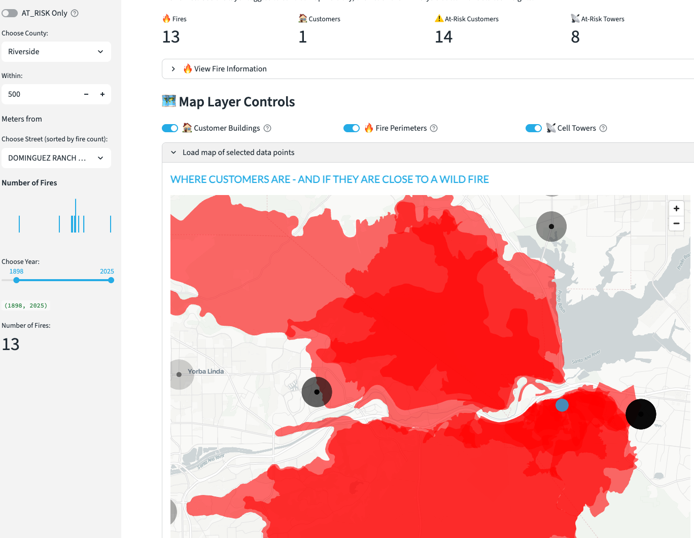
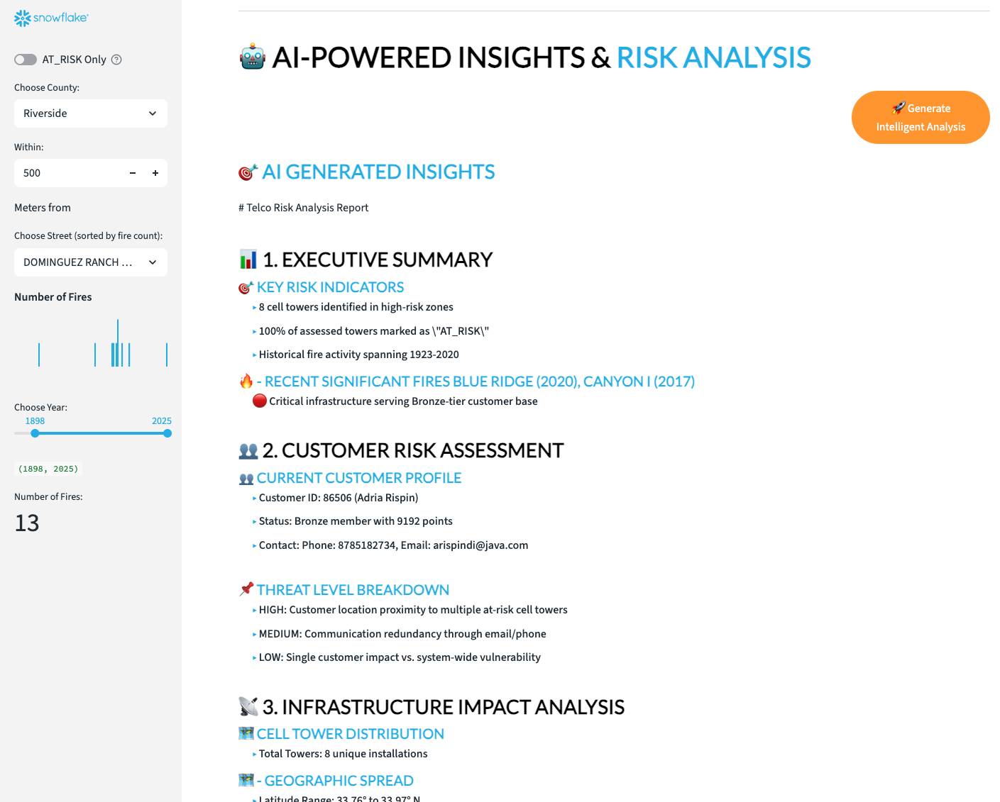

# California Wildfire Risk Assessment

Welcome to the **California Wildfire Risk Assessment** - a comprehensive geospatial analytics solution that combines real-time wildfire data, telecommunications infrastructure monitoring, and AI-powered risk analysis to protect communities and critical infrastructure from wildfire threats.

## Overview

The California Wildfire Risk Assessment leverages the power of Snowflake's geospatial capabilities integrated with Living Atlas data to provide real-time insights into wildfire risks across California. This solution enables telecommunications companies, emergency services, and government agencies to make data-driven decisions for wildfire preparedness, response, and recovery.

## Key Features

### 🔥 Real-Time Wildfire Monitoring and Risk Assessment
Monitor active wildfires and assess risk levels for customers, infrastructure, and communities across California using comprehensive fire perimeter data.

The wildfire monitoring system provides:
- **Active fire perimeters** - Real-time wildfire boundaries and spread patterns
- **Historical fire data** - Analysis of past wildfire events and recurrence patterns
- **Risk zone classification** - High, medium, and low risk area identification
- **Weather integration** - Wind patterns, humidity, and temperature factors
- **Evacuation planning** - Critical route identification and capacity analysis
- **Resource deployment** - Optimal positioning of emergency response assets

### 📡 Infrastructure and Customer Risk Analysis
Detailed analysis of telecommunications infrastructure and customer exposure to wildfire risks with AI-powered insights.

The infrastructure risk analysis includes:
- **Cell tower vulnerability** - Assessment of telecommunications infrastructure exposure
- **Customer impact analysis** - Identification of at-risk customer populations
- **Service continuity planning** - Backup systems and redundancy strategies
- **Network resilience scoring** - Quantified infrastructure robustness metrics
- **AI-powered insights** - Automated analysis and strategic recommendations
- **Business continuity** - Revenue impact assessment and mitigation strategies

## Getting Started

### Accessing the Wildfire Assessment Tool

1. **Navigate to Applications** - From your Snowflake interface, access the Streamlit applications
2. **Launch California Wildfire Risk Assessment** - Click on "California Wildfire Risk Assessment"
3. **Review Dashboard** - Explore current wildfire status and risk metrics
4. **Analyze Infrastructure** - Examine cell tower and customer risk exposure
5. **Generate AI Insights** - Request automated analysis and recommendations

### Core Analysis Capabilities

#### Real-Time Wildfire Monitoring
- **Fire Perimeter Tracking** - Live updates of wildfire boundaries and progression
- **Threat Level Assessment** - Dynamic risk scoring based on proximity and conditions
- **Historical Context** - Comparison with past fire seasons and patterns
- **Weather Integration** - Real-time meteorological data affecting fire behavior

#### Customer and Infrastructure Analysis
- **Geographic Risk Mapping** - Visual representation of at-risk areas and assets
- **Population Impact Assessment** - Number of customers in danger zones
- **Infrastructure Vulnerability** - Cell towers and network equipment exposure
- **Service Impact Prediction** - Potential outages and service disruptions

#### AI-Powered Strategic Insights
- **Executive Summary Generation** - High-level risk overview and key findings
- **Customer Risk Analysis** - Detailed assessment of population exposure
- **Infrastructure Threat Evaluation** - Cell tower and network vulnerability analysis
- **Strategic Recommendations** - AI-generated action plans and mitigation strategies

## Data Integration and Sources

### Wildfire Data
- **Living Atlas Integration** - Real-time fire perimeter data from authoritative sources
- **CAL FIRE Data** - Official California fire department information
- **Satellite Imagery** - Current fire progression and smoke detection
- **Weather Services** - Wind, humidity, temperature, and forecast data

### Telecommunications Infrastructure
- **Cell Tower Locations** - Comprehensive tower inventory and specifications
- **Network Topology** - Connection patterns and backup systems
- **Customer Demographics** - Population density and service area mapping
- **Historical Performance** - Past outage patterns and recovery times

### Risk Assessment Models
- **Fire Behavior Modeling** - Predictive algorithms for fire spread patterns
- **Infrastructure Vulnerability** - Asset-specific risk scoring methodologies
- **Customer Impact Analysis** - Population exposure and evacuation modeling
- **Business Continuity Assessment** - Revenue and service impact calculations

## Application Use Cases

### Telecommunications Industry
- **Network Planning** - Wildfire-resilient infrastructure design and placement
- **Emergency Response** - Rapid deployment of mobile cell towers and backup systems
- **Customer Communication** - Proactive notifications and service advisories
- **Insurance and Risk Management** - Data-driven policy decisions and claims management

### Emergency Management
- **Evacuation Planning** - Optimal route identification and capacity management
- **Resource Allocation** - Strategic positioning of firefighting and rescue assets
- **Public Safety Communications** - Maintaining critical communication networks
- **Coordination** - Multi-agency information sharing and response coordination

### Government and Regulatory
- **Policy Development** - Evidence-based wildfire management policies
- **Public Safety Planning** - Community resilience and preparedness programs
- **Infrastructure Investment** - Priority areas for hardening and improvement
- **Environmental Protection** - Balancing development with fire risk management

## AI-Powered Analysis Features

### Automated Risk Assessment
- **Executive Summaries** - High-level overview of current wildfire threats
- **Customer Impact Analysis** - Detailed assessment of population at risk
- **Infrastructure Vulnerability Reports** - Cell tower and network exposure analysis
- **Strategic Recommendations** - AI-generated action plans and priorities

### Predictive Analytics
- **Fire Spread Modeling** - Forecasting wildfire progression and intensity
- **Infrastructure Failure Prediction** - Anticipating network outages and equipment damage
- **Customer Behavior Analysis** - Predicting evacuation patterns and service demands
- **Resource Optimization** - AI-recommended deployment and allocation strategies

### Real-Time Insights
- **Dynamic Risk Scoring** - Continuously updated threat assessments
- **Anomaly Detection** - Identification of unusual patterns or emerging threats
- **Trend Analysis** - Long-term wildfire pattern recognition and forecasting
- **Performance Monitoring** - Network resilience and response effectiveness tracking

## Best Practices

### Risk Assessment Strategy
- **Multi-Layered Analysis** - Combine multiple data sources and modeling approaches
- **Regular Updates** - Ensure data freshness and model accuracy
- **Scenario Planning** - Prepare for various wildfire intensity and spread scenarios
- **Stakeholder Engagement** - Involve all affected parties in planning and response

### Infrastructure Protection
- **Proactive Hardening** - Invest in fire-resistant equipment and installations
- **Redundancy Planning** - Multiple backup systems and alternative routing
- **Rapid Response Capabilities** - Mobile assets and quick deployment protocols
- **Maintenance Scheduling** - Regular inspection and vegetation management

### Communication and Coordination
- **Clear Protocols** - Established procedures for emergency communication
- **Multi-Channel Approaches** - Various communication methods and backup systems
- **Public Information** - Transparent and timely updates to affected communities
- **Inter-Agency Coordination** - Seamless collaboration between organizations

## Technical Architecture

The California Wildfire Risk Assessment leverages:

- **Snowflake Data Cloud** - Scalable data storage and processing capabilities
- **Living Atlas Integration** - Real-time authoritative geospatial data
- **Streamlit Interface** - Interactive and user-friendly visualization platform
- **AI and Machine Learning** - Advanced analytics and predictive modeling
- **Geospatial Analysis** - Sophisticated spatial analysis and mapping tools

## Advanced Capabilities

### Integration Options
- **API Access** - Connect with existing emergency management systems
- **Mobile Applications** - Field-ready access for emergency responders
- **Third-Party Integration** - Connect with weather services, mapping platforms, and communication systems
- **Custom Dashboards** - Tailored interfaces for specific organizational needs

### Compliance and Security
- **Data Privacy** - Secure handling of sensitive location and customer information
- **Regulatory Compliance** - Meeting emergency management and telecommunications requirements
- **Audit Capabilities** - Complete documentation of analysis methods and decisions
- **Business Continuity** - Maintaining critical operations during emergencies

### Scalability Features
- **Multi-Region Support** - Expandable to other fire-prone regions
- **High-Volume Processing** - Handle large datasets and real-time data streams
- **Elastic Computing** - Scale resources based on demand and emergency situations
- **Disaster Recovery** - Robust backup and recovery capabilities

---

Protect your community and infrastructure with data-driven wildfire risk management. Launch the California Wildfire Risk Assessment to stay ahead of wildfire threats and ensure the safety of your customers and critical assets! 🔥🛡️
