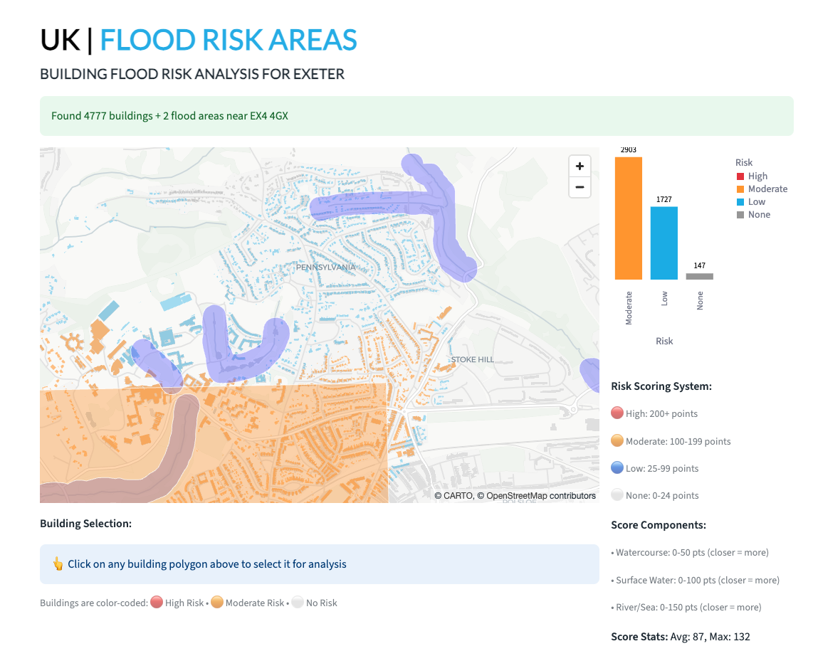
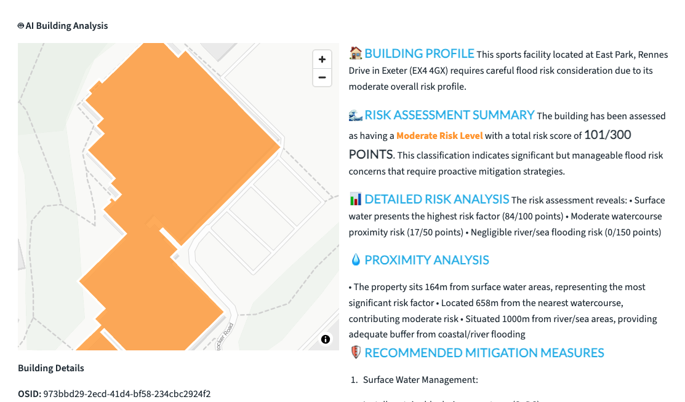

# Flood Risk Analysis

Welcome to the **Flood Risk Analysis** - an art of the possible geospatial risk assessment solution that helps organizations evaluate flood exposure, assess property vulnerabilities, and make informed decisions for flood risk management and mitigation.

## Overview

The Flood Risk Analysis combines historical flood data, real-time environmental monitoring, and advanced predictive modeling to provide actionable insights for flood risk assessment. This solution integrates multiple data sources including weather patterns, topographical data, and infrastructure information to deliver comprehensive flood risk evaluations.

## Key Features

### 🌊 Comprehensive Flood Risk Assessment
Analyze flood risk levels across different geographic areas using advanced hydrological modeling and historical flood data.

The flood risk assessment provides:
- **Risk zones mapping** - Visual representation of high, medium, and low flood risk areas
- **Historical flood patterns** - Analysis of past flooding events and frequency
- **Real-time monitoring** - Current weather conditions and flood warnings
- **Predictive modeling** - Forecasting potential flood scenarios based on weather patterns
- **Infrastructure impact** - Assessment of critical infrastructure exposure to flood risks

### 🏢 Building Profile and Vulnerability Analysis
Detailed analysis of individual buildings and properties to assess their specific flood risk exposure and vulnerability factors.

The building profile analysis includes:
- **Property-level risk scoring** - Individual flood risk assessment for specific addresses
- **Structural vulnerability** - Building characteristics affecting flood resilience
- **Elevation analysis** - Ground level and basement flood susceptibility
- **Historical claims data** - Previous flood damage and insurance claims
- **Mitigation recommendations** - Specific actions to reduce flood risk
- **Insurance implications** - Risk-based premium assessments and coverage recommendations

## Getting Started

### Accessing the Flood Risk Tool

1. **Navigate to Applications** - From your Snowflake interface, access the Apps section
2. **Launch Flood Risk Analysis** - Click on the Flood Risk Analysis application
3. **Select Analysis Type** - Choose from area assessment, building analysis, or risk modeling
4. **Input Parameters** - Define geographic boundaries, time periods, and analysis criteria

### Analysis Capabilities

#### Area Risk Assessment
- **Geographic Analysis** - Evaluate flood risk across neighborhoods, cities, or regions
- **Zone Classification** - Identify high-risk areas requiring immediate attention
- **Evacuation Planning** - Optimize emergency response routes and shelter locations
- **Infrastructure Protection** - Assess critical facilities and utilities exposure

#### Building-Level Analysis
- **Property Assessment** - Individual building flood risk evaluation
- **Portfolio Analysis** - Bulk assessment for real estate portfolios or insurance companies
- **Risk Scoring** - Quantified risk metrics for decision-making
- **Mitigation Planning** - Customized flood protection recommendations

#### Predictive Modeling
- **Weather Integration** - Real-time weather data and forecasting
- **Scenario Planning** - "What-if" analysis for different flood scenarios
- **Climate Change Impact** - Long-term risk projections considering changing weather patterns
- **Early Warning Systems** - Automated alerts for emerging flood risks

## Data Sources and Integration

### Environmental Data
- **Weather Services** - Real-time precipitation, river levels, and meteorological data
- **Topographical Maps** - Elevation models and drainage basin analysis
- **Soil Data** - Absorption rates and runoff characteristics
- **Land Use** - Urban development and natural barrier information

### Historical Records
- **Flood History** - Past flooding events and severity levels
- **Insurance Claims** - Historical damage and loss data
- **Emergency Response** - Previous evacuation and response effectiveness
- **Infrastructure Failures** - Historical system failures during flood events

### Real-Time Monitoring
- **Sensor Networks** - Water level and flow rate monitoring
- **Satellite Imagery** - Current ground conditions and water coverage
- **IoT Integration** - Smart city sensors and monitoring devices
- **Social Media** - Crowd-sourced flood reporting and verification

## Risk Management Applications

### Insurance and Finance
- **Underwriting Support** - Data-driven risk assessment for policy pricing
- **Claims Prevention** - Proactive risk mitigation to reduce claims
- **Portfolio Management** - Geographic risk distribution analysis
- **Regulatory Compliance** - Meeting flood risk disclosure requirements

### Emergency Management
- **Response Planning** - Optimized evacuation routes and resource allocation
- **Early Warning Systems** - Automated alerts for at-risk populations
- **Resource Deployment** - Strategic positioning of emergency assets
- **Community Preparedness** - Public education and awareness programs

### Urban Planning
- **Development Guidelines** - Flood-safe construction and zoning recommendations
- **Infrastructure Investment** - Priority areas for flood protection improvements
- **Green Infrastructure** - Natural flood management solutions
- **Resilience Planning** - Long-term community flood resilience strategies

## Best Practices

### Data Quality and Validation
- **Regular Updates** - Ensure data sources are current and accurate
- **Ground Truthing** - Validate model predictions with local observations
- **Multi-Source Verification** - Cross-reference data from multiple providers
- **Historical Calibration** - Validate models against known historical events

### Risk Communication
- **Clear Visualization** - Use intuitive maps and charts for stakeholder communication
- **Uncertainty Quantification** - Clearly communicate confidence levels and limitations
- **Actionable Insights** - Provide specific, implementable recommendations
- **Regular Reporting** - Scheduled risk updates and trend analysis

### Implementation Strategy
- **Phased Deployment** - Start with high-priority areas or critical infrastructure
- **Stakeholder Engagement** - Involve local communities and decision-makers
- **Training and Support** - Ensure users understand system capabilities and limitations
- **Continuous Improvement** - Regular model updates and performance monitoring

## Technical Architecture

The Flood Risk Analysis leverages:

- **Snowflake's Geospatial Capabilities** - Advanced spatial analysis and geographic functions
- **Machine Learning Models** - Predictive algorithms for flood forecasting
- **Real-Time Data Streams** - Live weather and sensor data integration
- **Historical Data Archives** - Comprehensive flood and weather history databases
- **Interactive Dashboards** - User-friendly visualization and reporting tools

## Advanced Features

### AI-Powered Insights
- **Pattern Recognition** - Machine learning identification of flood risk patterns
- **Predictive Analytics** - AI-driven flood forecasting and early warning
- **Anomaly Detection** - Identification of unusual weather or water level patterns
- **Risk Optimization** - AI-recommended mitigation strategies

### Integration Capabilities
- **API Access** - Connect with existing emergency management systems
- **Mobile Applications** - Field-ready mobile access for emergency responders
- **Third-Party Integration** - Connect with insurance, planning, and utility systems
- **Custom Dashboards** - Tailored interfaces for specific organizational needs

### Compliance and Reporting
- **Regulatory Reports** - Automated generation of required flood risk reports
- **Audit Trails** - Complete documentation of analysis methods and data sources
- **Quality Assurance** - Built-in validation and error checking
- **Data Security** - Enterprise-grade security and privacy protection

---

Transform your flood risk management with data-driven insights and predictive analytics. Launch the Flood Risk Analysis tool to protect your community, assets, and operations from flood-related threats! 🌊🛡️
