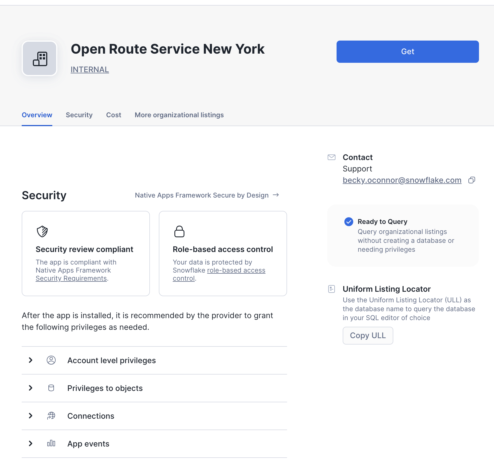
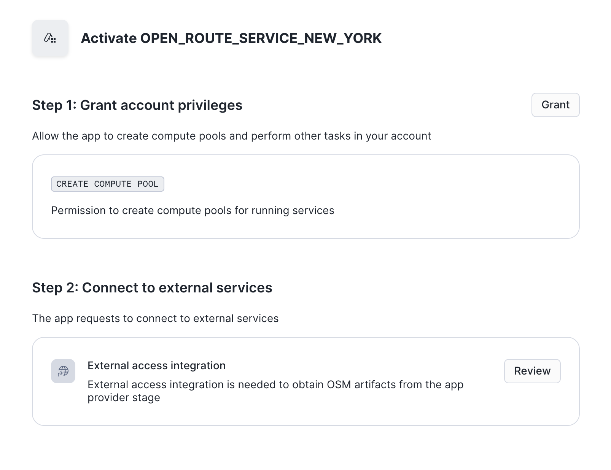
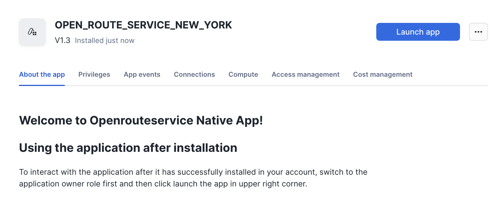
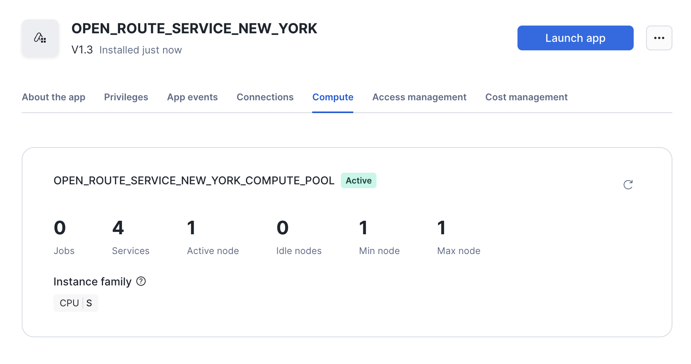
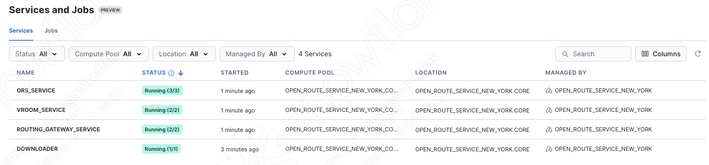
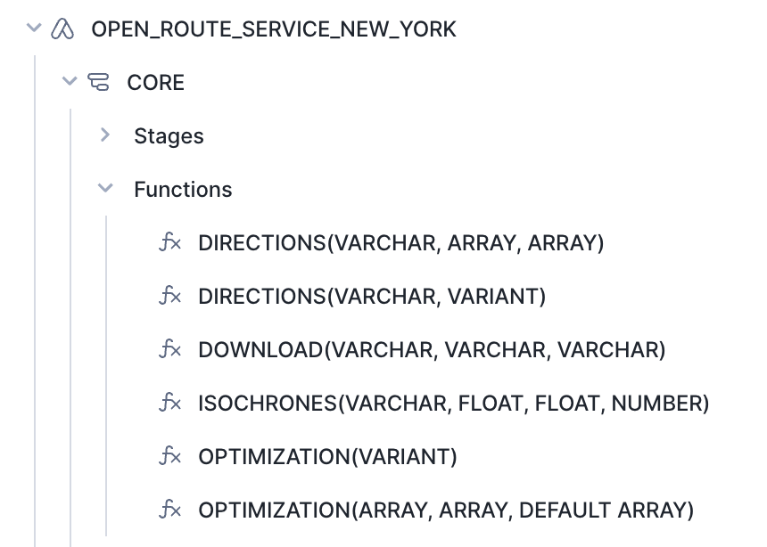
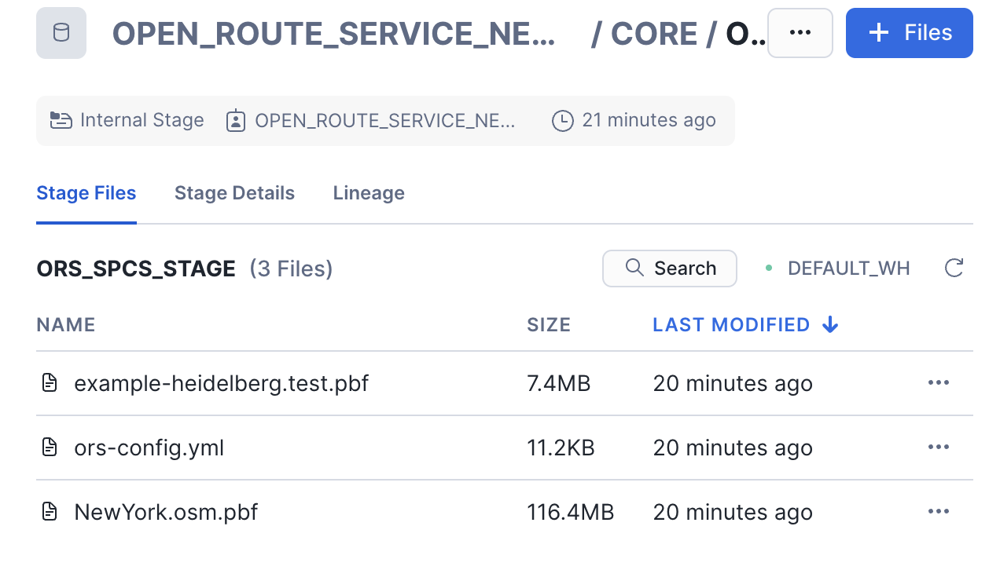
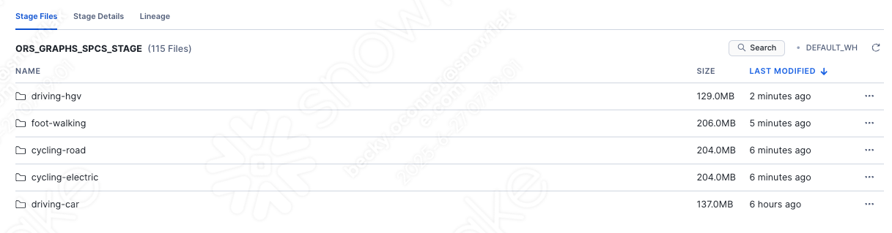
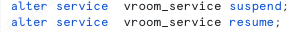

# <h0black>How the native app </h0black> <h0blue>Works</h0blue>


## <h1sub>Installing the native app</h1sub>


- Within the market place, navigate to the **Internal market place** tab

- Click on the Route Optimisation Service and press **Get**


- Populate the email box if requested and press **Save**
- Press **Get**
- Once Installed press **Configure**

    

-   In the activate screen, grant access to **CREATE COMPUTE POOL** and **External Access integration**.

The Compute pool is used to power the services which are being used by the native app.  External Access Integration is used to download the latest maps hosted by the provider.

The native app being shared with you today is populated with **New York City**.  This means, you will be able to generate directions, isochrones and optimisations accross anywhere within the city.





Once you have configured the app, press **Activate** when prompted.  



In this screen you can see information such as the privileges assigned to the app, event logs and what compute is assigned.  the compute setup for this app is one small CPU which keeps 4 services running.




Press **Launch App** which will take you to the default streamlit page.

In here you will see examples of how the app can be used such as for **Directions**, **Optimizations** and **Isochrones**

You can then go to to the notebook to learn what you can do with the functions.


Exit out of the app and go **Projects > Services and Jobs**



You can see the services which have been created by the app. Clicking on each service will show you the event activity.


It is useful to look at this if you experience any unexpected result when calling the service.  

The Vroom service will be used for optimizations and the ORS Service will be used for directions and isochrones.

-   Click on Data and open the **Open Route Service New York** app.



Here, you can see all the functions available to you. You can leverage these functions the same way as any other function in SQL.

-   Click on **Stages**

- Refresh the **ORS_SPCS_STAGE**



This is where the config file and the map file is stored.  These maps are used to generate the responses needed for the routing functions.  If you would like a different map, you can add a new map in this stage.  Maps can come from many sources such as:

-   https://download.geofabrik.de/ 
-   https://download.bbbike.org/osm/

If you change the map you will need to modify the config yml file which is also stored in this stage:

-   Download the config file and open it

You will see the area where you change the source file

```yaml
ors:
  engine:
    profile_default:
      build:  
        source_file: /home/ors/files/NewYork.osm.pbf
```

-   Go back to Stages and open the **ORS_GRAPHS_SPCS_STAGE**.  You will need to refresh the stage to view the graphs in the directory.



The graphs are based on the configured profiles which are stored in the config file


```yaml

    profiles:
      driving-car:
        enabled: true
      cycling-road:
        enabled: true
      driving-hgv:
        enabled: true
      cycling-electric:
        enabled: true
      foot-walking:
        enabled: true

```

If you wish to add more profiles you will need to start and stop the **VROOM** service after amending and re-uploading the config file.


