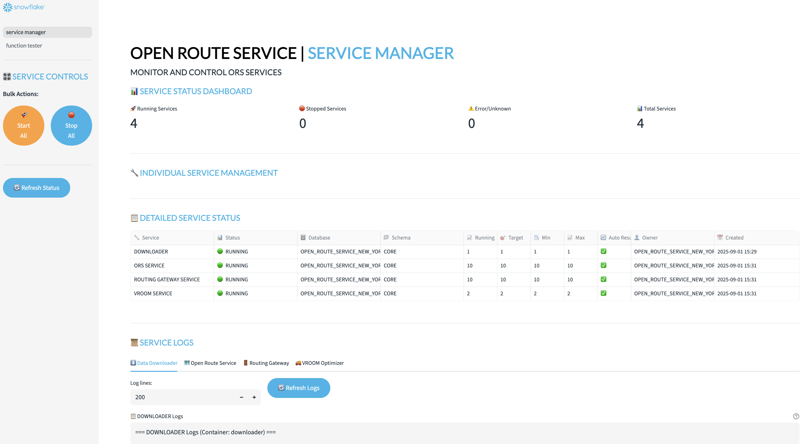
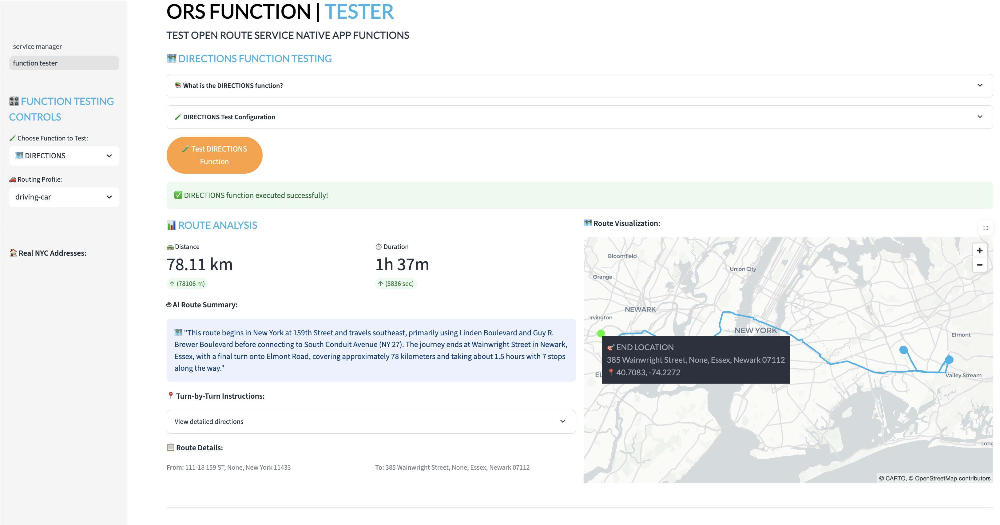
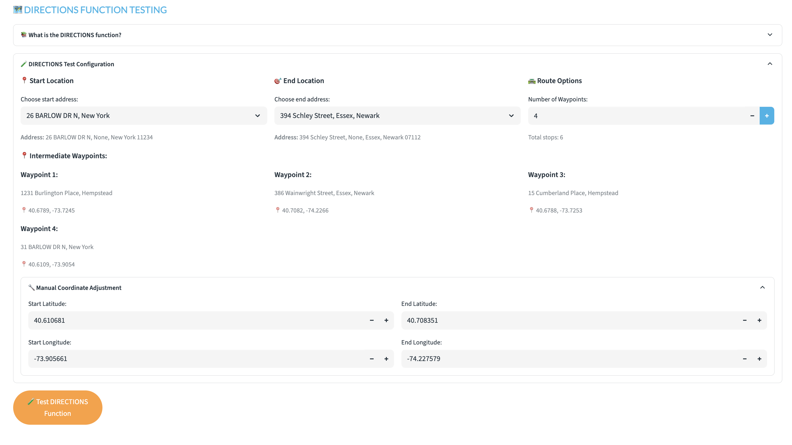
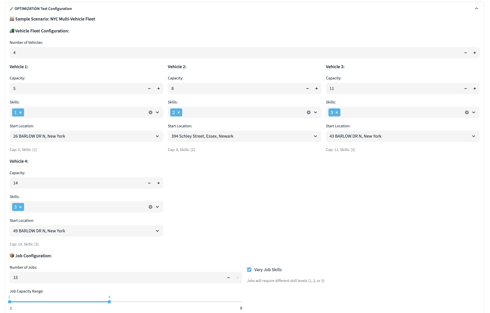
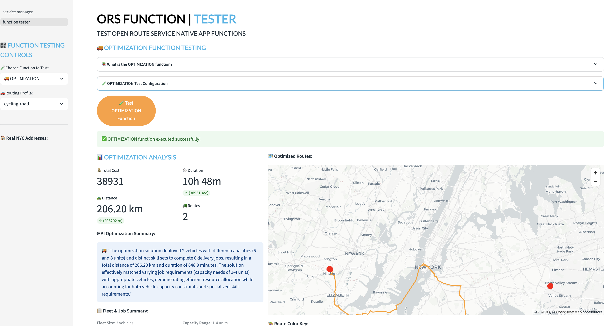
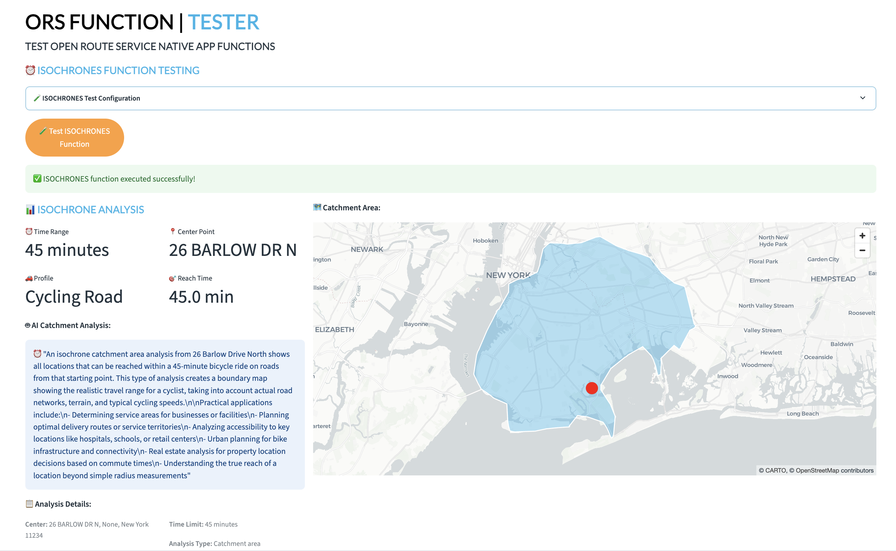

# <h0black>ORS Service Manager &</h0black> <h0blue>Function Tester</h0blue>

## <h1sub>Overview</h1sub>

The **ORS Service Manager** is a comprehensive Streamlit application that serves as the central control hub for the Open Route Service Native App ecosystem. This powerful dual-purpose tool combines service management capabilities with interactive function testing, making it essential for both system administrators and developers working with routing and geospatial analysis.

**🎯 Key Capabilities:**

1. **Complete Service Management** - Monitor, start, stop, and troubleshoot all ORS containerized services including the core routing engine, gateway services, data downloaders, and optimization components
2. **Interactive Function Testing** - Test and validate DIRECTIONS, OPTIMIZATION, and ISOCHRONES functions with real NYC data, custom configurations, and AI-powered analysis
3. **Real-time Monitoring** - Live service status updates, detailed logging, and performance metrics
4. **Educational Tool** - Hands-on learning environment for understanding routing algorithms, geospatial analysis, and microservice architecture

**🏗️ Architecture Integration:**
This application interfaces directly with Snowflake's Snowpark Container Services (SPCS) to manage the ORS Native App's containerized components, providing a user-friendly interface for complex backend operations that would otherwise require direct SQL commands or container management tools.

## Getting Started

### <h1sub>Accessing the Application</h1sub>

1. Navigate to **Projects** → **Streamlit** in your Snowflake interface
2. Locate and click on **ORS_SERVICE_MANAGER** application
3. The app opens with two pages:
   - **service manager** - Service control and monitoring
   - **function tester** - Interactive function testing

---

## <h1sub>Part 1: Service Management</h1sub>

### Service Status Dashboard

The **Service Status Dashboard** serves as the central command center for monitoring and controlling the entire ORS infrastructure. This comprehensive view provides real-time insights into all containerized services that power the routing and optimization capabilities.

**🎛️ Dashboard Components:**
The dashboard displays critical metrics and controls for managing the ORS ecosystem:

- **🚀 Running Services** - Count of active services
- **🛑 Stopped Services** - Count of suspended services  
- **⚠️ Error/Unknown** - Services in error or unknown state
- **📊 Total Services** - Complete service inventory

### Bulk Service Operations

The **Bulk Service Operations** panel provides powerful system-wide controls for managing the entire ORS infrastructure efficiently. These operations are particularly valuable for system administrators who need to coordinate multiple services during maintenance windows, system updates, or troubleshooting scenarios.

**🚀 Start All Services:**
- **Purpose**: Simultaneously resume all suspended services, bringing the complete ORS ecosystem online
- **Use Cases**: Initial system startup, post-maintenance recovery, or recovering from system-wide failures
- **Process**: Click **🚀 Start All** to initiate the startup sequence across all containerized services
- **Feedback**: Real-time progress indicators and success/error messages for each service as they come online
- **Dependencies**: The system automatically handles service dependencies and startup ordering

**🛑 Stop All Services:**
- **Purpose**: Gracefully suspend all running services in a coordinated manner
- **Use Cases**: Planned maintenance windows, system updates, resource conservation, or preparing for system shutdown
- **Process**: Click **🛑 Stop All** to initiate the shutdown sequence across all services
- **Safety**: Ensures proper shutdown procedures to prevent data loss or corruption
- **Monitoring**: Provides real-time feedback showing the status of each service as it stops

### Individual Service Management

The **Individual Service Management** section provides granular control over each ORS component, allowing administrators to manage specific services independently. This fine-grained control is essential for targeted troubleshooting, selective service updates, and optimizing resource usage based on current needs.

**🔧 Service Information Display:**
Each service entry provides comprehensive status information and controls:

- **Service name and description** - Clear identification with descriptive text (e.g., "🗺️ Open Route Service - Core routing and directions service")
- **Real-time status indicators** - Color-coded status with visual symbols (🟢 Running, 🔴 Suspended, ⚠️ Error states)
- **Resource metrics** - Container instance counts, memory usage, and performance indicators
- **Operational metadata** - Creation timestamps, last update times, and configuration details

**⚡ Individual Service Controls:**
- **🚀 Start Button** - Resume a specific suspended service without affecting others
- **🛑 Stop Button** - Suspend a specific running service for maintenance or troubleshooting
- **Real-time feedback** - Immediate success/error messages and status updates
- **Dependency awareness** - Warnings when stopping services that other components depend on

### Service Logs

The **Service Logs Section** provides direct access to real-time container logs from Snowflake's SPCS infrastructure, offering invaluable insights for system monitoring, troubleshooting, and performance optimization. This feature connects directly to the underlying container runtime to retrieve authentic log data.

**📊 SPCS Log Monitoring Capabilities:**
Advanced logging features for comprehensive system visibility:

- **Dedicated service tabs** - Individual log viewers for each containerized service (ORS_SERVICE, ROUTING_GATEWAY_SERVICE, DOWNLOADER, VROOM_SERVICE)
- **Live container logs** - Real-time access to actual service output, errors, and operational messages
- **Refresh controls** - Manual and automatic log refresh capabilities to capture the latest entries
- **Searchable interfaces** - Scrollable text areas with search functionality for efficient log analysis
- **Historical access** - Ability to review past log entries for trend analysis and issue investigation

**🔍 Service-Specific Log Content:**
Each service provides unique insights into different aspects of the ORS ecosystem:

- **ORS_SERVICE**: Spring Boot application lifecycle events, routing profile initialization, memory allocation patterns, HTTP request processing, routing calculation performance, and geographic data loading
- **ROUTING_GATEWAY_SERVICE**: Reverse proxy operations, incoming request routing decisions, load balancing activities, API gateway security checks, and traffic distribution metrics
- **VROOM_SERVICE**: Node.js optimization engine startup sequences, vehicle routing problem processing, optimization algorithm execution, solution generation, and performance benchmarks
- **DOWNLOADER**: OpenStreetMap data download progress, geographic region processing, data validation procedures, file system operations, and data pipeline status updates

---

## <h1sub>Part 2: Function Testing</h1sub>

The **Function Testing Interface** transforms the ORS Service Manager into a comprehensive testing and validation platform for all routing and geospatial functions. This interactive environment allows developers, analysts, and students to explore the full capabilities of the Open Route Service Native App using real-world data and scenarios.

**🧪 Testing Environment Features:**
Navigate to the **function tester** page to access a sophisticated testing platform that includes:

- **Real NYC Data Integration** - All tests use authentic address data from New York City, ensuring realistic routing scenarios
- **Interactive Visualizations** - PyDeck-powered maps with zoom-responsive elements and detailed tooltips
- **AI-Powered Analysis** - Claude-3.5-Sonnet integration for intelligent route summaries and optimization insights
- **Configurable Parameters** - Extensive customization options for vehicles, jobs, time constraints, and routing preferences
- **Educational Content** - Built-in explanations and tutorials for each function's capabilities and use cases

### <h1sub>DIRECTIONS Function Testing</h1sub>

The **DIRECTIONS Function** represents the core routing capability of the Open Route Service, providing detailed turn-by-turn navigation instructions for both simple point-to-point routes and complex multi-waypoint journeys. This function is fundamental to understanding how modern routing engines process geographic data, calculate optimal paths, and generate human-readable navigation instructions.

**🎯 Real-World Applications:**
This function simulates critical use cases across multiple industries:
- **Logistics & Delivery**: Multi-stop delivery routes with optimized sequencing
- **Field Services**: Technician routing for maintenance and service calls  
- **Tourism & Travel**: Scenic route planning with multiple points of interest
- **Emergency Response**: Optimal routing for first responders and medical services
- **Urban Planning**: Traffic flow analysis and infrastructure planning

#### Configuration Options

**📍 Geographic Location Selection:**
The location selection system uses authentic NYC address data to ensure realistic, routable scenarios:

- **Start Location** - Choose from northern/western NYC boroughs (Manhattan, Bronx, Queens North) to establish journey origins
- **End Location** - Select from southern/eastern NYC areas (Brooklyn, Staten Island, Queens South) ensuring meaningful geographic separation
- **Strategic Separation** - Addresses are pre-filtered to provide routes with substantial distance and complexity
- **Verified Coordinates** - All addresses use validated latitude/longitude pairs that are guaranteed to be routable by the ORS engine

**🛣️ Route Complexity Configuration:**
Control the complexity and realism of your routing scenarios:

- **Number of Waypoints (0-5)** - Add intermediate stops to simulate real-world multi-destination journeys:
  - **0 waypoints**: Simple point-to-point routing for basic navigation testing
  - **1-2 waypoints**: Moderate complexity for typical delivery or service routes
  - **3-5 waypoints**: Complex routing scenarios for comprehensive logistics planning
- **Intelligent Waypoint Selection** - System automatically chooses geographically logical intermediate points from the verified address database
- **Route Visualization** - Complete journey display showing the sequence and complexity of the planned route

#### Testing Process

1. **Expand "📚 What is the DIRECTIONS function?"** to learn about capabilities
2. **Configure route** in "🧪 DIRECTIONS Test Configuration" section:
   - Select start and end addresses
   - Choose number of waypoints (try 2-3 for interesting routes)
   - Optionally adjust coordinates manually
3. **Click "🧪 Test DIRECTIONS Function"**
4. **View results** in Route Analysis and Route Visualization sections

#### Results Analysis

**📊 Route Analysis:**
- **Smart metrics** - Distance in km/meters, Duration in hours/minutes
- **AI Route Summary** - Claude-powered description of the route
- **Turn-by-turn instructions** - Expandable detailed directions
- **Route details** - Complete address information

**🗺️ Route Visualization:**
- **Interactive map** with zoom-responsive points
- **Color-coded markers** - Red start, blue waypoints, green end
- **Route path** - Blue line connecting all points in sequence
- **Rich tooltips** - Hover for address details and route information

*Configuration panel for the directions interface:*

### <h1sub>OPTIMIZATION Function Testing</h1sub>

**Purpose:** Test vehicle routing optimization for multi-vehicle, multi-job scenarios.

#### Configuration Options

**🚛 Vehicle Fleet Setup:**
- **Number of Vehicles** - Configure 1-5 vehicles
- **Individual Vehicle Settings:**
  - **Capacity** - Load capacity in units
  - **Skills** - Special capabilities (1=basic, 2=intermediate, 3=advanced)
  - **Start Location** - Vehicle depot/base address

**📦 Job Configuration:**
- **Number of Jobs** - 1-15 delivery/pickup jobs
- **Capacity Range** - Variable capacity requirements per job
- **Skill Variety** - Toggle between varied or fixed skill requirements

#### Testing Process

1. **Expand "📚 What is the OPTIMIZATION function?"** to understand VRP concepts
2. **Configure fleet** in "🧪 OPTIMIZATION Test Configuration":
   - Set number of vehicles (try 2-3 for interesting optimization)
   - Configure each vehicle's capacity and skills
   - Select different depot locations
   - Set job parameters for realistic scenarios
3. **Click "🧪 Test OPTIMIZATION Function"**
4. **Analyze results** in Optimization Analysis and route visualization

#### Results Analysis

**📊 Optimization Analysis:**
- **Performance metrics** - Total cost, distance, duration
- **Fleet summary** - Routes generated, vehicles utilized
- **AI Optimization Summary** - Strategy and efficiency analysis
- **Fleet & Job Summary** - Configuration overview

**🗺️ Optimized Routes:**
- **Multi-colored routes** - Each vehicle in distinct Snowflake brand color
- **Color legend** - Vehicle identification with job counts
- **Interactive elements** - Vehicle depots, job locations, route paths
- **Comprehensive tooltips** - Vehicle specs, job requirements, route details

### <h1sub>ISOCHRONES Function Testing</h1sub>

**Purpose:** Test time-based catchment area analysis for service area planning.

#### Configuration Options

**📍 Center Location:**
- **Address selection** - Choose from NYC address database
- **Manual coordinates** - Fine-tune location if needed

**⏰ Time Configuration:**
- **Time Range** - 5-60 minutes of travel time
- **Profile selection** - Transportation mode from sidebar

#### Testing Process

1. **Expand "📚 What is the ISOCHRONES function?"** to learn about catchment analysis
2. **Configure analysis** in "🧪 ISOCHRONES Test Configuration":
   - Select center location for analysis
   - Set time range (try 15-30 minutes for good coverage)
   - Choose appropriate routing profile
3. **Click "🧪 Test ISOCHRONES Function"**
4. **Examine catchment area** in analysis and visualization sections

#### Results Analysis

**📊 Isochrone Analysis:**
- **Time metrics** - Range and profile information
- **AI Catchment Analysis** - Practical applications and insights
- **Analysis details** - Center location and parameters

**🗺️ Catchment Area:**
- **Polygon visualization** - Semi-transparent blue area showing reachable locations
- **Center point** - Red marker at analysis center
- **Interactive tooltips** - Center details and catchment information

---

## <h1sub>Advanced Features</h1sub>

### AI-Powered Analysis

All functions include **Claude-3.5-Sonnet** powered analysis:

- **DIRECTIONS** - Route descriptions with main roads and navigation insights
- **OPTIMIZATION** - Strategy analysis explaining efficiency and job distribution
- **ISOCHRONES** - Practical applications and market analysis insights

### Interactive Maps

**Professional Visualization:**
- **Zoom-responsive points** - Markers scale appropriately with zoom level
- **Rich tooltips** - Comprehensive information on hover
- **Snowflake brand colors** - Professional color scheme throughout
- **Multiple layers** - Points, paths, and polygons with clear differentiation

### Real NYC Data Integration

**Authentic Testing:**
- **Real addresses** from NYC address database
- **Geographic separation** - Addresses from different boroughs for meaningful routing
- **Routable coordinates** - All addresses verified for ORS compatibility
- **Full address details** - Street, city, borough, ZIP code information

---

## <h1sub>Best Practices</h1sub>

### Service Management

1. **Check service status** before running function tests
2. **Start all services** if any are suspended
3. **Monitor logs** for troubleshooting if functions fail
4. **Use manual refresh** rather than auto-refresh for better control

### Function Testing

1. **Read function instructions** before first use
2. **Start with simple configurations** then increase complexity
3. **Use waypoints** for DIRECTIONS to see multi-stop routing
4. **Configure multiple vehicles** for OPTIMIZATION to see true optimization
5. **Try different time ranges** for ISOCHRONES to understand catchment variation

### Routing Profiles

**Choose appropriate profiles for testing:**
- **driving-car** - Standard passenger vehicle routing
- **driving-hgv** - Heavy goods vehicle with truck restrictions
- **cycling-road** - Bicycle routing for urban delivery scenarios
- **cycling-electric** - E-bike routing with extended range
- **foot-walking** - Pedestrian routing for last-mile analysis

---

## <h1sub>Troubleshooting</h1sub>

### Common Issues

**"Could not find routable coordinates"**
- Select different addresses from the dropdowns
- Addresses are pre-filtered for ORS compatibility
- Try addresses from different boroughs

**"No services found"**
- Check that ORS native app is installed
- Ensure services are running in service manager
- Verify database permissions

**Function timeouts**
- Reduce complexity (fewer waypoints, vehicles, or jobs)
- Check service logs for backend issues
- Ensure adequate compute warehouse size

### Service Status Issues

**Services not starting**
- Check service logs for specific error messages
- Verify compute pool has adequate resources
- Ensure ORS native app is properly configured

**Missing functions**
- Verify ORS native app installation
- Check that all services are running
- Confirm database and schema permissions

---

## <h1sub>Educational Value</h1sub>

### Learning Objectives

**Geospatial Analysis:**
- Understanding routing algorithms and optimization
- Practical application of GIS concepts
- Real-world logistics and transportation planning

**Snowflake Native Apps:**
- Containerized service management (SPCS)
- Function calling and integration patterns
- Data visualization and analysis workflows

**AI Integration:**
- Combining AI analysis with geospatial data
- Practical applications of LLM summarization
- Enhanced user experience through intelligent insights

### Use Cases

**Fleet Intelligence:**
- Vehicle routing optimization
- Service area planning
- Delivery route analysis

**Location Intelligence:**
- Market catchment analysis
- Service accessibility studies
- Transportation planning

**Educational Applications:**
- Hands-on routing algorithm demonstrations
- Real-world logistics problem solving
- Interactive geospatial analysis learning

---

The ORS Service Manager provides a comprehensive platform for learning, testing, and demonstrating the full capabilities of the Open Route Service Native App in an educational and professional context.
