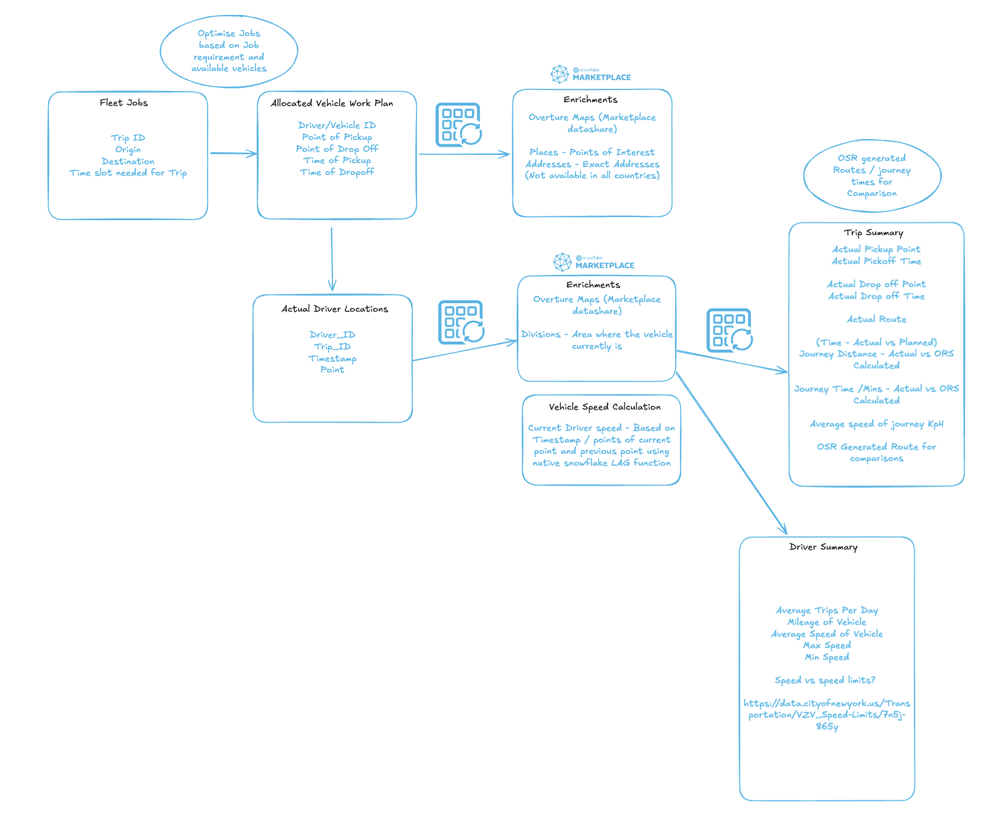
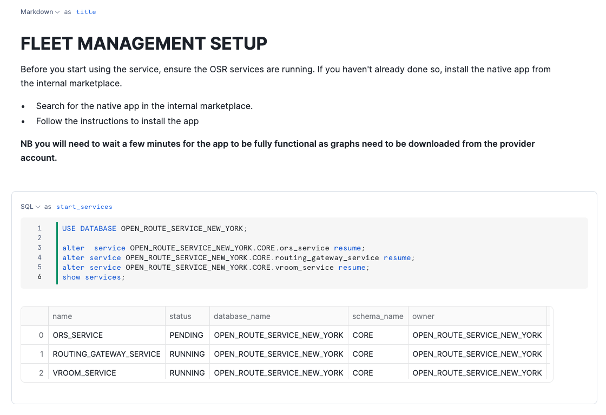
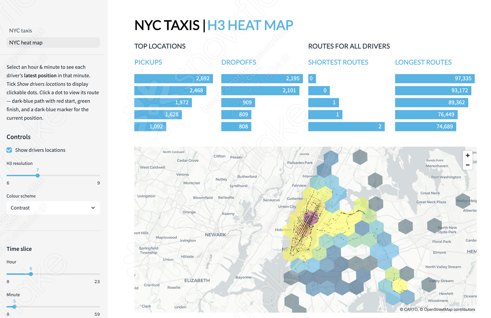

# <h0black>Using OSR for </h0black> <h0blue>Fleet Maintanence</h0blue>

Below is the data flow of how the streamlit app data is constructed.

You can see this in detail via the **Fleet Intelligence Setup** notebook.

## <h1sub> Run the Fleet Intelligence Applications </h1sub>

Now you can see how the data was constructed for analytical purposes, let's see this in action. The lab provides two fleet management applications:

### **NYC Taxi Trip Viewer**
Take a look at the **New York City taxi Trip Viewer** Streamlit app which is available in your provisioned snowsight instance.

The application processes and geocodes all the location history of All taxis in New York city over a short time period.  It then leverages the Open Route Service to provide all the given routes of every Drop of and Pickup point.

You will be able to see statistics about a specific driver, as well as focusing on a given trip where the route has been drawn out a long with time estimates provided by the Open Route Service.

### **NYC Beauty Supply Chain Optimizer**

Additionally, explore the **NYC Beauty Supply Chain Optimizer** Streamlit app, which demonstrates industry-specific fleet optimization:

- **Real Business Scenarios**: Beauty supply chain with 4 NYC depot locations
- **Advanced Vehicle Management**: Skill-based delivery assignments and capacity constraints  
- **Synthetic Data Integration**: Uses the `ORGDATACLOUD$INTERNAL$NYC_BEAUTY_SUPPLY_CHAIN_FLEET` marketplace listing
- **Interactive Optimization**: Service area mapping, route visualization, and performance metrics

This application showcases how marketplace data can provide realistic, ready-to-use scenarios for fleet optimization across different industries.