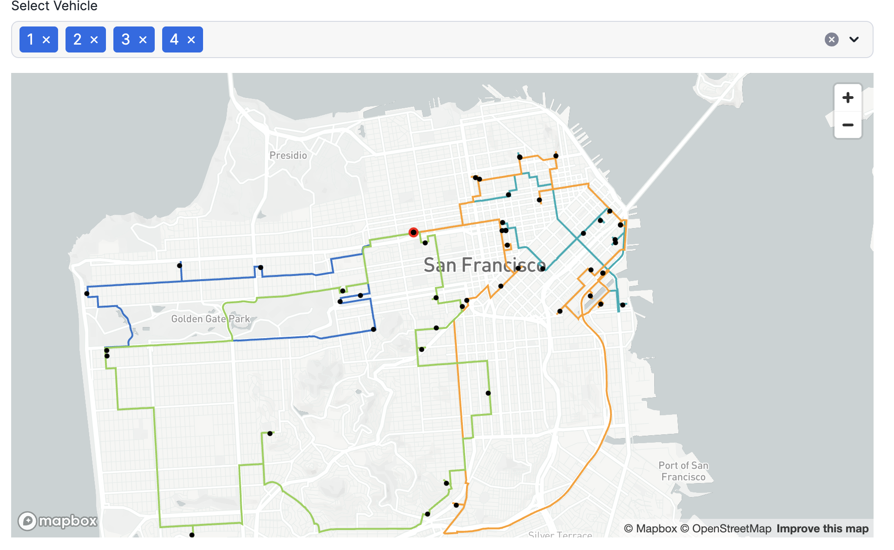

# <h0black>Using the OSR </h0black> <h0blue>Native App</h0blue>

This tutorial is self contained inside the notebook which covers creating the functions, how to apply them and how to visualise the results. 

You will leverage **AISQL** to synthesize data to test in the Route Optimisation Service, as well as using **AISQL** to generate Python code for map visualisations



At the end you will have a good understand of how the route optimisation servers works well with Snowflake Advanced analytical capabilites - which will also help you understand how the streamlit applications work.

- Within the notebook area in Snowsight, navigate to the **ROUTING_WITH_OPEN_ROUTES_AND_CORTEX** notebook and follow the instructions inside
- When you have completed the Notebook, navigate to the streamlit area (within projects) and explore the available applications:
  - **ROUTE_OPTIMIZER_SIMULATOR** - General purpose route optimization
  - **NYC_TAXI_TRIP_VIEWER** - Fleet monitoring and driver analytics  
  - **NYC_BEAUTY_SUPPLY_CHAIN_OPTIMIZER** - Industry-specific optimization scenarios 


## <h1sub> Calling APIs direct from the service </h1sub>

As a lighter alternative, you can also use the route optimisation service to get results from the free apis.  Please note that this method has api call limits.  

To try this, please visit:

https://openrouteservice.org/ and sign up for an API key.

Once you have a key, you will need to open a worksheet and modify the secret which has already been provisioned in this lab.  

- Replace the secret string with your **openrouteservice** key:


```sql
ALTER SECRET VEHICLE_ROUTING_SIMULATOR.CORE.ROUTING_TOKEN SET SECRET_STRING = 'secret for open route service';
```

Both the **notebook** and the **streamlit app** will work with either method.

There is a Quickstart available which provides you with step by step instructions on how to create the native app yourself.

