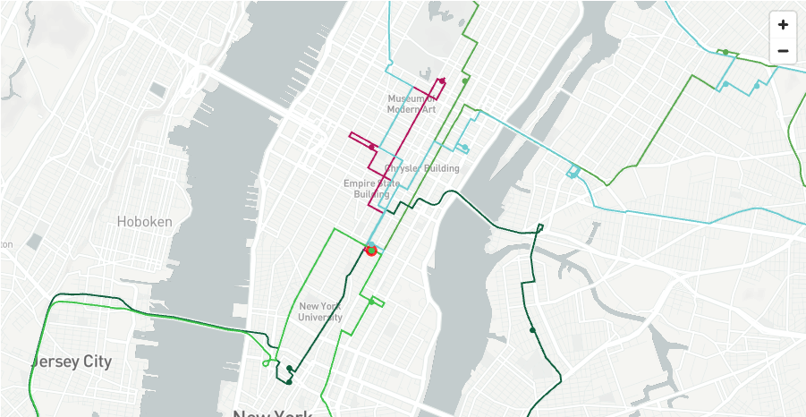

# <h0black>Further </h0black> <h0blue>Learning</h0blue>

You should now see how snowflake can use the open route service to understand the best way to generate routings, catchments and how toasign jobs to available vehicles.  There is a quickstart which gives you a step by step guide on:
-   How to create the native app which includes 4 containers
-   How to create the user defined functions should you wish to try out the online available APIs provided by the **Open Route Service**

click [here](https://quickstarts.snowflake.com/guide/Create-a-Route-Optimisation-and-Vehicle-Route-Plan-Simulator/index.html?utm_cta=undefined#5) to run through the quickstart.

