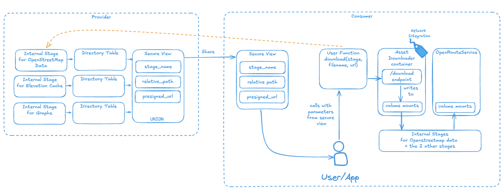

# <h0black>FLEET INTELLIGENCE IN </h0black> <h0blue>SNOWFLAKE</h0blue>
<h1sub>Advanced Route Optimization & Geospatial Analytics with Open Route Service Native App</h1sub> 

This comprehensive hands-on lab demonstrates how the **Open Route Service Native App** integrated with Snowflake's powerful data platform creates an enterprise-grade fleet intelligence solution. You'll explore cutting-edge geospatial analytics, AI-powered route optimization, and real-time fleet management capabilities that transform how organizations approach logistics, delivery, and transportation challenges.

**🎯 What You'll Learn:**
This lab provides deep hands-on experience with modern fleet intelligence technologies, combining Snowflake's data platform capabilities with advanced routing algorithms and geospatial analysis. You'll gain practical skills in service management, route optimization, and data-driven decision making that are directly applicable to real-world logistics challenges.

**🏗️ Native App Architecture:**
Experience a **fully managed native app solution** that eliminates infrastructure complexity while providing enterprise-scale routing capabilities. The Open Route Service Native App comes pre-configured with **New York City mapping data** and is available through Snowflake's **Internal Marketplace**. In production environments, this same architecture scales globally to support routing across any geographic region worldwide.

**📊 Comprehensive Learning Platform:**
The lab features an integrated suite of interactive applications and tools designed to provide comprehensive coverage of modern fleet intelligence concepts:

## <h1sub>Interactive Applications Suite</h1sub>

**🚛 Fleet Monitoring & Analytics:**
-   **NYC Taxi Trip Viewer** - Advanced fleet monitoring application that enables deep analysis of driver behavior, route replay capabilities, and comprehensive overview dashboards of all fleet operations. Includes real-time tracking, performance metrics, and operational intelligence.

**⚡ Route Optimization Engines:**
-   **Multi-Industry Route Simulator** - Sophisticated routing engine that adapts to various industry requirements including retail distribution, healthcare logistics, field services, and emergency response. Features dynamic vehicle assignment, capacity optimization, and industry-specific constraint handling.

-   **NYC Beauty Supply Chain Optimizer** - Specialized industry demonstration showcasing advanced route optimization with realistic depot locations, multi-skilled vehicle fleets, and complex delivery job matching. Includes capacity constraints, skill-based routing, and time window optimization.

**🎛️ Service Management & Testing:**
-   **ORS Service Manager & Function Tester** - Comprehensive platform for managing containerized services and interactive testing of all ORS capabilities. Features real-time service monitoring, container log analysis, and advanced function testing with AI-powered insights for DIRECTIONS, OPTIMIZATION, and ISOCHRONES functions.

-   **NYC Food Delivery Route Optimizer** - Complete B2C food delivery optimization solution featuring restaurants, dark kitchens, delivery vehicles (bikes, vans, refrigerated trucks), and customer orders with realistic temperature requirements and delivery time constraints. Demonstrates industry-specific routing challenges and solutions.

**📈 Geospatial Analytics & Visualization:**
-   **NYC Heat Map Analyzer** - Advanced geospatial visualization tool for analyzing traffic patterns, demand hotspots, and geographic distribution of fleet activities. Includes temporal analysis, density mapping, and predictive analytics capabilities.

## <h1sub>Advanced Technology Integration</h1sub>

**🤖 AI-Powered Intelligence:**
- **Snowflake Cortex Integration** - Leverage advanced AI capabilities for synthetic data generation, intelligent route analysis, and automated Python code generation for complex visualizations
- **Claude-3.5-Sonnet Analysis** - Real-time AI-powered route summaries, optimization strategy explanations, and natural language insights for complex routing decisions
- **Intelligent Data Synthesis** - Generate realistic fleet scenarios and routing challenges using structured data formats optimized for machine learning

**🗺️ Geospatial Data Ecosystem:**
- **Multi-Source Data Integration** - Combine NYC taxi IoT data, real address databases, point-of-interest datasets from Overture/Carto, and synthetic delivery scenarios
- **Real-World POI Integration** - Discover routing to authentic points of interest including restaurants, supermarkets, and business locations using marketplace datasets
- **Advanced Spatial Analysis** - Implement sophisticated geospatial functions including distance calculations, catchment area analysis, and location-based optimization

## <h1sub>Native App Architecture</h1sub>

This lab uses a pre provisioned native app to use.  The installation of the native app is not part of the hands on lab.  However, below is an architecture of how it works.

## <h1sub>Hands-On Learning Objectives</h1sub>

**🎓 Technical Skills Development:**
Through this comprehensive lab experience, you will master advanced fleet intelligence capabilities using Snowflake's modern data platform:

**📊 Advanced Data Platform Mastery:**
-  **Snowpark Container Services (SPCS)** - Manage and monitor containerized routing services, understand microservice architectures, and implement enterprise-grade service management
-  **Native App Ecosystem** - Experience the full lifecycle of native app integration, from marketplace installation to advanced function utilization
-  **Real-Time Data Processing** - Handle streaming IoT data from NYC taxi fleets, process geospatial coordinates, and implement temporal analytics

**🗺️ Geospatial Analytics & Visualization:**
-  **Multi-Layer Mapping** - Create sophisticated visualizations using PyDeck's advanced mapping capabilities, implement interactive tooltips, and design zoom-responsive interfaces
-  **Spatial Function Mastery** - Utilize Snowflake's ST_* geospatial functions for distance calculations, polygon analysis, and coordinate transformations
-  **Real-World POI Integration** - Connect to authentic point-of-interest datasets from Overture/Carto marketplace, enabling routing to restaurants, supermarkets, and business locations across New York City

**🤖 AI & Machine Learning Integration:**
-   **Snowflake Cortex Capabilities** - Generate synthetic datasets with realistic fleet scenarios, create intelligent route analysis, and automate Python code generation for complex visualizations
-   **Claude-3.5-Sonnet Integration** - Implement real-time AI-powered route summaries, optimization strategy explanations, and natural language insights for routing decisions
-   **Intelligent Optimization** - Apply machine learning techniques to vehicle assignment, capacity optimization, and skill-based routing challenges

**🚛 Industry-Specific Applications:**
-   **Multi-Industry Scenarios** - Explore routing solutions across retail distribution, healthcare logistics, field services, emergency response, and specialized supply chains
-   **Constraint-Based Optimization** - Implement complex routing constraints including vehicle capacities, driver skills, time windows, and delivery priorities
-   **Performance Analytics** - Analyze route efficiency, cost optimization, fuel consumption, and delivery time predictions

## <h1sub>Pre-Configured Lab Environment</h1sub>

**🏗️ Enterprise-Ready Infrastructure:**
A complete, production-grade lab environment has been automatically provisioned for you, eliminating setup complexity and allowing immediate focus on learning advanced fleet intelligence concepts. This environment mirrors real-world enterprise deployments and includes all necessary components for comprehensive hands-on experience.

**⚙️ Your Dedicated Environment:**
- **Snowflake Account**: {{ getenv("DATAOPS_SNOWFLAKE_ACCOUNT","[unknown]") }} - Your dedicated instance with full access to native apps and marketplace data
- **User Identity**: {{ getenv("EVENT_USER_NAME","[unknown]") }} - Pre-configured with appropriate permissions for all lab activities
- **Compute Resources**: {{ getenv("EVENT_WAREHOUSE","[unknown]") }} - Dedicated virtual warehouse optimized for geospatial processing
- **Data Platform**: {{ getenv("DATAOPS_DATABASE","[unknown]") }} - Primary database containing all fleet intelligence datasets and configurations
- **Working Schema**: {{ getenv("EVENT_SCHEMA","[unknown]") }} - Organized namespace for your lab work and experiments

**📊 Pre-Loaded Data Assets:**
- **Real NYC Taxi Data** - Authentic IoT streaming data with second-by-second location tracking, trip records, and route histories
- **Verified Address Database** - Comprehensive NYC address dataset with validated coordinates for realistic routing scenarios
- **Synthetic Fleet Scenarios** - Industry-specific delivery jobs, vehicle configurations, and depot locations for hands-on optimization
- **Point-of-Interest Data** - Real restaurant, retail, and business location data from Overture Maps via Carto marketplace integration

**🎛️ Ready-to-Use Applications:**
- **Four Interactive Streamlit Apps** - Fully deployed and configured for immediate use
- **Jupyter Notebooks** - Pre-configured analysis environments with sample code and datasets
- **ORS Native App** - Fully installed and operational with NYC mapping data loaded
- **AI Integration** - Snowflake Cortex and Claude-3.5-Sonnet ready for intelligent analysis

**🔧 Development Tools:**
- **Complete Python Environment** - Pre-configured with all necessary libraries for geospatial analysis, visualization, and AI integration
- **Database Schemas** - Organized data structures optimized for fleet intelligence workflows
- **Service Management Tools** - Full access to container monitoring, logging, and troubleshooting capabilities

