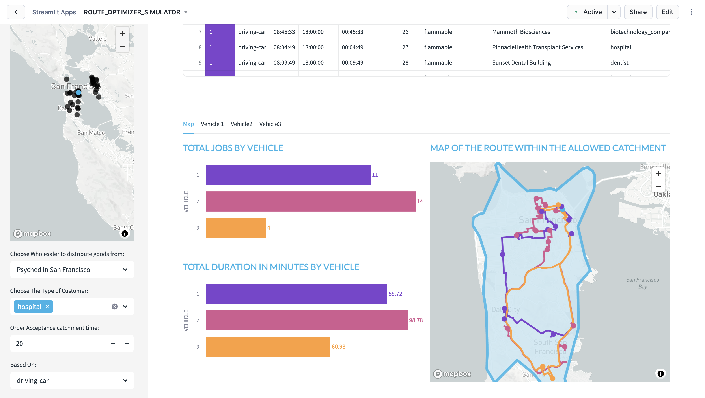

# <h0black>Run the Streamlit Applications for </h0black> <h0blue>Route Optimization</h0blue>

This lab provides four Streamlit applications demonstrating different aspects of fleet intelligence and route optimization:

## <h1sub>1. General Route Optimizer Simulator</h1sub>

- Within Streamlit, open the **ROUTE_OPTIMIZER_SIMULATOR**

The streamlit app which you have open simulates potential routes to 29 delivery locations for selected customer types - all coming from a user definable wholesaler. Currently there are 3 types of distributor available although with the notebook, you can create limitless industry categories:

- Food
- Health
- Cosmetics

If you wish to add additional choice of distributor types, you can with the provided notebook.

The places you will work with are real as they are based on the Carto Overture points of interest maps which is a dataset freely available on the marketplace. This allows you to create a location relevant scenario based on the needs of a specific usecase.

## <h1sub>2. NYC Taxi Trip Viewer</h1sub>

- Within Streamlit, open the **NYC_TAXI_TRIP_VIEWER**

This fleet monitoring application allows you to:
- Drill into any driver and analyze their route history
- Replay routes with time estimates
- See an overview of all drivers in the NYC taxi fleet
- View real-time location analytics and trip summaries

## <h1sub>3. NYC Beauty Supply Chain Optimizer</h1sub>

- Within Streamlit, open the **NYC_BEAUTY_SUPPLY_CHAIN_OPTIMIZER**

This specialized application demonstrates industry-specific route optimization featuring:

**Industry Focus**: Beauty supply chain with realistic scenarios
- **Depots**: Choose from 4 NYC locations (Manhattan, Brooklyn, Queens, Bronx)
- **Product Types**: Hair Products, Electronics, Make-up
- **Vehicle Skills**: Skill-based delivery matching (Level 1-3)
- **Capacity Management**: Vehicle capacity and capability constraints

**Advanced Features**:
- Real depot locations with building footprints
- Pre-configured optimization arrays for vehicles and jobs
- Interactive service area mapping with isochrones
- Skill-based job assignment (vehicles must have required skills)
- Time window constraints for deliveries
- Visual route optimization with vehicle-specific color coding

This app showcases how the marketplace listing `ORGDATACLOUD$INTERNAL$NYC_BEAUTY_SUPPLY_CHAIN_FLEET` provides ready-to-use synthetic data for realistic fleet optimization scenarios.

## <h1sub>4. ORS Service Manager & Function Tester</h1sub>

- Within Streamlit, open the **ORS_SERVICE_MANAGER**

This comprehensive application provides both service management and function testing capabilities:

**Service Management Features**:
- **Real-time service monitoring** - Dashboard showing status of all ORS services
- **Bulk operations** - Start/stop all services with one click
- **Individual service control** - Manage each service independently
- **SPCS log monitoring** - View real container logs for troubleshooting
- **Service health tracking** - Monitor running, stopped, and error states

**Function Testing Capabilities**:
- **🗺️ DIRECTIONS Testing** - Point-to-point and multi-waypoint routing with AI-powered route summaries
- **🚚 OPTIMIZATION Testing** - Multi-vehicle fleet optimization with configurable capacity, skills, and realistic job scenarios
- **⏰ ISOCHRONES Testing** - Time-based catchment area analysis for service planning

**Advanced Features**:
- **AI-Enhanced Analysis** - Claude-powered insights for all function results
- **Interactive Maps** - Rich tooltips with address details and performance metrics
- **Real NYC Data** - Authentic addresses from different boroughs for realistic testing
- **Educational Content** - Comprehensive instructions explaining each function's purpose and applications
- **Professional UI** - Snowflake-branded interface with collapsible configurations

**Perfect for**: Learning ORS capabilities, troubleshooting routing issues, demonstrating native app functionality, and understanding geospatial analysis concepts.

For detailed instructions, see the [ORS Service Manager Tutorial](ORS%20Service%20Manager%20Tutorial.md).

## NYC Food Delivery Route Optimizer

**Application:** `NYC_FOOD_DELIVERY_OPTIMIZER`

The **NYC Food Delivery Route Optimizer** demonstrates advanced B2C food delivery logistics with industry-specific constraints and requirements. This application showcases how fleet intelligence can be adapted for the food delivery sector, featuring realistic scenarios with restaurants, dark kitchens, delivery vehicles, and customer orders.

### Key Features

**🏪 Food Service Locations:**
- **Restaurants** - Traditional dining establishments with delivery services
- **Dark Kitchens** - Cloud kitchen facilities optimized for delivery-only operations  
- **Grocery Distribution** - Fresh market and grocery delivery centers
- **Multi-Cuisine Support** - Italian, Asian, seafood, and mixed cuisine types

**🚚 Specialized Delivery Fleet:**
- **Delivery Bikes** - Electric and gasoline-powered for urban navigation
- **Pizza Delivery Cars** - Traditional restaurant delivery vehicles
- **Refrigerated Vans** - Temperature-controlled for fresh and frozen items
- **Insulated Vehicles** - Maintaining food quality during transport
- **Delivery Scooters** - Agile urban delivery solutions

**📦 B2C Customer Orders:**
- **Real Customer Addresses** - Using authentic NYC address data for realistic routing
- **Food Categories** - Pizza, Asian cuisine, groceries, frozen items, beverages, desserts
- **Temperature Requirements** - Ambient, refrigerated, and frozen delivery constraints
- **Order Values** - Realistic pricing from $15-150 per order
- **Delivery Instructions** - Customer preferences and delivery requirements

**🎯 Advanced Optimization Features:**
- **Temperature Matching** - Vehicles with appropriate temperature control for order requirements
- **Capacity Optimization** - Vehicle load planning based on order sizes and food types
- **Time Window Constraints** - Customer-specified delivery time preferences
- **Skills-Based Routing** - Matching vehicle capabilities to delivery requirements
- **Multi-Depot Operations** - Cross-borough delivery optimization

### Industry-Specific Capabilities

**🌡️ Temperature Chain Management:**
- **Frozen Items** - Require specialized refrigerated vehicles (Skill Level 3)
- **Fresh Groceries** - Need insulated transport (Skill Level 2)  
- **Hot Food** - Ambient temperature with time-sensitive delivery (Skill Level 1)
- **Mixed Orders** - Intelligent vehicle assignment for combined temperature needs

**⏰ Delivery Time Optimization:**
- **Lunch Rush** - 11 AM - 2 PM peak optimization
- **Dinner Hours** - 5 PM - 9 PM high-volume routing
- **Late Night** - Extended hours for 24/7 operations
- **Weekend Patterns** - Adjusted capacity and timing for leisure dining

**💰 Cost-Effective Operations:**
- **Fuel Efficiency** - Electric and hybrid vehicle prioritization
- **Route Density** - Maximizing deliveries per route
- **Vehicle Utilization** - Optimal capacity usage across fleet
- **Distance Minimization** - Reducing total travel time and costs

This application provides hands-on experience with food delivery logistics challenges, demonstrating how modern fleet intelligence platforms can optimize complex B2C delivery operations while maintaining service quality and cost efficiency.